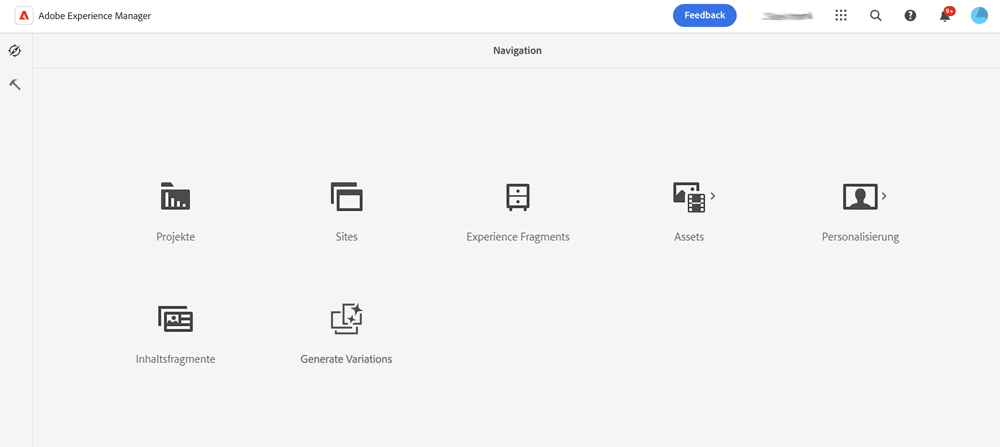
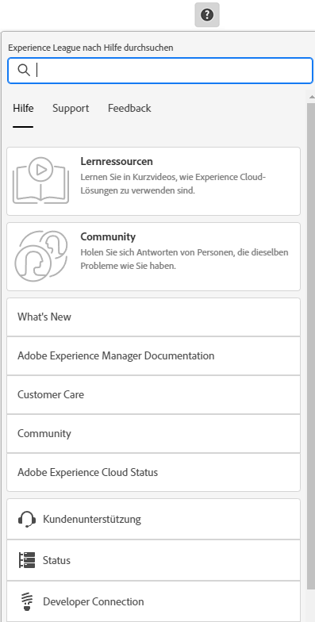
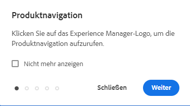
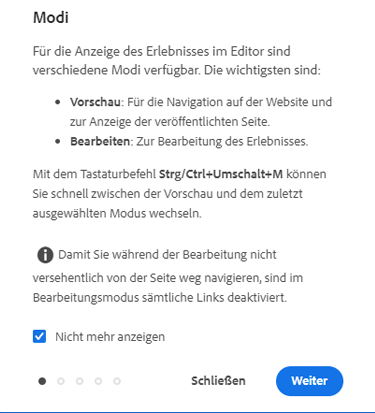

# Grundlegende Handhabung {#basic-handling}

Dieses Dokument soll einen Überblick über die grundlegende Handhabung der AEM-Autorenumgebung geben.

>[!TIP]
>
>In AEM stehen verschiedene Tastaturbefehle zur Verfügung. Insbesondere bei der [Verwendung der Sites-Konsole](/help/sites-cloud/authoring/sites-console/keyboard-shortcuts.md) und [des Seiteneditors](/help/sites-cloud/authoring/page-editor/keyboard-shortcuts.md).

## Touch-optimierte Benutzeroberfläche {#a-touch-enabled-ui}

Die AEM-Benutzeroberfläche wurde für Touchscreens optimiert. Über die Touch-optimierte Benutzeroberfläche können Sie mithilfe von Berührungen wie Tippen, Tippen und Halten oder Wischen mit der Software interagieren. Da die AEM-Benutzeroberfläche Touch-optimiert ist, können Sie Berührungsgesten auf Ihren Touch-Geräten wie auf Ihrem Handy oder Tablet verwenden. Es sind jedoch auch Mausaktionen auf einem herkömmlichen Desktop-Gerät möglich, sodass Sie flexibel entscheiden können, wie Sie Ihre Inhalte erstellen möchten.

## Erste Schritte {#first-steps}

Unmittelbar nach der Anmeldung gelangen Sie zum [Navigationsfenster](#navigation-panel). Wenn Sie eine der Optionen auswählen, wird die entsprechende Konsole geöffnet.

Damit Sie ein gutes Verständnis der grundlegenden Funktionen in AEM erhalten, wurde für dieses Dokument die **Sites-Konsole** herangezogen. Wählen Sie **Sites** aus, um zu beginnen.

## Produktnavigation {#product-navigation}

Wenn eine Benutzerin oder ein Benutzer zum ersten Mal auf eine Konsole zugreift, wird ein Tutorial zur Produktnavigation gestartet. Nehmen Sie sich einen Moment Zeit, um sich das Programm anzusehen und einen guten Überblick über den grundlegenden Umgang mit AEM zu erhalten.

Wählen Sie **Weiter** aus, um zur nächsten Seite des Überblicks zu wechseln. Wählen Sie zum Schließen die Option **Schließen** oder eine Stelle außerhalb des Dialogfelds „Überblick“ aus.

Die Übersicht wird bei Ihrem nächsten Zugriff auf eine Konsole neu gestartet, sofern Sie nicht die Option **Nicht mehr anzeigen** aktivieren.

## Globale Navigation {#global-navigation}

Sie können mithilfe des globalen Navigationsfensters zwischen den Konsolen navigieren. Dieses Navigationsfenster wird als Vollbild-Dropdown angezeigt, wenn Sie den **Adobe Experience Manager**-Link in der linken oberen Bildschirmecke auswählen.

Sie können das globale Navigationsfenster schließen, indem Sie auf **Schließen** klicken oder tippen. Sie kehren dann zu Ihrer vorherigen Position zurück.

Die globale Navigation verfügt über zwei Fenster, die am linken Bildschirmrand durch Symbole dargestellt werden:

* **[Navigation](#navigation-panel)**: Wird durch einen Kompass und das Standardbedienfeld bei der Anmeldung bei AEM dargestellt
* **[Tools](#tools-panel)** – dargestellt durch einen Hammer

Die in diesen Fenstern verfügbaren Optionen werden im Folgenden beschrieben.

### Navigationsfenster {#navigation-panel}

Das **Navigationsfenster**:

Der Titel der Browser-Registerkarte wird aktualisiert, um Ihren Standort während der Navigation durch die Konsolen und Inhalte widerzuspiegeln.

Im Navigationsfenster stehen folgende Konsolen zur Verfügung:

| Konsole | Zweck |
|---|---|
| Projekte | Die Projektekonsole bietet Ihnen direkten Zugriff auf Ihre Projekte. [Projekte sind virtuelle Dashboards](/help/sites-cloud/authoring/projects/overview.md), die zum Aufbau eines Teams verwendet werden können. Sie können diesem Team dann Zugriff auf Ressourcen, Workflows und Aufgaben gewähren, damit alle auf ein gemeinsames Ziel hinarbeiten. |
| Sites | Mit der [Sites-Konsole](/help/sites-cloud/authoring/sites-console/introduction.md) können Sie Websites erstellen, anzeigen und verwalten, die auf Ihrer AEM-Instanz ausgeführt werden. Mithilfe dieser Konsole können Sie Seiten erstellen, bearbeiten, kopieren, verschieben, löschen und veröffentlichen sowie Workflows starten. |
| Experience Fragments | Bei einem [Experience Fragment](/help/sites-cloud/authoring/fragments/content-fragments.md) handelt es sich um ein einzelnes Erlebnis, das kanalübergreifend wiederverwendet werden kann und Varianten aufweist. So erübrigt sich das wiederholte Kopieren und Einfügen von Erlebnissen oder Teilen von Erlebnissen. |
| Assets | In der Assets-Konsole können Sie [digitale Assets, wie Bilder, Videos, Dokumente und Audiodateien](/help/assets/overview.md), importieren und verwalten. Diese Assets können dann von jeder Site verwendet werden, die auf derselben AEM-Instanz ausgeführt wird. Über die Assets-Konsole können Sie auch [Inhaltsfragmente](/help/assets/content-fragments/content-fragments.md) erstellen und verwalten. |
| Personalisierung    | Diese Konsole bietet ein Framework aus Tools für die [Bearbeitung von Inhalten für eine bestimmte Zielgruppe und das Bieten personalisierter Erlebnisse](/help/sites-cloud/authoring/personalization/overview.md). |
| Inhaltsfragmente | [Inhaltsfragmente](/help/sites-cloud/administering/content-fragments/overview.md) ermöglichen Ihnen das Entwerfen, Erstellen, Kuratieren und Veröffentlichen von seitenunabhängigen Inhalten. Sie ermöglichen es Ihnen, strukturierte Inhalte vorzubereiten, die an verschiedenen Orten und über verschiedene Kanäle verwendet werden können, und eignen sich sowohl für die Erstellung von Seiten als auch für die Headless-Bereitstellung. |
| Generieren von Varianten | [Generieren von Varianten](/help/generative-ai/generate-variations.md) verwendet generative künstliche Intelligenz (KI), um Inhaltsvarianten basierend auf Prompts zu erstellen. Diese Prompts werden entweder von Adobe bereitgestellt oder von Benutzenden erstellt und verwaltet. |

## Tools-Bereich {#tools-panel}

Im **Tools-Bereich** befindet sich ein seitliches Bedienfeld mit einem Bereich von Kategorien, in denen ähnliche Konsolen zusammen gruppiert sind. Die **Tools-Konsolen** bieten Zugriff auf verschiedene spezialisierte Tools und Konsolen, mit denen Sie Websites, digitale Assets und andere Bereiche Ihres Content-Repositorys verwalten können.

## Die Kopfzeile {#the-header}

Die Kopfzeile befindet sich immer am oberen Rand des Bildschirms. Die meisten Optionen in der Kopfzeile bleiben unabhängig von Ihrer Position im System gleich, manche sind aber kontextspezifisch.

* [Globale Navigation](#global-navigation): Wählen Sie den Link **Adobe Experience Manager** aus, um zwischen Konsolen zu navigieren.

  

* Feedback

  

* Ihre IMS-Organisation – Wählen Sie diese Option aus, um sie bei Bedarf zu ändern.

* [Lösungen](https://www.adobe.com/experience-cloud.html): Wählen Sie diese Option aus, um auf Ihre anderen Adobe-Lösungen zuzugreifen.

  

* [Suchen](/help/sites-cloud/authoring/search.md): Sie können auch den [Tastaturbefehl](/help/sites-cloud/authoring/sites-console/keyboard-shortcuts.md) `/` (Schrägstrich) verwenden, um die Suche von jeder beliebigen Konsole aus zu starten.

  

* [Hilfe](#accessing-help)

  

* [Benachrichtigungen](/help/sites-cloud/authoring/inbox.md): Dieses Symbol wird mit der Anzahl der aktuell zugewiesenen unvollständigen Benachrichtigungen gekennzeichnet.

  

* [Benutzereigenschaften](/help/sites-cloud/authoring/account-environment.md): Wählen Sie diese Option aus, um Ihre Benutzereinstellungen zu ändern.

  

## Zugreifen auf die Hilfe {#accessing-help}

Es gibt eine Reihe von Hilferessourcen und mehrere Möglichkeiten, um darauf zuzugreifen.

* **Symbolleiste**: Durch Auswahl des Symbols **Hilfe** werden abhängig von Ihrer Position die geeigneten Ressourcen geöffnet:

  

* **Konsole**: Beim erstmaligen Navigieren im System [wird die AEM-Navigation durch eine Reihe von Folien vorgestellt](#product-navigation).

  

* **Seitendditor**: Wenn Sie zum ersten Mal eine Seite bearbeiten, wird der Seiteneditor durch eine Reihe von Folien vorgestellt.

  

   * Navigieren Sie in diesem Überblick wie im [Überblick zur Produktnavigation](#product-navigation) beim erstmaligen Öffnen einer Konsole.
   * Im Menü [**Seiteninformationen** können Sie die Option **Hilfe**](#accessing-help) auswählen, um diese Folien jederzeit erneut anzuzeigen.

* **Tools-Konsole**: Über die **Tools-Konsole** können Sie auch auf die externen **Ressourcen** zugreifen:

   * **Dokumentation** –
Dokumentation für Web Experience Management anzeigen
   * **Entwicklungsressourcen** –Entwicklungsressourcen und Downloads

>[!TIP]
>
>Sie können jederzeit über den Hotkey `?` (Fragezeichen) in einer Konsole auf eine Übersicht der verfügbaren Tastaturbefehle zugreifen.
>
>Eine Aufstellung aller Tastaturbefehle finden Sie in den folgenden Dokumenten:
>
>* [Tastaturbefehle für die Seitenbearbeitung](/help/sites-cloud/authoring/page-editor/keyboard-shortcuts.md)
>* [Tastaturbefehle für Konsolen](/help/sites-cloud/authoring/sites-console/keyboard-shortcuts.md)
