# Erstellen von Campaign-Newslettern mit AEM {#creating-newsletters}

In diesem Dokument erfahren Sie, wie Sie AEM as a Cloud Service verwenden können, um Newsletter zu erstellen, die mit Adobe Campaign Classic gesendet werden können.

Durch die Integration von AEM as a Cloud Service und Adobe Campaign Classic können Sie Ihre Newsletter mit AEM leistungsstarken Authoring-Tools erstellen. Wenn Sie dann bereit sind, Ihren Newsletter zu versenden, können Sie die Funktionen für die Empfängerverwaltung und -verteilung von Campaign verwenden, um ihn zu versenden.

## Voraussetzungen {#prerequisites}

Bevor Sie einen Newsletter mit AEM erstellen und mit Campaign versenden können, müssen Sie zunächst [Adobe Campaign Classic und AEM as a Cloud Service integrieren.](/help/sites-cloud/integrating/integrating-campaign-classic.md)

## Erstellen der Newsletter-Struktur {#create-structure}

Newsletter-Inhalte werden in AEM verwaltet, ähnlich wie Sie Ihre Site-Inhalte verwalten würden. Erstellen Sie zunächst eine &quot;Site&quot;, auf der Ihre Inhalte gespeichert werden. Auf dieser &quot;Website&quot; können Sie Ihre Newsletter nach Marke sammeln.

1. Melden Sie sich bei Ihrer AEM-Autoreninstanz an.

1. Öffnen Sie auf der Hauptnavigationsseite die **Sites** Konsole.

1. In einer Standardinstallation von AEM gibt es eine **Kampagne** Ordner. Wählen Sie sie aus und klicken Sie auf **Erstellen** Schaltfläche und dann **Seite**.

   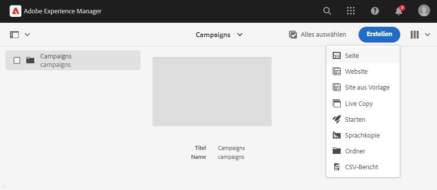

1. Auswählen **Marke** als Site-Vorlage verwenden und auf **Nächste**.

   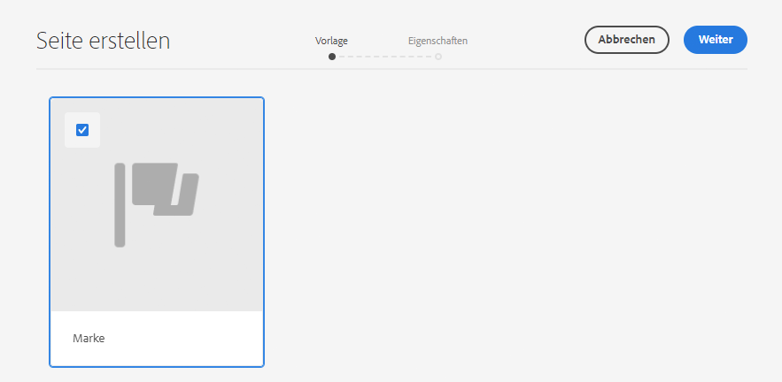

1. Geben Sie einen **Titel** und klicken Sie auf **Erstellen** und dann **Fertig**.

   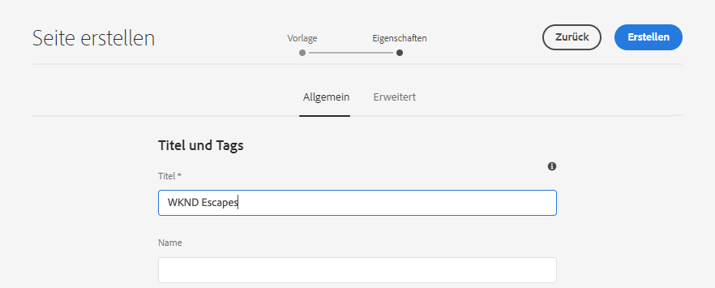

Sie verfügen nun über eine grundlegende Inhaltsstruktur, um Ihre Kampagnen zu erstellen.

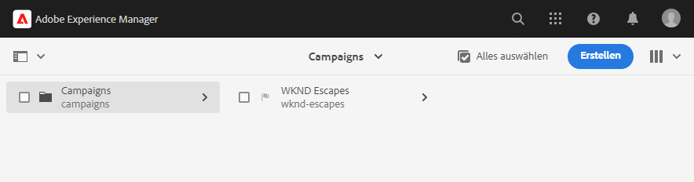

## Erstellen einer Kampagne {#create-campaign}

Nachdem Sie nun über eine grundlegende Inhaltsstruktur für Ihre Kampagne verfügen, können Sie die Kampagne selbst erstellen. Die Kampagne wird verwendet, um möglicherweise mehrere Newsletter zu organisieren.

1. Verwenden [Spaltenansicht](/help/sites-cloud/authoring/getting-started/basic-handling.md#viewing-and-selecting-resources) Wählen Sie in der Sites-Konsole die Marke aus, die Sie zuvor erstellt haben (in diesem Fall **WKND-Escapes**) und wählen Sie dann **Übergeordneter Bereich**, der automatisch für Sie erstellt wurde, und klicken Sie dann auf das **Erstellen** Schaltfläche und dann **Seite**.

   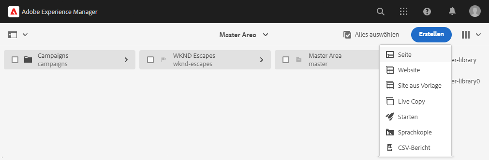

1. Auswählen **Kampagne** als Vorlage verwenden, klicken Sie auf **Nächste** und **Fertig**.

   

1. Geben Sie einen **Titel** und klicken Sie auf **Erstellen** und **Fertig**.

   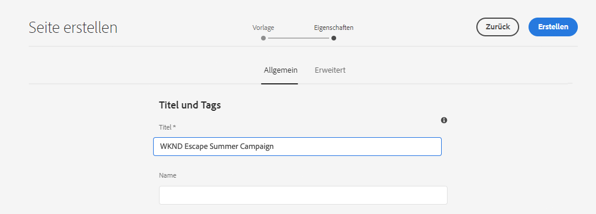

Sie haben jetzt eine Kampagne, in der Sie Ihre Newsletter erstellen können.

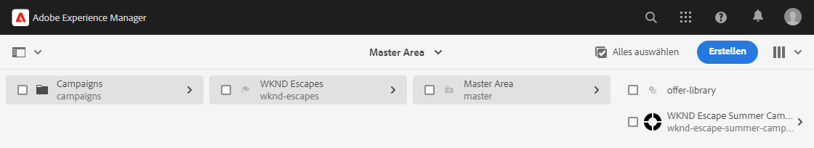

## Campaign-Konfiguration auswählen {#campaign-configuration}

AEM können mehrere Integrationskonfigurationen unterstützen. Für Ihre neue Kampagne müssen Sie festlegen, welche Konfigurationen zum Senden Ihres Newsletter-Inhalts verwendet werden sollen.

1. Verwenden [Spaltenansicht](/help/sites-cloud/authoring/getting-started/basic-handling.md#viewing-and-selecting-resources) Suchen Sie in der Sites-Konsole nach der zuvor erstellten Kampagne (in diesem Fall **WKND Escape Summer Campaign**), wählen Sie es dann mithilfe des Kontrollkästchens aus und klicken Sie dann auf das **Eigenschaften** in der Symbolleiste.

   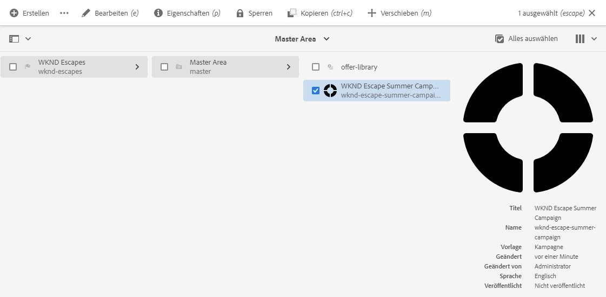

1. Im **Eigenschaften** auswählen, wählen Sie die **Cloud Service** um die Integration zu definieren, die für diese Kampagne verwendet werden soll.

   * Auswählen **Adobe Campaign** von **Cloud Service-Konfigurationen** Dropdown-Liste.
   * Wählen Sie die gewünschte Adobe Campaign-Integrationskonfiguration aus dem **Adobe Campaign** Dropdown-Liste.
   * Klicken Sie auf **Speichern und schließen**.

   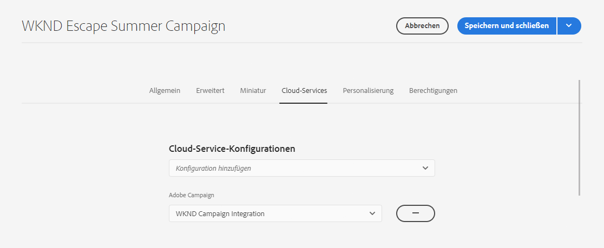

Ihre Kampagne ist jetzt mit Ihrer Adobe Campaign-Integration verknüpft. Sie können einen Newsletter in AEM erstellen und mit Adobe Campaign versenden.

## Newsletter erstellen {#create-newsletter}

Sie erstellen und verwalten Ihre Newsletter unter der Inhaltsstruktur der Kampagne, die Sie bereits erstellt und konfiguriert haben.

1. Verwenden [Spaltenansicht](/help/sites-cloud/authoring/getting-started/basic-handling.md#viewing-and-selecting-resources) Suchen Sie in der Sites-Konsole die zuvor konfigurierte Kampagne (in diesem Fall **WKND Escape Summer Campaign**), wählen Sie sie aus und klicken Sie dann auf das **Erstellen** Schaltfläche und dann **Seite**.

   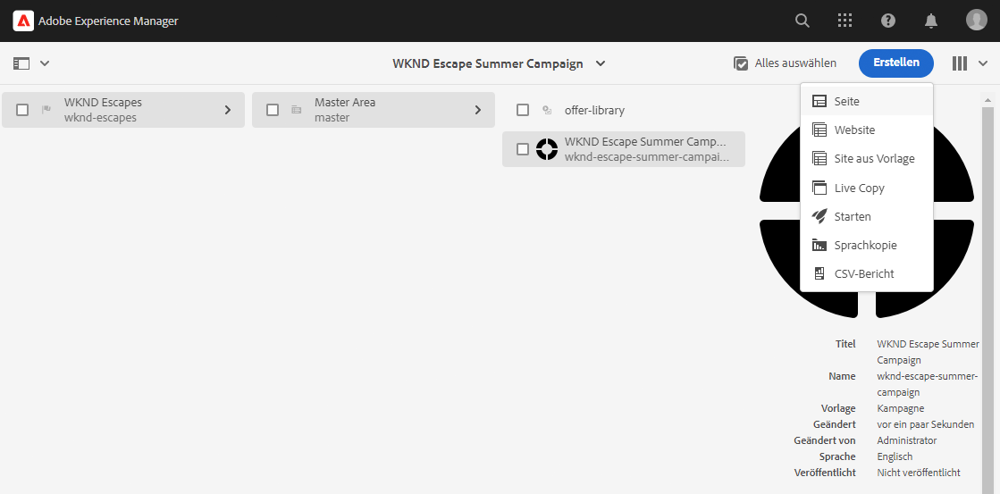

1. Wählen Sie im Assistenten Seite erstellen die **Adobe Campaign Email (AC 6.1)** Vorlage und klicken Sie auf **Nächste**.

   

1. Für **Eigenschaften** Geben Sie im Schritt des Assistenten die **Titel** Klicken Sie für den Newsletter auf **Erstellen** und **Öffnen**.

   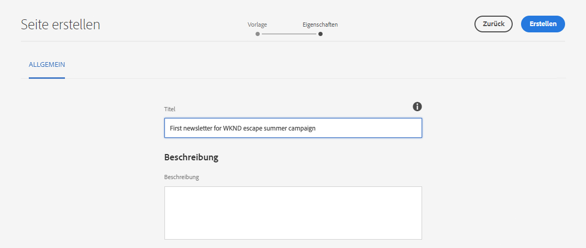

1. Bearbeiten Sie die Newsletter-Seite wie jede andere AEM Inhaltsseite, um Ihre Anforderungen zu erfüllen.

Jetzt können Sie einen Newsletter mit Adobe Campaign versenden.

## Newsletter veröffentlichen {#publishing-newsletter}

Sie müssen Ihren Newsletter veröffentlichen, um ihn für Adobe Campaign zum Versand verfügbar zu machen.

1. Verwenden [Spaltenansicht](/help/sites-cloud/authoring/getting-started/basic-handling.md#viewing-and-selecting-resources) Suchen Sie in der Sites-Konsole den Newsletter, den Sie zuvor erstellt haben (in diesem Fall **Erster Newsletter der WKND-Fluchtsommer-Kampagne**), wählen Sie sie aus und klicken Sie dann auf das **Seiteninformationen** Schaltfläche oben links und klicken Sie auf **Seite veröffentlichen**.

1. Wählen Sie die Konfigurationen aus, für die die Seite veröffentlicht werden soll, und klicken Sie auf **Veröffentlichen**.

   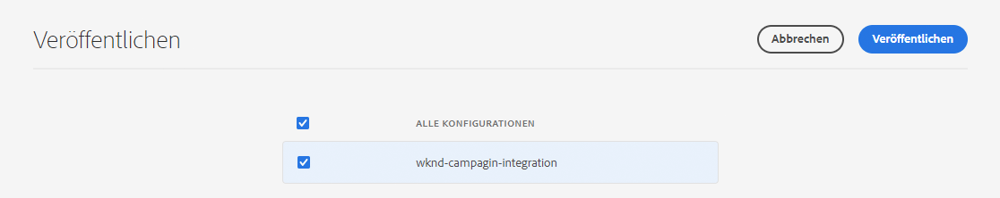

Die Newsletterseite wird jetzt in der AEM Veröffentlichungsinstanz veröffentlicht und ist in Adobe Campaign Classic sichtbar. Um es in Adobe Campaign auswählen zu können, muss es genehmigt werden.

1. Klicken Sie auf **Seiteninformationen** Schaltfläche für den Newsletter erneut anzeigen und auswählen **Workflow starten**.

1. Auswählen **Für Adobe Campaign genehmigen** als Workflow-Modell (optional mit einer Beschreibung) angeben, und klicken Sie auf **Workflow starten** Schaltfläche.

   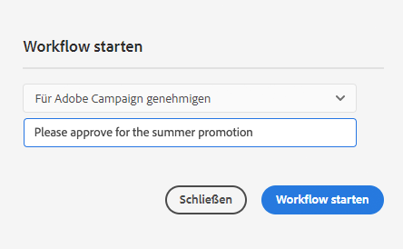

1. Oben im Newsletter-Seiteneditor wird ein Banner mit den nächsten Schritten im Genehmigungsprozess angezeigt. Klicken Sie auf **Fertig stellen**.

   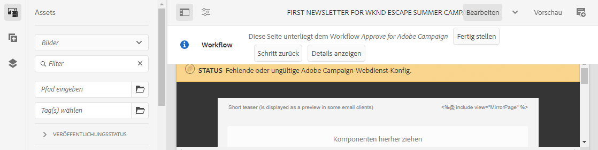

1. Im **Arbeitselement abschließen** Dialogfeld auswählen **Newsletter-Überprüfung (Administrator)** im **Nächster Schritt** Dropdown-Liste aus und klicken Sie auf **OK** Schaltfläche.

   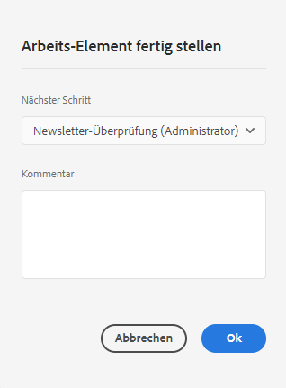

1. Klicken Sie im Banner, das oben im Newsletter-Seiten-Editor angezeigt wird, erneut auf **Fertig**.

1. Im **Arbeitselement abschließen** Dialogfeld auswählen **Newsletter-Validierung** im **Nächster Schritt** Dropdown-Liste aus und klicken Sie auf **OK** Schaltfläche.

   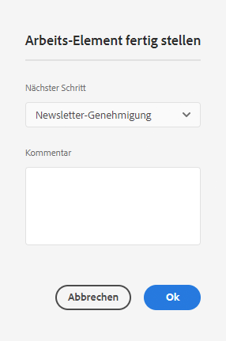

1. Wenn das Dialogfeld geschlossen wird, wird das Banner, das oben im Newsletter-Seiteneditor angezeigt wurde, ausgeblendet, da der Genehmigungs-Workflow abgeschlossen ist.

Der Newsletter wird jetzt in AEM veröffentlicht und zur Verwendung in Adobe Campaign genehmigt.

>[!TIP]
>
>Die beschriebenen Workflow-Schritte werden hier zur Veranschaulichung des Prozesses vereinfacht. In einem normalen Arbeitsablauf sind das Erstellen und Genehmigen eines Newsletters normalerweise unterschiedliche Rollen
>
>Siehe Dokument . [Arbeiten mit Workflows](/help/sites-cloud/authoring/workflows/overview.md) Weitere Informationen zur Verwendung von Workflows.

## Empfänger erstellen {#creating-recipient}

Um den Newsletter versenden zu können, den Sie in AEM erstellt haben, müssen Sie zunächst Ihre Empfänger in Adobe Campaign Classic definieren.

1. Melden Sie sich über die Clientkonsole bei Adobe Campaign Classic an.

1. Auswählen **Instrumente** -> **Explorer** aus der Menüleiste.

1. Navigieren Sie im Explorer zum **Profile und Zielgruppen** -> **Empfänger** Knoten.

   

1. Klicken Sie auf **Neu** in der Symbolleiste und geben Sie die Details des Empfängers an.

   * Vorname
   * Nachname
   * E-Mail-Adresse

1. Klicken Sie auf **Speichern**.

Sie haben jetzt einen Empfänger, an den Sie Ihren Newsletter mit Adobe Campaign Classic versenden können.

## E-Mail-Versand erstellen {#create-delivery}

Der letzte Schritt besteht darin, Ihren in AEM erstellten Newsletter an den Empfänger zu senden, den Sie in Adobe Campaign Classic hinzugefügt haben.

1. Melden Sie sich über die Clientkonsole bei Adobe Campaign Classic an.

1. Auswählen **Instrumente** -> **Explorer** aus der Menüleiste.

1. Navigieren Sie im Explorer zum **Campaign Management** -> **Sendungen** Knoten und klicken Sie auf **Neu**.

   

1. Im **Versand** Dialogfeld auswählen **E-Mail-Versand mit AEM Inhalt** als **Versandvorlage** aus der Dropdown-Liste aus und klicken Sie auf **Weiter**.

   

1. Im **E-Mail-Parameter** klicken Sie auf die **Von** und geben Sie die Informationen des Absenders ein und klicken Sie auf **OK**.

   * Absenderadresse
   * Aus Feld

   

1. Im **E-Mail-Parameter** klicken Sie auf die **nach** Link zum Öffnen der **Ziel auswählen** und klicken Sie dann auf **Hinzufügen**.

   

1. Im **Zielelement auswählen** Dialogfeld auswählen **Empfänger** und klicken Sie auf **Nächste**.

   

1. Wählen Sie mithilfe der Filter den gewünschten Empfänger aus [created](#creating-recipient) und klicken Sie auf **Beenden**.

   

1. Zurück im **Ziel auswählen** dialog, klicken Sie **OK**.

1. Klicken Sie im Versandfenster auf **Synchronisieren**.

   

1. Im **Synchronisieren mit AEM Inhalt** wählen Sie den zuvor erstellten Newsletter aus der Liste aus und klicken Sie auf **OK**.

1. Der E-Mail-Inhalt von Adobe Campaign wird mit dem Newsletter-Inhalt synchronisiert, den Sie in AEM erstellt haben.

   * Klicken **Inhalt aktualisieren** , wenn der Inhalt nicht automatisch geladen wird.

1. Klicken **Senden** , um die E-Mail zu senden.

1. Im **Senden an Hauptversand-Zielgruppe** Dialogfeld auswählen **Sendungen schnellstmöglich abschicken** und klicken Sie anschließend auf **Analyse**.

   

1. Im Analyseschritt wird der Versand erstellt, wobei der Inhalt mit den Empfängern kombiniert wird. Nachdem der Versand erstellt wurde, klicken Sie auf **Versand bestätigen** , um die E-Mail zu senden. Klicken Sie zur Bestätigung auf **Ja**.

1. Der Versand wurde gestartet. Klicken Sie auf **Schließen**.

   

1. Klicken **Speichern** , um den Versand zu speichern.

Ihr Newsletter wurde gesendet!

>[!TIP]
>
>In diesem Beispiel wurde ein vereinfachter Versand eines Newsletters an einen einzelnen Empfänger gezeigt. Natürlich würde ein normaler Versand viele verschiedene Empfänger enthalten, was Adobe Campaign einfach zu handhaben macht. Weitere Informationen finden Sie unter [Adobe Campaign Classic-Dokumentation](https://experienceleague.adobe.com/docs/campaign-classic.html) für weitere Informationen zur Versand- und Empfängerverwaltung.
