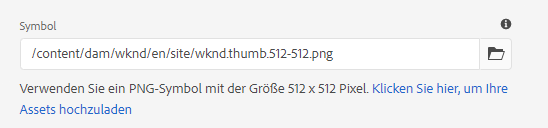
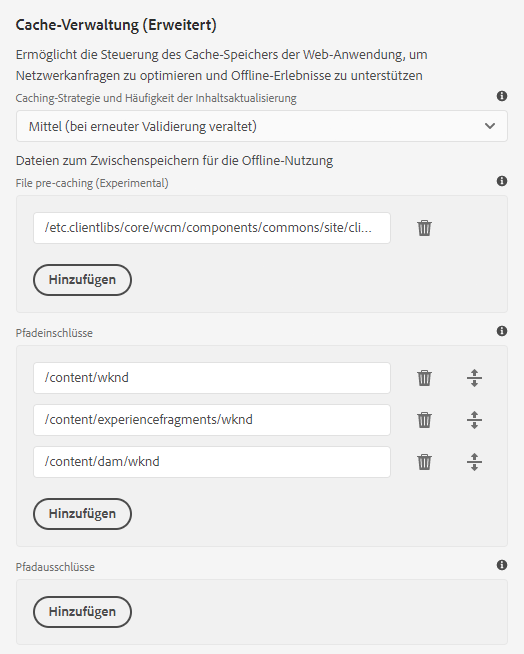

# Aktivieren der progressiven Web-App-Funktionen {#enabling-pwa}

Durch eine einfache Konfiguration kann ein Inhaltsautor jetzt progressive Funktionen für Web-Apps (PWA) für in AEM Sites erstellte Erlebnisse aktivieren.

>[!CAUTION]
>
>Dies ist eine erweiterte Funktion, die Folgendes erfordert:
>
>* Kenntnisse der PWA
>* Kenntnis der Site- und Inhaltsstruktur
>* Erläuterungen zu Cachestrategien
>* Unterstützung durch Ihr Entwicklungsteam

>
>
Bevor Sie diese Funktion verwenden, sollten Sie dies mit Ihrem Entwicklungsteam besprechen, um die beste Möglichkeit zu finden, sie für Ihr Projekt zu nutzen.

## Einführung {#introduction}

[Progressive Web-Apps (PWA) ](https://developer.mozilla.org/en-US/docs/Web/Progressive_web_apps) ermöglichen ansprechende App-ähnliche Erlebnisse für AEM Sites, indem sie es ermöglichen, lokal auf dem Benutzercomputer gespeichert und offline verfügbar zu sein. Ein Benutzer kann eine Site unterwegs durchsuchen, selbst wenn er eine Internetverbindung verliert. PWA ermöglichen nahtlose Erlebnisse, selbst wenn das Netzwerk verloren geht oder instabil ist.

Anstatt eine erneute Kodierung der Site erforderlich zu machen, kann ein Inhaltsersteller die Eigenschaften der PWA als zusätzliche Registerkarte in den [Seiteneigenschaften](/help/sites-cloud/authoring/fundamentals/page-properties.md) einer Site konfigurieren.

* Beim Speichern oder Veröffentlichen wird mit dieser Konfiguration ein Ereignis-Handler Trigger, der die [Manifestdateien](https://developer.mozilla.org/en-US/docs/Web/Manifest) und [Dienstarbeiter](https://developer.mozilla.org/en-US/docs/Web/API/Service_Worker_API) ausschreibt, die PWA-Funktionen auf der Site aktivieren.
* Das Manifest und der Dienst-Worker werden in der für die Site geltenden, kontextbezogenen Konfiguration](https://experienceleague.adobe.com/docs/experience-manager-core-components/using/developing/context-aware-configs.html) gespeichert. [ Sling-Zuordnungen werden ebenfalls beibehalten, um sicherzustellen, dass der Dienst vom Stamm der Anwendung aus bereitgestellt wird, um das Kopieren von Inhalten zu aktivieren, wodurch Offline-Funktionen in der App ermöglicht werden.

Mit PWA verfügt der Benutzer über eine lokale Kopie der Site, wodurch ein App-ähnliches Erlebnis auch ohne Internetverbindung entsteht.

>[!NOTE]
>
>Progressive Web-Apps sind eine sich entwickelnde Technologie und Unterstützung für die Installation lokaler Apps und andere Funktionen [hängen davon ab, welchen Browser Sie verwenden.](https://developer.mozilla.org/en-US/docs/Web/Progressive_web_apps/Installable_PWAs#Summary)

## Voraussetzungen {#prerequisites}

Um PWA-Funktionen für Ihre Site verwenden zu können, müssen Sie zwei Voraussetzungen für die Umgebung Ihres Projekts erfüllen:

1. [Passen Sie Ihre ](#adjust-components) Komponenten an, um diese Funktion zu aktivieren
1. [Passen Sie die ](#adjust-dispatcher) Dispatcher-Regeln an, um die erforderlichen Dateien bereitzustellen.

Dies sind technische Schritte, die der Autor mit dem Entwicklungsteam koordinieren muss. Diese Schritte sind nur einmal pro Site erforderlich.

### Anpassen der Komponenten {#adjust-components}

Ihre Komponenten müssen die Manifestdateien [und [Dienstarbeiter](https://developer.mozilla.org/en-US/docs/Web/API/Service_Worker_API) enthalten, die die PWA-Funktionen unterstützen.](https://developer.mozilla.org/en-US/docs/Web/Manifest)

Dazu muss der Entwickler den folgenden Link zur Datei `customheaderlibs.html` Ihrer Seitenkomponente hinzufügen.

```xml
<link rel="manifest" href="/content/<projectName>/manifest.webmanifest" crossorigin="use-credentials"/>
```

Der Entwickler muss außerdem den folgenden Link zur Datei `customfooterlibs.html` Ihrer Seitenkomponente hinzufügen.

```xml
<script>
        // Check that service workers are supported
        if ('serviceWorker' in navigator) {
            // Use the window load event to make sure the page load performs well
            window.addEventListener('load', () => {
                let serviceWorker = '/<projectName>sw.js';
                navigator.serviceWorker.register(serviceWorker);
            });
        }
</script>
```

>[!NOTE]
>
>Zukünftige Versionen von [Kernkomponenten](https://experienceleague.adobe.com/docs/experience-manager-core-components/using/introduction.html?lang=de) enthalten diese Funktionen automatisch. Wenn Sie jedoch benutzerdefinierte Komponenten anstelle der Hauptkomponenten verwenden, sind diese Anpassungen immer erforderlich.

### Anpassen des Dispatchers {#adjust-dispatcher}

Die PWA-Funktion generiert und verwendet `/content/<sitename>/manifest.webmanifest`-Dateien. Standardmäßig legt [der Dispatcher](/help/implementing/dispatcher/overview.md) diese Dateien nicht offen. Um diese Dateien bereitzustellen, muss der Entwickler die folgende Konfiguration zum Site-Projekt hinzufügen.

```text
File location: [project directory]/dispatcher/src/conf.dispatcher.d/filters/filters.any >

# Allow webmanifest files
/0102 { /type "allow" /extension "webmanifest" /path "/content/*/manifest" }
```

>[!NOTE]
>
>Zukünftige Versionen des [AEM Projektarchetyps](https://experienceleague.adobe.com/docs/experience-manager-core-components/using/developing/archetype/overview.html?lang=en#develop) enthalten diese Konfiguration.

## Aktivieren von PWA für Ihre Site {#enabling-pwa-for-your-site}

Wenn [die Voraussetzungen](#prerequisites) erfüllt sind, ist es für einen Inhaltsersteller sehr einfach, PWA-Funktionen für eine Site zu aktivieren. Im Folgenden finden Sie eine Grundübersicht, wie dies zu bewerkstelligen ist. Die einzelnen Optionen sind im Abschnitt [Detaillierte Optionen aufgeführt.](#detailed-options)

1. Melden Sie sich bei AEM an.
1. Tippen oder klicken Sie im Hauptmenü auf **Navigation** -> **Sites**.
1. Wählen Sie Ihr Siteprojekt aus und tippen Sie auf oder klicken Sie auf [**Eigenschaften**](/help/sites-cloud/authoring/fundamentals/page-properties.md) oder verwenden Sie den Hotkey `p`.
1. Wählen Sie die Registerkarte **Progressive Web App** und konfigurieren Sie die entsprechenden Eigenschaften. Sie möchten mindestens Folgendes:
   1. Wählen Sie die Option **PWA aktivieren**.
   1. Definieren Sie die **Startup-URL**.

      

   1. Laden Sie ein PNG-Symbol im Format 512 x 512 in den DAM hoch und verweisen Sie darauf als Symbol für die App.

      

   1. Konfigurieren Sie die Pfade, die der Dienst offline verwenden soll. Typische Pfade sind:
      * `/content/<sitename>`
      * `/content/experiencefragements/<sitename>`
      * `/content/dam/<sitename>`
      * Beliebige Schriftartverweise von Drittanbietern
      * `/etc/clientlibs/<sitename>`

      


1. Tippen oder klicken Sie auf **Speichern und schließen**.

Ihre Site ist jetzt konfiguriert und Sie können sie als lokale App installieren.[](#using-pwa-enabled-site)

## Verwenden Ihrer PWA-aktivierten Site {#using-pwa-enabled-site}

Nachdem Sie [Ihre Site so konfiguriert haben, dass sie PWA unterstützt, können Sie sie nun selbst erleben.](#enabling-pwa-for-your-site)

1. Rufen Sie die Site in einem [unterstützten Browser auf.](https://developer.mozilla.org/en-US/docs/Web/Progressive_web_apps/Installable_PWAs#Summary)
1. In der Adressleiste des Browsers wird ein `+`-Symbol angezeigt, das darauf hinweist, dass die Site als lokale App installiert werden kann.
   * Je nach Browser wird möglicherweise auch eine Benachrichtigung angezeigt (z. B. ein Banner oder ein Dialogfeld), die darauf hinweist, dass eine Installation als lokale App möglich ist.
1. Installieren Sie das Programm.
1. Die App wird auf dem Startbildschirm Ihres Geräts installiert.
1. Öffnen Sie die App, navigieren Sie ein wenig und sehen Sie, dass die Seiten offline verfügbar sind.

## Detaillierte Optionen {#detailed-options}

Im folgenden Abschnitt finden Sie weitere Details zu den Optionen, die verfügbar sind, wenn [Sie Ihre Site für PWA konfigurieren.](#enabling-pwa-for-your-site)

### Konfigurieren des installierbaren Erlebnisses {#configure-installable-experience}

Mit diesen Einstellungen kann sich Ihre Site wie eine native App verhalten, da sie auf dem Startbildschirm des Besuchers installiert und offline verfügbar ist.

* **PWA**  aktivieren - Dies ist der Hauptschalter, um die PWA für die Site zu aktivieren.
* **Startup-URL** : Dies ist die  [bevorzugte Beginn-](https://developer.mozilla.org/en-US/docs/Web/Manifest/start_url) URL, die die App öffnet, wenn der Benutzer die lokal installierte App lädt.
   * Dies kann ein beliebiger Pfad in Ihrer Inhaltsstruktur sein.
   * Dies muss nicht der Stamm sein und ist oft eine spezielle Begrüßungsseite für die App.
   * Wenn diese URL relativ ist, wird die Manifest-URL als Basis-URL verwendet, um sie zu beheben.
   * Wenn das Feld leer gelassen wird, verwendet das Feature die Adresse der Webseite, von der aus die Web-App installiert wurde.
   * Es wird empfohlen, einen Wert festzulegen.
* **Anzeigemodus** : Eine App mit aktiviertem PWA ist weiterhin eine AEM, die über einen Browser bereitgestellt wird. [Diese ](https://developer.mozilla.org/en-US/docs/Web/Manifest/display) Anzeigeoptionen definieren, wie der Browser auf dem lokalen Gerät ausgeblendet oder dem Benutzer auf andere Weise angezeigt werden soll.
   * **Eigenständig** : Der Browser ist dem Benutzer vollständig ausgeblendet und erscheint wie eine native App. Dies ist der Standardwert.
      * Mit dieser Option muss die App-Navigation vollständig über Ihre Inhalte mithilfe von Links und Komponenten auf den Seiten der Site möglich sein, ohne die Navigationssteuerelemente des Browsers zu verwenden.
   * **Browser**  - Der Browser wird wie gewohnt beim Besuch der Site angezeigt.
   * **Minimale Benutzeroberfläche** : Der Browser ist wie eine native App meistens ausgeblendet, es werden jedoch grundlegende Navigationssteuerelemente angezeigt.
   * **Vollbild** : Der Browser ist wie eine native App vollständig ausgeblendet, wird aber im Vollbildmodus gerendert.
      * Mit dieser Option muss die App-Navigation vollständig über Ihre Inhalte mithilfe von Links und Komponenten auf den Seiten der Site möglich sein, ohne die Navigationssteuerelemente des Browsers zu verwenden.
* **Bildschirmausrichtung**  - Als lokale App muss die PWA wissen, wie  [Geräteausrichtungen zu handhaben sind.](https://developer.mozilla.org/en-US/docs/Web/Manifest/orientation)
   * **Beliebig** : Die App passt sich der Ausrichtung des Geräts des Benutzers an. Dies ist der Standardwert.
   * **Hochformat** : Dies zwingt die App, unabhängig von der Ausrichtung des Geräts im Hochformat-Layout zu öffnen.
   * **Querformat** : Hiermit wird die App unabhängig von der Ausrichtung des Geräts im Querformat-Layout geöffnet.
* **Designfarbe** : Hiermit wird die  [Farbe der ](https://developer.mozilla.org/en-US/docs/Web/Manifest/theme_color) Anwendung definiert, die sich darauf auswirkt, wie das Betriebssystem des lokalen Benutzers die native Symbolleiste der Benutzeroberfläche und Navigationssteuerelemente anzeigt. Abhängig vom Browser kann sich dies auf andere Elemente der App-Präsentation auswirken.
   * Verwenden Sie das Popup &quot;Farbraum&quot;, um eine Farbe auszuwählen.
   * Die Farbe kann auch durch den Hexadezimalwert oder den RGB-Wert definiert werden.
* **Hintergrundfarbe** : Hiermit wird die  [Hintergrundfarbe der App definiert, ](https://developer.mozilla.org/en-US/docs/Web/Manifest/background_color) die beim Laden der App angezeigt wird.
   * Verwenden Sie das Popup &quot;Farbraum&quot;, um eine Farbe auszuwählen.
   * Die Farbe kann auch durch den Hexadezimalwert oder den RGB-Wert definiert werden.
   * Bestimmte Browser [erstellen automatisch einen Begrüßungsbildschirm](https://developer.mozilla.org/en-US/docs/Web/Manifest#Splash_screens) aus dem App-Namen, der Hintergrundfarbe und dem Symbol.
* **Symbol** : Hiermit wird  [das ](https://developer.mozilla.org/en-US/docs/Web/Manifest/icons) Symbol definiert, das die App auf dem Gerät des Benutzers darstellt.
   * Das Symbol muss eine PNG-Datei im Format 512 x 512 Pixel sein.
   * Das Symbol muss [in DAM gespeichert sein.](/help/assets/overview.md)

### Cache-Verwaltung (erweitert) {#offline-configuration}

Diese Einstellungen machen Teile dieser Site offline verfügbar und lokal auf dem Gerät des Besuchers verfügbar. Dadurch kann der Cache der Web-App gesteuert werden, um Netzwerkanforderungen zu optimieren und Offline-Erlebnisse zu unterstützen.

* **Cachestrategie und Häufigkeit der Inhaltsaktualisierung**  - Diese Einstellung definiert das Cachemodell für Ihre PWA.
   * **Moderat**  -  [Diese ](https://web.dev/stale-while-revalidate/) Einstellung ist für die meisten Sites der Fall und ist der Standardwert.
      * Mit dieser Einstellung werden die Inhalte, die der Benutzer zuerst anzeigte, aus dem Cache geladen. Während der Benutzer diesen Inhalt verwendet, wird der Rest des Inhalts im Cache erneut überprüft.
   * **Häufig**  - Dies ist der Fall für Seiten, die Updates benötigen, um sehr schnell zu sein, wie Auktionshäuser.
      * Bei dieser Einstellung sucht die App zuerst nach dem neuesten Inhalt über das Netzwerk, und wenn dieser nicht verfügbar ist, wird der lokale Cache erneut geöffnet.
   * **Selten**  - Dies gilt für nahezu statische Websites wie z. B. Referenzseiten.
      * Bei dieser Einstellung sucht die App zuerst nach dem Inhalt im Cache, und wenn nicht verfügbar, kehrt sie zum Abrufen zurück.
* **Datei vor dem Zwischenspeichern** : Diese auf AEM gehosteten Dateien werden im lokalen Browser-Cache gespeichert, wenn der Service-Mitarbeiter installiert und bevor sie verwendet wird. Dadurch wird sichergestellt, dass die Web-App im Offlinemodus voll funktionsfähig ist.
* **Pfadeinschlüsse** : Netzwerkanforderungen für die definierten Pfade werden abgefangen und zwischengespeicherte Inhalte werden gemäß der konfigurierten  **Cachestrategie und der Häufigkeit der Inhaltsaktualisierung** zurückgegeben.
* **Cache-Ausschlüsse** : Diese Dateien werden unabhängig von den Einstellungen unter &quot; **Datei vor** Zwischenspeicherung&quot;und &quot; **Pfad&quot;nie zwischengespeichert**.

>[!TIP]
>
>Ihr Entwicklerteam verfügt vermutlich über wertvolle Informationen zur Einrichtung Ihrer Offlinekonfiguration.

## Beschränkungen {#limitations}

Nicht alle PWA-Funktionen sind für AEM Sites verfügbar. Dies sind einige bemerkenswerte Einschränkungen.

* Ein Benutzer muss die Seite mindestens einmal durchsuchen, bevor sie offline zwischengespeichert wird.
* Seiten werden nicht automatisch synchronisiert oder aktualisiert, wenn der Benutzer die App nicht verwendet.
