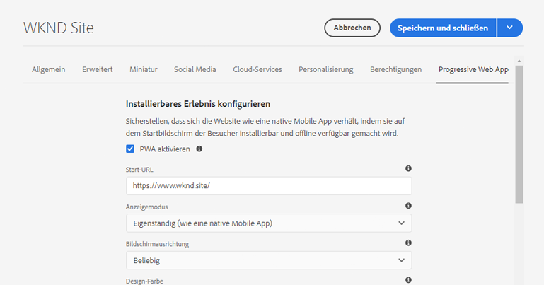

# Aktivieren von PWA (Progressive Web App)-Funktionen {#enabling-pwa}

Durch eine einfache Konfiguration kann ein Inhaltsautor jetzt PWA (Progressive Web App)-Funktionen für in AEM Sites erstellte Erlebnisse aktivieren.

>[!CAUTION]
>
>Dies ist eine erweiterte Funktion, die Folgendes erfordert:
>
>* Kenntnis der PWAs
>* Kenntnis der Site- und Inhaltsstruktur
>* Verständnis von Caching-Strategien
>* Unterstützung durch Ihr Entwicklungs-Team
>
>Bevor Sie diese Funktion verwenden, empfiehlt Adobe, dass Sie dies mit Ihrem Entwicklungsteam besprechen, um die beste Art und Weise zu bestimmen, wie Sie sie für Ihr Projekt verwenden können.

## Einführung {#introduction}

[PWAs (Progressive Web Apps)](https://developer.mozilla.org/de-DE/docs/Web/Progressive_web_apps) ermöglichen ansprechende Mobile-App-ähnliche Erlebnisse für AEM Sites, indem sie lokal auf dem Rechner eines Benutzers gespeichert werden und offline zugänglich sind. Ein Benutzer kann eine Site unterwegs durchsuchen, selbst wenn die Internet-Verbindung unterbrochen ist. PWA ermöglichen ein nahtloses Erlebnis, selbst wenn das Netzwerk verloren geht oder instabil ist.

Anstatt eine Neukodifizierung der Site zu erfordern, kann ein Inhaltsautor PWA-Eigenschaften als zusätzliche Registerkarte im [Seiteneigenschaften](/help/sites-cloud/authoring/fundamentals/page-properties.md) einer Site.

* Wenn diese Konfiguration gespeichert oder veröffentlicht wird, wird ein Ereignishandler Trigger, der die [Manifestdateien](https://developer.mozilla.org/de-DE/docs/Web/Manifest) und [Service Worker](https://developer.mozilla.org/de-DE/docs/Web/API/Service_Worker_API) die PWA-Funktionen auf der Site aktivieren.
* Sling-Zuordnungen werden auch beibehalten, um sicherzustellen, dass der Service Worker aus dem Stammverzeichnis des Programms bedient wird, um Proxy-Inhalte zu ermöglichen, die Offline-Funktionen innerhalb der App erlauben.

Mit PWA verfügt der Benutzer über eine lokale Kopie der Website, die auch ohne Internet-Verbindung eine Mobile-App-ähnliche Erfahrung bietet.

>[!NOTE]
>
>Progressive Web Apps sind eine sich weiterentwickelnde Technologie. Die Unterstützung für die Installation lokaler Apps und andere Funktionen [hängt davon ab, welchen Browser Sie verwenden.](https://developer.mozilla.org/en-US/docs/Web/Progressive_web_apps/Tutorials/js13kGames/Installable_PWAs#summary)

## Voraussetzungen {#prerequisites}

Damit Sie die PWA-Funktionen für Ihre Site nutzen können, muss Ihre Projektumgebung zwei Voraussetzungen erfüllen:

1. [Verwenden der Kernkomponenten](#adjust-components), um diese Funktion zu nutzen.
1. [Anpassen des Dispatchers](#adjust-dispatcher) Regeln zum Anzeigen der erforderlichen Dateien

Dies sind technische Schritte, die der Autor mit dem Entwicklungsteam koordinieren muss. Diese Schritte sind nur einmal pro Site erforderlich.

### Verwenden der Kernkomponenten {#adjust-components}

Die Kernkomponenten-Version 2.15.0 und höher unterstützt die PWA-Funktionen von AEM Sites vollständig. Da AEMaaCS immer die neueste Version der Kernkomponenten enthält, können Sie die PWA-Funktionen sofort nutzen. Ihr AEMaaCS-Projekt erfüllt diese Anforderung automatisch.

>[!NOTE]
>
>Es wird von Adobe nicht empfohlen, die PWA-Funktionen für benutzerdefinierte Komponenten oder Komponenten zu verwenden, die nicht [ausgehend von den Kernkomponenten erweitert wurden.](https://experienceleague.adobe.com/docs/experience-manager-core-components/using/developing/customizing.html?lang=de)
<!--
Your components need to include the [manifest files](https://developer.mozilla.org/en-US/docs/Web/Manifest) and [service worker,](https://developer.mozilla.org/en-US/docs/Web/API/Service_Worker_API) which supports the PWA features.

 To do this, the developer adds the following link to the `customheaderlibs.html` file of your page component.

```xml
<link rel="manifest" href="/content/<projectName>/manifest.webmanifest" crossorigin="use-credentials"/>
```

The developer also adds the following link to the `customfooterlibs.html` file of your page component.

```xml
<script>
        // Check that service workers are supported
        if ('serviceWorker' in navigator) {
            // Use the window load event to make sure the page load performs well
            window.addEventListener('load', () => {
                let serviceWorker = '/<projectName>sw.js';
                navigator.serviceWorker.register(serviceWorker);
            });
        }
</script>
```
-->

### Anpassen des Dispatchers {#adjust-dispatcher}

Die PWA-Funktion generiert und verwendet `/content/<sitename>/manifest.webmanifest`-Dateien. Standardmäßig ist [den Dispatcher](/help/implementing/dispatcher/overview.md) stellt solche Dateien nicht bereit. Um diese Dateien bereitzustellen, muss die Entwicklungsperson die folgende Konfiguration zum Site-Projekt hinzufügen.

```text
File location: [project directory]/dispatcher/src/conf.dispatcher.d/filters/filters.any >

# Allow webmanifest files
/0102 { /type "allow" /extension "webmanifest" /path "/content/*/manifest" }
```

Abhängig von Ihrem Projekt können Sie verschiedene Arten von Erweiterungen zu den Neuschreibungsregeln hinzufügen. Es kann nützlich sein, die Erweiterung `webmanifest` in die Rewrite-Bedingungen einzuschließen, wenn Sie eine Regel zum Ausblenden und Weiterleiten von Anfragen an `/content/<projectName>` einführen.

```text
RewriteCond %{REQUEST_URI} (.html|.jpe?g|.png|.svg|.webmanifest)$
```

## Aktivieren von PWA für Ihre Site {#enabling-pwa-for-your-site}

Mit [Voraussetzungen](#prerequisites) erfüllt, ist es für einen Inhaltsautor einfach, PWA-Funktionen für eine Site zu aktivieren. Im Folgenden finden Sie eine Übersicht über die Vorgehensweise. Die einzelnen Optionen werden im Abschnitt beschrieben. [Detaillierte Optionen.](#detailed-options)

1. Melden Sie sich bei AEM an.
1. Tippen oder klicken Sie im Hauptmenü auf **Navigation** > **Sites**.
1. Wählen Sie Ihr Site-Projekt aus und tippen oder klicken Sie auf [**Eigenschaften**](/help/sites-cloud/authoring/fundamentals/page-properties.md) oder verwenden Sie den Hotkey `p`.
1. Wählen Sie die Registerkarte **Progressive Web App** aus und konfigurieren Sie die entsprechenden Eigenschaften. Sie möchten mindestens:
   1. Wählen Sie die Option **PWA aktivieren** aus.
   1. Definieren Sie die **Start-URL**.

      

   1. Laden Sie ein PNG-Symbol mit 512 x 512 Pixeln in das DAM hoch und referenzieren Sie dieses als Symbol für die App.

      

   1. Konfigurieren Sie die Pfade, die der Service Worker offline verwenden soll. Typische Pfade sind:
      * `/content/<sitename>`
      * `/content/experiencefragements/<sitename>`
      * `/content/dam/<sitename>`
      * Alle Schriftart-Referenzen von Drittanbietern
      * `/etc/clientlibs/<sitename>`

      

1. Tippen oder klicken Sie auf **Speichern und schließen**.

Ihre Site ist jetzt konfiguriert und Sie können sie [als lokale App installieren](#using-pwa-enabled-site).

## Verwenden Ihrer PWA-fähigen Site {#using-pwa-enabled-site}

Nachdem Sie [Ihre Site für die Unterstützung von PWA konfiguriert haben](#enabling-pwa-for-your-site), können Sie sie selbst ausprobieren.

1. Greifen Sie auf die Site in einer [unterstützter Browser](https://developer.mozilla.org/en-US/docs/Web/Progressive_web_apps/Tutorials/js13kGames/Installable_PWAs#summary).
1. In der Adressleiste des Browsers wird ein neues Symbol angezeigt, das angibt, dass die Site als lokale App installiert werden kann.
   * Je nach Browser kann das Symbol variieren und im Browser wird möglicherweise auch eine Benachrichtigung angezeigt (z. B. ein Banner oder ein Dialogfeld), die darauf hinweist, dass eine Installation als lokale App möglich ist.
1. Installieren Sie die App.
1. Die App wird auf dem Startbildschirm Ihres Geräts installiert.
1. Öffnen Sie die App, navigieren Sie ein wenig und stellen Sie sicher, dass die Seiten offline verfügbar sind.

## Detaillierte Optionen {#detailed-options}

Im folgende Abschnitt finden Sie weitere Informationen zu den Optionen, die bei der [Konfiguration Ihrer Site für PWA](#enabling-pwa-for-your-site) verfügbar sind.

### Konfigurieren installierbarer Erlebnisse {#configure-installable-experience}

Diese Einstellungen ermöglichen es Ihrer Site, sich wie eine native App zu verhalten, indem sie sie auf der Startseite des Besuchers installiert und offline verfügbar macht.

* **PWA aktivieren** - Dies ist der Hauptschalter zum Aktivieren von PWA für die Site.
* **Startseiten-URL** - Dies ist die [bevorzugte Start-URL](https://developer.mozilla.org/de-DE/docs/Web/Manifest/start_url) , das die App geöffnet wird, wenn der Benutzer die lokal installierte App lädt.
   * Dies kann ein beliebiger Pfad in Ihrer Inhaltsstruktur sein.
   * Dies muss nicht das Stammverzeichnis sein und ist oft eine spezielle Startseite für die App.
   * Wenn diese URL relativ ist, wird die Manifest-URL als Basis-URL verwendet, um sie aufzulösen.
   * Wenn das Feld leer gelassen wird, verwendet die Funktion die Adresse der Webseite, von der aus die App installiert wurde.
   * Es wird empfohlen, einen Wert festzulegen.
* **Anzeigemodus**: Eine PWA-fähige App ist immer noch eine AEM-Site, die über einen Browser bereitgestellt wird. [Diese Anzeigeoptionen](https://developer.mozilla.org/de-DE/docs/Web/Manifest/display) legen fest, wie der Browser ausgeblendet oder anderweitig dem Benutzer auf dem lokalen Gerät präsentiert werden soll.
   * **Eigenständig** - Der Browser ist für den Benutzer ausgeblendet und erscheint wie eine native App. Dies ist der Standardwert.
      * Bei dieser Option muss die App-Navigation vollständig über Ihre Inhalte mithilfe von Links und Komponenten auf den Seiten der Website möglich sein, ohne die Navigationssteuerelemente des Browsers zu verwenden.
   * **Browser**: Der Browser wird so angezeigt, wie er normalerweise beim Besuch der Website angezeigt wird.
   * **Minimale Benutzeroberfläche**: Der Browser ist wie eine native App größtenteils ausgeblendet, grundlegende Navigationssteuerelemente werden jedoch angezeigt.
   * **Vollbild** - Der Browser ist wie eine native App ausgeblendet, wird jedoch im Vollbildmodus gerendert.
      * Bei dieser Option muss die App-Navigation vollständig über Ihre Inhalte mithilfe von Links und Komponenten auf den Seiten der Website möglich sein, ohne die Navigationssteuerelemente des Browsers zu verwenden.
* **Bildschirmausrichtung** - Als lokale App muss der PWA wissen, wie [Geräteausrichtungen](https://developer.mozilla.org/de-DE/docs/Web/Manifest/orientation).
   * **Beliebig**: Die App passt sich der Ausrichtung des Geräts des Benutzers an. Dies ist der Standardwert.
   * **Hochformat**: Dadurch wird die App unabhängig von der Ausrichtung des Geräts des Benutzers im Hochformat geöffnet.
   * **Querformat**: Dadurch wird die App unabhängig von der Ausrichtung des Geräts des Benutzers im Querformat geöffnet.
* **Themenfarbe**: Hiermit wird die [Farbe der App](https://developer.mozilla.org/de-DE/docs/Web/Manifest/theme_color) definiert, die sich darauf auswirkt, wie das Betriebssystem des lokalen Benutzers die native Symbolleiste der Benutzeroberfläche und die Navigationssteuerelemente anzeigt. Je nach Browser kann sich das auch auf andere Darstellungselemente der App auswirken.
   * Verwenden Sie das Popup-Farbton, um eine Farbe auszuwählen.
   * Die Farbe kann auch durch einen Hex- oder RGB-Wert definiert werden.
* **Hintergrundfarbe**: Hiermit wird die [Hintergrundfarbe der App](https://developer.mozilla.org/de-DE/docs/Web/Manifest/background_color) definiert, die beim Laden der App angezeigt wird.
   * Verwenden Sie das Popup-Farbton, um eine Farbe auszuwählen.
   * Die Farbe kann auch durch einen Hex- oder RGB-Wert definiert werden.
   * Bestimmte Browser [bauen einen Startbildschirm automatisch](https://developer.mozilla.org/de-DE/docs/Web/Manifest#Splash_screens) aus dem App-Namen, der Hintergrundfarbe und dem Symbol auf.
* **Symbol**: Hiermit wird [das Symbol](https://developer.mozilla.org/en-US/docs/Web/Manifest/icons) definiert, das die App auf dem Gerät des Benutzers darstellt.
   * Das Symbol muss eine PNG-Datei mit einer Größe von 512 x 512 Pixeln sein.
   * Das Symbol muss [im DAM gespeichert sein](/help/assets/overview.md).

### Cache-Verwaltung (Erweitert) {#offline-configuration}

Mit diesen Einstellungen werden Teile der Website offline und lokal auf dem Gerät des Besuchers verfügbar. Dies ermöglicht die Steuerung des Cache-Speichers der Web-Anwendung, um Netzwerkanfragen zu optimieren und Offline-Erlebnisse zu unterstützen.

* **Caching-Strategie und Häufigkeit der Inhaltsaktualisierung**: Diese Einstellung definiert das Caching-Modell für Ihre PWA.
   * **Mäßig**: [Diese Einstellung](https://web.dev/stale-while-revalidate/) gilt für die meisten Sites und ist der Standardwert.
      * Bei dieser Einstellung wird der Inhalt, den die Benutzerin bzw. der Benutzer zuerst sieht, aus dem Cache geladen, und während die Person diesen Inhalt verwendet, wird der restliche Inhalt im Cache erneut validiert.
   * **Häufig** - Dies gilt für Websites, die schnell aktualisiert werden müssen, wie Auktionshäuser.
      * Mit dieser Einstellung sucht das Programm zuerst über das Netzwerk nach dem neuesten Inhalt. Wenn er nicht verfügbar ist, wird er wieder in den lokalen Cache geladen.
   * **Selten**: Dies ist der Fall bei Websites, die nahezu statisch sind, z. B. Referenzseiten.
      * Mit dieser Einstellung sucht das Programm zuerst nach dem Inhalt im Cache und wenn nicht verfügbar, gelangt es zum Netzwerk, um ihn abzurufen.
* **Vorab-Caching von Dateien**: Diese in AEM gehosteten Dateien werden beim Installieren des Service Workers und vor der Verwendung im lokalen Browser-Cache gespeichert. Dadurch wird sichergestellt, dass die Web-App im Offline-Modus vollständig funktioniert.
* **Pfadeinschlüsse**: Netzwerkanfragen für die definierten Pfade werden abgefangen und zwischengespeicherte Inhalte werden entsprechend der konfigurierten **Caching-Strategie und der Häufigkeit der Inhaltsaktualisierung** zurückgegeben.
* **Cache-Ausschlüsse** - Diese Dateien werden unabhängig von den Einstellungen unter **Dateivorab-Zwischenspeicherung** und **Pfadeinschlüsse**.

>[!TIP]
>
>Ihr Entwickler-Team hat wahrscheinlich wertvolle Hinweise dazu, wie Ihre Offline-Konfiguration eingerichtet werden sollte.

## Einschränkungen und Empfehlungen {#limitations-recommendations}

Nicht alle PWA-Funktionen sind für AEM Sites verfügbar. Hier sind einige nennenswerte Einschränkungen.

* Seiten werden nicht automatisch synchronisiert oder aktualisiert, wenn der Benutzer die App nicht verwendet.

Adobe empfiehlt auch Folgendes, wenn Sie PWA implementieren.

### Minimieren Sie die Anzahl der Ressourcen, die vorab zwischengespeichert werden sollen. {#minimize-precache}

Adobe empfiehlt, die Anzahl der Seiten, die vorab zwischengespeichert werden, zu begrenzen.

* Betten Sie Bibliotheken ein, damit Sie die Anzahl der Einträge reduzieren können, die bei der Zwischenspeicherung verwaltet werden sollen.
* Schränken Sie die Anzahl der Bildvarianten ein, die vorab zwischengespeichert werden sollen.

### Aktivieren Sie PWA, nachdem die Projektskripte und Stylesheets stabilisiert wurden. {#pwa-stabilized}

Client-Bibliotheken werden mit dem Zusatz eines Cache-Selektors bereitgestellt, der dem folgenden Muster `lc-<checksumHash>-lc` folgt. Jedes Mal, wenn sich eine der Dateien (und Abhängigkeiten), aus denen eine Bibliothek besteht, ändert sich dieser Selektor. Wenn Sie eine Client-Bibliothek aufgelistet haben, die vom Service Worker vorab zwischengespeichert werden soll, und Sie auf eine neue Version verweisen möchten, rufen Sie den Eintrag manuell ab und aktualisieren Sie ihn. Daher empfiehlt Adobe, dass Sie Ihre Site so konfigurieren, dass sie nach der Stabilisierung der Projektskripte und Stylesheets eine PWA ist.

### Minimieren Sie die Anzahl der Bildvarianten. {#minimize-variations}

Die Bildkomponente der AEM-Kernkomponenten bestimmt eine der Frontend-Ausgabedarstellungen, die Sie am besten abrufen können. Dieser Mechanismus enthält auch einen Zeitstempel, der den Zeitpunkt der letzten Änderung dieser Ressource angibt. Durch diesen Mechanismus wird die Konfiguration des PWA-Vorab-Cachings komplizierter.

Beim Konfigurieren des Pre-Cache muss der Benutzer alle Pfadvarianten auflisten, die abgerufen werden können. Diese Varianten bestehen aus Parametern wie Qualität und Breite. Es wird empfohlen, die Anzahl dieser Varianten auf maximal drei zu reduzieren - klein, mittel, groß. Dies können Sie über das Dialogfeld &quot;content-policy&quot;im [Bildkomponente](https://experienceleague.adobe.com/docs/experience-manager-core-components/using/wcm-components/image.html?lang=de).

Wenn der Speicher- und Netzwerkverbrauch nicht sorgfältig konfiguriert wird, kann dies die Leistung Ihrer PWA erheblich beeinträchtigen. Wenn Sie z. B. 50 Bilder zwischenspeichern möchten und drei Breiten pro Bild haben möchten, muss der Benutzer, der die Site verwaltet, eine Liste mit bis zu 150 Einträgen im Abschnitt &quot;PWA vor dem Cache&quot;der Seiteneigenschaften verwalten.

Adobe empfiehlt Ihnen auch, Ihre Site so zu konfigurieren, dass sie eine PWA ist, nachdem sich die Verwendung der Bilder im Projekt stabilisiert hat.
