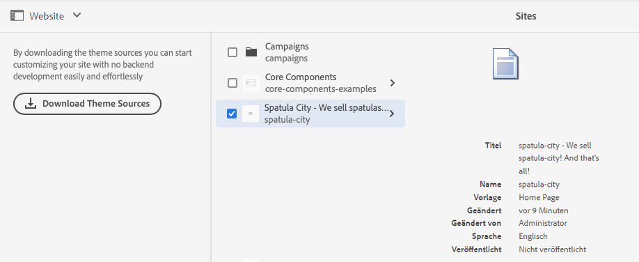

# Grundlegende Handhabung {#basic-handling}

Dieses Dokument soll einen Überblick über die grundlegende Handhabung der AEM-Autorenumgebung geben. Als Grundlage wird die **Sites-Konsole** verwendet.

>[!NOTE]
>
>* Einige Funktionen stehen nicht in allen Konsolen zur Verfügung und in einigen Konsolen können zusätzliche Funktionen zur Verfügung stehen. Detaillierte Informationen zu den einzelnen Konsolen und ihren jeweiligen Funktionen finden Sie auf den anderen Seiten.
>* In AEM sind Tastaturbefehle verfügbar. Insbesondere wenn [Verwenden von Konsolen](/help/sites-cloud/authoring/getting-started/keyboard-shortcuts.md) und [Seiten bearbeiten](/help/sites-cloud/authoring/fundamentals/keyboard-shortcuts.md).

{{edge-delivery-authoring}}

## Touch-optimierte Benutzeroberfläche {#a-touch-enabled-ui}

Die AEM-Benutzeroberfläche wurde für Touchscreens optimiert. Eine Touch-optimierte Benutzeroberfläche ermöglicht es Ihnen, mithilfe von Gesten wie &quot;Auswählen&quot;, &quot;Berühren und Halten&quot;und &quot;Wischen&quot;mit der Software zu interagieren. Da die AEM-Benutzeroberfläche Touch-optimiert ist, können Sie Berührungsgesten auf Ihren Touch-Geräten wie auf Ihrem Handy oder Tablet verwenden. Es sind jedoch auch Mausaktionen auf einem herkömmlichen Desktop-Gerät möglich, sodass Sie flexibel entscheiden können, wie Sie Ihre Inhalte erstellen möchten.

## Erste Schritte {#first-steps}

Unmittelbar nach der Anmeldung gelangen Sie zum [Navigationsfenster](#navigation-panel). Wenn Sie eine der Optionen auswählen, wird die entsprechende Konsole geöffnet.

Damit Sie ein gutes Verständnis der grundlegenden Funktionen in AEM erhalten, wurde für dieses Dokument die **Sites-Konsole** herangezogen. Wählen Sie **Sites** aus, um zu beginnen.

## Produktnavigation {#product-navigation}

Wenn eine Benutzerin oder ein Benutzer zum ersten Mal auf eine Konsole zugreift, wird ein Tutorial zur Produktnavigation gestartet. Nehmen Sie sich einen Moment Zeit, um sich das Programm anzusehen und einen guten Überblick über den grundlegenden Umgang mit AEM zu erhalten.

Wählen Sie **Weiter** aus, um zur nächsten Seite des Überblicks zu wechseln. Wählen Sie zum Schließen die Option **Schließen** oder eine Stelle außerhalb des Dialogfelds „Überblick“ aus.

Die Übersicht wird bei Ihrem nächsten Zugriff auf eine Konsole wieder gestartet, sofern Sie nicht die Option **Nicht mehr anzeigen** aktivieren.

## Globale Navigation {#global-navigation}

Sie können mithilfe des globalen Navigationsfensters zwischen den Konsolen navigieren. Dieses Navigationsfenster wird als Vollbild-Dropdown angezeigt, wenn Sie den Adobe Experience Manager-Link in der linken oberen Bildschirmecke auswählen.

Sie können das globale Navigationsfenster schließen, indem Sie auf **Schließen** klicken oder tippen. Sie kehren dann zu Ihrer vorherigen Position zurück.

Die globale Navigation verfügt über zwei Fenster, die am linken Bildschirmrand durch Symbole dargestellt werden:

* **[Navigation](#navigation-panel)** - Wird durch einen Kompass und das Standardbedienfeld bei der Anmeldung bei AEM dargestellt
* **[Tools](#tools-panel)** – dargestellt durch einen Hammer

Die in diesen Fenstern verfügbaren Optionen werden im Folgenden beschrieben.

### Navigationsfenster {#navigation-panel}

Das Navigationsfenster:

Der Titel der Browser-Registerkarte wird aktualisiert, um Ihren Standort während der Navigation durch die Konsolen und Inhalte widerzuspiegeln.

Im Navigationsfenster stehen folgende Konsolen zur Verfügung:

| Konsole | Zweck |
|---|---|
| Projekte | Die Projektekonsole bietet Ihnen direkten Zugriff auf Ihre Projekte. [Projekte sind virtuelle Dashboards](/help/sites-cloud/authoring/projects/overview.md), die zum Aufbau eines Teams verwendet werden können. Sie können diesem Team dann Zugriff auf Ressourcen, Workflows und Aufgaben gewähren, damit alle auf ein gemeinsames Ziel hinarbeiten. |
| Sites | Mit der Konsole „Sites“ können Sie [Websites erstellen, anzeigen und verwalten](/help/sites-cloud/authoring/fundamentals/organizing-pages.md), die auf Ihrer AEM-Instanz ausgeführt werden. Mithilfe dieser Konsole können Sie Seiten erstellen, bearbeiten, kopieren, verschieben, löschen und veröffentlichen sowie Workflows starten. |
| Experience Fragments | Bei einem [Experience Fragment](/help/sites-cloud/authoring/fundamentals/experience-fragments.md) handelt es sich um ein einzelnes Erlebnis, das kanalübergreifend wiederverwendet werden kann und Varianten aufweist. So erübrigt sich das wiederholte Kopieren und Einfügen von Erlebnissen oder Teilen von Erlebnissen. |
| Assets | In der Assets-Konsole können Sie [digitale Assets, wie Bilder, Videos, Dokumente und Audiodateien](/help/assets/overview.md), importieren und verwalten. Diese Assets können dann von jeder Site verwendet werden, die auf derselben AEM-Instanz ausgeführt wird. Über die Assets-Konsole können Sie auch [Inhaltsfragmente](/help/assets/content-fragments/content-fragments.md) erstellen und verwalten. |
| Personalisierung    | Diese Konsole bietet ein Framework aus Tools für die [Bearbeitung von Inhalten für eine bestimmte Zielgruppe und das Bieten personalisierter Erlebnisse](/help/sites-cloud/authoring/personalization/overview.md). |
| Inhaltsfragmente | [Inhaltsfragmente](/help/sites-cloud/administering/content-fragments/overview.md) ermöglichen Ihnen das Entwerfen, Erstellen, Kuratieren und Veröffentlichen von seitenunabhängigen Inhalten. Sie ermöglichen es Ihnen, strukturierte Inhalte vorzubereiten, die an verschiedenen Orten und über verschiedene Kanäle verwendet werden können, und eignen sich sowohl für die Erstellung von Seiten als auch für die Headless-Bereitstellung. |

## Tools-Bereich {#tools-panel}

Im Tools-Bereich befindet sich ein seitliches Bedienfeld mit einem Bereich von Kategorien, in denen ähnliche Tools-Konsolen gruppiert sind. Die Tools-Konsolen bieten Zugriff auf verschiedene spezialisierte Tools und Konsolen, mit denen Sie Websites, digitale Assets und andere Aspekte Ihres Content-Repositorys verwalten können. <!--The [Tools consoles](/help/sites-administering/tools-consoles.md) provide access to several specialized tools and consoles that help you administer your websites, digital assets, and other aspects of your content repository.-->

## Die Kopfzeile {#the-header}

Die Kopfzeile befindet sich immer am oberen Rand des Bildschirms. Die meisten Optionen in der Kopfzeile bleiben unabhängig von Ihrer Position im System gleich, manche sind aber kontextspezifisch.

* [Globale Navigation](#global-navigation)

  Wählen Sie den Link **Adobe Experience Manager** aus, um zwischen Konsolen zu navigieren.

  

* [Suchen](/help/sites-cloud/authoring/getting-started/search.md)

  

  Sie können auch den [Tastaturbefehl](/help/sites-cloud/authoring/getting-started/keyboard-shortcuts.md) `/` (Schrägstrich) verwenden, um von jeder beliebigen Konsole aus die Suche zu starten.

* [Lösungen](https://www.adobe.com/experience-cloud.html)

  

* [Hilfe](#accessing-help)

  

* [Benachrichtigungen](/help/sites-cloud/authoring/getting-started/inbox.md)

  

  Dieses Symbol wird mit der Anzahl der aktuell zugewiesenen unvollständigen Benachrichtigungen gekennzeichnet.

* [Benutzereigenschaften](/help/sites-cloud/authoring/getting-started/account-environment.md)

  

* [Schienenauswahl](#rail-selector)

  

  Die angezeigten Optionen hängen von der jeweiligen Konsole ab. So können Sie z. B. in **Sites** nur Inhalt (Standard), die Zeitleiste, Verweise oder das seitliche Bedienfeld „Filter“ auswählen.

  

* Breadcrumb

  

  Breadcrumbs befinden sich immer in der Mitte der Leiste und zeigen die Beschreibung des aktuell ausgewählten Elements an. Sie ermöglichen Ihnen damit die Navigation innerhalb einer bestimmten Konsole. In der **Sites**-Konsole können Sie damit durch die Ebenen Ihrer Website navigieren.

  Klicken Sie einfach auf den Breadcrumb-Text, um eine Dropdown-Liste mit den Hierarchieebenen des aktuell ausgewählten Elements anzuzeigen. Klicken Sie auf einen Eintrag, um zu dieser Position zu gelangen.

  

* Schaltfläche **Erstellen**

  

  Wird hierauf geklickt, entsprechen die angezeigten Optionen der Konsole/dem Kontext.

* [Ansichten](#viewing-and-selecting-resources)

  Das Ansichtssymbol befindet sich ganz rechts in der AEM-Symbolleiste. Da es auch die aktuelle Ansicht anzeigt, ändert es sich. In der Standardansicht wird beispielsweise in der **Spaltenansicht** Folgendes angezeigt:

  

  Sie können zwischen der Spalten-, Karten- und Listenansicht wechseln; in der Listenansicht werden auch die Ansichtseinstellungen angezeigt.

  

  >[!NOTE]
  >
  >Die Option **Ansichtseinstellungen** steht nur im Modus **Listenansicht** zur Verfügung.

* Navigation über die Tastatur

  Sie haben die Möglichkeit, auf einer Website nur mit der Tastatur zu navigieren. Dabei wird die Standard-Browser-Funktionalität der **TAB**-Taste (oder **WAHL+TAB**) verwendet, um zwischen fokussierbaren Elementen auf der Seite zu wechseln.

  In der **Sites**-Konsole gibt es die zusätzliche Option, **zum Hauptinhalt zu wechseln**. Diese wird sichtbar, wenn Sie durch die Kopfzeilenoptionen blättern, und beschleunigt Ihre Navigation, indem Sie die Standardelemente in der (Produkt-) Symbolleiste überspringen und direkt zum Hauptinhalt wechseln.

  

## Aufrufen der Hilfe {#accessing-help}

Ihnen stehen verschiedene Hilferessourcen zur Verfügung:

* **Konsolensymbolleiste**

  Durch Auswahl des Symbols **Hilfe** werden abhängig von Ihrer Position die geeigneten Ressourcen geöffnet:

  

* **Navigation**

  Beim erstmaligen Navigieren im System [wird die AEM-Navigation über eine Reihe von Folien vorgestellt](#product-navigation).

  

* **Seiten-Editor**

  Wenn Sie zum ersten Mal eine Seite bearbeiten, wird der Seiten-Editor durch eine Reihe von Folien vorgestellt.

  

  Navigieren Sie in diesem Überblick wie im [Überblick zur Produktnavigation](#product-navigation) beim erstmaligen Öffnen einer Konsole.

  Im Menü [**Seiteninformationen** können Sie die Option **Hilfe**](/help/sites-cloud/authoring/fundamentals/environment-tools.md#accessing-help) auswählen, um diese Folien jederzeit erneut anzuzeigen.

* **Tools-Konsole**

  Über die **Tools**-Konsole können Sie auch auf die externen **Ressourcen** zugreifen.

   * **Dokumentation** –
Dokumentation für Web Experience Management anzeigen
   * **Entwicklungsressourcen** –Entwicklungsressourcen und Downloads

  >[!NOTE]
  >
  >Sie können jederzeit über den Hotkey `?` (Fragezeichen) in einer Konsole auf eine Übersicht der verfügbaren Tastaturbefehle zugreifen.
  >
  >Eine Aufstellung aller Tastaturbefehle finden Sie in den folgenden Dokumenten:
  >
  >* [Tastaturbefehle für die Seitenbearbeitung](/help/sites-cloud/authoring/fundamentals/keyboard-shortcuts.md)
  >* [Tastaturbefehle für Konsolen](/help/sites-cloud/authoring/getting-started/keyboard-shortcuts.md)

## Aktionssymbolleiste {#actions-toolbar}

Bei der Auswahl einer Ressource (z. B. einer Seite oder eines Assets) werden in der Symbolleiste verschiedene durch Symbole und Text gekennzeichnete Aktionen mit erläuterndem Text angezeigt. Diese Aktionen sind abhängig von:

* der aktuellen Konsole
* dem aktuellen Kontext
* ob Sie sich im [Auswahlmodus](#viewing-and-selecting-resources) befinden

In der Symbolleiste werden immer nur jene Aktionen angezeigt, die Sie bei den jeweiligen Elementen durchführen können.

Wie Sie [eine Ressource auswählen](#viewing-and-selecting-resources), hängt von der Ansicht ab.

Aufgrund des eingeschränkten Anzeigebereichs in einigen Fenstern kann die Symbolleiste schnell länger als der verfügbare Platz werden. In diesem Fall werden weitere Optionen angezeigt. Durch Klicken oder Tippen auf die Auslassungspunkte (drei Punkte bzw. **…**) wird eine Dropdown-Auswahl geöffnet, die alle verbleibenden Aktionen enthält. Beispiel: Sie haben eine Seite in der **Sites-Konsole** ausgewählt:

>[!NOTE]
>
>Die einzelnen verfügbaren Symbole werden gemäß der/des jeweils zutreffenden Konsole/Funktion/Szenarios dokumentiert.

## Schnellaktionen {#quick-actions}

In der [Kartenansicht](#card-view) sind bestimmte Aktionen sowohl als Schnellaktionssymbole als auch auf der Symbolleiste vorhanden. Schnellaktionssymbole sind jeweils nur für ein Element verfügbar, sodass Sie keine Vorauswahl treffen müssen.

Die Schnellaktionen sind sichtbar, wenn Sie den Mauszeiger (auf Desktop-Geräten) über eine Ressourcenkarte bewegen. Die verfügbaren Schnellaktionen können von der Konsole und dem Kontext abhängen. Hier finden Sie beispielsweise die Schnellaktionen für eine Seite in der **Sites**-Konsole:

## Anzeigen und Auswählen von Ressourcen {#viewing-and-selecting-resources}

Anzeige, Navigation und Auswahl sind grundsätzlich in allen Ansichten gleich. Je nach verwendeter Ansicht kommt es aber zu geringfügigen Abweichungen bei der Verwendung.

Sie können Ressourcen in jeder der verfügbaren Ansichten anzeigen, darin navigieren und sie auswählen (für weitere Aktionen). Die einzelnen Ansichten können Sie mit dem Symbol oben rechts auswählen:

* [Spaltenansicht](#column-view)
* [Kartenansicht](#card-view)
* [Listenansicht](#list-view)

>[!NOTE]
>
>Standardmäßig zeigt AEM Assets in keiner der Ansichten die ursprüngliche Ausgabedarstellung von Assets als Miniatur in der Benutzeroberfläche an. Administratoren können mithilfe von Überlagerungen AEM Assets so konfigurieren, dass ursprüngliche Ausgabedarstellungen als Miniaturen angezeigt werden.

### Auswählen von Ressourcen {#selecting-resources}

Die Auswahl einer bestimmten Ressource hängt von der Kombination der Ansicht und des Geräts ab:

| Anzeigen | Touch aktivieren | Desktop aktivieren | Touch deaktivieren | Desktop deaktivieren |
|---|---|---|---|---|
| Spalte | Auswählen der Miniaturansicht | Klicken Sie auf die Miniatur | Auswählen der Miniaturansicht | Klicken Sie auf die Miniatur |
| Karte | Karte auswählen und halten | Fahren Sie mit dem Mauszeiger darüber und verwenden Sie dann die Schnellaktion mit Häkchen | Auswählen der Karte | Klicken Sie auf die Karte |
| Liste | Auswählen der Miniaturansicht | Klicken Sie auf die Miniatur | Auswählen der Miniaturansicht | Klicken Sie auf die Miniatur |

#### Alle auswählen {#select-all}

Sie können alle Elemente in einer Ansicht auswählen, indem Sie in der oberen rechten Ecke der Konsole auf die Option **Alles auswählen** klicken.

* In der **Kartenansicht** sind alle Karten ausgewählt.
* In der **Listenansicht** sind alle Elemente in der Liste ausgewählt.
* In der **Spaltenansicht** sind alle Elemente in der Spalte ganz links ausgewählt.

#### Gesamte Auswahl aufheben {#deselecting-all}

In allen Fällen wird die Anzahl der ausgewählten Elemente in der rechten oberen Ecke der Symbolleiste angezeigt.

Sie können wie folgt die Auswahl aller Elemente aufheben und den Auswahlmodus beenden:

* Klicken oder tippen Sie auf das **X** neben der Anzahl,
* verwenden Sie die **Esc**-Taste oder nutzen Sie

.

In allen Ansichten kann die Auswahl aller Elemente aufgehoben werden, indem Sie die Esc-Taste auf der Tastatur drücken, wenn Sie ein Desktop-Gerät verwenden.

#### Auswahlbeispiel {#selecting-example}

1. Beispiel für die Kartenansicht:

   

1. Nach Auswahl einer Ressource wird die obere Kopfzeile von der [Aktionssymbolleiste](#actions-toolbar) überdeckt, die Zugriff auf die Aktionen bietet, die für die ausgewählte Ressource verfügbar sind.

   Um den Auswahlmodus zu beenden, wählen Sie das **X** in der rechten oberen Ecke oder drücken Sie die **Esc-Taste**.

### Spaltenansicht {#column-view}

Die Spaltenansicht ermöglicht eine visuelle Navigation eines Inhaltsbaums durch eine Reihe kaskadierender Spalten. Mit dieser Ansicht können Sie die Baumstruktur Ihrer Website visualisieren und durchlaufen.

Wenn Sie eine Ressource in der Spalte ganz links auswählen, werden die untergeordneten Ressourcen in einer Spalte rechts angezeigt. Wenn Sie eine Ressource in der rechten Spalte auswählen, werden die ihr untergeordneten Ressourcen in einer anderen Spalte rechts angezeigt usw.

* Sie können in der Baumstruktur nach oben und unten navigieren, indem Sie auf den Ressourcennamen oder den Pfeil rechts neben dem Ressourcennamen tippen/klicken.

   * Beim Tippen bzw. Klicken werden der Ressourcenname und der Pfeil hervorgehoben.
   * Die untergeordneten Elemente der angeklickten/angetippten Ressource werden in der Spalte rechts neben der angeklickten/angetippten Ressource angezeigt.
   * Wenn Sie einen Ressourcennamen auswählen, der keine untergeordneten Elemente besitzt, werden die Ressourcendetails in der letzten Spalte angezeigt.

* Durch Tippen oder Klicken auf die Miniaturansicht wird die Ressource ausgewählt.

   * Wenn diese Option ausgewählt ist, wird ein Häkchen auf der Miniaturansicht angezeigt und zudem wird der Ressourcenname hervorgehoben.
   * Die Details der ausgewählten Ressource werden in der letzten Spalte angezeigt.
   * Die Aktionssymbolleiste wird verfügbar.

  Wenn eine Seite in der Spaltenansicht ausgewählt wird, wird die ausgewählte Seite in der letzten Spalte zusammen mit den folgenden Details angezeigt:

   * Seitentitel
   * Seitenname (Teil der URL der Seite)
   * Vorlage, auf der die Seite basiert
   * Änderungsdetails
   * Sprache der Seite
   * Veröffentlichen und Vorschau von Details

### Kartenansicht {#card-view}

* In der Kartenansicht werden Informationskarten für jedes Element auf der aktuellen Ebene angezeigt. Diese enthalten Informationen wie:

   * eine visuelle Darstellung des Seiteninhalts
   * den Seitentitel
   * wichtige Daten (z. B. zuletzt bearbeitet, zuletzt veröffentlicht)
   * ob die Seite gesperrt, ausgeblendet oder Teil einer Live Copy ist
   * wann Sie im Zuge eines Workflows agieren müssen (sofern zutreffend)
      * Markierungen, die die erforderlichen Aktionen angeben, können mit Einträgen in Ihrem [Posteingang](/help/sites-cloud/authoring/getting-started/inbox.md) in Verbindung stehen.

* [Schnellaktionen](#quick-actions) sind ebenfalls in dieser Ansicht verfügbar, z. B. Auswahl und allgemeine Aktionen wie Bearbeiten.

  

* Sie können in der Struktur nach unten navigieren, indem Sie auf die Karten tippen/klicken (vermeiden Sie dabei die Schnellaktionen), und über die [Breadcrumbs in der Kopfzeile](#the-header) wieder nach oben navigieren.

### Listenansicht {#list-view}

* In der Listenansicht werden Informationen für jede Ressource auf der aktuellen Ebene aufgelistet.
* Sie können in der Struktur nach unten navigieren, indem Sie auf den Ressourcennamen tippen/klicken, und über die [Breadcrumbs in der Kopfzeile](#the-header) wieder nach oben navigieren.
* Um alle Elemente in der Liste auszuwählen, verwenden Sie das Kontrollkästchen links oben in der Liste.

  

   * Wenn alle Elemente in der Liste ausgewählt sind, wird dieses Kontrollkästchen aktiviert.

      * Wählen Sie das Kontrollkästchen aus, um die Auswahl für alle aufzuheben.

   * Wenn nur einige Elemente ausgewählt sind, wird es mit einem Minuszeichen angezeigt.

      * Wählen Sie das Kontrollkästchen aus, um alle auszuwählen.
      * Wählen Sie das Kontrollkästchen erneut aus, um die Auswahl für alle aufzuheben.

* Wählen Sie mit der Option **Ansichtseinstellungen** unter der Schaltfläche „Ansichten“ die Spalten aus, die angezeigt werden sollen. Die folgenden Spalten stehen zur Anzeige zur Verfügung:

   * **Name** – Seitenname, der in einer mehrsprachigen Authoring-Umgebung nützlich sein kann, da er Teil der URL der Seite ist und sich unabhängig von der Sprache nicht ändert
   * **Geändert** – Datum und Person der letzten Änderung
   * **Veröffentlicht** – Veröffentlichungsstatus
   * **Vorschau** – Vorschaustatus
   * **Vorlage** – Vorlage, auf der die Seite basiert
   * **Workflow** – Workflow, der derzeit auf die Seite angewendet ist. Weitere Informationen sind verfügbar, wenn Sie die Maus darüber bewegen oder die Timeline öffnen.
   * **Seiten-Analytik**
   * **Unique Visitors**
   * **Zeit auf Seite**

     

  Standardmäßig wird die Spalte **Name** angezeigt, die Teil der URL der Seite ist. Unter Umständen muss der Autor auf Seiten zugreifen, die in einer anderen Sprache verfasst sind. In diesem Fall ist die Anzeige des Seitennamens (der sich normalerweise nicht ändert) äußerst hilfreich, wenn der Autor die Sprache der Seite nicht kennt.

* Ändern Sie die Reihenfolge der Elemente mithilfe des vertikalen gepunkteten Balkens am rechten Rand jedes Elements.

  >[!NOTE]
  >
  >Das Ändern der Reihenfolge funktioniert nur innerhalb eines sortierten Ordners, der den Wert `jcr:primaryType` als `sling:OrderedFolder` hat.

  

  Wählen Sie die vertikale Auswahlleiste aus und ziehen Sie das Element an eine neue Position in der Liste.

  

## Schienenauswahl {#rail-selector}

Die **Schienenauswahl** befindet sich im Fenster oben links. Je nach Konsole stehen unterschiedliche Optionen zur Verfügung.

So können Sie z. B. in der Konsole **Sites** nur Inhalt (Standard), die Inhaltsstruktur, die Zeitleiste, Verweise, Site-Details oder das seitliche Bedienfeld „Filter“ auswählen.

Wenn „Nur Inhalt“ ausgewählt ist, wird lediglich das Schienensymbol angezeigt. Bei Auswahl einer anderen Option wird der Optionsname neben dem Schienensymbol angezeigt.

>[!NOTE]
>
>[Tastaturbefehle](/help/sites-cloud/authoring/getting-started/keyboard-shortcuts.md) sind verfügbar, um schnell zwischen Optionen zur Schienenanzeige wechseln zu können.

### Inhaltsstruktur {#content-tree}

Die Inhaltsstruktur kann verwendet werden, um schnell in der Site-Hierarchie im Seitenbereich zu navigieren und viele Informationen über die Seiten im aktuellen Ordner anzuzeigen.

Mithilfe des Seitenbereichs der Inhaltsstruktur in Verbindung mit einer Listen- oder Kartenansicht können Benutzerinnen und Benutzer die hierarchische Struktur des Projekts einfach erkennen, mit dem Seitenbereich der Inhaltsstruktur einfach durch die Inhaltsstruktur navigieren und detaillierte Seiteninformationen in der Listenansicht anzeigen.

>[!NOTE]
>
>Sobald ein Eintrag in der Hierarchieansicht ausgewählt ist, können Sie mithilfe der Pfeiltasten schnell in der Hierarchie navigieren.
>
>Weitere Informationen finden Sie unter [Tastaturbefehle](/help/sites-cloud/authoring/getting-started/keyboard-shortcuts.md).

### Zeitleiste {#timeline}

Die Zeitleiste kann zur Anzeige und/oder Einleitung von Ereignissen in Verbindung mit der ausgewählten Ressource verwendet werden. Öffnen Sie die Zeitleisten-Spalte über die Schienenauswahl:

In der Timeline-Spalte haben Sie folgende Möglichkeiten:

* Anzeigen verschiedener Ereignisse im Zusammenhang mit einem ausgewählten Element

   * Sie können die Ereignistypen in der Dropdown-Liste auswählen:

      * Kommentare
      * [Anmerkungen](/help/sites-cloud/authoring/fundamentals/annotations.md)
      * [Aktivitäten](/help/sites-cloud/authoring/personalization/activities.md)
      * [Launches](/help/sites-cloud/authoring/launches/overview.md)
      * [Versionen](/help/sites-cloud/authoring/features/page-versions.md)
      * [Workflows](/help/sites-cloud/authoring/workflows/overview.md)
         * mit Ausnahme von Übergangs-Workflows, da keine Verlaufsinformationen für diese gespeichert werden <!--With the exception of [transient workflows](/help/sites-developing/workflows.md#transient-workflows) as no history information is saved for these-->
      * Alles anzeigen

* Hinzufügen/Anzeigen von Kommentaren zum gewählten Element Das Feld **Kommentare** wird unten in der Ereignisliste angezeigt. Wenn Sie einen Kommentar gefolgt von der Eingabetaste eingeben, wird der Kommentar registriert. Es wird angezeigt, wenn **Kommentare** oder **Alle anzeigen** ausgewählt ist.

* Einige Konsolen weisen weitere Funktionalitäten auf. So können Sie z. B. in der Sites-Konsole

   * [eine Version speichern](/help/sites-cloud/authoring/features/page-versions.md)
   * [einen Workflow starten](/help/sites-cloud/authoring/workflows/applying.md)

Diese Optionen sind über den Pfeil neben dem **Kommentarfeld** aufrufbar.

### Verweise {#references}

**Verweise** zeigen Verbindungen zur ausgewählten Ressource an. In der **Sites**-Konsole wird zum Beispiel folgendes für [Verweise](/help/sites-cloud/authoring/fundamentals/environment-tools.md#references) für Seiten angezeigt:

* [Launches](/help/sites-cloud/authoring/launches/overview.md#launches-in-references-sites-console)
* [Live Copies](/help/sites-cloud/administering/msm/overview.md#openingthelivecopyoverviewfromreferences)
* [Sprachkopien](/help/sites-cloud/administering/translation/preparation.md#seeing-the-status-of-language-roots)
* Inhaltsverweise:

   * Links von anderen Seiten zur ausgewählten Seite
   * Inhalt, der von ausgewählten Seiten durch die Referenzkomponente geliehen oder verliehen wird

### Site {#site}

**Site** zeigt Details zu Sites an, [die mithilfe einer Site-Vorlage erstellt wurden](/help/sites-cloud/administering/site-creation/create-site.md).

Im Dokument [Verwenden der Site-Leiste zur Verwaltung des Designs Ihrer Site](/help/sites-cloud/administering/site-creation/site-rail.md) finden Sie weitere Einzelheiten darüber, wie Sie die Leiste zur Verwaltung des [Designs Ihrer Site](/help/sites-cloud/administering/site-creation/site-themes.md) verwenden können.

>[!TIP]
>
>Eine vollständige Beschreibung des Prozesses zum Erstellen einer Site aus einer Vorlage und zum Anpassen ihres Designs finden Sie in der [Tour zur schnellen Site-Erstellung](/help/journey-sites/quick-site/overview.md).

### Filter {#filter}

Hierdurch wird ein dem [Suchbereich](/help/sites-cloud/authoring/getting-started/search.md) ähnliches Fenster mit bereits entsprechend eingestellten Ortsfiltern geöffnet. So können Sie den für die Anzeige gewünschten Inhalt weiter filtern.

