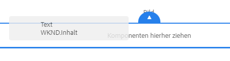
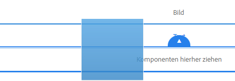
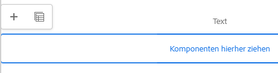
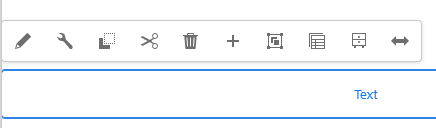
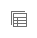
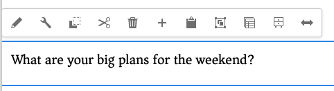
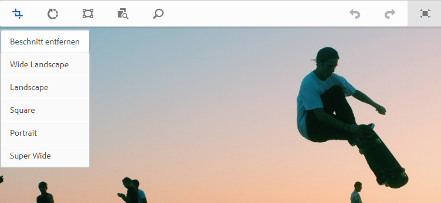
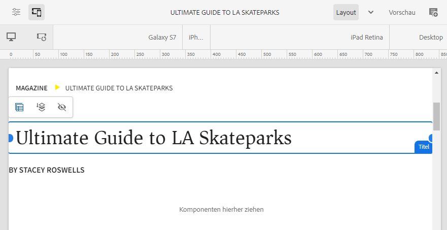

# Bearbeiten von Seiteninhalten mit dem AEM-Seiteneditor {#edit-content}

Der AEM-Seiteneditor ist ein leistungsstarkes Tool zum Erstellen von Seiteninhalten. Erfahren Sie, wie Sie damit Inhalte per Drag &amp; Drop verschieben und im Kontext bearbeiten können.

## Überblick {#overview}

Es gibt drei grundlegende Aktionen, die Sie im Seiteneditor ausführen können, um Inhalte zu bearbeiten:

1. [Hinzufügen neuer Komponenten](#adding-components) durch Ziehen und Ablegen auf die Seite
1. [Hinzufügen neuer Assets](#adding-asset) durch Ziehen und Ablegen auf die Seite
1. [Bearbeiten von Komponenten im Kontext](#edit-in-place), die bereits auf der Seite vorhanden sind

Der AEM-Seiteneditor bietet eine intuitive Benutzeroberfläche für die Durchführung dieser Aufgaben sowie Zugriff auf erweiterte Funktionen.

Darüber hinaus können Sie mit dem Editor den vorhandenen Inhalt auf Ihrer Seite durch folgende Vorgänge organisieren:

* [Verschieben von Komponenten](#moving-components)
* [Bearbeiten des Komponenten-Layouts](#editing-component-layout)
* [Bearbeiten der Komponentenvererbung](#inherited-components)

>[!NOTE]
>
>Ihr Projekt-Team kann die Konsole bei Bedarf anpassen. Weitere Details finden Sie unter [Anpassen der Seitenbearbeitung](/help/implementing/developing/extending/page-authoring.md).

## Hinzufügen von Komponenten {#adding-components}

Sie können neue Komponenten per Drag-and-Drop auf Ihre Seite ziehen, indem Sie sie aus dem [Komponenten-Browser im seitlichen Bedienfeld](/help/sites-cloud/authoring/page-editor/editor-side-panel.md#components-browser) auf einen Komponenten-Platzhalter ziehen.

### Komponenten-Platzhalter {#component-placeholder}

Der Komponenten-Platzhalter zeigt an, wo eine Komponente platziert wird, wenn sie abgelegt wird. Sie zeigt sich in zweierlei Form:

* Wenn Sie eine neue Komponente zur Seite hinzufügen (aus dem Komponenten-Browser ziehen), wird sie als graues Feld mit Details zur platzierten Komponente angezeigt.

  

* Wenn Sie [eine vorhandene Komponente verschieben](#movging-components), wird sie als blaues Quadrat angezeigt.

  

In beiden Fällen wird das ausgewählte Ziel blau umrandet unter der Komponente dargestellt, die gezogen wird. Das Ziel ist die Stelle, an die die Komponente beim Loslassen platziert wird.

### Hinzufügen einer Komponente aus dem Komponenten-Browser {#adding-a-component-from-the-components-browser}

Sie können eine neue Komponente mit dem [Komponenten-Browser](/help/sites-cloud/authoring/page-editor/editor-side-panel.md#components-browser) hinzufügen. Der [Komponenten-Platzhalter](#component-placeholder) zeigt an, wo die Komponente platziert wird.

1. Stellen Sie sicher, dass sich der Seiteneditor im [**Bearbeitungsmodus** befindet](/help/sites-cloud/authoring/page-editor/introduction.md#mode-selector).
1. Öffnen Sie den [Komponenten-Browser](/help/sites-cloud/authoring/page-editor/editor-side-panel.md#components-browser).
1. Ziehen Sie die benötigte Komponente an die [passende Position](#component-placeholder) und lassen Sie los.
1. [Bearbeiten](#edit-content) Sie die neu platzierte Komponente.

>[!NOTE]
>
>Auf Mobilgeräten nimmt der Komponenten-Browser den gesamten Bildschirm ein. Sobald Sie mit dem Ziehen einer Komponente beginnen, wird der Browser geschlossen, um die Seite erneut anzuzeigen, damit Sie die Komponente platzieren können.

### Hinzufügen einer Komponente aus dem Absatzsystem {#adding-a-component-from-the-paragraph-system}

Sie können eine neue Komponente über den Platzhalter **Komponenten hierher ziehen** des Absatzsystems hinzufügen. 

1. Stellen Sie sicher, dass sich der Seiteneditor im [**Bearbeitungsmodus** befindet](/help/sites-cloud/authoring/page-editor/introduction.md#mode-selector).
1. Es gibt zwei Möglichkeiten, eine neue Komponente aus dem Absatzsystem auszuwählen und hinzuzufügen:

   * Wählen Sie die Option **Komponente einfügen** (+) aus der Symbolleiste einer vorhandenen Komponente oder aus dem Feld **Komponenten hierherziehen**.

     

   * Wenn Sie ein Desktop-Gerät verwenden, können Sie die Aktion per Doppelklick auf das Feld **Komponenten hierher ziehen** durchführen.

1. Das Dialogfeld **Neue Komponente einfügen** wird geöffnet, in dem Sie die erforderliche Komponente auswählen können: Tippen oder klicken Sie auf die Komponente, die hinzugefügt werden soll. 

   * Suchen Sie mithilfe der Suchfilter nach Ihrer Komponente.
   * Verwenden Sie das Informationssymbol neben den Komponentennamen, um mehr über die Komponente zu erfahren.

   

1. Die ausgewählte Komponente wird zu dem von Ihnen ausgewählten Ziel hinzugefügt. [Bearbeiten](#edit-content) Sie bei Bedarf die Komponente.

## Hinzufügen eines Assets {#adding-asset}

Sie können der Seite auch eine neue Komponente hinzufügen, indem Sie ein Asset aus dem [Asset-Browser](/help/sites-cloud/authoring/page-editor/editor-side-panel.md#assets-browser) ziehen. Dadurch wird automatisch eine Komponente des entsprechenden Typs erstellt, die das Asset enthält.

Dieses Verhalten kann für Ihre Installation konfiguriert werden. Weitere Informationen finden Sie im Dokument [Komponenten-Referenzhandbuch](/help/implementing/developing/components/reference.md#component-placeholders).

So erstellen Sie eine Komponente, indem Sie einen der obigen Asset-Typen ziehen:

1. Öffnen Sie die Seite im Modus [**Bearbeiten**](/help/sites-cloud/authoring/page-editor/introduction.md#mode-selector).
1. Öffnen Sie den [Asset-Browser](/help/sites-cloud/authoring/page-editor/editor-side-panel.md#assets-browser).
1. Ziehen Sie die benötigte Komponente an die passende Position. Der [Komponenten-Platzhalter](#component-placeholder) zeigt an, wo die Komponente sich befindet und ein Ziel zeigt an, wo sie eingefügt wird.
1. Lassen Sie das Asset auf dem Ziel los. Eine für den Asset-Typ geeignete Komponente wird am erforderlichen Speicherort erstellt und enthält das ausgewählte Asset.
1. [Bearbeiten](#edit-content) Sie bei Bedarf die Komponente.

>[!NOTE]
>
>Auf Mobilgeräten nimmt der Asset-Browser den gesamten Bildschirm ein. Sobald Sie mit dem Ziehen eines Assets beginnen, wird der Browser geschlossen, um die Seite erneut anzuzeigen, damit Sie das Asset platzieren können.

Wenn Sie die Assets durchgehen und feststellen, dass Sie an einem der Assets eine Änderung vornehmen möchten, können Sie den [Asset-Editor](/help/assets/manage-digital-assets.md) direkt über den Browser starten. Klicken Sie dazu einfach auf das Bearbeitungssymbol neben dem Asset-Namen.

## Bearbeiten von Komponenten im Kontext {#edit-in-place}

Wenn Sie eine Komponente auswählen, wird die Komponenten-Symbolleiste geöffnet. Damit können Sie verschiedene Aktionen für die Komponente auswählen.

Die in der Komponenten-Symbolleiste verfügbaren Aktionen sind für die ausgewählte Komponente geeignet. Je nach ausgewählter Komponente können mehr oder weniger Aktionen angezeigt werden. Diese können hier beschrieben werden oder nicht.

* **Bearbeiten** ermöglicht Änderungen des Inhalts der Komponente. Diese können häufig an Ort und Stelle vorgenommen werden. Das Verhalten hängt von der Komponente ab.

  

* **Konfigurieren** ermöglicht es Ihnen, einige Parameter der Komponente zu ändern, die sich nicht direkt auf ihren Inhalt beziehen. Dies erfolgt normalerweise in einem Dialogfeld. Das Verhalten hängt von der Komponente ab.

  

* **Kopieren** kopiert die Komponente in die Zwischenablage, um sie an einer anderen Stelle einzufügen. Die ursprüngliche Komponente bleibt unverändert.

  

* **Ausschneiden** kopiert die Komponente in die Zwischenablage. Die ursprüngliche Komponente wird entfernt.

  

* **Löschen** löscht die Komponente von der Seite. Sie werden dazu aufgefordert, die Aktion zu bestätigen.

  

* **Komponente einfügen** öffnet das Dialogfeld für das [Hinzufügen einer neuen Komponente](#adding-a-component-from-the-paragraph-system).

  

* **Einfügen** fügt die Komponente aus der Zwischenablage in die Seite ein. Ob das Original erhalten bleibt, hängt davon ab, ob Sie **Kopieren** oder **Ausschneiden** verwendet haben.

   * Sie können Komponenten auf derselben oder einer anderen Seite einfügen.
   * Wenn Sie etwas auf einer anderen Seite einfügen, die bereits vor dem Ausschneiden bzw. Kopieren geöffnet war, müssen Sie die Seite aktualisieren, damit der eingefügte Inhalt angezeigt wird.
   * Das eingefügte Element wird über dem Element eingefügt, auf dem Sie die Einfügeaktion auswählen.
   * Die Aktion „Einfügen“ wird nur angezeigt, wenn sich Inhalt in der Zwischenablage befindet.

  

* Mit **Gruppieren** können Sie mehrere Komponenten gleichzeitig auswählen. Dasselbe kann auf einem Desktop-Gerät durch **Strg+Klicken** bzw. **Befehl+Klicken** erreicht werden.

  

* **Übergeordnet** wählt die übergeordnete Komponente der ausgewählten Komponente aus.

  

* Mit **Layout** können Sie das [Layout](#editing-component-layout) der ausgewählten Komponente ändern. 

   * Dies gilt nur für die ausgewählte Komponente und aktiviert nicht den [Layout-Modus](/help/sites-cloud/authoring/page-editor/introduction.md#mode-selector) für die gesamte Seite.

  

* Mit der Option zum **Umwandeln in eine Experience-Fragment-Variante** können Sie ein [Experience Fragment](/help/sites-cloud/authoring/fragments/content-fragments.md) von der ausgewählten Komponente aus erstellen oder sie zu einem bestehenden Experience Fragment hinzufügen.

  

### Dialogfeld „Komponente bearbeiten“ {#component-edit-dialog}

Einige Komponenten bieten zusätzliche Bearbeitungsoptionen, die über die vorhandenen Bearbeitungsoptionen hinausgehen. Sie können das Dialogfeld „Bearbeiten“ einer Komponente über das [Symbol „Bearbeiten“ (Bleistiftsymbol) in der Komponenten-Symbolleiste](#component-toolbar) aufrufen, um auf zusätzliche Konfigurationsoptionen zuzugreifen.

Die exakten Bearbeitungsoptionen hängen von der jeweiligen Komponente ab. Bei bestimmten Komponenten sind [einige Aktionen nur im Vollbildmodus verfügbar](#edit-content-full-screen-mode). Zum Beispiel:

* Textkomponente

  

* Bildkomponente

  

### Bearbeiten von Komponenten im Vollbildmodus {#edit-content-full-screen-mode}

Viele Komponenten bieten einen Vollbildmodus für die Bearbeitung, auf den Sie über diese Schaltfläche zugreifen können.

Beim Bearbeiten im Vollbildmodus werden mehr Bearbeitungsoptionen als im Editor für die Bearbeitung im Kontext angezeigt, z. B. für die Bildkomponente.

Verwenden Sie die Schaltfläche **Minimieren**, um den Vollbildmodus zu beenden.

## Verschieben von Komponenten {#moving-components}

So verschieben Sie eine Komponente:

1. Wählen Sie durch Tippen und Halten bzw. Klicken und Halten die Komponente aus, die verschoben werden soll.
1. Ziehen Sie die Komponenten an die neue Position. 

   * Der Seiteneditor gibt die Position der Komponente mit einem [Platzhalter](#component-placeholder) an und zeigt, wo der Absatz mit einem Ziel abgelegt werden kann.

   

1. Legen Sie die Komponente an der gewünschten Position ab.

>[!TIP]
>
>Sie können eine Komponente auch durch [Ausschneiden und Einfügen](#component-toolbar) verschieben.

## Bearbeiten des Komponenten-Layouts {#editing-component-layout}

Wenn Sie eine Komponente anpassen möchten, müssen Sie nicht ständig zwischen dem Bearbeitungs- und dem [Layout-Modus](/help/sites-cloud/authoring/page-editor/responsive-layout.md) hin- und herwechseln. Mithilfe der **Layout**-Aktion können Sie das Layout einer Komponente ebenfalls ändern und dabei Zeit sparen, da Sie den Bearbeitungsmodus nicht verlassen müssen.

1. In der Sites-Konsole wird durch Auswählen einer Komponente im **Bearbeitungsmodus** die zugehörige Symbolleiste für die Komponente angezeigt.

1. Wählen Sie die **Layout**-Aktion aus, um das Layout der Komponente anzupassen.

   

1. Sobald die Layout-Aktion ausgewählt ist, können Sie das Layout der Komponente so wie im [Layout-Modus](/help/sites-cloud/authoring/page-editor/responsive-layout.md#defining-layouts-layout-mode) ändern.

   * Die Größenänderungsgriffe für die Komponente werden angezeigt.
   * Oben im Bildschirm wird die Emulator-Symbolleiste angezeigt.
   * In der Komponenten-Symbolleiste werden Layout-Aktionen anstelle der standardmäßigen Bearbeitungsaktionen angezeigt.

   

1. Wenn Sie alle Änderungen wie gewünscht vorgenommen haben, tippen oder klicken Sie im Aktionsmenü der Komponente auf die Schaltfläche **Schließen**, um die Layout-Anpassung zu stoppen. In der Komponenten-Symbolleiste stehen nun wieder die Standard-Bearbeitungsfunktionen zur Verfügung.

   

>[!TIP]
>
>Die Layout-Aktion ist immer auf die jeweils ausgewählte Komponente beschränkt. Wenn Sie z. B. das Layout einer Komponente bearbeiten und dann auf eine andere Komponente klicken, werden die Layout-Aktionen in der Bearbeitungssymbolleiste durch die Standardaktionen ersetzt und die Ziehpunkte zur Größenanpassung und die Emulator-Symbolleiste nicht mehr angezeigt.
>
>Um das Layout für die gesamte Seite, d. h. über mehrere Komponenten hinweg, zu bearbeiten, wechseln Sie in den [Layout-Modus](/help/sites-cloud/authoring/page-editor/responsive-layout.md).

## Bearbeiten der Komponentenvererbung {#inherited-components}

Vererbung ist der Mechanismus, bei dem Inhalte so verknüpft werden können, dass Inhaltsänderungen automatisch übernommen werden. Vererbte Komponenten können sich aus diversen Szenarien ergeben, wie:

* [Multi-Site-Management](/help/sites-cloud/administering/msm/overview.md)
* [Launches](/help/sites-cloud/authoring/launches/overview.md)

Sie können die Vererbung deaktivieren und dann wieder aktivieren. Je nach Komponente sind diese Optionen in der Komponenten-Symbolleiste verfügbar, wenn die Komponente Teil einer Live Copy oder eines Launches ist.

* **Vererbung abbrechen**

  

* **Vererbung erneut aktivieren**, wenn die Vererbung bereits abgebrochen wurde.

  

* **Rollout** steht auch in der Blueprint- oder Live Copy-Quelle zur Verfügung.

  
