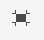

# Bearbeiten des Seiteninhalts mit dem AEM Seiteneditor {#edit-content}

Der AEM Seiteneditor ist ein leistungsstarkes Tool zum Bearbeiten des Seiteninhalts. Erfahren Sie, wie Sie damit Inhalte per Drag &amp; Drop verschieben und direkt bearbeiten können.

## Übersicht {#overview}

Es gibt drei grundlegende Aktionen, die Sie im Seiteneditor ausführen können, um Ihren Inhalt zu bearbeiten:

1. [Hinzufügen neuer Komponenten](#adding-components) durch Ziehen und Ablegen auf die Seite.
1. [Hinzufügen neuer Assets](#adding-asset) durch Ziehen und Ablegen auf die Seite.
1. [Bearbeiten von Komponenten direkt](#edit-in-place) die bereits auf der Seite vorhanden sind.

Der AEM Seiteneditor bietet eine intuitive Benutzeroberfläche für die Durchführung dieser Aufgaben sowie Zugriff auf erweiterte Funktionen.

Darüber hinaus können Sie mit dem Editor den vorhandenen Inhalt auf Ihrer Seite organisieren, indem Sie

* [Komponenten verschieben](#moving-components)
* [Komponentenlayout bearbeiten](#editing-component-layout)
* [Bearbeiten der Komponentenvererbung](#inherited-components)

## Komponenten hinzufügen {#adding-components}

Sie können neue Komponenten per Drag &amp; Drop auf Ihre Seite ziehen, indem Sie sie aus dem [Komponenten-Browser im Seitenbereich](/help/sites-cloud/authoring/page-editor/editor-side-panel.md#components-browser) und legen sie in einem Komponenten-Platzhalter ab.

### Komponenten-Platzhalter {#component-placeholder}

Der Komponenten-Platzhalter zeigt an, wo eine Komponente platziert wird, wenn Sie sie ablegen. Es gibt zwei Erscheinungen.

* Wenn Sie eine neue Komponente zur Seite hinzufügen (aus dem Komponenten-Browser ziehen), wird sie als graues Feld mit Details zur Komponente angezeigt, die Sie platzieren.

  

* Wann [Verschieben einer vorhandenen Komponente,](#movging-components) wird es als blaues Quadrat angezeigt.

  

In beiden Fällen wird die ausgewählte Zielgruppe als blauer Umriss unter der Komponente angezeigt, die Sie ziehen. Das Ziel, wenn die Komponente bei der Freigabe platziert wird.

### Hinzufügen einer Komponente aus dem Komponenten-Browser {#adding-a-component-from-the-components-browser}

Sie können eine neue Komponente mit dem [Komponenten-Browser](/help/sites-cloud/authoring/page-editor/editor-side-panel.md#components-browser) hinzufügen. Die [Komponenten-Platzhalter](#component-placeholder) zeigt Ihnen an, wo Sie die Komponente platzieren.

1. Stellen Sie sicher, dass sich der Seiteneditor in [**Bearbeiten** -Modus.](/help/sites-cloud/authoring/page-editor/introduction.md#mode-selector)
1. Öffnen Sie die [Komponenten-Browser.](/help/sites-cloud/authoring/page-editor/editor-side-panel.md#components-browser)
1. Ziehen Sie die erforderliche Komponente in den [erforderliche Position](#component-placeholder) und -Version.
1. [Bearbeiten](#edit-content) die neu platzierte Komponente.

>[!NOTE]
>
>Auf Mobilgeräten nimmt der Komponenten-Browser den gesamten Bildschirm ein. Sobald Sie mit dem Ziehen einer Komponente beginnen, wird der Browser geschlossen, um die Seite erneut anzuzeigen, damit Sie die Komponente platzieren können.

### Hinzufügen einer Komponente aus dem Absatzsystem {#adding-a-component-from-the-paragraph-system}

Sie können eine neue Komponente mit dem **Komponenten hierher ziehen** Platzhalter des Absatzsystems:

1. Stellen Sie sicher, dass sich der Seiteneditor in [**Bearbeiten** -Modus.](/help/sites-cloud/authoring/page-editor/introduction.md#mode-selector)
1. Es gibt zwei Möglichkeiten, eine neue Komponente aus dem Absatzsystem auszuwählen und hinzuzufügen:

   * Wählen Sie die Option **Komponente einfügen** (+) aus der Symbolleiste einer vorhandenen Komponente oder aus dem Feld **Komponenten hierherziehen**.

     

   * Wenn Sie ein Desktop-Gerät verwenden, können Sie die Aktion per Doppelklick auf das Feld **Komponenten hierher ziehen** durchführen.

1. Die **Neue Komponente einfügen** -Dialogfeld geöffnet, in dem Sie die gewünschte Komponente auswählen können. Tippen oder klicken Sie auf die hinzuzufügende Komponente.

   * Verwenden Sie die Suchfilter, um Ihre Komponente zu finden.
   * Verwenden Sie das Informationssymbol neben Komponentennamen, um mehr über die Komponente zu erfahren.

   

1. Die ausgewählte Komponente wird zum ausgewählten Ziel hinzugefügt. [Bearbeiten](#edit-content) Sie bei Bedarf die Komponente.

## Hinzufügen eines Assets {#adding-asset}

Sie können auch eine neue Komponente zur Seite hinzufügen, indem Sie ein Asset aus dem [Asset-Browser.](/help/sites-cloud/authoring/page-editor/editor-side-panel.md#assets-browser) Dadurch wird automatisch eine Komponente des entsprechenden Typs erstellt (und das Asset enthält).

Dieses Verhalten kann für Ihre Installation konfiguriert werden. Lesen Sie das Dokument . [Komponentenreferenzhandbuch](/help/implementing/developing/components/reference.md#component-placeholders) für weitere Informationen.

So erstellen Sie eine Komponente, indem Sie einen der obigen Asset-Typen ziehen:

1. Stellen Sie sicher, dass sich Ihre Seite in [**Bearbeiten** -Modus.](/help/sites-cloud/authoring/page-editor/introduction.md#mode-selector)
1. Öffnen Sie den [Asset-Browser](/help/sites-cloud/authoring/page-editor/editor-side-panel.md#assets-browser).
1. Ziehen Sie die benötigte Komponente an die passende Position. Die [Komponenten-Platzhalter](#component-placeholder) zeigt an, wo die Komponente positioniert ist und ein Ziel zeigt an, wo sie eingefügt wird.
1. Lassen Sie das Asset auf das Ziel los. Eine für den Asset-Typ geeignete Komponente wird an der erforderlichen Stelle erstellt, die das ausgewählte Asset enthält.
1. [Bearbeiten](#edit-content) Sie bei Bedarf die Komponente.

>[!NOTE]
>
>Auf Mobilgeräten nimmt der Asset-Browser den gesamten Bildschirm ein. Sobald Sie mit dem Ziehen eines Assets beginnen, wird der Browser geschlossen, um die Seite erneut anzuzeigen, damit Sie das Asset platzieren können.

Wenn Sie die Assets durchgehen und feststellen, dass Sie an einem der Assets eine Änderung vornehmen möchten, können Sie den [Asset-Editor](/help/assets/manage-digital-assets.md) direkt über den Browser starten. Klicken Sie dazu einfach auf das Bearbeitungssymbol neben dem Asset-Namen.

## Bearbeiten von Komponenten im Kontext {#edit-in-place}

Wenn Sie eine Komponente auswählen, wird die Komponenten-Symbolleiste geöffnet. Damit können Sie verschiedene Aktionen für die Komponente auswählen.

Die in der Komponenten-Symbolleiste verfügbaren Aktionen sind für die ausgewählte Komponente geeignet. Je nach ausgewählter Komponente können mehr oder weniger angezeigt werden und diese werden hier möglicherweise oder nicht beschrieben.

* **Bearbeiten** können Sie den Inhalt der Komponente ändern, häufig an Ort und Stelle. Sein Verhalten hängt von der Komponente ab.

  

* **Konfigurieren** ermöglicht es Ihnen, einige Parameter der Komponente zu ändern, die sich nicht direkt auf ihren Inhalt beziehen, normalerweise in einem Dialogfeld. Sein Verhalten hängt von der Komponente ab.

  

* **Kopieren** kopiert die Komponente in die Zwischenablage, um sie an einer anderen Stelle einzufügen. Die ursprüngliche Komponente bleibt unverändert.

  

* **Ausschneiden** kopiert die Komponente in die Zwischenablage. Die ursprüngliche Komponente wird entfernt.

  

* **Löschen** löscht die Komponente mit Ihrer Bestätigung aus der Seite.

  

* **Komponente einfügen** öffnet das Dialogfeld zu [eine neue Komponente hinzufügen.](#adding-a-component-from-the-paragraph-system)

  

* **Einfügen** Fügt die Komponente aus der Zwischenablage in die Seite ein. Ob das Original erhalten bleibt, hängt davon ab, ob Sie verwendet haben **Kopieren** oder **Ausschneiden**.

   * Sie können Komponenten auf derselben oder einer anderen Seite einfügen.
   * Wenn Sie etwas auf einer anderen Seite einfügen, die bereits vor dem Ausschneiden bzw. Kopieren geöffnet war, müssen Sie die Seite aktualisieren, damit der eingefügte Inhalt angezeigt wird.
   * Das eingefügte Element wird über dem Element eingefügt, auf dem Sie die Einfügeaktion auswählen.
   * Die Aktion „Einfügen“ wird nur angezeigt, wenn sich Inhalt in der Zwischenablage befindet.

  

* **Gruppe** können Sie mehrere Komponenten gleichzeitig auswählen. Dasselbe kann auf einem Desktop-Gerät durch **Strg+Klicken** bzw. **Befehl+Klicken** erreicht werden.

  

* **Übergeordnet** markiert die übergeordnete Komponente der ausgewählten Komponente.

  

* **Layout** können Sie die [layout](#editing-component-layout) der ausgewählten Komponente.

   * Dies gilt nur für die ausgewählte Komponente und aktiviert nicht den [Layout-Modus](/help/sites-cloud/authoring/page-editor/introduction.md#mode-selector) für die gesamte Seite.

  

* **In Experience Fragment-Variante konvertieren** ermöglicht die Erstellung einer [Experience Fragment](/help/sites-cloud/authoring/fragments/content-fragments.md) aus der ausgewählten Komponente oder fügen Sie sie einem vorhandenen Experience Fragment hinzu.

  

### Dialogfeld „Komponente bearbeiten“ {#component-edit-dialog}

Einige Komponenten bieten zusätzliche Bearbeitungsoptionen, die über die ersetzenden Bearbeitungsoptionen hinausgehen. Sie können das Dialogfeld &quot;Bearbeiten&quot;einer Komponente im [Symbol &quot;Bearbeiten&quot;(Bleistift) in der Komponenten-Symbolleiste](#component-toolbar) , um auf zusätzliche Konfigurationsoptionen zuzugreifen.

Die genauen Bearbeitungsoptionen hängen von der Komponente ab. Für einige Komponenten [Einige Aktionen sind nur im Vollbildmodus verfügbar](#edit-content-full-screen-mode). Beispiel:

* Textkomponente

  

* Bildkomponente

  

### Bearbeiten von Komponenten im Vollbildmodus {#edit-content-full-screen-mode}

Viele Komponenten bieten einen Vollbildmodus für die Bearbeitung, auf den Sie über diese Schaltfläche zugreifen können.

Die Bearbeitung im Vollbildmodus ermöglicht die Anzeige von mehr Bearbeitungsoptionen als der Editor für die Bearbeitung im Kontext, z. B. für die Bildkomponente.

Verwenden Sie die **Minimieren** -Schaltfläche, um den Vollbildmodus zu aktivieren.

## Verschieben von Komponenten {#moving-components}

So verschieben Sie eine Komponente:

1. Wählen Sie die Komponente aus, die durch Tippen und Halten oder Klicken und Halten verschoben werden soll.
1. Ziehen Sie die Komponente an die neue Position.

   * Der Seiteneditor gibt die Position der Komponente mit einer [Platzhalter](#component-placeholder) und wo der Absatz mit einer Zielgruppe abgelegt werden kann.

   

1. Legen Sie es an der gewünschten Position ab.

>[!TIP]
>
>Sie können eine Komponente auch durch [Ausschneiden und Einfügen](#component-toolbar) verschieben.

## Bearbeiten des Komponenten-Layouts {#editing-component-layout}

Wenn Sie eine Komponente anpassen möchten, müssen Sie nicht ständig zwischen dem Bearbeitungs- und dem [Layout-Modus](/help/sites-cloud/authoring/page-editor/responsive-layout.md) hin- und herwechseln. Mithilfe der **Layout**-Aktion können Sie das Layout einer Komponente ebenfalls ändern und dabei Zeit sparen, da Sie den Bearbeitungsmodus nicht verlassen müssen.

1. Wann **Bearbeiten** -Modus der Sites-Konsole wählen Sie eine Komponente aus, um die Symbolleiste der Komponente anzuzeigen.

1. Wählen Sie die **Layout**-Aktion aus, um das Layout der Komponente anzupassen.

   

1. Sobald die Layout -Aktion ausgewählt ist, können Sie das Layout der Komponente wie in [Layout-Modus.](/help/sites-cloud/authoring/page-editor/responsive-layout.md#defining-layouts-layout-mode)

   * Die Größenänderungsgriffe für die Komponente werden angezeigt.
   * Oben im Bildschirm wird die Emulator-Symbolleiste angezeigt.
   * In der Komponenten-Symbolleiste werden Layout-Aktionen anstelle der standardmäßigen Bearbeitungsaktionen angezeigt.

   

1. Tippen oder klicken Sie nach den erforderlichen Layoutänderungen auf die Schaltfläche **Schließen** im Aktionsmenü der Komponente, um die Änderung des Layouts der Komponente zu beenden und die Symbolleiste der Komponente wieder in den normalen Bearbeitungsstatus zu versetzen.

   

>[!TIP]
>
>Die Layout-Aktion ist immer auf die jeweils ausgewählte Komponente beschränkt. Wenn Sie z. B. das Layout einer Komponente bearbeiten und dann auf eine andere Komponente klicken, werden die Layout-Aktionen in der Bearbeitungssymbolleiste durch die Standardaktionen ersetzt und die Ziehpunkte zur Größenanpassung und die Emulator-Symbolleiste nicht mehr angezeigt.
>
>Um das Layout für die gesamte Seite, d. h. über mehrere Komponenten hinweg, zu bearbeiten, wechseln Sie in den [Layout-Modus](/help/sites-cloud/authoring/page-editor/responsive-layout.md).

## Bearbeiten der Komponentenvererbung {#inherited-components}

Vererbung ist der Mechanismus, bei dem Inhalte so verknüpft werden können, dass sich durch eine Änderung automatisch der andere verändert. Vererbte Komponenten können sich aus diversen Szenarien ergeben, wie:

* [Multi-Site-Management](/help/sites-cloud/administering/msm/overview.md)
* [Launches](/help/sites-cloud/authoring/launches/overview.md)

Sie können die Vererbung abbrechen und erneut aktivieren. Je nach Komponente sind diese Optionen in der Komponenten-Symbolleiste verfügbar, wenn die Komponente Teil einer Live Copy oder eines Launches ist.

* **Vererbung abbrechen**

  

* **Vererbung erneut aktivieren** wenn die Vererbung bereits abgebrochen wurde

  

* **Rollout** ist auch in der Blueprint- oder Live Copy-Quelle verfügbar

  
