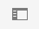
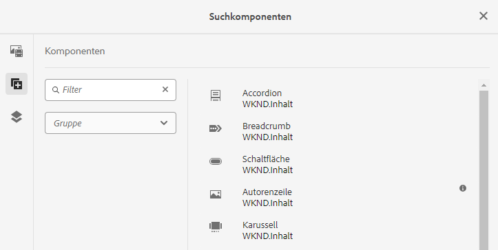
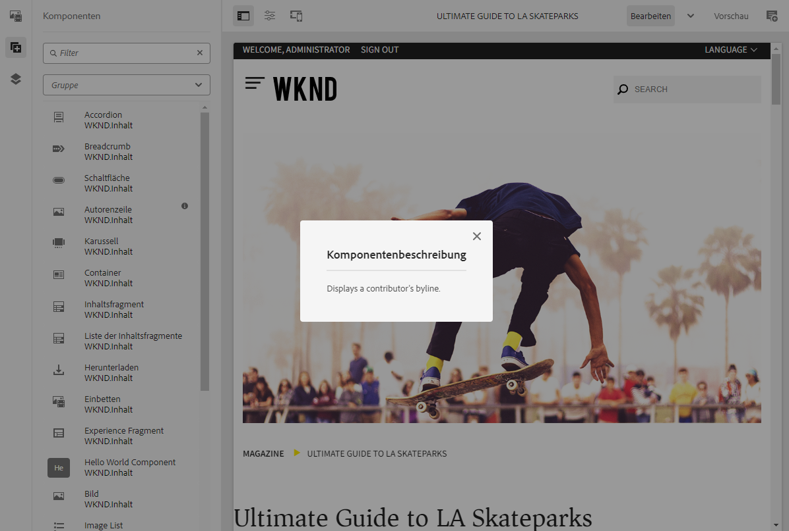
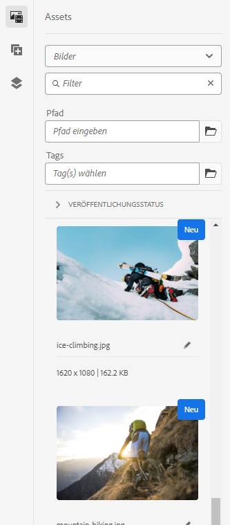
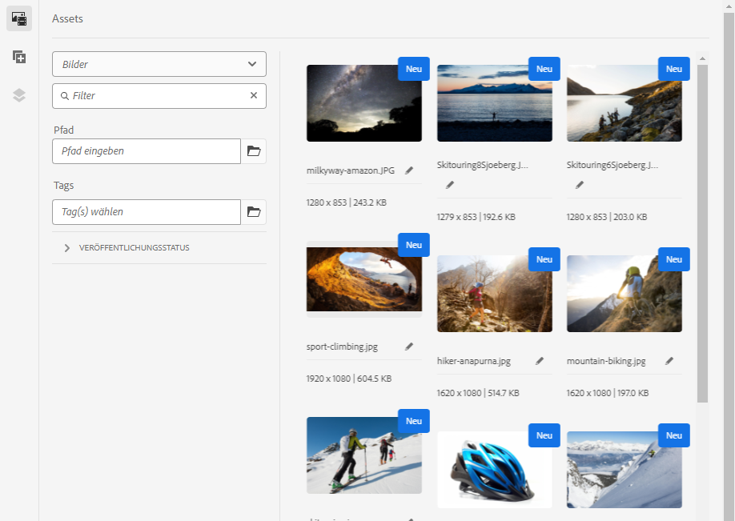
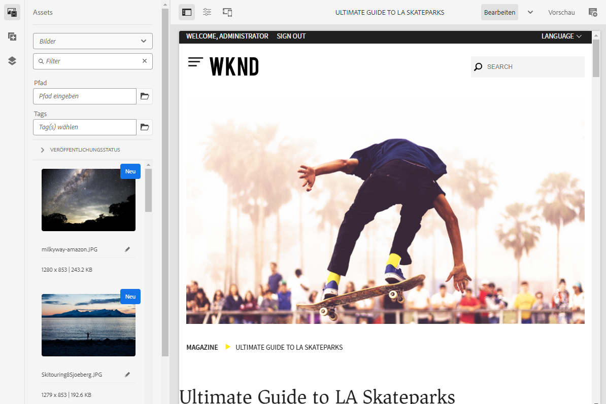
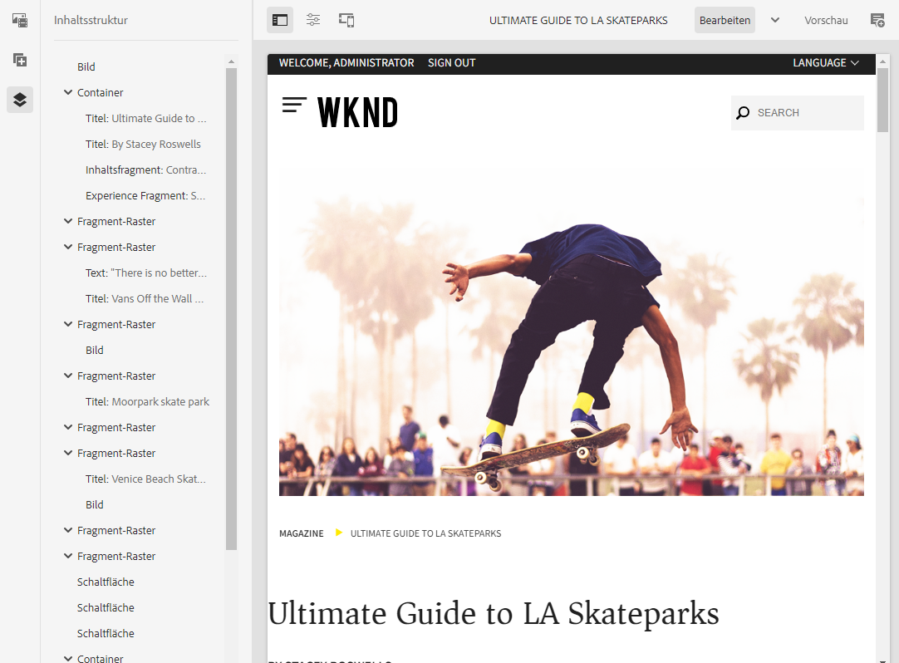
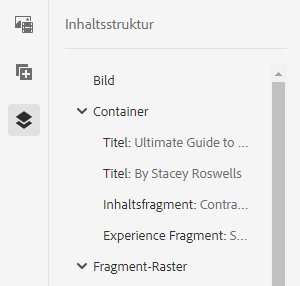
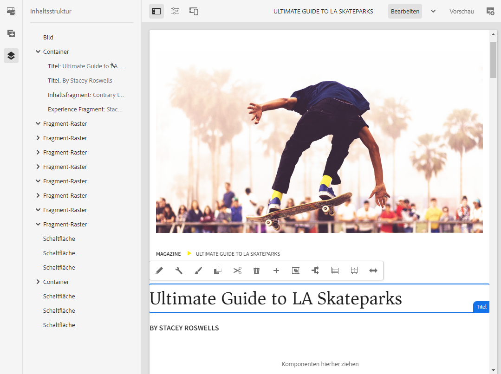

# Seitliches Bedienfeld des Seiteneditors {#side-panel}

Erfahren Sie, wie Sie mit dem seitlichen Bedienfeld im AEM Sites-Editor Komponenten und Assets zu Ihrer Seite hinzufügen.

## Modi des seitlichen Bedienfelds {#modes}

Sie können im Seiteneditor jederzeit auf das seitliche Bedienfeld zugreifen, indem Sie in der Symbolleiste des Seiteneditors auf das Symbol **Seitliches Bedienfeld ein/aus** tippen oder klicken.

Wenn Sie das seitliche Bedienfeld öffnen, wird es von der linken Seite aus eingeblendet und Sie können zwischen drei wichtigen Registerkarten wählen:

* [Komponenten-Browser](#components-browser), um neue Inhalte zu Ihrer Seite hinzuzufügen.
* [Asset-Browser](#assets-browser), um neue Assets zu Ihrer Seite hinzuzufügen.
* [Inhaltsstruktur](#content-tree), um die Struktur Ihrer Seite zu durchsuchen.

## Komponenten-Browser {#components-browser}

[Komponenten](/help/implementing/developing/components/overview.md) sind die Bausteine, die zum Erstellen von Inhalten mit dem AEM-Seiteneditor verwendet werden. Sie platzieren mehrere Komponenten auf einer Seite und konfigurieren deren Optionen, um Ihre Inhaltsseite zu erstellen.

Der Komponenten-Browser enthält alle Komponenten, die zur Verwendung auf der aktuellen Seite verfügbar sind. Sie können diese an die gewünschte Position ziehen und dann bearbeiten, um Inhalte hinzuzufügen.

Tippen oder klicken Sie auf die Registerkarte **Komponenten** im seitlichen Bedienfeld, um auf den **Komponenten-Browser** zuzugreifen.

Das tatsächliche Aussehen und die Funktionsweise hängen vom verwendeten Gerätetyp ab.

### Mobilgerät {#mobile-device-components-browser}

Beim Öffnen des Komponenten-Browsers auf einem Mobilgerät wird die zu bearbeitende Seite vollständig überdeckt.

Um der Seite eine Komponente hinzuzufügen, wählen Sie die Komponente aus und ziehen Sie sie nach rechts.  Der Komponenten-Browser wird geschlossen und die Seite, auf der Sie die Komponente platzieren können, wird erneut angezeigt.

>[!NOTE]
>
>Ein Mobilgerät wird erkannt, wenn die Breite weniger als 1024 Pixel beträgt.

### Desktop-Gerät {#desktop-device-components-browser}

Beim Öffnen des Komponenten-Browsers auf einem Deskopt-Gerät wird dieser auf der linken Seite des Fensters angezeigt.

Um der Seite eine Komponente hinzuzufügen, klicken Sie auf die gewünschte Komponente und ziehen Sie sie an die gewünschte Position.

### Verwenden des Komponenten-Browsers {#using-component-browser}

Komponenten im **Komponenten-Browser** werden durch Folgendes dargestellt:

* Komponentenname
* Komponentengruppe (in grau)
* Symbol oder Abkürzung
   * Die Symbole für die Standardkomponenten sind monochrom dargestellt.
   * Für die Abkürzungen werden immer die ersten zwei Buchstaben des Komponentennamens verwendet.

In der oberen Symbolleiste des **Komponenten-Browsers** haben Sie folgende Möglichkeiten:

* Komponenten nach Namen filtern
* Mittels Dropdown-Auswahl die Anzeige auf eine bestimmte Gruppe begrenzen

Für eine detailliertere Beschreibung der Komponente können Sie (falls verfügbar) im **Komponenten-Browser** das Informationssymbol neben der Komponente auswählen. Zum Beispiel für das **Inhaltsfragment**:

Weitere Informationen zu den verfügbaren Komponenten finden Sie in der [Komponentenkonsole](/help/sites-cloud/authoring/components-console.md).

## Asset-Browser {#assets-browser}

Der **Asset-Browser** enthält alle [Assets](/help/assets/overview.md), die auf Ihrer aktuellen Seite verwendet werden können.

Tippen oder klicken Sie auf die Registerkarte **Assets** im seitlichen Bedienfeld, um die Assets zu durchsuchen.

Bei Bedarf können Sie die Liste der Assets durch Scrollen beliebig erweitern.

Das tatsächliche Aussehen und die Funktionsweise hängen vom verwendeten Gerätetyp ab:

### Mobilgerät {#mobile-device-assets-browser}

Beim Öffnen des Asset-Browsers auf einem Mobilgerät wird die zu bearbeitende Seite vollständig überdeckt.

Um der Seite ein Asset hinzuzufügen, wählen Sie das Asset aus und ziehen Sie es nach rechts.  Der Asset-Browser wird geschlossen und die Seite, auf der Sie das Asset zu der gewünschten Komponente hinzufügen können, wird erneut angezeigt.

>[!NOTE]
>
>Ein Mobilgerät wird erkannt, wenn die Breite weniger als 1024 Pixel beträgt.

### Desktop-Gerät {#desktop-device-assets-browser}

Beim Öffnen des Asset-Browsers auf einem Desktop-Gerät wird dieser auf der linken Seite des Fensters geöffnet.

Um der Seite ein Asset hinzuzufügen, wählen Sie das gewünschte Asset aus und ziehen Sie es in die gewünschte Komponente oder Position.

### Verwenden des Assets-Browsers {#using-assets-browser}

Um ein Asset zu der Seite hinzuzufügen, wählen Sie es aus und ziehen Sie es an die gewünschte Position. Dabei kann es sich um Folgendes handeln:

* Eine vorhandene Komponente des entsprechenden Typs.
   * Sie können beispielsweise ein Asset des Typs „Bild“ auf eine Bildkomponente ziehen.
* Ein [Platzhalter](/help/sites-cloud/authoring/page-editor/edit-content.md#component-placeholder) im Absatzsystem zum Erstellen einer Komponente des entsprechenden Typs.
   * Sie können beispielsweise ein Asset des Typs „Bild“ in das Absatzsystem ziehen, um eine Bildkomponente zu erstellen.

>[!NOTE]
>
>Das Ziehen und Ablegen von Assets ist für bestimmte Assets und Komponententypen verfügbar. Weitere Einzelheiten finden Sie unter [Einfügen einer Komponente mit dem Asset-Browser](/help/sites-cloud/authoring/page-editor/edit-content.md#adding-a-component-from).

In der Symbolleiste des Asset-Browsers können Sie Assets nach folgenden Kriterien filtern:

* Name
* Pfad
* Asset-Typ wie Bilder, Videos, Dokumente, Absätze, Inhaltsfragmente und Experience Fragments
* Asset-Eigenschaften wie Ausrichtung und Stil
   * Nur für bestimmte Asset-Typen verfügbar

Wenn Sie eine Änderung an einem der Assets vornehmen möchten, können Sie den [Asset-Editor](/help/assets/manage-digital-assets.md) auch direkt über den Browser starten. Klicken Sie dazu einfach auf das Bearbeitungssymbol neben dem Asset-Namen.

## Inhaltsstruktur {#content-tree}

Die **Inhaltsstruktur** bietet einen Überblick über alle auf der Seite verwendeten Komponenten in einer hierarchischen Darstellung, sodass Sie direkt feststellen können, wie die Seite aufgebaut ist.

>[!NOTE]
>
>Beim Bearbeiten einer Seite auf einem Mobilgerät (wenn die Browser-Breite weniger als 1.024 Pixel beträgt) ist die Inhaltsstruktur nicht verfügbar.

Tippen oder klicken Sie auf die Registerkarte **Inhaltsstruktur**, um auf die Inhaltsstruktur zuzugreifen.

Mit dieser Strukturansicht Ihrer Seite oder Vorlage können Sie leichter nachvollziehen, wie deren Inhalte hierarchisch strukturiert sind. Auf einer komplexeren Seite können Sie so zudem einfacher zwischen Komponenten auf der Seite wechseln.

Da eine Seite häufig zahlreiche Komponenten desselben Typs enthält, wird in der Komponentenstruktur neben dem Namen des Komponententyps (schwarz dargestellt) zusätzlich eine Beschreibung angezeigt (grau dargestellt). Der Text für diese Beschreibung wird aus den allgemeinen Eigenschaften der Komponente (z. B. Titel oder Text) entnommen.

Die Komponententypen werden in der für die Benutzeroberfläche ausgewählten Sprache angezeigt, die Beschreibung dagegen in der Sprache, die für die Seite verwendet wird.

Durch Klicken auf den Richtungspfeil neben einer Komponente wird die entsprechende Ebene ein- bzw. ausgeblendet.

Durch Klicken auf die Komponente wird diese im Seiteneditor markiert. Die verfügbaren Aktionen hängen vom Status der Seite ab.  Zum Beispiel:

## Eine Basisseite {#basic-page}

Die Komponenten einer Basisseite weisen die üblichen Optionen auf.

Wenn Sie in der Struktur auf eine Komponente klicken, die bearbeitbar ist, wird rechts neben ihrem Namen ein Schraubenschlüssel-Symbol angezeigt. Durch Klicken auf dieses Symbol wird das Dialogfeld „Bearbeiten“ für die Komponente geöffnet.

### Eine Live Copy {#live-copy}

Einer Seite, die Teil einer [Live Copy](/help/sites-cloud/administering/msm/overview.md) ist, bei der Komponenten von einer anderen Seite übernommen werden, bietet verschiedene Optionen.

## Browser für zugehörige Inhalte {#associated-content-browser}

Wenn Ihre Seite Inhaltsfragmente enthält, haben Sie auch Zugriff auf den [Browser für zugehörige Inhalte](/help/sites-cloud/authoring/fragments/content-fragments.md#using-associated-content).
