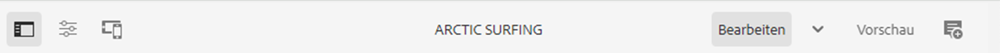
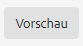

# Der AEM-Seiteneditor {#editing-page-content}

Sobald Ihre Seite in der [**Sites**-Konsole](/help/sites-cloud/authoring/sites-console/introduction.md) erstellt wurde, können Sie den Seiteninhalt mit dem AEM-Seiteneditor bearbeiten. Dieser ist ein leistungsstarkes Tool zur Inhaltserstellung.

>[!NOTE]
>
>Beim Bearbeiten einer Seite in der [**Sites**-Konsole](/help/sites-cloud/authoring/sites-console/introduction.md) öffnet die Konsole den entsprechenden Editor gemäß der [Vorlage](/help/sites-cloud/authoring/page-editor/templates.md) der Seite: entweder den in diesem Dokument beschriebenen Seiteneditor oder den [universellen Editor](/help/sites-cloud/authoring/universal-editor/authoring.md).

>[!NOTE]
>
>Damit Sie Seiten bearbeiten können, muss Ihr Konto über die entsprechenden Zugriffsrechte und Berechtigungen verfügen.  Wenden Sie sich an Ihre Systemadmins, falls Sie keine Berechtigungen haben.

{{traditional-aem}}

## Ausrichtung {#orientation}

Der AEM-Seiteneditor besteht im Wesentlichen aus drei Bereichen:

1. [Die Symbolleiste](#toolbar): Die Symbolleiste bietet einen Schnellzugriff zum Wechseln des Seitenmodus sowie Zugriff auf zusätzliche Seiteneinstellungen.
1. [Das seitliche Bedienfeld](#side-panel): Das seitliche Bedienfeld bietet Zugriff auf Seitenkomponenten und Assets sowie auf andere Authoring-Tools.
1. [Der Editor](#editor): Im Editor können Sie Änderungen an Ihrem Inhalt vornehmen und eine Vorschau davon anzeigen.

Inhalte werden mithilfe von [Komponenten](/help/sites-cloud/authoring/components-console.md) hinzugefügt (entsprechend dem Inhaltstyp), die per Drag-and-Drop auf die Seite gezogen werden können. Dort können sie dann bearbeitet, verschoben oder gelöscht werden.

### Symbolleiste {#page-toolbar}

Die Symbolleiste der Seite bietet Zugriff auf die zum jeweiligen Kontext zugehörigen Funktionen, je nach Seitenkonfiguration.

#### Seitliches Bedienfeld {#side-panel-button}

Dadurch wird das [seitliche Bedienfeld](/help/sites-cloud/authoring/page-editor/editor-side-panel.md), das den Asset-Browser, den Komponenten-Browser und die Inhaltsstruktur enthält, geöffnet/geschlossen.

#### Seiteninformationen {#page-information}

Ermöglicht den Zugriff auf ausführliche Seiteninformationen mit Seitendetails und Aktionen, die auf der Seite durchgeführt werden können, einschließlich Anzeigen und Bearbeiten von Seiteninformationen, Anzeigen von Seiteneigenschaften und Veröffentlichen bzw. Aufheben der Veröffentlichung der Seite.

Mit **Seiteninformationen** öffnen Sie ein Dropdown-Menü, das Details zur letzten Bearbeitung und zur letzten Veröffentlichung der ausgewählten Seite enthält. Je nach den Eigenschaften der Seite, ihrer Site und Ihrer Instanz sind zusätzliche Aktionen verfügbar.

* [Eigenschaften öffnen](/help/sites-cloud/authoring/sites-console/page-properties.md)
* [Seiten-Rollout](/help/sites-cloud/administering/msm/overview.md#msm-from-the-ui)
* [Workflow starten](/help/sites-cloud/authoring/workflows/applying.md#starting-a-workflow-from-the-page-editor)
* [Sperren einer Seite](/help/sites-cloud/authoring/page-editor/introduction.md#locking-unlocking)
* [Seite veröffentlichen](/help/sites-cloud/authoring/sites-console/publishing-pages.md#publishing-pages-1)
* [Veröffentlichen einer Seite aufheben](/help/sites-cloud/authoring/sites-console/publishing-pages.md#unpublishing-pages)
* [Vorlage bearbeiten](/help/sites-cloud/authoring/page-editor/templates.md)
* [Als veröffentlicht anzeigen](/help/sites-cloud/authoring/page-editor/introduction.md#view-as-published)
* [In Admin anzeigen](/help/sites-cloud/authoring/basic-handling.md#viewing-and-selecting-resources)
* [Hilfe](/help/sites-cloud/authoring/basic-handling.md#accessing-help)
* [Launch bewerben](/help/sites-cloud/authoring/launches/promoting.md) (nur wenn die Seite ein Launch ist)

Darüber hinaus können über die **Seiteninformationen** ggf. auch Analysen und Empfehlungen aufgerufen werden.

#### Emulator {#emulator}

Blendet die [Emulator-Symbolleiste](/help/sites-cloud/authoring/page-editor/responsive-layout.md#selecting-a-device-to-emulate) ein bzw. aus, über die das Look-and-Feel der Seite auf einem anderen Gerät emuliert werden kann. Dies wird im Layout-Modus automatisch aktiviert.

#### ContextHub {#context-hub}

Öffnet den [ContextHub](/help/sites-cloud/authoring/personalization/contexthub.md). Ist nur im **Vorschaumodus** verfügbar.

#### Seitentitel {#page-title}

Dies ist der Titel der Seite, der in Großbuchstaben als Information gerendert wird.

#### Modusauswahl {#mode-selector}

Die Modusauswahl zeigt den aktuellen [Modus](/help/sites-cloud/authoring/page-editor/introduction.md#mode-selector) an und ermöglicht die Auswahl eines anderen Modus, z. B. „Bearbeiten“, „Layout“, „Timewarp“ oder „Targeting“.

Für die Bearbeitung von Seiten stehen verschiedene Modi zur Verfügung, über die jeweils unterschiedliche Aktionen durchgeführt werden können:

* [Bearbeiten](/help/sites-cloud/authoring/page-editor/edit-content.md): Ermöglicht es, den Seiteninhalt zu bearbeiten.
* [Layout](/help/sites-cloud/authoring/page-editor/responsive-layout.md): Ermöglicht es, das responsive Layout gerätespezifisch zu erstellen und zu bearbeiten (wenn die Seite auf einem Layout-Container basiert).
* [Targeting](/help/sites-cloud/authoring/personalization/targeted-content.md): Steigert die Inhaltsrelevanz durch Targeting und kanalübergreifende Messungen.
* [Timewarp](/help/sites-cloud/authoring/sites-console/page-versions.md#timewarp): Ermöglicht es, eine Seite in dem Zustand anzuzeigen, den sie zu einem bestimmten früheren Zeitpunkt aufgewiesen hat.
* [Live Copy-Status](/help/sites-cloud/authoring/page-editor/introduction.md#live-copy-status): Liefert einen schnellen Überblick über den Live Copy-Status und darüber, welche Komponenten übernommen oder nicht übernommen wurden.
* [Entwicklermodus](/help/implementing/developing/tools/developer-mode.md)
* [Vorschau](/help/sites-cloud/authoring/page-editor/introduction.md#previewing-pages): Ermöglicht es, die Seite so wie in der Veröffentlichungsumgebung anzuzeigen oder anhand der Links im Inhalt zu navigieren.
* [Anmerken](/help/sites-cloud/authoring/page-editor/annotations.md): Ermöglicht es, Anmerkungen auf der Seite hinzuzufügen oder anzuzeigen.

>[!NOTE]
>
>* Je nach den Merkmalen der Seite sind einige Modi ggf. nicht verfügbar.
>* Für den Zugriff auf einige Modi sind die entsprechenden Berechtigungen erforderlich.
>* Aus Platzgründen steht der Entwicklermodus auf Mobilgeräten nicht zur Verfügung.
>* Mit dem [Tastaturbefehl](/help/sites-cloud/authoring/sites-console/keyboard-shortcuts.md)`Ctrl-Shift-M` können Sie zwischen der **Vorschau** und dem aktuell ausgewählten Modus (z. B. **Bearbeiten**, **Layout**) wechseln.

#### Vorschau {#preview}

Die Schaltfläche **Vorschau** aktiviert den [Vorschaumodus](#preview-mode). Dieser zeigt die Seite so an, wie sie bei der Veröffentlichung angezeigt wird.

#### Anmerken {#annotate}

Über den **Anmerkungsmodus** können Sie die Seite bei der Überprüfung einer Seite mit [Anmerkungen](/help/sites-cloud/authoring/page-editor/annotations.md) versehen. Nach der ersten Anmerkung ändert sich das Symbol in eine Zahl, die die Anzahl der Anmerkungen auf der Seite anzeigt.

### Seitliches Bedienfeld {#side-panel}

Im seitlichen Bedienfeld haben Sie Zugriff auf drei verschiedene Registerkarten:

* Mit dem Komponenten-Browser können Sie neue Inhalte zu Ihrer Seite hinzufügen.
* Mit dem Asset-Browser können Sie neue Assets zu Ihrer Seite hinzufügen.
* Über die Inhaltsstruktur können Sie in der Struktur Ihrer Seite navigieren.

Weitere Informationen finden Sie unter [Seitliches Bedienfeld des Seiteneditors](/help/sites-cloud/authoring/page-editor/editor-side-panel.md).

### Editor {#editor}

Im Editor können Sie den Seiteninhalt direkt verändern. Die Seite wird so gerendert, wie Sie sie sehen würden, und Sie können neue Inhalte mithilfe des Assets- oder Komponenten-Browsers in das seitliche Bedienfeld ziehen und Inhalt im Kontext bearbeiten.

## Bearbeiten von Inhalten {#editing-content}

Nachdem Sie nun mit dem Seiteneditor vertraut sind, können Sie Inhalte bearbeiten.

Weitere Informationen finden Sie unter [Bearbeiten von Inhalten mit dem AEM-Seiteneditor](/help/sites-cloud/authoring/page-editor/edit-content.md).

## Statusbenachrichtigung {#status-notification}

Wird eine Seite bearbeitet, die einem oder mehreren [Workflows](/help/sites-cloud/authoring/workflows/overview.md) unterliegt, wird in einer Benachrichtigungsleiste unterhalb der Symbolleiste ein entsprechender Hinweis angezeigt.

>[!NOTE]
>
>Die Statusleiste ist nur für Benutzerkonten mit entsprechenden Berechtigungen sichtbar.

In der Benachrichtigung ist der Workflow aufgeführt, dem die Seite zugeordnet ist. Wenn Benutzende am aktuellen Workflow-Schritt beteiligt sind, sind zusätzlich auch Optionen verfügbar, die sich [auf den Workflow-Status auswirken](/help/sites-cloud/authoring/workflows/participating.md) und die weiteren Informationen zum Workflow liefern, darunter:

* **Abschließen**: Öffnet das Dialogfeld **Arbeitselement abschließen**.
* **Delegieren**: Öffnet das Dialogfeld **Arbeitselement abschließen**.
* **Details anzeigen**: Öffnet das Fenster **Details** des entsprechenden Workflows.

Das Fertigstellen und Delegieren von Workflow-Schritten über die Benachrichtigungsleiste erfolgt auf die gleiche Art und Weise wie beim [Teilnehmen an Workflows](/help/sites-cloud/authoring/workflows/participating.md) über den Benachrichtigungs-Posteingang.

Wenn die Seite mehreren Workflows unterliegt, werden in der Benachrichtigung rechts außen die Anzahl der Workflows sowie Pfeilschaltflächen angezeigt, über die Sie durch die einzelnen Workflows scrollen können.

## Live Copy-Status {#live-copy-status}

Mit dem Seitenmodus **Live Copy-Status** erhalten Sie einen schnellen Überblick über den Live Copy-Status und darüber, welche Komponenten übernommen bzw. nicht übernommen wurden:

* Grüner Rahmen: Vererbt
* Rosa Rahmen: Vererbung wurde abgebrochen

Zum Beispiel:

## Anzeigen einer Seitenvorschau {#previewing-pages}

Für die Anzeige einer Seitenvorschau stehen zwei Optionen zur Verfügung:

* [Vorschaumodus](#preview-mode): Für einen schnellen Blick auf die Seite im Kontext.
* [Als veröffentlicht anzeigen](#view-as-published): Eine vollständige Vorschau, die die Seite auf einer neuen Registerkarte öffnet.

>[!TIP]
>
>* Links im Inhalt sind sichtbar, können jedoch im **Bearbeitungsmodus** nicht aufgerufen werden.
>* Verwenden Sie eine der Vorschauoptionen, wenn Sie mithilfe von Links navigieren möchten.
>* Verwenden Sie den [Tastaturbefehl](/help/sites-cloud/authoring/sites-console/keyboard-shortcuts.md) `Ctrl-Shift-M` (Strg+Umschalt+M), um zwischen der Vorschau und dem zuletzt ausgewählten Modus zu wechseln.

>[!NOTE]
>
>Das WCM-Modus-Cookie wird für beide Vorschauoptionen gesetzt.

### Vorschaumodus {#preview-mode}

Beim Bearbeiten von Inhalten können Sie mithilfe des Vorschaumodus eine Vorschau der Seite anzeigen. Dieser Modus:

* Blendet diverse Bearbeitungsmechanismen aus, damit Sie einen schnellen Überblick darüber erhalten, wie die Seite veröffentlicht aussehen wird.
* Ermöglicht die Verwendung von Links zur Navigation.
* Aktualisiert **nicht** den Seiteninhalt.

Bei der Bearbeitung einer Seite können Sie den Vorschaumodus über das Symbol rechts oben im Seiteneditor aufrufen:

### Als veröffentlicht anzeigen {#view-as-published}

Die Option **Als veröffentlicht anzeigen** ist über das Menü [Seiteninformationen](#page-information) verfügbar. Dadurch wird die Seite in einer neuen Registerkarte geöffnet und der Inhalt aktualisiert, und die Seite wird genau so angezeigt, wie sie in der Publishing-Umgebung angezeigt wird.

## Sperren und Entsperren einer Seite {#locking-unlocking}

AEM bietet Ihnen die Möglichkeit, eine Seite zu sperren, sodass niemand außer Ihnen den Inhalt bearbeiten kann. Eine Sperre ist nützlich, wenn Sie zahlreiche Änderungen an einer bestimmten Seite vornehmen oder wenn Sie eine Seite für kurze Zeit einfrieren müssen.

1. Wählen Sie das Symbol **Seiteninformationen** aus, um das Auswahlmenü zu öffnen.
1. Wählen Sie die Option **Seite sperren** aus.

Sobald sie gesperrt ist, wird in der Symbolleiste des Seiteneditors ein Sperrsymbol angezeigt.

Das Entsperren einer Seite läuft ähnlich ab wie das [Sperren der Seite](#locking-a-page). Sobald die Seite gesperrt ist, werden die Sperroptionen durch Aktionen zum Entsperren ersetzt.

>[!CAUTION]
>
>* Das Sperren einer Seite kann durch stellvertretendes Agieren für andere Benutzende erfolgen. Eine auf diese Weise gesperrte Seite kann jedoch nur dann (von Kunden) entsperrt werden, wenn der Benutzer verwendet wird, für den stellvertretend agiert wurde.
>* Seiten können nicht entsperrt werden, indem man sich als der Benutzer ausgibt, der die Seite gesperrt hat.
>* Wenn die Benutzerin bzw. der Benutzer, die bzw. der die Seite gesperrt hat, nicht zum Entsperren der Seite verfügbar ist, wenden Sie sich an den Support, um sich über Optionen zum Entfernen der Sperrung zu informieren.

## Rückgängigmachen und Wiederholen von Seitenbearbeitungen {#undoing-and-redoing-page-edits}

Mit den folgenden Symbolen können Sie eine Aktion rückgängig machen oder wiederholen. Diese werden gegebenenfalls in der Symbolleiste angezeigt:

>[!TIP]
>
>* Mit dem [Tastaturbefehl](/help/sites-cloud/authoring/sites-console/keyboard-shortcuts.md) `Ctrl-Z` (Strg+Z) können Sie Bearbeitungen ebenfalls rückgängig machen.
>* Analog dazu können Sie zum Wiederholen von Bearbeitungen den Tastaturbefehl `Ctrl-Y` (Strg+Y) verwenden.

>[!NOTE]
>
>Unter [Einschränkungen beim Rückgängigmachen und Wiederholen](/help/sites-cloud/authoring/page-editor/undo-redo.md) erfahren Sie im Detail, was beim Rückgängigmachen und Wiederholen von Seitenbearbeitungen möglich ist.
