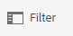

# Pfadauswahl {#path-selection}

Oft muss bei der Bearbeitung einer Seite eine andere Ressource ausgewählt werden (z. B. zum Definieren eines Links zu einer anderen Seite oder zum Auswählen eines Bilds). Zur Vereinfachung der Pfadauswahl werden Eingaben in den [Pfad-Feldern](#path-fields) automatisch ausgefüllt. Ergänzend dazu stehen zudem leistungsstarke Auswahlfunktionen im [Pfad-Browser](#path-browser) zur Verfügung.

## Pfadfelder {#path-fields}

Im vorliegenden Beispiel wird zur Verdeutlichung die Bildkomponente verwendet. Weitere Informationen zur Verwendung und Bearbeitung von Komponenten finden Sie unter [Komponenten für die Seitenbearbeitung](/help/sites-cloud/authoring/page-editor/components.md).

Die Pfadfelder bieten auch automatisches Ausfüllen und Vorausschau auf Eingaben, um die Suche nach Ressourcen zu vereinfachen.

Durch Klicken auf die Schaltfläche **Auswahl-Dialogfeld öffnen** auf dem Pfadfeld wird das Dialogfeld [Pfad-Browser](#path-browser) geöffnet, in dem Optionen für eine präzisere Auswahl zur Verfügung stehen.

Alternativ können Sie etwas in das Pfadfeld eingeben und AEM schlägt Ihrer Eingabe entsprechend passende Pfade vor.

## Pfad-Browser {#path-browser}

Der Pfad-Browser ist wie die [Spaltenansicht](/help/sites-cloud/authoring/basic-handling.md#column-view) der [**Sites**-](/help/sites-cloud/authoring/sites-console/introduction.md) aufgebaut und ermöglicht eine präzisere Auswahl der Ressourcen.

* Sobald eine Ressource ausgewählt ist, wird die Schaltfläche **Auswählen** oben rechts im Dialogfeld aktiviert. 
   * Wählen Sie diese Option aus, um die Auswahl zu bestätigen, oder wählen Sie zum Abbrechen die Option **Abbrechen** aus.
* Wenn der Kontext die Auswahl mehrerer Ressourcen zulässt, wird bei Auswahl einer Ressource ebenfalls die Schaltfläche **Auswählen** aktiviert, aber außerdem die Anzahl der ausgewählten Ressourcen oben rechts im Fenster angezeigt. 
   * Klicken Sie auf das **X** neben der Zahl, um die Auswahl für alle aufzuheben.
* Wenn Sie durch die Struktur navigieren, wird Ihre Position in den Breadcrumbs am oberen Rand des Dialogfelds angezeigt.
   * Mithilfe der Breadcrumbs können Sie innerhalb der Ressourcenhierarchie schnell von einem Punkt zu einem anderen wechseln.
* Darüber hinaus können Sie jederzeit das Suchfeld oben im Dialogfeld verwenden. 
   * Klicken Sie im Suchfeld auf **X**, wenn Sie die Suche löschen möchten.
* Sie können Ihre Suche auch eingrenzen, indem Sie die Filteroptionen einblenden und die Ergebnisse nach Pfad filtern.

