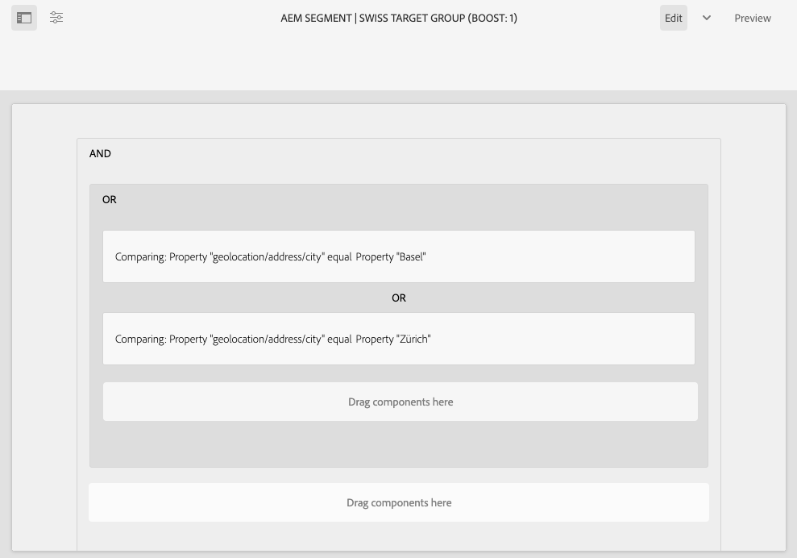

# Konfigurieren der Segmentierung mit ContextHub{#configuring-segmentation-with-contexthub}

Die Segmentierung ist bei der Erstellung einer Kampagne eine grundlegende Überlegung. Unter [Grundlagen zur Segmentierung](segmentation.md) finden Sie Informationen zur Funktionsweise der Segmentierung sowie zu Schlüsselbegriffen.

Je nach den von Ihnen bereits zu den Besucherinnen und Besuchern Ihrer Site erfassten Informationen sowie je nach Ihren angestrebten Zielen müssen Sie die erforderlichen Segmente und Strategien für Ihre zielgerichteten Inhalte festlegen.

Diese Segmente werden dann verwendet, um einem Besucher gezielt bestimmte Inhalte anzuzeigen. Hier festgelegte [Aktivitäten](activities.md) können auf jeder Seite einbezogen werden – und sie können bestimmen, auf welches Besuchersegment die spezialisierten Inhalte angewendet werden sollen.

AEM ermöglicht Ihnen die einfache Personalisierung Ihrer Benutzererlebnisse. Außerdem können Sie damit die Ergebnisse Ihrer Segmentdefinitionen überprüfen.

## Zugriff auf Segmente {#accessing-segments}

Die [Zielgruppen](audiences.md)-Konsole dient dazu, Segmente für ContextHub sowie Zielgruppen für Ihr Adobe Target-Konto zu verwalten. Diese Dokumentation befasst sich mit der Verwaltung von Segmenten für ContextHub.

Zum Zugriff auf Ihre Segmente wählen Sie in der globalen Navigation die Optionen **Navigation > Personalisierung > Zielgruppen** aus. Wählen Sie Ihre Konfiguration (z. B. WKND Site) aus, um Ihre Segmente anzuzeigen:


## Segmenteditor {#segment-editor}

<!--The **Segment Editor** lets you easily modify a segment. To edit a segment, select a segment in the [list of segments](/help/sites-administering/segmentation.md#accessing-segments) and click the **Edit** button.-->
Der **Segmenteditor** ermöglicht Ihnen die einfache Veränderung eines Segments. Wählen Sie zur Bearbeitung eines Segments ein Segment aus der Liste von Segmenten aus und klicken Sie auf die Schaltfläche **Bearbeiten**.


Mithilfe des Komponenten-Browsers können Sie **UND**- und **ODER**-Container zur Festlegung der Segmentlogik und anschließend zusätzliche Komponenten zum Vergleich von Eigenschaften und Werten oder Referenzskripts oder anderen Segmenten zur Definition der Auswahlkriterien (siehe [Erstellen eines neuen Segments](#creating-a-new-segment)) hinzufügen, um das genaue Szenario für die Auswahl des Segments festzulegen.

Wenn die gesamte Anweisung mit „true“ bewertet wurde, wird das Segment aufgelöst. Falls mehrere Segmente zutreffen, wird außerdem der Faktor **Verstärken** verwendet. Unter [Erstellen eines neuen Segments](#creating-a-new-segment) finden Sie weitere Details zum Faktor „Verstärken“.

>[!CAUTION]
>
>Der Segmenteditor prüft nicht auf Zirkelbezüge. Ein Beispiel hierfür wäre, wenn Segment A auf ein anderes Segment B verweist, das wiederum auf Segment A verweist. Sie müssen sicherstellen, dass Ihre Segmente keine Zirkelbezüge enthalten.

### Container {#containers}

Die folgenden Container sind standardmäßig verfügbar und ermöglichen es Ihnen, Gruppenvergleiche und Verweise für die boolesche Auswertung zusammenzufassen. Sie können vom Komponenten-Browser in den Editor gezogen werden. Im folgenden Abschnitt [Verwenden von UND- und ODER-Containern](#using-and-and-or-containers) erhalten Sie weitere Informationen.

|  |  |
|---|---|
| UND-Container | Der boolesche UND-Operator |
| ODER-Container | Der boolesche ODER-Operator |

### Vergleiche {#comparisons}

Die folgenden Segmentvergleiche sind standardmäßig verfügbar, um Segmenteigenschaften auszuwerten. Sie können vom Komponenten-Browser in den Editor gezogen werden.

|  |  |
|---|---|
| Eigenschaft-Wert | Vergleicht eine Eigenschaft eines Geschäfts mit einem definierten Wert |
| Eigenschaft-Eigenschaft | Vergleicht eine Eigenschaft eines Geschäfts mit einer anderen Eigenschaft |
| Eigenschaft-Segment-Referenz | Vergleicht eine Eigenschaft eines Geschäfts mit einem anderen referenzierten Segment |
| Eigenschaft-Skript-Referenz | Vergleicht eine Eigenschaft eines Geschäfts mit den Ergebnissen eines Skripts |
| Segment-Referenz-Skript-Referenz | Vergleicht ein referenziertes Segment mit den Ergebnissen eines Skripts |

>[!NOTE]
>
>Ist der Datentyp beim Vergleich von Werten nicht festgesetzt (d. h. auf „auto detect“ eingestellt), vergleicht die Segmentierungs-Engine von ContextHub die Werte einfach auf die Art und Weise, wie auch JavaScript es tun würde. Werte werden nicht auf die erwarteten Typen übertragen, was zu irreführenden Ergebnissen führen kann. Beispiel:
>
>`null < 30 // will return true`
>
>Daher sollten Sie beim [Erstellen eines Segments](#creating-a-new-segment) immer einen **Datentyp** auswählen, wenn die Typen der verglichenen Werte bekannt sind. Beispiel:
>
>Beim Vergleich der Eigenschaft `profile/age` wissen Sie bereits, dass der verglichene Typ **number** sein wird. Selbst wenn `profile/age` nicht festgelegt ist, wird ein Vergleich von `profile/age` unter 30 wie erwartet **false** ergeben.

### Verweise {#references}

Die folgenden Verweise sind standardmäßig verfügbar, um eine direkte Verknüpfung zu einem Skript oder einem anderen Segment herzustellen. Sie können vom Komponenten-Browser in den Editor gezogen werden.

|  |  |
|---|---|
| Segment-Referenz | Bewerten Sie das referenzierte Segment. |
| Skript-Referenz | Bewerten Sie das referenzierte Skript. Weitere Informationen finden Sie im folgenden Abschnitt [Verwenden von Skript-Referenzen](#using-script-references). |

## Erstellen eines neuen Segments {#creating-a-new-segment}

Festlegen eines neuen Segments

1. Nachdem Sie [auf die Segmente zugegriffen haben](#accessing-segments), [navigieren Sie zum Ordner](#organizing-segments), in dem Sie das Segment erstellen möchten.

1. Wählen Sie die Schaltfläche **Erstellen** und dann **ContextHub-Segments erstellen**.

   

1. Geben Sie unter **Neues ContextHub-Segment** einen Titel für das Segment sowie bei Bedarf einen Verstärkungswert ein und wählen Sie **Erstellen** aus.

   

   Jedes Segment verfügt über einen Verstärkungsparameter, der als Gewichtungsfaktor verwendet wird. Eine höhere Zahl zeigt an, dass das Segment in Instanzen mit mehreren gültigen Segmenten bei der Auswahl gegenüber einem Segment mit einer niedrigeren Zahl bevorzugt wird.

   * Mindestwert: `0`
   * Höchstwert: `1000000`

1. Bearbeiten Sie in der Segment-Konsole Ihr erstelltes Segment, um es im Segmenteditor zu öffnen.
1. Ziehen Sie einen Vergleich oder Verweis in den Segmenteditor. Der Vergleich oder Verweis wird dann im standardmäßigen UND-Container angezeigt.
1. Wählen Sie die Konfigurationsoption des neuen Verweises oder Segments doppelt aus, um die spezifischen Parameter zu bearbeiten. In diesem Beispiel prüfen wir auf Personen in Basel.

   

   Legen Sie, wenn möglich immer einen **Datentyp** fest, um sicherzustellen, dass Ihre Vergleiche richtig bewertet werden. Siehe [Vergleiche](#comparisons) für weitere Informationen.

1. Klicken Sie auf **Fertig**, um Ihre Definition zu speichern:
1. Fügen Sie bei Bedarf weitere Komponenten hinzu. Sie können boolesche Ausdrücke mithilfe der Container-Komponenten für UND- und ODER-Vergleiche formulieren (siehe [Verwenden von UND- und ODER-Containern](#using-and-and-or-containers) unten). Mit dem Segmenteditor können Sie nicht mehr benötigte Komponenten löschen oder diese an neue Positionen innerhalb der Anweisung ziehen.

### Verwenden von UND- und ODER-Containern {#using-and-and-or-containers}

Mithilfe der UND- und ODER-Container-Komponenten können Sie komplexe Segmente in AEM erstellen. Hierbei ist es hilfreich, sich einige grundlegende Punkte bewusst zu machen:

* Die oberste Ebene der Definition ist immer der ursprünglich erstellte UND-Container. Dies kann nicht verändert werden, hat allerdings auch keine Auswirkungen auf den Rest der Segmentdefinition.
* Stellen Sie sicher, dass die Verschachtelung Ihres Containers sinnvoll ist. Die Container können als die Klammern Ihres booleschen Ausdrucks betrachtet werden.

Das folgende Beispiel wird zur Auswahl von Besuchern verwendet, die zu unserer schweizerischen Zielgruppe gehören:

```text
 People in Basel

 OR

 People in Zürich
```

Beginnen Sie damit, eine ODER-Container-Komponente innerhalb des standardmäßigen UND-Containers zu platzieren. Innerhalb des ODER-Containers können Sie die Eigenschafts- oder Referenzkomponenten hinzufügen.



Sie können bei Bedarf mehrere UND- und ODER-Operatoren verschachteln.

### Verwenden von Skript-Referenzen {#using-script-references}

Mithilfe der Komponente „Skript-Referenz“ kann die Auswertung einer Segmenteigenschaft an ein externes Skript delegiert werden. Sobald das Skript ordnungsgemäß konfiguriert ist, kann es wie jede andere beliebige Komponente einer Segmentbedingung verwendet werden.

#### Definieren eines Skripts für einen Verweis {#defining-a-script-to-reference}

1. Fügen Sie die Datei zur clientlib `contexthub.segment-engine.scripts` hinzu.
1. Implementieren Sie eine Funktion, die einen Wert zurückgibt. Beispiel:

   ```javascript
   ContextHub.console.log(ContextHub.Shared.timestamp(), '[loading] contexthub.segment-engine.scripts - script.profile-info.js');
   
   (function() {
       'use strict';
   
       /**
        * Sample script returning profile information. Returns user info if data is available, false otherwise.
        *
        * @returns {Boolean}
        */
       var getProfileInfo = function() {
           /* let the SegmentEngine know when script should be re-run */
           this.dependOn(ContextHub.SegmentEngine.Property('profile/age'));
           this.dependOn(ContextHub.SegmentEngine.Property('profile/givenName'));
   
           /* variables */
           var name = ContextHub.get('profile/givenName');
           var age = ContextHub.get('profile/age');
   
           return name === 'Joe' && age === 123;
       };
   
       /* register function */
       ContextHub.SegmentEngine.ScriptManager.register('getProfileInfo', getProfileInfo);
   
   })();
   ```

1. Registrieren Sie das Skript bei `ContextHub.SegmentEngine.ScriptManager.register`.

Wenn das Skript von zusätzlichen Eigenschaften abhängig ist, sollte dieses `this.dependOn()` abrufen. Wenn das Skript beispielsweise von `profile/age` abhängt:

```javascript
this.dependOn(ContextHub.SegmentEngine.Property('profile/age'));
```

#### Verweisen auf ein Skript {#referencing-a-script}

1. Erstellen Sie ein ContextHub-Segment.
1. Fügen Sie die Komponente **Skript-Referenz** an der gewünschten Stelle des Segments hinzu.
1. Öffnen Sie das Dialogfeld „Bearbeiten“ der Komponente **Skript-Referenz**. Sofern [ordnungsgemäß konfiguriert](#defining-a-script-to-reference), sollte das Skript in der Dropdown-Liste **Skriptname** verfügbar sein.

## Organisieren von Segmenten {#organizing-segments}

Wenn Sie viele Segmente haben, kann es schwierig werden, sie als flache Liste zu verwalten. In solchen Fällen kann es sinnvoll sein, Ordner zu erstellen, um Ihre Segmente zu verwalten.

### Erstellen eines neuen Ordners {#create-folder}

1. Wählen Sie nach dem [Zugriff auf die Segmente](#accessing-segments) die Schaltfläche **Erstellen** und dann **Ordner** aus.

   

1. Geben Sie einen **Titel** und einen **Namen** für Ihren Ordner an.
   * Der **Titel** sollte beschreibend sein.
   * Der **Name** wird zum Knotennamen im Repository.
      * Er wird automatisch auf der Grundlage des Titels generiert und gemäß den [AEM-Benennungskonventionen](/help/implementing/developing/introduction/naming-conventions.md) angepasst.
      * Er kann bei Bedarf angepasst werden.

   

1. Wählen Sie **Erstellen** aus.

   

1. Der Ordner wird in der Liste der Segmente angezeigt.
   * Die Sortierung Ihrer Spalten beeinflusst, wo in der Liste der neue Ordner erscheint.
   * Sie können die Spaltenüberschriften auswählen, um die Sortierung anzupassen.
     

### Ändern vorhandener Ordner {#modify-folders}

1. Wählen Sie nach dem [Zugriff auf die Segmente](#accessing-segments) den Ordner aus, den Sie ändern möchten.

   

1. Wählen Sie **Umbenennen** in der Symbolleiste aus, um den Ordner umzubenennen.

1. Geben Sie einen neuen **Ordnertitel** an und wählen Sie **Speichern** aus.

   

>[!NOTE]
>
>Beim Umbenennen von Ordnern kann nur der Titel geändert werden. Der Name kann nicht geändert werden.

### Löschen eines Ordners

1. Wählen Sie nach dem [Zugriff auf die Segmente](#accessing-segments) den Ordner aus, den Sie ändern möchten.

   

1. Wählen Sie **Löschen** in der Symbolleiste aus, um den Ordner zu löschen.

1. In einem Dialogfeld wird eine Liste der zum Löschen ausgewählten Ordner angezeigt.

   

   * Wählen Sie zum Bestätigen **Löschen** aus.
   * Wählen Sie zum Abbrechen **Abbrechen** aus.

1. Wenn einer der ausgewählten Ordner Unterordner oder Segmente enthält, muss deren Löschung bestätigt werden.

   

   * Wählen Sie zum Bestätigen **Löschen erzwingen** aus.
   * Wählen Sie zum Abbrechen **Abbrechen** aus.

>[!NOTE]
>
> Es ist nicht möglich, ein Segment von einem Ordner in einen anderen zu verschieben.

## Testen der Anwendung eines Segments {#testing-the-application-of-a-segment}

Sobald das Segment definiert wurde, können die potenziellen Ergebnisse mithilfe von **[ContextHub](contexthub.md) getestet werden.**

1. Zeigen Sie eine Seite in einer Vorschau an.
1. Klicken Sie auf das ContextHub-Symbol, um die ContextHub-Symbolleiste anzuzeigen.
1. Wählen Sie eine Persona aus, die mit dem von Ihnen erstellten Segment übereinstimmt.
1. Der ContextHub löst die entsprechenden Segmente für die ausgewählte Rolle auf.

Beispielsweise basiert unsere einfache Segmentdefinition zur Identifizierung von Benutzern in Basel auf dem Standort des Benutzers. Das Laden einer spezifischen Rolle, die mit diesen Kriterien übereinstimmt, zeigt, ob das Segment erfolgreich aufgelöst wurde:


Oder ob es nicht aufgelöst wurde:


>[!NOTE]
>
>Alle Eigenschaften werden sofort aufgelöst, obwohl sich die meisten beim Neuladen der Seite ändern.

Solche Tests können auch auf Inhaltsseiten und in Kombination mit gezielten Inhalten und damit verbundenen **Aktivitäten** und **Erlebnissen** durchgeführt werden.

Wenn Sie eine Aktivität und ein Erlebnis eingerichtet haben, können Sie Ihr Segment mit der Aktivität bequem testen. Weitere Informationen zum Einrichten einer Aktivität finden Sie unter [Dokumentation zum Verfassen zielgerichteter Inhalte](targeted-content.md).

1. Im Bearbeitungsmodus einer Seite, auf der Sie gezielte Inhalte eingerichtet haben, können Sie anhand des Pfeilsymbols auf dem Inhalt erkennen, dass es sich um gezielten Inhalt handelt.
1. Wechseln Sie in den Vorschaumodus und anschließend mithilfe von ContextHub zu einer Persönlichkeit, die nicht der für das Erlebnis konfigurierten Segmentierung entspricht.
1. Wechseln Sie zu einer Persönlichkeit, die nicht der für das Erlebnis konfigurierten Segmentierung entspricht, und sehen Sie, wie sich das Erlebnis entsprechend verändert.

## Verwenden Ihres Segments {#using-your-segment}

Segmente dienen zur Steuerung des tatsächlichen Inhalts, der spezifischen Zielgruppen angezeigt wird. Unter [Verwalten von Zielgruppen](audiences.md) finden Sie weitere Informationen zu Zielgruppen und Segmenten; unter [Bearbeiten gezielter Inhalte](targeted-content.md) finden Sie weitere Informationen zur Nutzung von Zielgruppen und Segmenten zur gezielten Platzierung von Inhalten.
