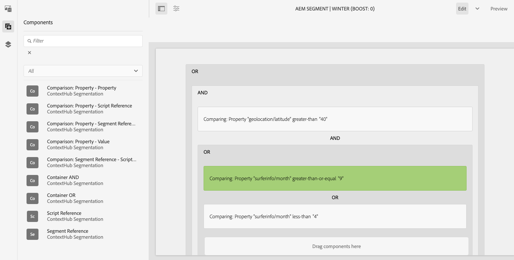

# Konfigurieren der Segmentierung mit ContextHub{#configuring-segmentation-with-contexthub}

Die Segmentierung ist bei der Erstellung einer Kampagne eine grundlegende Überlegung. Informationen zur Funktionsweise der Segmentierung und zu Schlüsselbegriffen finden Sie unter [Die Segmentierung](segmentation.md).

Je nach den von Ihnen bereits zu den Besuchern Ihrer Site erfassten Informationen sowie je nach Ihren angepeilten Zielen müssen Sie die erforderlichen Segmente und Strategien für Ihre zielgerichteten Inhalte festlegen.

Diese Segmente werden dann verwendet, um einem Besucher gezielt bestimmte Inhalte bereitzustellen. Hier festgelegte [Aktivitäten](activities.md) können auf jeder Seite einbezogen werden – und sie können bestimmen, auf welches Besuchersegment die spezialisierten Inhalte angewendet werden sollen.

AEM ermöglicht es Ihnen, die Benutzererfahrungen einfach zu personalisieren. Außerdem können Sie damit die Ergebnisse Ihrer Segmentdefinitionen überprüfen.

## Zugriff auf Segmente {#accessing-segments}

Die Konsole [Audiencen](audiences.md) wird zum Verwalten von Segmenten für ContextHub sowie von Audiencen für Ihr Adobe Target-Konto verwendet. Diese Dokumentation befasst sich mit der Verwaltung von Segmenten für ContextHub.

Zum Zugriff auf Ihre Segmente wählen Sie in der globalen Navigation die Optionen **Navigation > Personalisierung > Zielgruppen** aus.


## Segment-Editor {#segment-editor}

<!--The **Segment Editor** allows you to easily modify a segment. To edit a segment, select a segment in the [list of segments](/help/sites-administering/segmentation.md#accessing-segments) and click the **Edit** button.-->
Mit dem **Segment-Editor** können Sie ein Segment einfach ändern. Wählen Sie zur Bearbeitung eines Segments ein Segment aus der Liste von Segmenten aus und klicken Sie auf die Schaltfläche **Bearbeiten**.



Mithilfe des Komponenten-Browsers können Sie **AND**- und **OR**-Container hinzufügen, um die Segmentlogik zu definieren, und dann zusätzliche Komponenten hinzufügen, um Eigenschaften und Werte zu vergleichen oder Referenzskripte und andere Segmente zu definieren, um die Auswahlkriterien zu definieren (siehe [Erstellen eines neuen Segments](#creating-a-new-segment)), um das genaue Szenario für die Segmentauswahl zu definieren.

Wenn die gesamte Anweisung mit „true“ bewertet wurde, wird das Segment aufgelöst. Falls mehrere Segmente zutreffen, wird außerdem der Faktor **Verstärken** verwendet. Weitere Informationen zum Steigerungsfaktor finden Sie unter [Erstellen eines neuen Segments](#creating-a-new-segment).

>[!CAUTION]
>
>Der Segment-Editor prüft nicht auf Zirkelbezüge. Beispiel: Segment A verweist auf ein anderes Segment B, das wiederum auf Segment A verweist. Sie müssen sicherstellen, dass Ihre Segmente keine kreisförmigen Verweise enthalten.

### Container {#containers}

Die folgenden Container sind standardmäßig verfügbar und ermöglichen Ihnen die Gruppierung von Vergleichen und Verweisen zum Zweck einer booleschen Bewertung. Sie können vom Komponentenbrowser in den Editor gezogen werden. Weitere Informationen finden Sie im folgenden Abschnitt [Verwenden von AND- und ODER-Containern](#using-and-and-or-containers).

|  |  |
|---|---|
| UND-Container | Der boolesche AND-Operator |
| ODER-Container | Der boolesche OR-Operator |

### Vergleiche {#comparisons}

Die folgenden Segmentvergleiche sind standardmäßig für die Bewertung der Segmenteigenschaften verfügbar. Sie können vom Komponentenbrowser in den Editor gezogen werden.

|  |  |
|---|---|
| property-value | Vergleicht eine Eigenschaft eines Stores mit einem definierten Wert |
| property-property | Vergleicht eine Eigenschaft eines Stores mit einer anderen Eigenschaft |
| Eigenschafts-/Segmentreferenz | Vergleicht eine Eigenschaft eines Stores mit einem anderen referenzierten Segment |
| PropertyScript-Referenz | Vergleicht eine Eigenschaft eines Stores mit den Ergebnissen eines Skripts |
| Segmentreferenz - Skriptreferenz | Vergleicht ein referenziertes Segment mit den Ergebnissen eines Skripts |

>[!NOTE]
>
>Wenn beim Vergleich von Werten der Datentyp des Vergleichs nicht festgelegt ist (d. h. automatisch erkannt wird), vergleicht die ContextHub-Segmentierungsengine die Werte einfach wie JavaScript. Sie verteilt keine Werte an die erwarteten Typen, was zu irreführenden Ergebnissen führen kann. Beispiel:
>
>`null < 30 // will return true`
>
>Daher sollten Sie beim Erstellen eines Segments [ einen **Datentyp** auswählen, sobald die Typen der verglichenen Werte bekannt sind. ](#creating-a-new-segment) Beispiel:
>
>Beim Vergleich der Eigenschaft `profile/age` wissen Sie bereits, dass der Vergleichstyp **number** ist. Wenn `profile/age` also nicht eingestellt ist, gibt ein Vergleich `profile/age` weniger als 30 **false** zurück, wie Sie erwarten würden.

### Verweise {#references}

Die folgenden Verweise sind standardmäßig für die direkte Verknüpfung eines Skripts oder eines anderen Segments verfügbar. Sie können vom Komponentenbrowser in den Editor gezogen werden.

|  |  |
|---|---|
| Segment-Verweis | Bewerten Sie das referenzierte Segment |
| Skript-Referenz | Bewerten Sie das referenzierte Skript. Weitere Informationen finden Sie im folgenden Abschnitt [Skriptverweise](#using-script-references) verwenden. |

## Erstellen eines neuen Segments {#creating-a-new-segment}

So legen Sie Ihr neues Segment fest:

1. Nach dem Zugriff auf die Segmente [ navigieren Sie [zu dem Ordner](#organizing-segments), in dem Sie das Segment erstellen möchten, oder lassen Sie es im Stammordner liegen.](#accessing-segments)

1. Tippen oder klicken Sie auf die Schaltfläche **Erstellen** und wählen Sie **ContextHub-Segment** erstellen.

   

1. Geben Sie unter **Neues ContextHub-Segment** einen Titel für das Segment sowie bei Bedarf einen Verstärkungswert ein und tippen oder klicken Sie auf **Erstellen**.

   

   Jedes Segment verfügt über einen Boost-Parameter, der als Gewichtungsfaktor verwendet wird. Eine höhere Zahl zeigt an, dass das Segment in Instanzen mit mehreren gültigen Segmenten bei der Auswahl gegenüber einem Segment mit einer niedrigeren Zahl bevorzugt wird.

   * Mindestwert: `0`
   * Höchstwert: `1000000`

1. Bearbeiten Sie in der Segmentkonsole Ihr neu erstelltes Segment, um es im Segment-Editor zu öffnen.
1. Ziehen Sie einen Vergleich oder Verweis in den Segment-Editor. Der Vergleich oder Verweis wird dann im standardmäßigen UND-Container angezeigt.
1. Doppelklicken oder tippen Sie auf die Konfigurationsoption des neuen Verweises oder Segments, um die spezifischen Parameter zu bearbeiten. In diesem Beispiel testen wir Menschen in Basel.

   

   Legen Sie möglichst immer einen **Datentyp** fest, um die ordnungsgemäße Bewertung Ihrer Vergleiche sicherzustellen. Weitere Informationen finden Sie unter [Vergleiche](#comparisons).

1. Klicken Sie auf **Fertig**, um Ihre Definition zu speichern:
1. Fügen Sie bei Bedarf weitere Komponenten hinzu. Sie können boolesche Ausdrücke anhand der Containerkomponenten für UND- und ODER-Vergleiche formulieren (siehe [Verwenden von UND- und ODER-Containern](#using-and-and-or-containers) weiter unten). Mit dem Segment-Editor können Sie nicht mehr benötigte Komponenten löschen oder diese an neue Positionen innerhalb der Anweisung ziehen.

### Verwenden von UND- und ODER-Containern {#using-and-and-or-containers}

Mithilfe von UND- und ODER-Containerkomponenten können Sie komplexe Segmente in AEM erstellen. Hierbei ist es hilfreich, sich einige grundlegende Punkte bewusst zu machen:

* Die oberste Ebene der Definition ist immer der UND-Container, der ursprünglich erstellt wurde. Dies kann nicht geändert werden, hat aber keine Auswirkungen auf den Rest Ihrer Segmentdefinition.
* Stellen Sie sicher, dass die Verschachtelung Ihrer Container Sinn ergibt. Die Container können als die Klammern Ihres booleschen Ausdrucks betrachtet werden.

Im folgenden Beispiel werden Besucher ausgewählt, die in unserer Schweizer Zielpopulation berücksichtigt werden:

```text
 People in Basel

 OR

 People in Zürich
```

Beginnen Sie damit, eine ODER-Containerkomponente innerhalb des standardmäßigen UND-Containers zu platzieren. Innerhalb des ODER-Containers können Sie die Eigenschaften- oder Referenzkomponenten hinzufügen.


Sie können bei Bedarf mehrere UND- und ODER-Operatoren verschachteln.

### Verwenden von Skript-Referenzen {#using-script-references}

Durch die Verwendung der Skript-Referenzkomponente kann die Bewertung einer Segmenteigenschaft an ein externes Skript delegiert werden. Sobald das Skript ordnungsgemäß konfiguriert ist, kann es als eine beliebige andere Komponente einer Segmentbedingung verwendet werden.

#### Definieren eines Skripts für einen Verweis  {#defining-a-script-to-reference}

1. hinzufügen Datei in `contexthub.segment-engine.scripts` clientlib.
1. Implementieren Sie eine Funktion, durch die ein Wert ausgegeben wird. Beispiel:

   ```javascript
   ContextHub.console.log(ContextHub.Shared.timestamp(), '[loading] contexthub.segment-engine.scripts - script.profile-info.js');
   
   (function() {
       'use strict';
   
       /**
        * Sample script returning profile information. Returns user info if data is available, false otherwise.
        *
        * @returns {Boolean}
        */
       var getProfileInfo = function() {
           /* let the SegmentEngine know when script should be re-run */
           this.dependOn(ContextHub.SegmentEngine.Property('profile/age'));
           this.dependOn(ContextHub.SegmentEngine.Property('profile/givenName'));
   
           /* variables */
           var name = ContextHub.get('profile/givenName');
           var age = ContextHub.get('profile/age');
   
           return name === 'Joe' && age === 123;
       };
   
       /* register function */
       ContextHub.SegmentEngine.ScriptManager.register('getProfileInfo', getProfileInfo);
   
   })();
   ```

1. Registrieren Sie das Skript mit `ContextHub.SegmentEngine.ScriptManager.register`.

Wenn das Skript von zusätzlichen Eigenschaften abhängig ist, sollte dieses `this.dependOn()` () abrufen. Wenn das Skript beispielsweise von `profile/age` abhängt:

```javascript
this.dependOn(ContextHub.SegmentEngine.Property('profile/age'));
```

#### Verweisen auf ein Skript {#referencing-a-script}

1. Erstellen Sie ein ContextHub-Segment.
1. Fügen Sie eine **Skript-Referenz**-Komponente an der gewünschten Stelle des Segments hinzu.
1. Öffnen Sie das Dialogfeld der **Skript-Referenz**-Komponente. Ist das Skript [ordnungsgemäß konfiguriert](#defining-a-script-to-reference), sollte es im Dropdown-Menü **Skriptname** verfügbar sein.

## Organisieren von Segmenten {#organizing-segments}

Wenn Sie viele Segmente haben, können diese als einfache Liste schwer zu verwalten sein. In solchen Fällen kann es nützlich sein, Ordner zur Verwaltung Ihrer Segmente zu erstellen.

### Neuen Ordner {#create-folder} erstellen

1. Klicken Sie nach dem Zugriff auf die Segmente](#accessing-segments) auf oder tippen Sie auf die Schaltfläche **Erstellen** und wählen Sie **Ordner**.[

   

1. Geben Sie einen **Titel** und einen **Namen** für Ihren Ordner an.
   * Der **Titel** sollte beschreibend sein.
   * Der Knoten **Name** wird zum Knotennamen im Repository.
      * Sie wird automatisch basierend auf dem Titel generiert und entsprechend den Benennungskonventionen [AEM angepasst.](/help/implementing/developing/introduction/naming-conventions.md)
      * Er kann bei Bedarf angepasst werden.

   

1. Tippen oder klicken Sie auf **Erstellen**.

   

1. Der Ordner wird in der Liste der Segmente angezeigt.
   * Die Sortierung der Spalten hat Auswirkungen darauf, wo in der Liste der neue Ordner angezeigt wird.
   * Sie können auf die Spaltenüberschriften tippen oder klicken, um die Sortierung anzupassen.
      

### Vorhandene Ordner {#modify-folders} ändern

1. Nachdem Sie [auf die Segmente](#accessing-segments) zugegriffen haben, klicken oder tippen Sie auf den Ordner, den Sie ändern möchten, um ihn auszuwählen.

   

1. Tippen oder klicken Sie in der Symbolleiste auf **Umbenennen**, um den Ordner umzubenennen.

1. Geben Sie einen neuen **Ordnertitel** ein und tippen oder klicken Sie auf **Speichern**.

   

>[!NOTE]
>
>Beim Umbenennen von Ordnern kann nur der Titel geändert werden. Der Name kann nicht geändert werden.

### Ordner löschen

1. Nachdem Sie [auf die Segmente](#accessing-segments) zugegriffen haben, klicken oder tippen Sie auf den Ordner, den Sie ändern möchten, um ihn auszuwählen.

   

1. Tippen oder klicken Sie in der Symbolleiste auf **Löschen**, um den Ordner zu löschen.

1. In einem Dialogfeld wird eine Liste der zum Löschen ausgewählten Ordner angezeigt.

   

   * Tippen oder klicken Sie zur Bestätigung auf **Löschen**.
   * Tippen oder klicken Sie auf **Abbrechen**, um abzubrechen.

1. Wenn einer der ausgewählten Ordner Unterordner oder Segmente enthält, muss der Löschvorgang bestätigt werden.

   

   * Tippen oder klicken Sie zur Bestätigung auf **Löschen erzwingen**.
   * Tippen oder klicken Sie auf **Abbrechen**, um abzubrechen.

>[!NOTE]
>
> Es ist nicht möglich, ein Segment von einem Ordner in einen anderen zu verschieben.

## Testen der Anwendung eines Segments {#testing-the-application-of-a-segment}

Sobald das Segment definiert wurde, können die potenziellen Ergebnisse mithilfe von **[ContextHub](contexthub.md) getestet werden.**

1. Vorschau einer Seite
1. Klicken Sie auf das ContextHub-Symbol, damit die ContextHub-Symbolleiste angezeigt wird.
1. Wählen Sie eine Rolle aus, die mit dem von Ihnen erstellten Segment übereinstimmt.
1. Der ContextHub löst die entsprechenden Elemente für die ausgewählte Rolle auf.

Beispielsweise basiert unsere einfache Segmentdefinition zur Identifizierung von Benutzern in Basel auf dem Standort des Benutzers. Das Laden einer spezifischen Rolle, die mit diesen Kriterien übereinstimmt, zeigt, ob das Segment erfolgreich aufgelöst wurde:


Oder ob es nicht aufgelöst wurde:


>[!NOTE]
>
>Alle Eigenschaften werden sofort aufgelöst, obwohl die meisten sich nur beim erneuten Laden der Seite ändern.

Solche Tests können auch zu Inhaltsseiten und in Kombination mit gezieltem Inhalt und damit verbundenen **Aktivitäten** und **Erlebnissen** durchgeführt werden.

Wenn Sie eine Aktivität und ein Erlebnis eingerichtet haben, können Sie Ihr Segment einfach mit der Aktivität testen. Weitere Details zur Einrichtung einer Aktivität finden Sie in der entsprechenden [Dokumentation zur Bearbeitung gezielter Inhalte](targeted-content.md).

1. Im Bearbeitungsmodus einer Seite, auf der Sie gezielte Inhalte eingerichtet haben, können Sie anhand des Pfeilsymbols auf dem Inhalt erkennen, dass es sich um gezielten Inhalt handelt.
1. Wechseln Sie in den Vorschaumodus und anschließend mithilfe von ContextHub zu einer Rolle, die nicht mit der für das Erlebnis konfigurierten Segmentierung übereinstimmt.
1. Wechseln Sie zu einer Rolle, die nicht mit der für das Erlebnis konfigurierten Segmentierung übereinstimmt, und sehen Sie, wie sich das Erlebnis entsprechend verändert.

## Verwenden Ihres Segments  {#using-your-segment}

Segmente werden verwendet, um den tatsächlichen Inhalt zu steuern, der von bestimmten Audiencen der Zielgruppe gesehen wird. Weitere Informationen über die Verwendung von Audiencen und Segmenten zur Zielgruppe von Inhalten finden Sie unter [Verwalten von Audiencen](audiences.md) und [Erstellen von zielgerichteten Inhalten](targeted-content.md).
