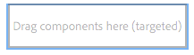
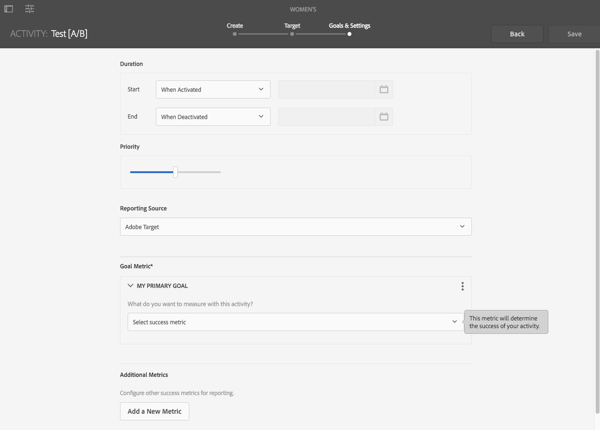

# Verfassen zielgerichteter Inhalte im Targeting-Modus {#authoring-targeted-content-using-targeting-mode}

Verfassen von zielgerichteten Inhalten im Targeting-Modus von AEM. Der Targeting-Modus und die Target-Komponente bieten Tools zum Erstellen von Inhalten für Erlebnisse:

* Einfache Erkennung des zielgerichteten Inhalts auf der Seite. Eine gepunktete Linie bildet einen Rahmen für alle zielgerichteten Inhalte.
* Wählen Sie eine Marke und eine Aktivität aus, um die Erlebnisse anzuzeigen.
* Fügen Sie Erlebnisse zu einer Aktivität hinzu oder entfernen Sie Erlebnisse.
* Führen Sie A/B-Tests durch und konvertieren Sie die Gewinner (nur Adobe Target).
* Fügen Sie einem Erlebnis Angebote hinzu, indem Sie Angebote erstellen oder Angebote aus einer Bibliothek verwenden.
* Konfigurieren Sie Ziele und überwachen Sie die Leistung.
* Simulieren Sie das Benutzererlebnis.
* Konfigurieren Sie die Target-Komponente für weitere Anpassungen.

>[!NOTE]
>
>Der Targeting-Modus ist sowohl im Seiten-Editor als auch im Experience Fragment-Editor verfügbar.
>
>Die folgende Dokumentation gilt für beide (da beide auf derselben Grundlage arbeiten), auch wenn sie für den Seiten-Editor geschrieben wurde.

>[!CAUTION]
>
>Beim Targeting im Seiten-Editor können nur Komponenten von Experience Fragments als Ziel ausgewählt werden.
>
>Andere Komponententypen können über das Symbol **In Experience-Fragment-Variante umwandeln** in der Komponenten-Symbolleiste in ein Experience Fragment umgewandelt werden.

<!--
>Other component types can be converted to an Experience Fragment using the **Convert to experience fragment variation** icon on the component toolbar:
>
>
-->

Sie können entweder AEM oder Adobe Target als Targeting-Engine verwenden (für die Verwendung von Adobe Target benötigen Sie ein gültiges Adobe Target-Konto). Wenn Sie Adobe Target verwenden, müssen Sie zunächst die Integration konfigurieren. Informationen hierzu finden Sie in der [Anleitung zur Integration mit Adobe Target](/help/sites-cloud/integrating/integrating-adobe-target.md).

Die im Target-Modus sichtbaren Aktivitäten und Erlebnisse spiegeln die Optionen der [Aktivitätskonsole](/help/sites-cloud/authoring/personalization/activities.md) wider:

* Änderungen, die Sie im Targeting-Modus an Aktivitäten und Erlebnissen vornehmen, werden in der Aktivitätskonsole übernommen.
* Änderungen, die in der Aktivitätskonsole vorgenommen werden, werden im Targeting-Modus angezeigt.

>[!NOTE]
>
>Wenn Sie eine Kampagne in Adobe Target erstellen, wird jeder Kampagne eine Eigenschaft mit dem Namen `thirdPartyId` hinzugefügt. Sollten Sie die Kampagne in Adobe Target löschen, wird die Eigenschaft „thirdPartyId“ jedoch nicht gelöscht. Die `thirdPartyId` kann nicht für Kampagnen unterschiedlicher Typen (A/B, XT) wiederverwendet werden und lässt sich nicht manuell löschen. Möchten Sie dieses Problem umgehen, geben Sie jeder Kampagne einen eindeutigen Namen. Kampagnennamen lassen sich somit nicht für verschiedene Kampagnentypen wiederverwenden.
>
>Wenn Sie denselben Namen im selben Kampagnentyp verwenden, wird die vorhandene Kampagne überschrieben.
>
>Sollte Ihnen beim Synchronisieren die Fehlermeldung „Anforderung fehlgeschlagen. `thirdPartyId` ist bereits vorhanden“ angezeigt werden, ändern Sie den Kampagnennamen und synchronisieren Sie erneut.

>[!NOTE]
>
>Beim Targeting bleibt die Kombination aus Branding und Aktivität auf Benutzerebene gleich, nicht auf Kanalebene.

## Wechseln in den Modus „Targeting“ {#switching-to-targeting-mode}

Wechseln Sie in den Targeting-Modus, um auf die Werkzeuge für die Erstellung von zielgerichtetem Inhalt zuzugreifen.

So wechseln Sie in den Target-Modus:

1. Öffnen Sie die Seite, für die Sie zielgerichtete Inhalte erstellen möchten.
1. Klicken oder tippen Sie in der Symbolleiste oben auf der Seite auf das Dropdown-Menü für den Modus, um die verfügbaren Modustypen anzuzeigen.

   

1. Klicken oder tippen Sie auf **Targeting**. Die Targeting-Optionen werden daraufhin oben auf der Seite eingeblendet.

   

## Hinzufügen von Aktivitäten im Targeting-Modus {#adding-an-activity-using-targeting-mode}

Verwenden Sie den Targeting-Modus, um einer Marke eine Aktivität hinzuzufügen. Wenn Sie eine Aktivität hinzufügen, enthält sie das Standarderlebnis. Nachdem Sie die Aktivität hinzugefügt haben, starten Sie das Inhalts-Targeting für die Aktivität.

Sie können Adobe Target-Aktivitäten auch von AEM aus erstellen und verwalten, indem Sie die Ziel-Engine - entweder AEM oder Adobe Target - auswählen und den Aktivitätstyp - Erlebnis-Targeting oder A/B-Test auswählen.

Darüber hinaus können Sie Ziele und Metriken für alle Adobe Target-Aktivitäten verwalten und Ihre Adobe Target-Zielgruppen verwalten. Zu guter Letzt steht Ihnen auch das Aktivitäts-Reporting von Adobe Target zur Verfügung, die unter anderem auch die Konvertierung der im A/B-Test am besten abschneidenden Erlebnisse umfasst.

Wenn Sie eine Aktivität hinzufügen, wird sie auch im [Aktivitätskonsole](/help/sites-cloud/authoring/personalization/activities.md).

So fügen Sie eine Aktivität hinzu:

1. Verwenden Sie die **Marke** aus dem Dropdown-Menü die Marke auswählen, für die Sie die Aktivität erstellen möchten.

   >[!NOTE]
   >
   >Es wird empfohlen, [Marken über die Aktivitätskonsole erstellen](/help/sites-cloud/authoring/personalization/activities.md#creating-a-brand-using-the-activities-console).
   >
   >
   >Wenn Sie eine Marke auf andere Weise erstellen, stellen Sie sicher, dass der Knoten `/campaigns/<brand>/master` vorhanden ist. Sonst führt der Versuch, eine Aktivität zu erstellen, zu einem Fehler.

1. Klicken oder tippen Sie auf + neben **Aktivität** Dropdown-Menü.
1. Geben Sie einen Namen für die Aktivität ein.

   >[!NOTE]
   >
   >Wenn Sie eine neue Aktivität erstellen und der Seite oder einer der ihr übergeordneten Seiten eine Adobe Target-Cloud-Konfiguration angehängt ist, wird Adobe Target von AEM automatisch als Targeting-Engine festgelegt.

1. Wählen Sie aus dem Dropdown-Menü **Targeting** die gewünschte Targeting-Engine aus.

   * Wählen Sie **ContextHub AEM** aus, werden die übrigen Felder als nicht verfügbar ausgegraut. Klicken oder tippen Sie auf **Erstellen**.

   * Wenn Sie **Adobe Target** auswählen, können Sie eine Konfiguration (standardmäßig ist die Konfiguration festgelegt, die Sie bei der Konfiguration des Kontos angelegt haben) und einen Aktivitätstyp auswählen. <!--If you select **Adobe Target**, you can select a configuration (by default, it is the configuration you provided when you [configured the account](/help/sites-administering/opt-in.md)) and Activity Type.-->

1. Wählen Sie im Menü Aktivität entweder **Erlebnis-Targeting** oder **A/B-Test**.

   * Erlebnis-Targeting - Verwaltung von Adobe Target-Aktivitäten über AEM.
   * A/B-Test – Erstellen und Verwalten von A/B-Testaktivitäten für Adobe Target in AEM.

## Der Targeting-Prozess: Erstellen, Targeting, Ziele und Einstellungen {#the-targeting-process-create-target-and-goals-settings}

Der Targeting-Modus ermöglicht die Konfiguration verschiedener Aspekte einer Aktivität. Verwenden Sie den folgenden dreistufigen Prozess zum Erstellen zielgerichteter Inhalte für eine Markenaktivität:

1. [Erstellen](#create-authoring-the-experiences): Hinzufügen oder Entfernen von Erlebnissen und Hinzufügen von Angeboten für jedes Erlebnis.
1. [Target](#target-configuring-the-audiences): Geben Sie die Zielgruppe für jedes Erlebnis an. Sie können eine bestimmte Zielgruppe ansprechen und bei Verwendung von A/B-Tests entscheiden, welcher Prozentsatz des Traffics zu welchem Erlebnis geleitet wird.
1. [Ziele und Einstellungen](#goals-settings-configuring-the-activity-and-setting-goals): Planen Sie die Aktivität und legen Sie die Priorität fest. Sie können auch Erfolgsmetrikziele festlegen.

Gehen Sie wie folgt vor, um das Inhalts-Targeting für eine Aktivität zu starten.

>[!NOTE]
>
>Möchten Sie Targeting verwenden, müssen Sie zunächst Mitglied der Autorenbenutzergruppe für Target-Aktivitäten sein.

So fügen Sie eine Aktivität hinzu:

1. Im **Marke** Wählen Sie aus dem Dropdown-Menü die Marke aus, die die Aktivität enthält, an der Sie gerade arbeiten.
1. Im **Aktivität** aus dem Dropdown-Menü die Aktivität auswählen, für die Sie zielgerichtete Inhalte erstellen.
1. Um die Steuerelemente anzuzeigen, die Sie durch den Targeting-Prozess führen, klicken oder tippen Sie auf **Targeting starten**.

   

   >[!NOTE]
   >
   >Möchten Sie die Aktivität bearbeiten, mit der Sie sich aktuell befassen, klicken oder tippen Sie auf **Zurück**.

## Erstellen: Verfassen der Erlebnisse {#create-authoring-the-experiences}

Der Schritt Erstellen des Inhalts-Targeting umfasst die Erstellung von Erlebnissen. In diesem Schritt können Sie die Erlebnisse der Aktivität erstellen oder löschen und jedem Erlebnis Angebote hinzufügen.

### Anzeigen von Erlebnisangeboten im Targeting-Modus {#seeing-experience-offers-in-targeting-mode}

Nach [Starten des Zielgruppenbestimmungsprozesses](#the-targeting-process-create-target-and-goals-settings)wählen Sie ein Erlebnis aus, um die Angebote anzuzeigen, die für dieses Erlebnis bereitgestellt werden. Wenn Sie ein Erlebnis auswählen, ändern sich die Targeting-Komponenten auf der Seite, um das Angebot für dieses Erlebnis anzuzeigen.

>[!CAUTION]
>
>Gehen Sie beim Deaktivieren des Targetings für eine Komponente mit Bedacht vor, wenn für diese bereits in der Autoreninstanz Targeting durchgeführt wurde. Die entsprechende Aktivität wird automatisch auch aus der Veröffentlichungsinstanz gelöscht.

>[!NOTE]
>
>Ein Angebot ist der Inhalt einer Targeting-Komponente.

Erlebnisse werden im Bereich „Zielgruppen“ angezeigt. Im folgenden Beispiel finden sich unter anderem die Erlebnisse **Standard**, **Frauen**, **Frauen über 30** und **Frauen unter 30**. In diesem Beispiel wird das Standardangebot einer Targeting-**Bild**-Komponente dargestellt.

Bei Auswahl eines anderen Erlebnisses wird in der Bild-Komponente das Angebot des entsprechenden Erlebnisses gezeigt.

Wenn ein Erlebnis ausgewählt wurde und die Targeting-Komponente kein Angebot für dieses Erlebnis enthält, wird in der Komponente **Angebot hinzufügen** angezeigt. Diese Option wird auf dem halbtransparenten Standardangebot überlagert. Wenn für ein Erlebnis kein Angebot erstellt wurde, wird das **Standardangebot** für das Segment angezeigt, das dem Erlebnis zugeordnet ist.

Das Standardereignis wird ebenfalls angezeigt, wenn die Besuchereigenschaften nicht mit Erlebnissen zugeordneten Segmenten übereinstimmen. Informationen hierzu finden Sie unter [Erlebnisse im Targeting-Modus hinzufügen](#adding-and-removing-experiences-using-targeting-mode).

### Individuelle Angebote und Bibliotheksangebote {#custom-offers-and-library-offers}

Angebote, die [auf der Seite erstellt](#adding-a-custom-offer) und für ein einzelnes Erlebnis verwendet werden, werden als benutzerdefinierte Angebote bezeichnet. Das folgende Bild wird dem Inhalt eines benutzerdefinierten Angebots überlagert:

Angebote, die [aus einer Angebotsbibliothek hinzugefügt werden](#adding-an-offer-from-an-offer-library), werden mit dem folgenden Bild platziert:

Sie können benutzerdefinierte Angebote in einer Angebotsbibliothek speichern, wenn Sie sie wiederverwenden möchten. Sie können auch ein Bibliotheksangebot in ein benutzerdefiniertes Angebot konvertieren, wenn Sie den Inhalt für ein Erlebnis ändern möchten. Im Anschluss an die Bearbeitung kann das Angebot dann erneut in der Bibliothek gespeichert werden.

### Hinzufügen und Entfernen von Erlebnissen im Targeting-Modus {#adding-and-removing-experiences-using-targeting-mode}

Verwenden des Schritts Erstellen von [Zielgruppenbestimmungsprozess](#the-targeting-process-create-target-and-goals-settings), können Sie Erlebnisse hinzufügen und entfernen. Darüber hinaus können Sie ein Erlebnis duplizieren und es auch umbenennen.

#### Hinzufügen von Erlebnissen im Targeting-Modus {#adding-experiences-using-targeting-mode}

So fügen Sie Erlebnisse hinzu:

1. Um ein Erlebnis hinzuzufügen, klicken oder tippen Sie auf **+** **Erlebnis-Targeting hinzufügen**. Diese Option befindet sich unter den bereits bestehenden Erlebnissen im Bereich **Zielgruppen**.
1. Wählen Sie und Zielgruppe aus. Standardmäßig ist dieser Name der Name des Erlebnisses. Sie können bei Bedarf einen anderen Namen eingeben. Klicken oder tippen Sie auf **OK**.

#### Erlebnisse im Targeting-Modus entfernen {#removing-experiences-using-targeting-mode}

So löschen Sie Erlebnisse:

1. Klicken oder tippen Sie auf den Pfeil neben dem Erlebnisnamen.

   

1. Klicken Sie auf **Löschen**.

#### Umbenennen von Erlebnissen im Targeting-Modus {#renaming-experiences-using-targeting-mode}

So benennen Sie Erlebnisse im Targeting-Modus um:

1. Klicken oder tippen Sie auf den Pfeil neben dem Erlebnisnamen.
1. Klicken Sie auf **Erlebnis umbenennen** und geben Sie den neuen Namen ein.
1. Klicken oder tippen Sie auf einen anderen Bereich des Bildschirms, um die Änderungen zu übernehmen.

#### Bearbeiten von Zielgruppen im Targeting-Modus {#editing-audiences-using-targeting-mode}

So bearbeiten Sie im Targeting-Modus Zielgruppen:

1. Klicken oder tippen Sie auf den Pfeil neben dem Erlebnisnamen.
1. Klicken Sie auf **Zielgruppe bearbeiten** und wählen Sie eine neue Zielgruppe aus.
1. Klicken Sie auf **OK**.

#### Duplizieren von Erlebnissen im Targeting-Modus {#duplicating-experiences-using-targeting-mode}

So duplizieren Sie Erlebnisse im Targeting-Modus:

1. Klicken oder tippen Sie auf den Pfeil neben dem Erlebnisnamen.
1. Klicken Sie auf **Duplizieren** und wählen Sie die Zielgruppe aus.
1. Benennen Sie das Erlebnis, falls gewünscht, um und klicken Sie auf **OK**.

### Erstellen von Angeboten im Targeting-Modus {#creating-offers-using-targeting-mode}

Targeting einer Komponente zum Erstellen von Angeboten für Erlebnisse. Zielgerichtete Komponenten bieten den Inhalt, der als Angebote für Erlebnisse verwendet wird.

* [Vorhandene Komponente als Ziel auswählen](#creating-a-default-offer-by-targeting-an-existing-component). Der Inhalt wird zum Angebot des Standarderlebnisses.
* [Fügen Sie eine Target-Komponente hinzu](#creating-an-offer-by-adding-a-target-component) und versehen Sie diese anschließend mit Inhalt.

Nach dem Targeting der Komponente können für jedes Erlebnis Angebote hinzugefügt werden:

* [Hinzufügen benutzerdefinierter Angebote](#adding-a-custom-offer).
* [Angebote aus einer Bibliothek hinzufügen](#adding-an-offer-from-an-offer-library).

Für die Arbeit mit Angeboten stehen die folgenden Tools zur Verfügung:

* [Hinzufügen eines benutzerdefinierten Angebots zu einer Angebotsbibliothek](#adding-a-custom-offer-to-a-library).
* [Bibliotheksangebot in ein benutzerdefiniertes Angebot konvertieren](#converting-a-library-offer-to-a-custom-library).
* [Öffnen Sie ein Bibliotheksangebot und bearbeiten Sie den Inhalt](#editing-a-library-offer).

#### Erstellen von Standardangeboten durch Targeting bestehender Komponenten {#creating-a-default-offer-by-targeting-an-existing-component}

Targeting einer Komponente auf der Seite, um sie als Angebot für das Standarderlebnis der Aktivität zu verwenden. Wenn Sie eine Komponente als Ziel auswählen, wird sie in eine Target-Komponente eingeschlossen und ihr Inhalt wird zum Angebot für das Standarderlebnis.

Wenn Sie eine Komponente als Ziel auswählen, kann nur diese Komponente im Angebot verwendet werden. Sie können die Komponente nicht aus dem Angebot entfernen oder dem Angebot andere Komponenten hinzufügen.

Führen Sie nach dem [Starten des Zielgruppenbestimmungsprozesses](#the-targeting-process-create-target-and-goals-settings).

1. Klicken oder tippen Sie auf die Komponente zum Targeting. Die Symbolleiste für die Komponente wird ähnlich dem folgenden Beispiel angezeigt.

   

1. Klicken oder tippen Sie auf das Target-Symbol.

   

   Der Komponenteninhalt ist das Angebot für das Standarderlebnis. Wenn eine Komponente als Ziel ausgewählt wird, wird ihr Standardknoten für jedes Erlebnis repliziert. Dies ist zum Modifizieren des richtigen Inhaltsknotens beim erlebnisspezifischen Bearbeiten erforderlich. Diesen Ereignissen, die nicht dem Standardereignis entsprechen, können Sie entweder [ein individuelles Angebot](#adding-a-custom-offer) oder [ein Bibliotheksangebot](#adding-an-offer-from-an-offer-library) hinzufügen.

#### Erstellen eines Angebots durch Hinzufügen einer Target-Komponente {#creating-an-offer-by-adding-a-target-component}

Fügen Sie eine Target-Komponente hinzu, um ein Angebot für das Standarderlebnis zu erstellen. Bei der Target-Komponente handelt es sich um einen Container für andere Komponenten. Komponenten, die in diesem Container platziert werden, werden zu Target-Komponenten. Sollten Sie die Target-Komponente verwenden, können Sie ein Angebot durch Hinzufügen mehrerer Komponenten erstellen. Außerdem können Sie für jedes Erlebnis verschiedene Komponenten verwenden, um unterschiedliche Angebote zu erstellen.

Weitere Informationen zur Anpassung dieser Komponente finden Sie unter [Konfigurieren von Target-Komponentenoptionen](#configuring-target-component-options).

>[!NOTE]
>
>Angebote, die Sie mithilfe der [Angebotskonsole](/help/sites-cloud/authoring/personalization/offers.md) erstellen, können ebenfalls über mehrere Komponenten verfügen. Diese Angebote gehören zu einer Angebotsbibliothek und können für mehrere Erlebnisse verwendet werden.

Da die Target-Komponente ein Container ist, wird sie als Ablagebereich für andere Komponenten angezeigt.

Im Target-Modus hat die Target-Komponente einen blauen Rahmen, und die Ablagezielnachricht zeigt die Zielart an.

Im Bearbeitungsmodus wird die Target-Komponente mit Zielscheibensymbol dargestellt.

Ziehen Sie Komponenten in die Target-Komponente, werden diese zu Targeting-Komponenten.

Wenn Sie eine Komponente zur Target-Komponente hinzufügen, stellt sie Inhalte für ein bestimmtes Erlebnis bereit. Um das Erlebnis anzugeben, wählen Sie das Erlebnis aus, bevor Sie die Komponenten hinzufügen.

Sie können eine Target-Komponente zur Seite im Bearbeitungsmodus oder im Target-Modus hinzufügen. Sie können der Target-Komponente nur im Target-Modus Komponenten hinzufügen. Die Target-Komponente gehört zur Komponentengruppe Personalisierung .

Möchten Sie Targeting-Inhalte bearbeiten, müssen Sie zunächst auf **Targeting starten** tippen oder klicken.

1. Ziehen Sie die Target-Komponente auf die Seite, auf der das Angebot angezeigt werden soll.
1. Standardmäßig ist keine Standort-ID festgelegt. Klicken oder tippen Sie auf das Zahnradsymbol &quot;Konfigurieren&quot;, um den Standort festzulegen.

   >[!NOTE]
   >
   >Sollte diese Einstellung vom Administrator gefordert werden, müssen Sie den Ort möglicherweise genau angeben.
   >
   >Administratoren können unter `https://<host>:<port>/system/console/configMgr/com.day.cq.personalization.impl.servlets.TargetingConfigurationServlet` festlegen, ob diese Einstellung zwingend vorgenommen werden muss.
   >
   >Sollen Benutzer zur Eingabe eines Pfads aufgefordert werden, aktivieren Sie das Kontrollkästchen **Ortsangabe erzwingen**.

1. Wählen Sie das Erlebnis aus, für das Sie das Angebot erstellen möchten.
1. Erstellen Sie das Angebot:

   * Ziehen Sie für das Standarderlebnis Komponenten in den Targeting-Ablagebereich und bearbeiten Sie die Komponenteneigenschaften wie gewohnt, um Inhalte für das Angebot zu erstellen.
   * Für Erlebnisse, die nicht dem Standarderlebnis entsprechen, können Sie entweder [individuelle Angebote](#adding-a-custom-offer) oder [Bibliotheksangebote](#adding-an-offer-from-an-offer-library) hinzufügen.

#### Hinzufügen individueller Angebote {#adding-a-custom-offer}

Erstellen Sie ein Angebot, indem Sie den Inhalt einer Targeting-Komponente im Targeting-Modus bearbeiten. Wenn Sie ein benutzerdefiniertes Angebot erstellen, wird es als Angebot für ein einzelnes Erlebnis verwendet.

Sollten Sie sich dazu entschließen, das Angebot auch für andere Erlebnisse nutzen zu wollen, können Sie ein individuelles Angebot erstellen und es [der Bibliothek hinzufügen](#adding-a-custom-offer-to-a-library). Weitere Informationen zur Verwendung der Angebotskonsole für die Erstellung wiederverwendbarer Angebote finden Sie unter [Hinzufügen von Angeboten zu Angebotsbibliotheken](/help/sites-cloud/authoring/personalization/offers.md#add-an-offer-to-an-offer-library).

1. Wählen Sie das Erlebnis aus, dem Sie das Angebot hinzufügen möchten.
1. Um das Komponentenmenü anzuzeigen, klicken oder tippen Sie auf die Targeting-Komponente, zu der Sie das Angebot hinzufügen.

   

1. Klicken oder tippen Sie auf das Symbol + .

   Der Inhalt des Standardangebots wird als Angebot für das aktuelle Erlebnis verwendet.

1. Klicken oder tippen Sie auf das Angebot, um das Angebotsmenü anzuzeigen, und klicken oder tippen Sie auf das Bearbeitungssymbol.

   

1. Bearbeiten Sie den Inhalt der Komponente.

#### Hinzufügen eines Angebots aus einer Angebotsbibliothek {#adding-an-offer-from-an-offer-library}

Fügen Sie einem Erlebnis ein Angebot aus der [Angebotsbibliothek](/help/sites-cloud/authoring/personalization/offers.md) hinzu. Sie können beliebige Angebote aus der Bibliothek der Marke auswählen, die Sie derzeit bearbeiten.

Sie können dem Standarderlebnis keine Bibliotheksangebote hinzufügen.

1. Wählen Sie das Erlebnis aus, dem Sie das Angebot hinzufügen möchten.
1. Um das Komponentenmenü anzuzeigen, klicken oder tippen Sie auf die Targeting-Komponente, zu der Sie das Angebot hinzufügen.

   

1. Klicken oder tippen Sie auf das Ordnersymbol.

   

1. Wählen Sie das gewünschte Angebot aus der Bibliothek aus und klicken oder tippen Sie auf das entsprechende Häkchen.

   

   Mit der Angebotsauswahl können Sie nach Angeboten suchen oder diese filtern. Beim Durchsuchen oder Filtern können Sie auch die Angebote sortieren und deren Ansicht ändern. Die Zahl oben rechts zeigt an, wie viele Angebote in der aktuellen Bibliothek verfügbar sind.

   * Klicken oder tippen Sie auf **Durchsuchen**, um zu einem anderen Ordner zu navigieren. Es öffnet sich ein Navigationsfenster, in dem Sie durch Klicken auf die Pfeile tiefer in die Ordnerstruktur vordringen können. Klicken oder tippen Sie erneut auf **Durchsuchen**, um das Navigationsfenster zu schließen.

   

   * Klicken oder tippen Sie auf **Filter** , um die Angebote nach Keywords oder Tags zu filtern. Sie geben Suchbegriffe ein und wählen Tags aus dem Dropdown-Menü aus. Klicken oder tippen Sie auf **Filter** erneut, um den Filterbereich zu schließen.

   

   * Durch Klicken oder Tippen auf den Pfeil neben **Von neu nach alt** können Sie anpassen, wie die Angebote sortiert werden sollen. Angebote können von neu nach alt oder von alt nach neu sortiert werden.

   

   Klicken oder tippen Sie auf das Symbol neben **Anzeigen als**, um Angebote als Kacheln oder Liste anzuzeigen.

   

#### Hinzufügen individueller Angebote zu einer Bibliothek {#adding-a-custom-offer-to-a-library}

Fügen Sie ein benutzerdefiniertes Angebot zum [Angebotsbibliothek](/help/sites-cloud/authoring/personalization/offers.md) wenn Sie es als Angebot für mehrere Erlebnisse wiederverwenden möchten. Sie können der Bibliothek der aktuellen Marke, die Sie als Ziel auswählen, Angebote hinzufügen.

Weitere Informationen zur Verwendung der Angebotskonsole für die Erstellung wiederverwendbarer Angebote finden Sie unter [Hinzufügen von Angeboten zu Angebotsbibliotheken](/help/sites-cloud/authoring/personalization/offers.md#add-an-offer-to-an-offer-library).

1. Wählen Sie das Erlebnis aus, um das benutzerdefinierte Angebot anzuzeigen.
1. Klicken oder tippen Sie auf das benutzerdefinierte Angebot, um das Angebotsmenü anzuzeigen, und klicken oder tippen Sie auf die Schaltfläche **Angebot in Angebotsbibliothek speichern** Symbol.

   

1. Geben Sie einen Angebotsnamen ein und wählen Sie die Bibliothek aus, der das Angebot hinzugefügt werden soll. Klicken oder tippen Sie abschließend auf das Häkchen.

#### Umwandeln von Bibliotheksangeboten in individuelle Angebote {#converting-a-library-offer-to-a-custom-library}

Konvertieren Sie ein Bibliotheksangebot in ein benutzerdefiniertes Angebot, um das Angebot für das aktuelle Erlebnis zu ändern, ohne das Angebot in anderen Erlebnissen zu ändern.

1. Wählen Sie das Erlebnis aus, um das Bibliotheksangebot anzuzeigen.
1. Klicken oder tippen Sie auf das Bibliotheksangebot, um das Angebotsmenü anzuzeigen, und klicken oder tippen Sie dann auf das Symbol In Inline-Angebot konvertieren .

   

#### Überarbeiten eines Bibliothekangebots {#editing-a-library-offer}

Öffnen Sie ein Bibliotheksangebot aus einem Erlebnis im Targeting-Modus, um das Angebot zu bearbeiten. Die vorgenommenen Änderungen werden in allen Erlebnissen angezeigt, die das Angebot verwenden.

1. Wählen Sie das Erlebnis aus, um das Bibliotheksangebot anzuzeigen.
1. Wandeln Sie das Bibliotheksangebot in ein lokales/individuelles Angebot um. Weitere Informationen finden Sie unter [Umwandeln von Bibliotheksangeboten in individuelle Angebote](#converting-a-library-offer-to-a-custom-library).
1. Bearbeiten Sie den Inhalt des Angebots.

1. Speichern Sie es erneut in der Bibliothek. Weitere Informationen finden Sie unter [Hinzufügen individueller Angebote zu einer Bibliothek](#adding-a-custom-offer-to-a-library).

## Target: Konfigurieren der Zielgruppen {#target-configuring-the-audiences}

Der Target -Schritt von [Zielgruppenbestimmungsprozess](#the-targeting-process-create-target-and-goals-settings) umfasst die Zuordnung von Zielgruppen zu den Erlebnissen, mit denen Sie im Schritt Erstellen gearbeitet haben. Auf der Target-Seite werden die Zielgruppen angezeigt, die von den einzelnen Erlebnissen angesprochen werden. Sie können die Zielgruppe für jedes Erlebnis angeben oder ändern. Wenn Sie Adobe Target verwenden, können Sie auch A/B-Tests erstellen, mit denen Sie einen bestimmten Prozentsatz des Traffics für eine Zielgruppe auf ein bestimmtes Erlebnis ausrichten können.

### Wenn Sie AEM-Targeting oder Adobe Target (Erlebnis-Targeting) verwenden {#if-you-are-using-aem-targeting-or-adobe-target-experience-targeting}

werden Zielgruppen auf der linken Seite des Zuordnungsdiagramms angezeigt, Erlebnisse auf der rechten Seite.

Legen Sie mithilfe eines Segments eine Zielgruppe fest. Die Cloud-Konfiguration für die Seite bestimmt darüber, welche Segmente Ihnen zur Verfügung stehen. Wenn die Seite nicht mit einer Adobe Target-Cloud-Konfiguration verknüpft ist, stehen AEM Segmente zum Definieren von Zielgruppen zur Verfügung. Wenn die Seite mit einer Adobe Target-Cloud-Konfiguration verknüpft ist, verwenden Sie Target-Segmente.

Informationen zu Targeting-Engines finden Sie unter [Targeting-Engine](/help/sites-cloud/authoring/personalization/overview.md#targeting-engine).

Eine Zielgruppe darf nicht von mehr als einem Erlebnis verwendet werden. Neben einem Erlebnis wird ein Warnsymbol angezeigt, wenn es einer Zielgruppe zugeordnet ist, die einem anderen Erlebnis zugeordnet ist.

### Verknüpfen von Erlebnissen und Zielgruppen (AEM oder Adobe Target) {#associating-experiences-with-audiences-aem-or-adobe-target}

Gehen Sie wie folgt vor, um ein Erlebnis mit einer Zielgruppe zu verknüpfen, wenn Sie AEM Targeting (oder Erlebnis-Targeting in Adobe Target) verwenden:

1. Klicken oder tippen Sie neben dem dem Erlebnis zugeordneten Zielgruppenfeld auf den Dropdown-Pfeil.
1. (Optional) Klicken oder tippen Sie auf **Bearbeiten** und geben Sie ein Stichwort ein, nach dem das gewünschte Segment durchsucht werden soll.
1. Wählen Sie aus der Zielgruppenliste die gewünschte aus und klicken oder tippen Sie auf **OK**.

### Wenn Sie A/B-Tests (Adobe Target) verwenden {#if-you-are-using-a-b-testing-adobe-target}

Wenn Sie über eine A/B-Test-Aktivität verfügen, befinden sich die Zielgruppen auf der linken Seite, der Prozentsatz, in dem jedes Erlebnis angezeigt wird, befindet sich in der Mitte und die Erlebnisse befinden sich auf der rechten Seite.

Sie können die Prozentsätze so lange ändern, wie sie 100 Prozent ergeben. Eine Zielgruppe kann von mehreren Erlebnissen in A/B-Tests verwendet werden.

### Zielgruppen in A/B-Tests Traffic-Anteilen zuordnen {#associating-audiences-and-traffic-percentages-with-a-b-testing}

1. Klicken oder tippen Sie auf das Dropdown-Feld neben der Zielgruppe, die dem Erlebnis zugeordnet ist.
1. (Optional) Klicken Sie auf **Bearbeiten** und geben Sie dann einen Suchbegriff ein, um nach dem gewünschten Segment zu suchen.
1. Klicken oder tippen Sie auf **OK**.
1. Geben Sie Prozentsätze ein, um zu konfigurieren, wie der Zielgruppen-Traffic zu den einzelnen Erlebnissen geleitet wird. Die Gesamtzahl muss 100 betragen.
1. (Optional) Bearbeiten Sie den Erlebnisnamen, indem Sie auf das Dropdown-Menü neben dem Erlebnisnamen klicken.

## Ziele und Einstellungen: Konfigurieren der Aktivität und Festlegen von Zielen {#goals-settings-configuring-the-activity-and-setting-goals}

Im Schritt „Ziele und Einstellungen“ des [Targeting-Verfahrens](#the-targeting-process-create-target-and-goals-settings) wird das Verhalten der Markenaktivität konfiguriert. Geben Sie den Start und das Ende der Aktivität sowie die Priorität der Aktivität an. Darüber hinaus verfolgen Sie auch Ziele. Insbesondere können Sie entscheiden, was Sie mit Ihren Aktivitäten messen möchten.

Zielmetriken sind nur verfügbar, wenn Sie Adobe Target für Ihre Targeting-Engine verwenden. Sie müssen mindestens eine Zielmetrik definieren. Wenn Sie Adobe Analytics konfiguriert haben und eine A4T Analytics-Cloud-Konfiguration haben, können Sie auswählen, ob die Berichtsquelle Adobe Target oder Adobe Analytics sein soll.

Die Zielmetriken werden nur für die veröffentlichte Kampagne gemessen.

Bei Verwendung von AEM als Targeting-Engine:

Sollten Sie Adobe Target als Targeting-Engine verwenden:

Wenn Sie Adobe Target als Targeting-Engine verwenden und A4T Analytics für das Konto konfiguriert wurde, wird Ihnen ein zusätzliches Dropdown-Menü für die **Berichtsquelle** angezeigt:

Es sind folgende Erfolgsmetriken verfügbar (nur für die Veröffentlichung einsetzbar):

| Metrik | Beschreibung | Optionen |
|---|---|---|
| Konversion | Der Prozentsatz der Besucher, die auf einen beliebigen Teil des getesteten Erlebnisses geklickt haben. Eine Konversion kann entweder einmal pro Besucher oder jedes Mal gezählt werden, wenn ein Besucher eine Konversion durchführt. Die Konversionsmetrik ist auf einen der folgenden Werte eingestellt | Seite angezeigt – Sie können festlegen, welche Seite die Zielgruppe angezeigt haben muss, indem Sie entweder „URL lautet“ auswählen und eine oder mehrere Ziel-URLs eingeben oder „URL enthält“ auswählen und einen Pfad oder ein Stichwort hinzufügen. Mbox angezeigt – Sie können festlegen, welche Mbox Ihre Zielgruppe angezeigt haben muss, indem Sie deren Namen eingeben. Durch Klicken auf „Mbox hinzufügen“ können Sie mehrere Mboxes bestimmen. |
| Umsatz | Durch den Besuch generierter Umsatz. Sie können unter den aufgelisteten Umsatzmetriken auswählen. Ob für eine dieser Optionen eine Mbox angezeigt wurde, zeigt an, dass das Ziel erreicht wurde. Sie können die Mbox oder mehrere Mboxes definieren. | Umsatz pro Besucher (RPV), durchschnittlicher Bestellwert (AOV), Gesamtumsatz, Bestellungen |
| Interaktion | Es können drei Interaktionsarten erfasst werden | Seitenansichten, benutzerspezifische Bewertung, Besuchszeit pro Site |

Darüber hinaus gibt es erweiterte Einstellungen, mit denen Sie bestimmen können, wie Erfolgsmetriken gezählt werden. Zu den Optionen gehören die Zählung der Metrik pro Impression oder einmal pro Besucher und die Auswahl, ob der Benutzer in der Aktivität bleiben oder entfernt werden soll.

Verwenden Sie die erweiterten Einstellungen, um zu bestimmen, was passiert **after** ein Benutzer die Zielmetrik vorfindet. Die folgende Tabelle zeigt die verfügbaren Optionen.

| Ein Benutzer findet diese Sollmetrik vor … | Sie wählen folgende Aktionen aus … |
|---|---|
| Anzahl erhöhen und Benutzer in Aktivität belassen | Geben Sie an, wie die Anzahl erhöht wird: „Einmal pro Teilnehmer“, „Bei jeder Impression, außer Seitenaktualisierungen“, „Bei jeder Impression“ |
| Anzahl erhöhen, Benutzer freigeben und Wiedereintritt erlauben | Wählen Sie das Erlebnis aus, das dem Besucher angezeigt wird, wenn er die Aktivität erneut aufruft: „Gleiches Erlebnis“, „Zufälliges Erlebnis“, „Nicht gesehenes Erlebnis“ |
| Anzahl erhöhen, Benutzer freigeben und Wiedereintritt untersagen | Legen Sie fest, was der Benutzer anstelle des Aktivitätsinhalts sieht: „Gleiches Erlebnis ohne Tracking“, „Standardinhalt“ oder andere Aktivitätsinhalte |

Weitere Informationen zu Erfolgsmetriken finden Sie in der [Adobe Target-Dokumentation](https://experienceleague.adobe.com/docs/target/using/activities/success-metrics/success-metrics.html?lang=de).

### Konfigurieren von Einstellungen (AEM Targeting) {#configuring-settings-aem-targeting}

So konfigurieren Sie Einstellungen bei Verwendung AEM Targeting:

1. Um den Beginn der Aktivität festzulegen, wählen Sie im Dropdown-Menü **Start** einen der folgenden Werte:

   * **Bei Aktivierung**: Die Aktivität beginnt mit der Aktivierung der Seite, die den zielgerichteten Inhalt enthält.
   * **Angegebenes Datum und Uhrzeit:** Ein bestimmter Zeitpunkt. Wenn Sie diese Option auswählen, tippen/klicken Sie auf das Kalendersymbol, wählen Sie ein Datum aus und geben Sie die Zeit an, zu der die Aktivität gestartet werden soll.

1. Um festzulegen, wann die Aktivität endet, verwenden Sie die Variable **Ende** aus dem Dropdown-Menü einen der folgenden Werte auswählen:

   * **Wenn deaktiviert**: Beendet die Aktivität, wenn die Seite, die den zielgerichteten Inhalt enthält, deaktiviert wird.
   * **Angegebenes Datum und Uhrzeit:** Ein bestimmter Zeitpunkt. Wenn Sie diese Option wählen, klicken oder tippen Sie auf das Kalendersymbol, wählen Sie ein Datum und geben Sie die Zeit für das Ende der Aktivität an.

1. Um eine Priorität für die Aktivität festzulegen, wählen Sie mit dem Schieberegler entweder **Niedrig**, **Normal**, oder **Hoch**.

### Konfigurieren von Zielen und Einstellungen (Adobe Target) {#configuring-goals-settings-adobe-target}

So konfigurieren Sie Ziele und Einstellungen bei Verwendung von Adobe Target:

1. Um den Beginn der Aktivität festzulegen, wählen Sie im Dropdown-Menü **Start** einen der folgenden Werte:

   * **Bei Aktivierung**: Die Aktivität beginnt mit der Aktivierung der Seite, die den zielgerichteten Inhalt enthält.
   * **Angegebenes Datum und Uhrzeit:** Ein bestimmter Zeitpunkt. Wenn Sie diese Option auswählen, tippen/klicken Sie auf das Kalendersymbol, wählen Sie ein Datum aus und geben Sie die Zeit an, zu der die Aktivität gestartet werden soll.

1. Um festzulegen, wann die Aktivität endet, verwenden Sie die Variable **Ende** aus dem Dropdown-Menü einen der folgenden Werte auswählen:

   * **Wenn deaktiviert**: Beendet die Aktivität, wenn die Seite, die den zielgerichteten Inhalt enthält, deaktiviert wird.
   * **Angegebenes Datum und Uhrzeit:** Ein bestimmter Zeitpunkt. Wenn Sie diese Option wählen, klicken oder tippen Sie auf das Kalendersymbol, wählen Sie ein Datum und geben Sie die Zeit für das Ende der Aktivität an.

1. Um eine Priorität für die Aktivität festzulegen, wählen Sie mit dem Schieberegler entweder **Niedrig**, **Normal**, oder **Hoch**.
1. Sollten Sie Adobe Analytics über Ihr Adobe Target-Konto konfiguriert haben, wird Ihnen zusätzlich das Dropdown-Menü **Berichtsquelle** angezeigt. Wählen Sie **Adobe Target** oder **Adobe Analytics** als Quelle.

   Wenn Sie **Adobe Analytics**, wählen Sie das Unternehmen und die Report Suite aus. Wenn Sie **Adobe Target**, ist keine Aktion erforderlich.

   

1. Wählen Sie im Bereich **Zielmetrik** unter **Mein Hauptziel** die Erfolgsmetrik, die Sie verfolgen möchten – Umrechnung, Umsatz, Interaktion – und geben Sie an, wie diese Metrik gemessen wird (oder welche Aktion die Zielgruppe durchführt, um anzuzeigen, dass ein Ziel erreicht wurde). Siehe Definition der Zielmetriken in der vorherigen Tabelle und siehe [Adobe Target-Dokumentation](https://experienceleague.adobe.com/docs/target/using/activities/success-metrics/success-metrics.html?lang=de) zu Erfolgsmetriken.

   Sie können das Ziel umbenennen, indem Sie auf die drei Punkte oben rechts klicken und **Umbenennen** auswählen.

   Möchten Sie die Inhalte aller Felder löschen, klicken Sie auf die drei Punkte oben rechts und wählen Sie **Alle Felder löschen** aus.

   Alle Metriken verfügen auch über erweiterte Einstellungen, die Sie definieren können. Auswählen **Erweiterte Einstellungen** , um darauf zuzugreifen. Weitere Informationen dazu, wie die Erfolgsmetriken in der oben stehenden Tabelle gemessen werden, finden Sie in der [Adobe Target-Dokumentation](https://experienceleague.adobe.com/docs/target/using/activities/success-metrics/success-metrics.html?lang=de).

   >[!NOTE]
   >
   >Sie müssen mindestens eine Zielmetrik definieren.

   

   >[!NOTE]
   >
   >Wenn Informationen in Ihrer Metrik fehlen, wird die Metrik durch eine rote Linie umschlossen.

1. Klicken **Neue Metrik hinzufügen** , um zusätzliche Erfolgsmetriken zu konfigurieren.

   

   >[!NOTE]
   >
   >Sie können weitere Ziele entfernen, indem Sie auf die drei Punkte klicken oder tippen und auf **Löschen**. AEM erfordert, dass Sie mindestens ein Ziel definiert haben.

1. Möchten Sie weitere Steuermöglichkeiten für die Messung von Erfolgsmetriken nutzen, klicken oder tippen Sie auf **Erweiterte Einstellungen**.
1. Klicken Sie auf **Speichern**.

Nach der Konfiguration können Sie [die Leistung Ihrer Aktivitäten anzeigen](/help/sites-cloud/authoring/personalization/activities.md#viewing-performance-and-converting-winning-experiences-a-b-test) die Adobe Target verwenden (Erlebnis- oder A/B-Test-Targeting). Darüber hinaus können Sie mit A/B-Test-Targeting [konvertieren die Gewinner.](/help/sites-cloud/authoring/personalization/activities.md#viewing-performance-and-converting-winning-experiences-a-b-test)

## Simulieren eines Erlebnisses {#simulating-an-experience}

Simulieren Sie das Erlebnis eines Besuchers, um sicherzustellen, dass der Seiteninhalt entsprechend dem Design Ihres zielgerichteten Inhalts erwartungsgemäß angezeigt wird. Laden Sie bei der Simulation verschiedene Benutzerprofile und sehen Sie sich die zielgerichteten Inhalte für diesen Benutzer an.

Die folgenden Kriterien bestimmen den Inhalt, der bei der Simulation des Besuchererlebnisses angezeigt wird:

* Die Daten im Sitzungsspeicher des Benutzers (über ContextHub).
* Die [Aktivitäten, die aktiviert sind](/help/sites-cloud/authoring/personalization/activities.md).
* Die [Regeln, die die Segmente definieren](/help/sites-cloud/authoring/personalization/segmentation.md).
* Der Inhalt der Erlebnisse in den Target-Komponenten.
* Die [Konfiguration der Targeting-Engine](/help/sites-cloud/authoring/personalization/activities.md).

Wenn beim Laden eines Profils unerwarteter Inhalt auf der Seite angezeigt wird, überprüfen Sie die Konfiguration der einzelnen Elemente in dieser Liste.

>[!NOTE]
>
>Wenn Sie A/B-Tests verwenden, werden bei der Simulation von Erlebnissen basierend auf dem Traffic-Prozentsatz angezeigt. Dies wird von Adobe Target kontrolliert, was zu unerwarteten Ergebnissen für Autoren führen kann. (Die Aktivität _author wird mit bestimmten Einstellungen synchronisiert, die eine Neubewertung während der Simulation ermöglichen.) Autoren müssen möglicherweise aktualisiert werden, um die anderen Erlebnisse basierend auf ihren Traffic-Einstellungen anzuzeigen.

Verwenden Sie die folgenden Tools, um das Besuchererlebnis zu simulieren:

* Die Simulationsaktivität im Targeting-Modus: Auf der Seite werden die Angebote für den Benutzer angezeigt, der derzeit in ContextHub ausgewählt ist. Sie können die Angebote bearbeiten, die auf den Benutzer ausgerichtet sind.
* Vorschaumodus: Verwenden Sie ContextHub, um die Benutzer und Orte auszuwählen, die den Kriterien der Segmente entsprechen, auf denen Ihre Erlebnisse basieren. Wenn sich Ihre ContextHub-Auswahl ändert, ändern sich die zielgerichteten Inhalte entsprechend.

1. Möchten Sie in den Vorschaumodus wechseln, klicken oder tippen Sie in der Symbolleiste auf **Vorschau**.
1. Klicken Sie in der Symbolleiste auf das ContextHub-Symbol.

   

1. Verwenden Sie ContextHub, um die Kontexteigenschaften zu ändern. Klicken oder tippen Sie beispielsweise auf die Eigenschaft Persona , um einen anderen Benutzer auszuwählen.

   

   Die Seite ändert sich, um den Inhalt anzuzeigen, der für den aktuellen Kontext angesprochen wird.

1. Um Änderungen an den angezeigten Angeboten vorzunehmen, wechseln Sie in den Targeting-Modus. Bearbeiten Sie bei ausgewählter Simulationsaktivität die Angebote für den Kontext, den Sie im Vorschaumodus konfiguriert haben.

## Konfigurieren der Target-Komponentenoptionen {#configuring-target-component-options}

Sie können die Komponente „Target“ anpassen, indem Sie auf eine von zwei möglichen Arten auf die Komponentenoptionen zugreifen:

1. Klicken oder tippen Sie nach abgeschlossenem Targeting der Komponente auf die Komponente und dann auf das Einstellungssymbol (Zahnrad).

   

   Sodann zeigt AEM das Fenster mit den Target-Optionen an.

   

1. Alternativ können Sie auf diese Einstellungen auch im Vollbildmodus zugreifen: Klicken oder tippen Sie dazu im Optionsfenster der Target-Komponente auf das Vollbildsymbol.

   

   AEM zeigt die Target-Komponentenoptionen daraufhin im Vollbildmodus an.

   

1. Konfigurieren Sie die Einstellungen der Target-Komponente, wie in den folgenden Tabellen beschrieben.

| Option | Beschreibung |
|---|---|
| Ort | Der Ort ist ein String, der den Ortsnamen des Targeting-Inhalts enthält und Angebote mit Orten (oder Orte und Komponenten) auf der Seite verknüpft, auf der diese Angebote platziert werden sollen. Bei diesem Feld handelt es sich um einen allgemeinen Wert. Wenn Sie ein Angebot in eine Komponente einfügen, speichert das Angebot die Standort-ID. Wenn die Seite ausgeführt wird, bewertet die Engine die Segmente des Benutzers und löst auf dieser Grundlage die Erlebnisse aus den aktiven Kampagnen auf, die angezeigt werden sollen. Anschließend werden die Standort-IDs auf der Seite überprüft und es wird versucht, Angebote mit diesen Standort-IDs abzugleichen. |
| Engine | Wählen Sie abhängig von der gewünschten Engine Client-seitige Regeln (ohne Tracking), Adobe Target, ContextHub oder Adobe Campaign aus. |

Wenn Sie Adobe Target als Engine auswählen:

| Option | Beschreibung |
|---|---|
| Präzise Zielgruppenerfassung | Durch die Aktivierung der präzisen Zielgruppenbestimmung wird die Komponente angewiesen, auf die Verfügbarkeit von Client-Kontext- oder ContextHub-Daten zu warten, bevor die Anforderung an Adobe Target gesendet wird. Dies kann die Ladezeit erhöhen. Beim Verfassen ist stets die präzise Zielgruppenerfassung aktiviert. Wenn Sie das Kontrollkästchen „Präzise Zielgruppenerfassung“ aktivieren, führt die Mbox zunächst mboxDefine und anschließend mboxUpdate aus, was bei Verfügbarkeit der Daten zu einer Ajax-Anfrage führt. Wurde das Kontrollkästchen „Präzise Zielgruppenerfassung“ nicht ausgewählt, wird von der Mbox zunächst mboxCreate ausgeführt, was zu einer sofortigen, zeitgleichen Anfrage führt (in diesem Fall stehen möglicherweise noch nicht alle Kontextdaten zur Verfügung). Hinweis: Das Aktivieren und Deaktivieren der präzisen Zielgruppenerfassung einer Komponente wirkt sich nicht auf globale Einstellungen aus. Globale Einstellungen lassen sich jederzeit außer Kraft setzen, indem Sie die präzise Zielgruppenerfassung in der Komponente aktivieren. |
| Einschließen gelöster Segmente | Aktivieren Sie dieses Kontrollkästchen, werden alle gelösten Segmente im Mbox-Aufruf sowie in beliebigen auf der Seite konfigurierten Parametern und im Framework erfasst. Dies funktioniert nur in Situationen mit der XML-API, in denen Sie AEM Segmente synchronisieren. Wenn Sie Segmente in AEM haben, die nicht von Adobe Target verarbeitet werden (wie Skriptsegmente), können Sie mit dieser Option das Segment in AEM auflösen und Informationen an Adobe Target senden, dass das Segment aktiv ist. |
| Übernommene Kontextparameter | Listenkontextparameter, die (falls vorhanden) vom Adobe Target-Framework übernommen und mit der ausgewählten Seite verknüpft werden. |
| Kontextparameter | Klicken oder tippen Sie auf „Feld hinzufügen“, um zusätzliche Parameter zu konfigurieren (es stehen die gleichen Optionen wie im Target-Framework zur Verfügung). Kontextparameter, die der Komponente hinzugefügt wurden, gelten nur für die gewählte Komponente, nicht für andere Komponenten, wie dies der Fall wäre, wenn Kontextparameter direkt dem Framework hinzugefügt würden. |
| Statische Parameter | Klicken oder tippen Sie auf „Feld hinzufügen“, um zusätzliche statische Parameter zu konfigurieren (hierfür stehen die gleichen Optionen wie im Target-Framework zur Verfügung). Statische Parameter, die der Komponente hinzugefügt wurden, gelten nur für die gewählte Komponente, nicht für andere Komponenten, wie dies der Fall wäre, wenn statische Parameter direkt dem Framework hinzugefügt würden. Statische Parameter stammen nicht aus dem Kontext (Client-Kontext des Content Hub). |

>[!NOTE]
>
>Wenn Sie eine Komponente auswählen und als Ziel festlegen, ersetzt AEM auch die Komponente und injiziert eine Adobe Target-Komponente. (Die Adobe Target-Komponente wird nicht nur verwendet, wenn Sie sie der Seite manuell hinzufügen, sondern auch, wenn Sie eine vorhandene Komponente als Ziel auswählen.)
>
>Wählen Sie **Adobe Campaign** als Engine aus, wenn Sie AEM mit Adobe Campaign integrieren. Weitere Informationen finden Sie unter „Integrieren von AEM mit Adobe Campaign“.
>
>Wählen Sie **ContextHub** als Engine aus, wenn Sie ContextHub für das Targeting verwenden. Weitere Informationen finden Sie unter „Konfigurieren von ContextHub“.
<!--You select **Adobe Campaign** as the engine if you are integrating AEM with Adobe Campaign. See [Integrating AEM with Adobe Campaign](/help/sites-administering/campaign.md) for more information.-->
<!--Select **ContextHub** as the engine if you are using ContextHub for targeting. See [Configuring ContextHub.](/help/sites-administering/contexthub-config.md)-->
