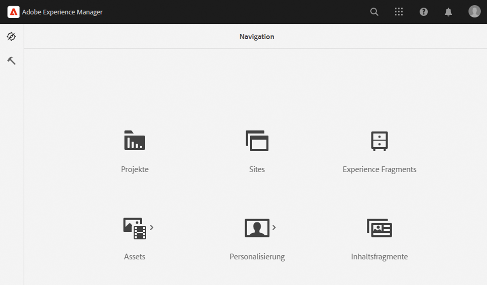
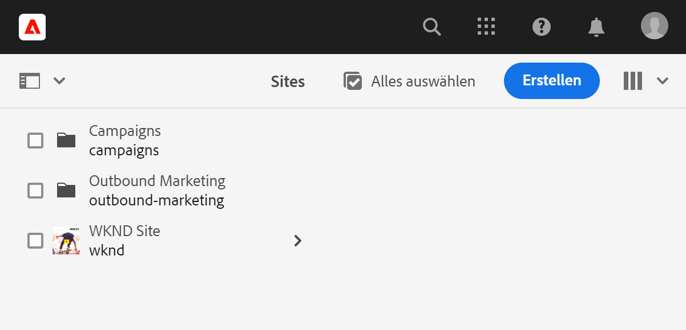
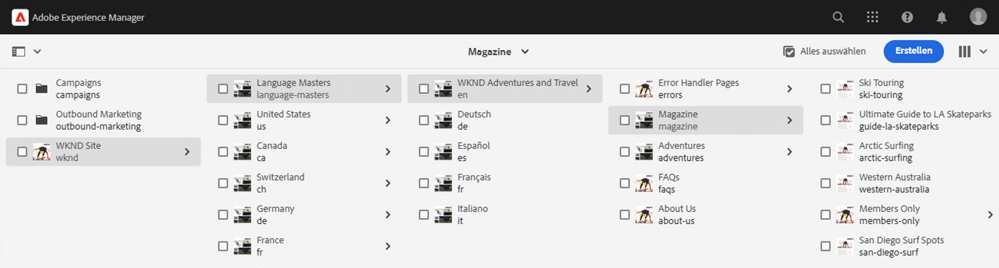
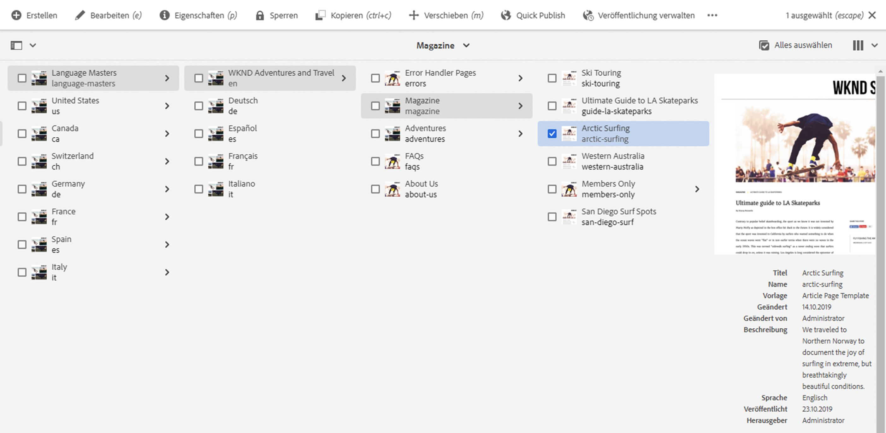
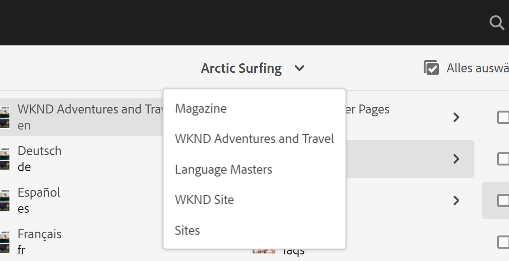
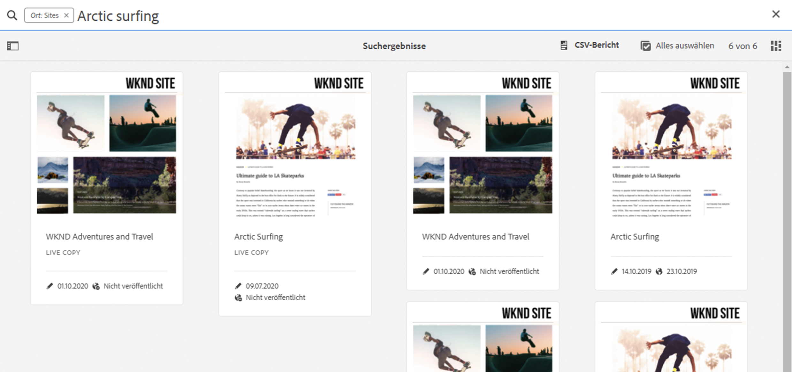
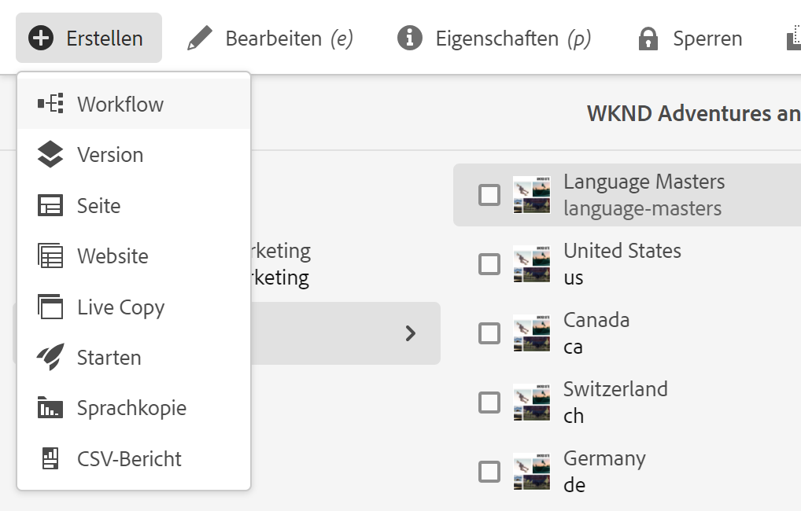
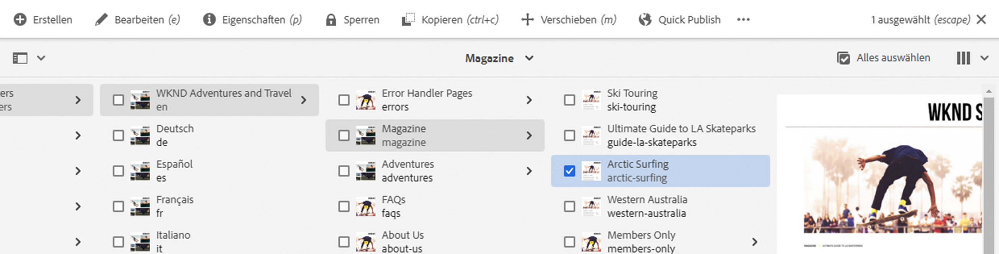
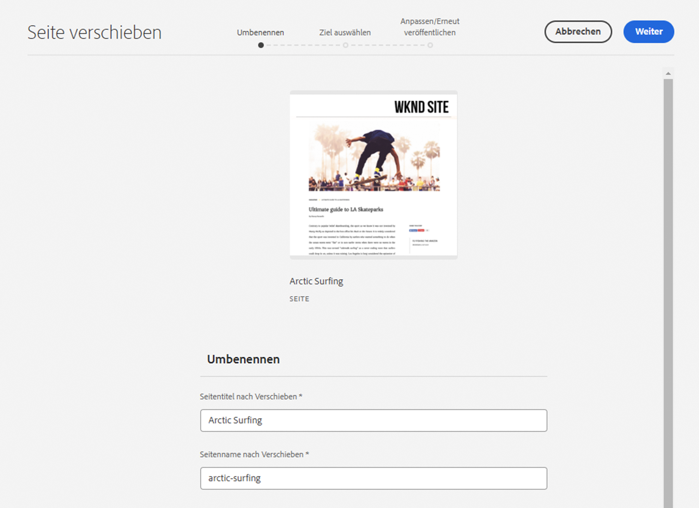
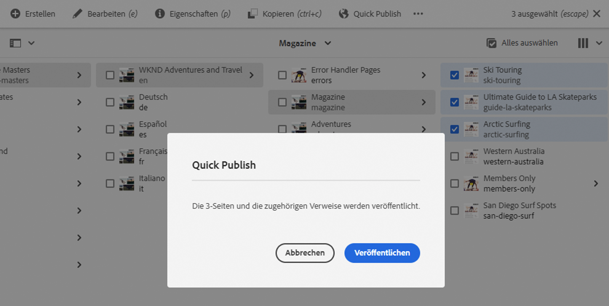

# Schnellstartanleitung für das Authoring {#quick-guide-to-authoring}

Beginnen Sie hier mit einer kurzen, allgemeinen Anleitung für die ersten Schritte zum Verfassen von Inhalten mit der **Sites**-Konsole.

>[!TIP]
>
>Diese Schnellstartanleitung konzentriert sich auf das Verfassen von Sites, die meisten Konzepte sind jedoch weitgehend auch auf andere Konsolen anwendbar.

## Alles beginnt in der Sites-Konsole. {#sites-console}

Ob Sie neue Inhalte erstellen oder vorhandene Inhalte anzeigen und verwalten möchten, die zentrale Übersicht für Sie ist die **Sites-Konsole**.

Wenn Sie sich zum ersten Mal bei AEM anmelden, gelangen Sie zum globalen Navigationsbildschirm. Tippen oder klicken Sie einfach auf **Sites**, um die **Sites-Konsole** zu öffnen.

Um von einem anderen Ort in AEM aus auf die globale Navigation zuzugreifen, tippen oder klicken Sie auf den Link **Adobe Experience Manager** links oben auf einem beliebigen AEM-Bildschirm. Hierdurch wird eine Dropdown-Überlagerung der globalen Navigation geöffnet.

Sind Sie einmal in der **Sites-Konsole**, ist die Navigation einfach und der Inhalt wird standardmäßig in einer Spaltenansicht angezeigt.

## Ansichten {#views}

Die **Sites-Konsole** wird standardmäßig in der **Spaltenansicht** geöffnet. Jede Hierarchieebene wird als Spalte angezeigt, was sich gut für Web-basierte, hierarchisch organisierte Inhalte eignet.

Tippen oder klicken Sie auf einen Eintrag in einer Spalte, um ihn auszuwählen oder die nächste Ebene in der Hierarchie zu öffnen. Ein ausgewähltes Element wird durch ein Häkchen gekennzeichnet.

Es stehen zwei weitere Ansichten zur Verfügung:

* **Kartenansicht** – In dieser Ansicht wird jeder Eintrag als einfach zu bearbeitende Karte dargestellt, wodurch zusätzliche Optionen leicht zugänglich sind.
* **Listenansicht** – Sie stellt eine einzelne Ebene einer Hierarchie als Einzelliste dar und bietet detailliertere Informationen zu den einzelnen Elementen.

Verwenden Sie den Ansichtsumschalter oben links auf dem Bildschirm, um zwischen Ansichten zu wechseln. Dieses Dokument verwendet die standardmäßige Spaltenansicht.

## Navigieren in Inhalten {#navigating}

**Spaltenansicht** stellt Inhalte als eine Reihe kaskadierender Spalten dar. Wenn Sie ein Element in der aktuellen Spalte auswählen, werden bei einem Dokument die Details in der nächsten Spalte rechts angezeigt, und bei einem Ordner wird der Inhalt der nächsten Hierarchieebene angezeigt.

Auf diese Weise können Sie Ihre Inhaltsstruktur nach oben und unten durchlaufen.

Um schnell zwischen Ebenen zu springen, können Sie die Breadcrumbs oben auf der Seite verwenden.

Sie können auch jederzeit das Suchsymbol oben rechts auf dem Bildschirm verwenden, um nach bestimmten Inhalten zu suchen.

Die Suche wird als Dropdown-Überlagerung über der gesamten Konsole angezeigt. Geben Sie Ihre Suchbegriffe ein, um nach Ihrem Inhalt zu suchen.

## Erstellen von Inhalten {#creating}

Um eine neue Seite zu erstellen, navigieren Sie einfach an die Stelle, an der sich die Seite in der Inhaltshierarchie befinden soll, und tippen oder klicken Sie auf die Schaltfläche **Erstellen** in der Symbolleiste.

Die verfügbaren Optionen sind kontextabhängig. Wenn Sie sich an der Wurzel Ihrer Inhaltsstruktur befinden, können Sie eine vollkommen neue Site erstellen. Andernfalls können Sie neue Seiten oder andere seitenbezogene Inhalte erstellen.

Je nachdem, was Sie erstellen, führt der entsprechende Assistent Sie durch den Erstellungsprozess.

## Bearbeiten von Inhalten {#editing}

Um eine Seite zu bearbeiten, tippen oder klicken Sie, um die Seite in der **Sites**-Konsole auszuwählen. Tippen oder klicken Sie dann in der angezeigten Symbolleiste auf das Symbol **Bearbeiten**.

Dadurch wird die Seite entsprechend dem Inhalt im Editor geöffnet.

Wenn Sie einfach die Eigenschaften einer Seite wie Tags oder deren Namen aktualisieren möchten, können Sie auf das Symbol **Eigenschaften** in der Symbolleiste tippen oder klicken.

## Organisieren von Inhalten {#organizing}

Um eine Seite zu verschieben oder zu kopieren, wählen Sie sie in der Konsole aus und tippen oder klicken Sie dann in der Symbolleiste auf **Verschieben** bzw. **Kopieren**. Es wird ein Assistent gestartet, der Sie durch die Schritte zum Verschieben oder Kopieren führt und den Namen und Speicherort der resultierenden Seite definiert.

## Veröffentlichen von Inhalten {#publishing}

Wenn Sie die gewünschten Änderungen an Ihrem Inhalt vorgenommen haben, können Sie den Inhalt mit der **Sites-Konsole** verwenden. Wählen Sie den zu veröffentlichenden Inhalt aus und tippen oder klicken Sie auf das Symbol **Quick Publish** in der Symbolleiste.

Klicken oder tippen Sie zum Bestätigen der Veröffentlichung im Dialogfeld auf **Veröffentlichen**.

## Zusätzliche Ressourcen {#additional-resources}

Dies ist nur eine kurze Einführung in die Leistungsfähigkeit der Erstellung von Sites-Inhalten und deckt daher nicht alle Themen oder Optionen ab.

Im Folgenden finden Sie weitere Ressourcen, die alle Funktionen der Konsole detailliert beschreiben und Themen zur Erstellung von Inhalten im Allgemeinen besprechen.

* [Grundlegende Handhabung](/help/sites-cloud/authoring/basic-handling.md)
* [Konzepte der Bearbeitung (Authoring)](/help/sites-cloud/authoring/author-publish.md)
* [Sites-Konsole](/help/sites-cloud/authoring/sites-console/introduction.md)
* [Seiteneditor](/help/sites-cloud/authoring/page-editor/introduction.md)
* [Veröffentlichen von Seiten](/help/sites-cloud/authoring/sites-console/publishing-pages.md)
