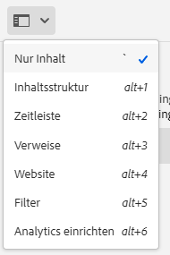
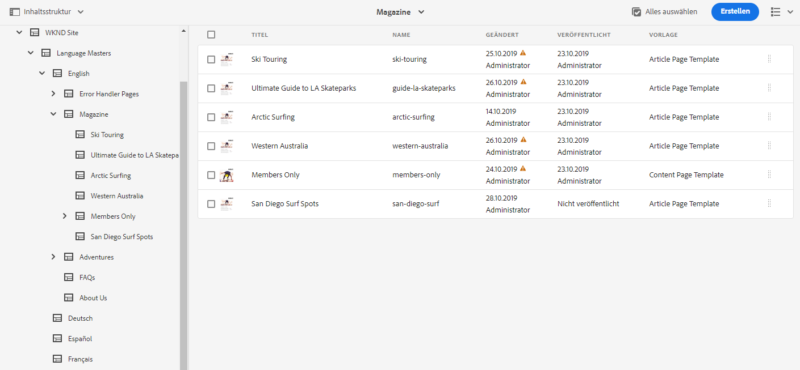
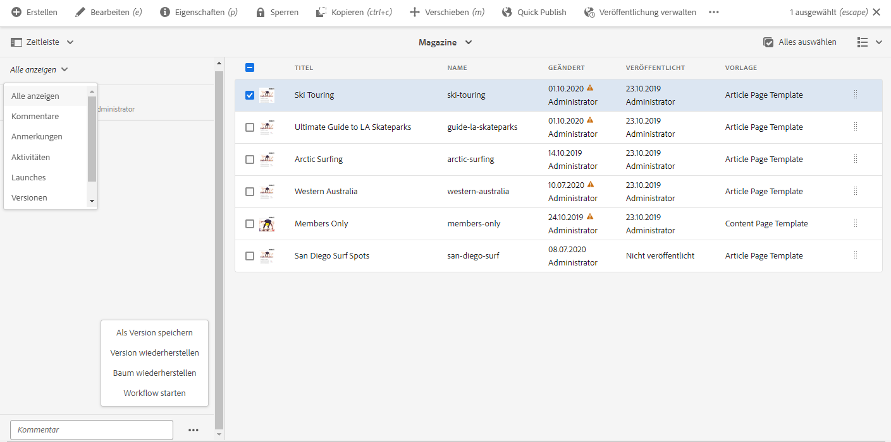
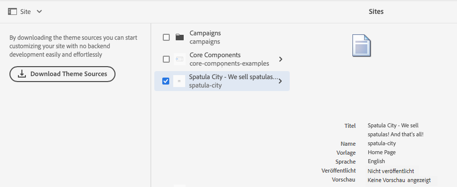
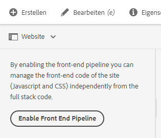
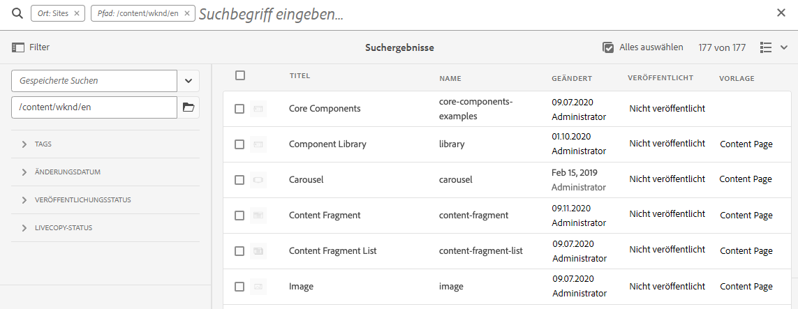
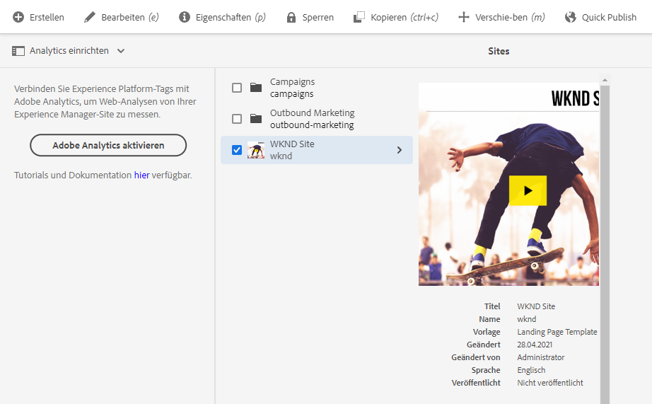

# Seitliches Bedienfeld der Sites-Konsole {#side-panel}

Erfahren Sie, wie Sie das seitliche Bedienfeld in der **AEM Sites**-Konsole verwenden, um Ihre Inhalte besser zu verstehen und darin zu navigieren.

## Ausrichtung {#orientation}

Das seitliche Bedienfeld wird standardmäßig geschlossen, wenn Sie die **Sites**-Konsole aufrufen. Auf diese Weise steht der Bildschirm ganz Ihren Inhalten zur Verfügung.

Tippen oder klicken Sie auf das Symbol **Seitliches Bedienfeld** in der Symbolleiste der **Sites**-Konsole, um das seitliche Bedienfeld zu aktivieren und Ihre Ansicht des Inhalts auszuwählen.

* [Nur Inhalte](#content-only)
* [Inhaltsstruktur](#content-tree)
* [Timeline](#timeline)
* [Verweise](#references)
* [Site](#site)
* [Filter](#filter)
* [Einrichten von Analysen](#setup-analytics)

Die aktuell ausgewählte Ansicht wird durch ein blaues Häkchen in der Dropdown-Liste gekennzeichnet und das Symbol „Seitliches Bedienfeld“ in der Symbolleiste wird mit dem Namen der ausgewählten Ansicht aktualisiert.

## Nur Inhalte {#content-only}

Mit dieser Ansicht des seitlichen Bedienfelds wird es effektiv deaktiviert, d. h. es wird nur der Inhalt Ihrer Site angezeigt.

>[!TIP]
>
>Verwenden Sie den Tastaturbefehl Gravis/Backtick `´`, um zur Ansicht „Nur Inhalt“ des seitlichen Bedienfelds zu wechseln.

## Inhaltsstruktur {#content-tree}

Diese Ansicht des seitlichen Bedienfelds zeigt Ihren Inhalt in einer Baumstruktur an. Die Inhaltsstruktur kann verwendet werden, um schnell in der Site-Hierarchie im Seitenbereich zu navigieren und viele Informationen über die Seiten im aktuellen Ordner anzuzeigen.

Ein nach rechts zeigender Pfeil neben einem Element in der Struktur zeigt einen Knoten an, der erweitert werden kann, um seine untergeordneten Elemente anzuzeigen. Tippen oder klicken Sie auf den Pfeil, um die untergeordneten Elemente anzuzeigen.

Die Konsole zeigt den Inhalt des aktuell ausgewählten Elements in der Inhaltsstruktur an.

Mithilfe des seitlichen Bedienfelds der Inhaltsstruktur in Verbindung mit einer Listen- oder Kartenansicht können Sie die hierarchische Struktur des Projekts einfach erkennen, mit dem seitlichen Bedienfeld der Inhaltsstruktur leicht durch die Inhaltsstruktur navigieren und detaillierte Seiteninformationen in der Listenansicht anzeigen.

>[!TIP]
>
>* Verwenden Sie den Tastaturbefehl `Alt+1`, um zur Inhaltsstrukturansicht des seitlichen Bedienfelds zu wechseln.
>* Sobald ein Eintrag in der Hierarchieansicht ausgewählt ist, können Sie mithilfe der Pfeiltasten schnell in der Hierarchie navigieren.
>* Weitere Informationen finden Sie unter [Tastaturbefehle](/help/sites-cloud/authoring/sites-console/keyboard-shortcuts.md).

## Timeline {#timeline}

In der Timeline werden Ereignisse angezeigt, die sich auf die ausgewählte Ressource ausgewirkt haben.  Sie können damit auch bestimmte Ereignisse wie Workflows oder Versionen starten.

Über das seitliche Bedienfeld **Timeline** können Sie verschiedene Ereignisse im Zusammenhang mit einem ausgewählten Element anzeigen, die als Typen aus einer Dropdown-Liste ausgewählt werden können:

* Kommentare
* [Anmerkungen](/help/sites-cloud/authoring/page-editor/annotations.md)
* [Aktivitäten](/help/sites-cloud/authoring/personalization/activities.md)
* [Launches](/help/sites-cloud/authoring/launches/overview.md)
* [Versionen](/help/sites-cloud/authoring/sites-console/page-versions.md)
* [Workflows](/help/sites-cloud/authoring/workflows/overview.md)
   * Beachten Sie, dass für Verlaufs-Workflows keine Informationen angezeigt werden, da für diese keine Verlaufsinformationen gespeichert werden.<!--With the exception of [transient workflows](/help/sites-developing/workflows.md#transient-workflows) as no history information is saved for these-->
* Alles anzeigen

Darüber hinaus können Sie Kommentare zum ausgewählten Element über das Feld **Kommentar** unten in der Ereignisliste hinzufügen/anzeigen. Wenn Sie einen Kommentar gefolgt von `Return` eingeben, wird der Kommentar registriert. Er wird angezeigt, wenn **Kommentare** oder **Alle anzeigen** ausgewählt ist.

Außerdem können Sie in der **Sites**-Konsole über die Schaltfläche mit den Auslassungspunkten neben dem Feld **Kommentar** auf zusätzliche Funktionen zugreifen.

* [eine Version speichern](/help/sites-cloud/authoring/sites-console/page-versions.md)
* [einen Workflow starten](/help/sites-cloud/authoring/workflows/applying.md)

>[!TIP]
>
>* Verwenden Sie den Tastaturbefehl `Alt+2`, um zur Timeline-Ansicht des seitlichen Bedienfelds zu wechseln.
>* Weitere Informationen finden Sie unter [Tastaturbefehle](/help/sites-cloud/authoring/sites-console/keyboard-shortcuts.md).

## Verweise {#references}

Die Ansicht **Verweise** zeigt eine Liste der Verweistypen zu oder von der Ressource, die in der Konsole ausgewählt ist.

Wählen Sie den gewünschten Verweistyp, um weitere Informationen anzuzeigen: In bestimmten Situationen sind weitere Aktionen verfügbar, wenn Sie einen bestimmten Verweis auswählen:

* **Eingehende Links** enthält eine Liste der Seiten, die auf die Seite verweisen, und bietet direkten Zugriff zum **Bearbeiten** einer dieser Seiten, wenn Sie einen bestimmten Link auswählen.
   * Dies kann nur statische Links anzeigen, nicht dynamisch generierte Links wie etwa aus der Listenkomponente.
* [Launches](/help/sites-cloud/authoring/launches/overview.md) bietet Zugriff auf zugehörige Launches.
* [Live Copies](/help/sites-cloud/administering/msm/overview.md) zeigt die Pfade aller Live Copies an, die auf der gewählten Ressource basieren.
* [Blueprint](/help/sites-cloud/administering/msm/best-practices.md) bietet Details und verschiedene Aktionen.
* [Sprachenkopien](/help/sites-cloud/administering/translation/managing-projects.md#creating-translation-projects-using-the-references-panel) bietet Details und verschiedene Aktionen

## Site {#site}

Die **Site**-Ansicht des Seitenbereichs zeigt Details zu Sites an, [ mithilfe einer Site-Vorlage erstellt ](/help/sites-cloud/administering/site-creation/create-site.md).

Im Dokument [Verwenden des Site-Bedienfelds zum Verwalten des Site-Designs](/help/sites-cloud/administering/site-creation/site-rail.md) finden Sie weitere Informationen darüber, wie Sie das Bedienfeld zum Verwalten des [Designs Ihrer Site](/help/sites-cloud/administering/site-creation/site-themes.md) verwenden können.

Wenn Sie die Frontend-Pipeline noch nicht eingerichtet haben, um die Design-basierte Site-Erstellung zu aktivieren, bietet das seitliche Bedienfeld diese Option an.

>[!TIP]
>
>Eine vollständige Beschreibung des Prozesses zum Erstellen einer Site aus einer Vorlage und zum Anpassen ihres Designs finden Sie in der [Tour zur schnellen Site-Erstellung](/help/journey-sites/quick-site/overview.md).

## Filter {#filter}

Das Bedienfeld **Filter** ähnelt der [Suchfunktion](/help/sites-cloud/authoring/search.md) mit bereits entsprechend eingestellten Ortsfiltern. So können Sie den für die Anzeige gewünschten Inhalt weiter filtern.

Im Gegensatz zu anderen Ansichten des seitlichen Bedienfelds können Sie durch Tippen oder Klicken auf die Schaltfläche `X` im Suchfeld zu einer anderen Ansicht wechseln.

## Einrichten von Analysen {#setup-analytics}

Mit dieser Ansicht können Sie Adobe Analytics für eine ausgewählte Site schnell einrichten.

