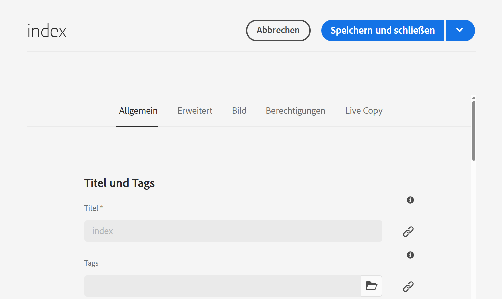
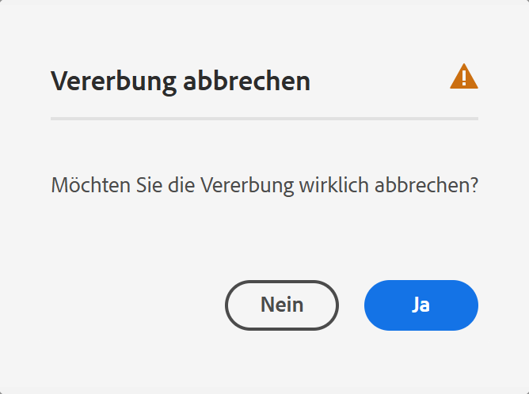
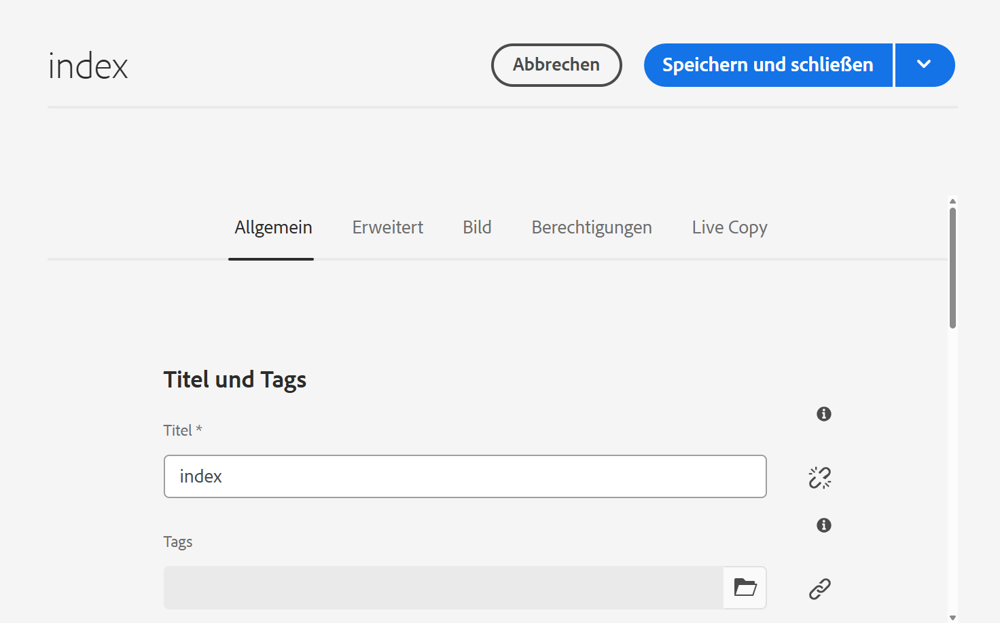
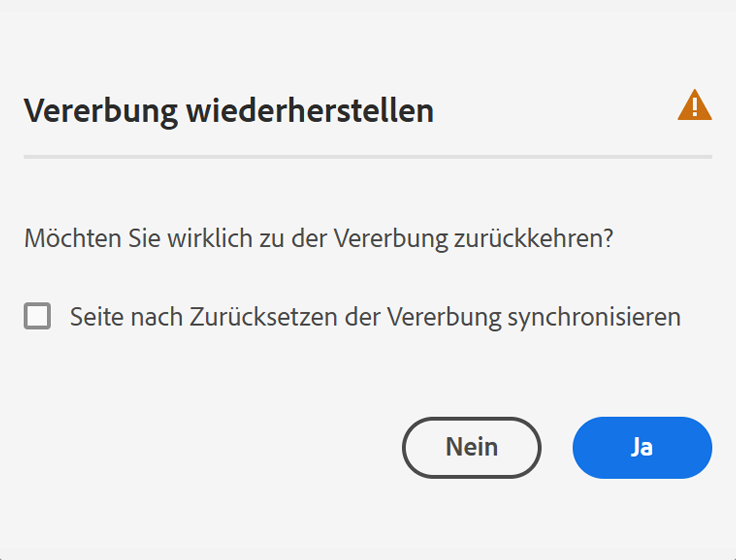

# Bearbeiten der Seiteneigenschaften {#page-properties}

Erfahren Sie, wie Sie [die Eigenschaften einer Seite](/help/sites-cloud/authoring/sites-console/page-properties.md) bearbeiten und das Verhalten der Seite ändern und wie sie verwaltet wird.

>[!TIP]
>
>Weitere Informationen zu den verfügbaren Eigenschaften der einzelnen Seiten finden Sie im Dokument [Seiteneigenschaften](/help/sites-cloud/authoring/sites-console/page-properties.md).

## Wo Seiteneigenschaften bearbeitet werden können {#where}

Sie können Seiteneigenschaften an verschiedenen Stellen in AEM bearbeiten.

* [Im ](#from-the-sites-console)
* [Im Seiteneditor](#from-the-page-editor)
* [Im universellen Editor](#from-the-universal-editor)

Mit der Sites-Konsole können Sie auch [die Eigenschaften mehrerer Seiten gleichzeitig bearbeiten](#editing-multiple-pages).

### In der Sites-Konsole {#from-the-sites-console}

Beim Durchsuchen Ihres Inhalts in der **Sites-Konsole** können Sie die Schaltfläche **Eigenschaften** in der Symbolleiste verwenden, um die Seiteneigenschaften zu bearbeiten:

1. Navigieren Sie in der [**Sites-Konsole**](/help/sites-cloud/authoring/sites-console/introduction.md) zu der Seite, für die Sie Eigenschaften anzeigen und bearbeiten möchten.
1. Wählen Sie die Option **Eigenschaften** für die gewünschte Seite aus, indem Sie wahlweise Folgendes verwenden:
   * [Schnellaktionen](/help/sites-cloud/authoring/basic-handling.md#quick-actions)
   * [Auswahlmodus](/help/sites-cloud/authoring/basic-handling.md#selecting-resources)
   * Die Seiteneigenschaften werden in den entsprechenden Registerkarten angezeigt.
1. Sie können die Eigenschaften nach Bedarf anzeigen oder bearbeiten.
1. Speichern Sie dann Ihre Aktualisierungen mit **Speichern** und klicken Sie danach auf **Schließen**, um zur Konsole zurückzukehren.

### Im Seiteneditor {#from-the-page-editor}

Beim Bearbeiten einer Seite mit dem Seiteneditor können Sie die **Seiteninformationen** verwenden, um die Seiteneigenschaften zu definieren:

1. Öffnen Sie im [Seiteneditor](/help/sites-cloud/authoring/page-editor/introduction.md) die Seite, für die Sie Eigenschaften bearbeiten möchten.
1. Wählen Sie das Symbol **Seiteninformationen** aus, um das Auswahlmenü zu öffnen:
1. Wählen Sie **Eigenschaften öffnen**. Daraufhin wird ein Dialogfeld geöffnet, in dem Sie die Eigenschaften bearbeiten können. Die Eigenschaften werden nach der entsprechenden Registerkarte sortiert. Die folgenden Schaltflächen stehen ebenfalls rechts in der Symbolleiste zur Verfügung:
   * **Abbrechen**
   * **Speichern und schließen**
1. Mit der Schaltfläche **Speichern und schließen** können Sie Änderungen speichern.

## Im universellen Editor {#from-the-universal-editor}

Beim Bearbeiten einer Seite mit dem universellen Editor können Sie das Symbol **Seiteneigenschaften** verwenden, um die Eigenschaften zu bearbeiten:

1. Öffnen Sie im [universellen Editor](/help/sites-cloud/authoring/universal-editor/authoring.md#page-properties) die Seite, deren Eigenschaften Sie bearbeiten möchten.
1. Wählen Sie das Symbol **Seiteneigenschaften** in der Symbolleiste aus.
1. Das Fenster mit den Seiteneigenschaften von AEM wird auf einer neuen Browser-Registerkarte geöffnet, so als würden Sie Seiteneigenschaften im [Seiteneditor bearbeiten.](#from-the-page-editor) Die folgenden Schaltflächen stehen ebenfalls rechts in der Symbolleiste zur Verfügung:
   * **Abbrechen**
   * **Speichern und schließen**
1. Mit der Schaltfläche **Speichern und schließen** können Sie Änderungen speichern.
1. Kehren Sie zur Browser-Registerkarte des universellen Editors zurück.

## Bearbeiten der Eigenschaften mehrerer Seiten {#editing-multiple-pages}

In der [**Sites-Konsole**](/help/sites-cloud/authoring/sites-console/introduction.md) können Sie mehrere Seiten auswählen und dann mithilfe von **Eigenschaften anzeigen** die Seiteneigenschaften anzeigen und/oder bearbeiten. Dies wird als Massenbearbeitung von Seiteneigenschaften bezeichnet.

Sie können mehrere Seiten für die Massenbearbeitung mit verschiedenen Methoden auswählen, darunter:

* Beim Durchsuchen der **Sites**-Konsole
* Nach Verwendung von **Suche**, um einen Seitensatz zu finden

Nach Auswahl der Seiten und anschließendem Klicken oder Tippen auf die Option **Eigenschaften** werden die Masseneigenschaften angezeigt:

Sie können nur Massenbearbeitungen von Seiten durchführen, die:

* den gleichen Ressourcentyp haben
* nicht Teil einer Live Copy sind.
   * Ist eine der ausgewählten Seiten Teil einer Live Copy, wird beim Öffnen der Eigenschaften eine Meldung angezeigt.

Das Fenster für die Massenbearbeitung ist vertikal in zwei Hälften geteilt:

* Auf der linken Seite finden Sie eine Liste der Seiten, die Sie für die Massenbearbeitung ausgewählt haben.

   * Sie können die Seiten nach Bedarf auswählen oder die Auswahl aufheben.
   * Standardmäßig sind alle Seiten ausgewählt. 

* Auf der rechten Seite finden Sie eine Liste mit [Eigenschaften, die für die Massenbearbeitung verfügbar sind.](/help/implementing/developing/extending/bulk-editor.md)

   * Wie beim Anzeigen von Eigenschaften für eine einzelne Seite werden die Eigenschaften unter Registerkarten angeordnet.
   * Eigenschaften, die auf allen ausgewählten Seiten verfügbar sind und explizit als für die Massenbearbeitung verfügbar definiert wurden, sind sichtbar.
   * Wenn Sie die Seitenauswahl auf eine Seite reduzieren, sind alle Eigenschaften sichtbar.
   * Es werden nur Eigenschaften mit einem gemeinsamen Wert angezeigt.
   * Wenn es sich um ein mehrwertiges Feld handelt (z. B. Tags), werden die Werte nur angezeigt, wenn *alle* übereinstimmen. Wenn nur einige übereinstimmen, werden sie nur bei der Bearbeitung angezeigt.

* Für Felder, die häufig vorkommen, aber auf den verschiedenen Seiten unterschiedliche Werte haben, wird ein spezieller Wert angegeben, beispielsweise `<Mixed Entries>`.

Sie können die Werte in den Feldern aktualisieren, die auf den ausgewählten Seiten verfügbar sind. Die neuen Werte werden auf alle ausgewählten Seiten angewendet, wenn Sie **Fertig** wählen. Wenn es sich um ein mehrwertiges Feld handelt (z. B. Tags), können Sie entweder einen neuen Wert anhängen oder einen gemeinsamen Wert entfernen.

## Vererbung von Eigenschaften {#inheritance}

Wenn die Seite auf einem Blueprint basiert oder anderweitig Inhalte von einer anderen Seite erbt, wird die Vererbung im Fenster **Seiteneigenschaften** für das jeweilige Feld angezeigt.

Vererbte Eigenschaften können nicht bearbeitet werden. Tippen oder klicken Sie auf das Symbol **Vererbung abbrechen** neben einem bestimmten Feld, um dessen Vererbung abzubrechen.

Bestätigen Sie den Abbruch im Modal **Vererbung abbrechen**.

Sobald die Vererbung für ein Feld abgebrochen wurde, kann es bearbeitet werden.

Um die Vererbung zu reaktivieren, tippen oder klicken Sie auf das Symbol **Vererbung wiederherstellen** neben dem Feld.

Bestätigen Sie die Wiederherstellung im Modal **Vererbung wiederherstellen**.

Wählen Sie **Seite nach Zurücksetzen der Vererbung synchronisieren** aus, um das Feld mit den neuesten Werten im Blueprint zu aktualisieren. Andernfalls werden die Werte bei der nächsten Synchronisierung der Live Copy aktualisiert.

>[!TIP]
>
>Weitere Informationen zur Vererbung finden Sie im Dokument [Multi-Site Manager und Übersetzung](/help/sites-cloud/administering/msm-and-translation.md).
