# Die Sites-Konsole {#sites-console}

Erfahren Sie, wie Sie Ihre AEM-Seiten mit der **Sites**-Konsole verwalten und organisieren können.

## Ausrichtung {#orientation}

Mit der **Sites**-Konsole können Sie Ihre Seitenhierarchie anzeigen.

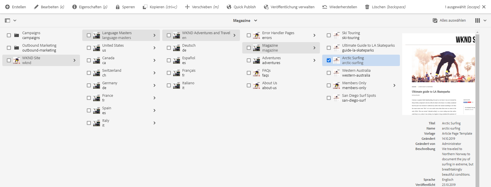

Sie bietet verschiedene Ansichten und Symbolleisten, mit denen Sie Ihre Seiten verwalten und organisieren können.

* [Die Konsolensymbolleiste](#toolbar) ist immer vorhanden, um Ihnen bei der Navigation zu helfen.
* [Dank der drei verschiedenen Ansichten](#views) können Sie Ihre Seite problemlos finden und auswählen.
* [Die Aktionssymbolleiste](#action-toolbar) wird angezeigt, wenn Sie ein Element ausgewählt haben, das bearbeitet werden soll.
* [Das seitliche Bedienfeld](#side-panel) verfügt über mehrere Optionen zum Anzeigen detaillierter Informationen auf einer ausgewählten Seite.

## Konsolensymbolleiste {#console-toolbar}

Die Konsolensymbolleiste befindet sich immer in der Konsole und hilft Ihnen, sich in Ihren Inhalten zu orientieren und durch die Inhalte zu navigieren.

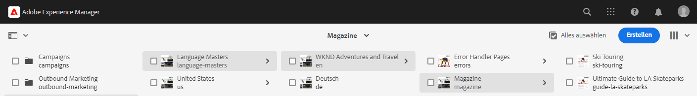.

### Auswahl des seitlichen Bedienfelds {#side-panel-selector}

Mit der Auswahl des seitlichen Bedienfelds können Sie zusätzliche Informationen zum ausgewählten Element in der Konsole anzeigen.

Die angezeigten Optionen hängen von der jeweiligen Konsole ab. So können Sie z. B. in **Sites** nur Inhalt (Standard), die Timeline, Verweise oder das seitliche Bedienfeld „Filter“ auswählen.

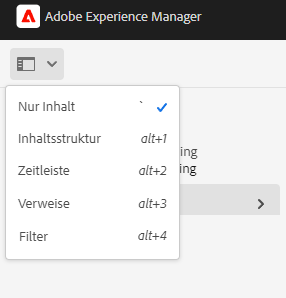

Weitere Informationen zum seitlichen Bedienfeld finden Sie unter [Seitliches Bedienfeld der Sites-Konsole](/help/sites-cloud/authoring/sites-console/console-side-panel.md).

### Breadcrumbs {#breadcrumbs}

Breadcrumbs befinden sich in der Mitte der Leiste und zeigen immer die Beschreibung des aktuell ausgewählten Elements an. Sie ermöglichen Ihnen damit die Navigation durch die Ebenen Ihrer Website.

Tippen oder klicken Sie einfach auf den Breadcrumb-Text, um eine Dropdown-Liste mit den Hierarchieebenen des aktuell ausgewählten Elements anzuzeigen. Tippen oder klicken Sie auf einen Eintrag, um zu dieser Position zu gelangen.

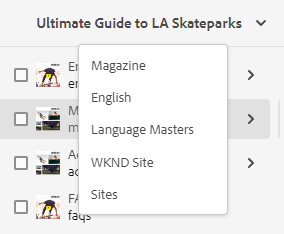

### Alle auswählen {#select-all}

Tippen oder klicken Sie auf die Schaltfläche **Alle auswählen**, um alle Elemente in der aktuellen Ansicht der Konsole auszuwählen.

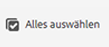

Wenn Sie alle Elemente ausgewählt haben, wird die Anzahl der ausgewählten Elemente oben rechts in der Symbolleiste an der Stelle der Schaltfläche **Alle auswählen** angezeigt.

Sie können wie folgt die Auswahl aller Elemente aufheben und den Auswahlmodus beenden:

* Klicken oder tippen Sie auf das **X** neben der Anzahl.
* Verwenden Sie die **Esc**-Taste.

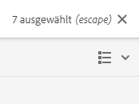.

### Schaltfläche „Erstellen“ {#create-button}

Mit der Schaltfläche **Erstellen** können Sie neue Seiten zu Ihrer Site hinzufügen und zusätzliche Sites-Objekte wie Live Copies oder Launches erstellen.

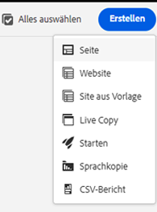

Wird hierauf geklickt, entsprechen die angezeigten Optionen der Konsole/dem Kontext.  Die häufigsten sind:

* [Seite  &#x200B;](/help/sites-cloud/authoring/sites-console/creating-pages.md)
* [Site](/help/sites-cloud/administering/site-creation/create-site.md)
* [Live Copy](/help/sites-cloud/administering/msm/overview.md)
* [Launch](/help/sites-cloud/authoring/launches/overview.md)
* [Sprachkopie](/help/sites-cloud/administering/translation/overview.md)
* [CSV-Bericht](/help/sites-cloud/authoring/sites-console/csv-export.md)

Weitere Informationen zur Funktionsweise finden Sie unter den Links zu diesen Funktionen.

## Ansichten und Auswählen von Seiten {#views}

Die **Sites**-Konsole bietet drei verschiedene Ansichten Ihrer Inhaltshierarchie. Sie können Ressourcen in jeder der verfügbaren Ansichten anzeigen, durchblättern und (für weitere Aktionen) auswählen:

* [Spaltenansicht](#column-view)
* [Kartenansicht](#card-view)
* [Listenansicht](#list-view)

Das Symbol **Ansicht** ganz rechts neben der AEM-Symbolleiste gibt die aktuell ausgewählte Ansicht an.

Wenn Sie darauf tippen oder klicken, können Sie eine andere Ansicht auswählen.

Sie können zwischen der Spalten-, Karten- und Listenansicht wechseln; in der Listenansicht werden auch die Ansichtseinstellungen angezeigt.

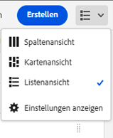

>[!NOTE]
>
>Die Option **Ansichtseinstellungen** steht nur im Modus **Listenansicht** zur Verfügung.

Anzeige, Navigation und Auswahl sind grundsätzlich in allen Ansichten gleich. Je nach verwendeter Ansicht kommt es aber zu geringfügigen Abweichungen bei der Verwendung.

>[!NOTE]
>
>Standardmäßig zeigt AEM Assets in keiner der Ansichten die ursprüngliche Ausgabedarstellung von Assets als Miniatur in der Benutzeroberfläche an. Administratoren können mithilfe von Überlagerungen AEM Assets so konfigurieren, dass ursprüngliche Ausgabedarstellungen als Miniaturen angezeigt werden.

### Auswählen von Ressourcen {#selecting-resources}

Die Auswahl einer bestimmten Ressource hängt von der Kombination der Ansicht und des Geräts ab:

| Anzeigen | Touch aktivieren | Desktop aktivieren | Touch deaktivieren | Desktop deaktivieren |
|---|---|---|---|---|
| Spalte | Wählen der Miniaturansicht | Klicken der Miniaturansicht | Wählen der Miniaturansicht | Klicken der Miniaturansicht |
| Karte | Wählen und Halten der Karte | Fahren Sie mit dem Mauszeiger darüber und verwenden Sie dann die Schnellaktion mit Häkchen | Wählen der Karte | Klicken Sie auf die Karte |
| Liste | Wählen der Miniaturansicht | Klicken der Miniaturansicht | Wählen der Miniaturansicht | Klicken der Miniaturansicht |

#### Auswahlbeispiel {#selecting-example}

1. Beispiel für die Kartenansicht:

   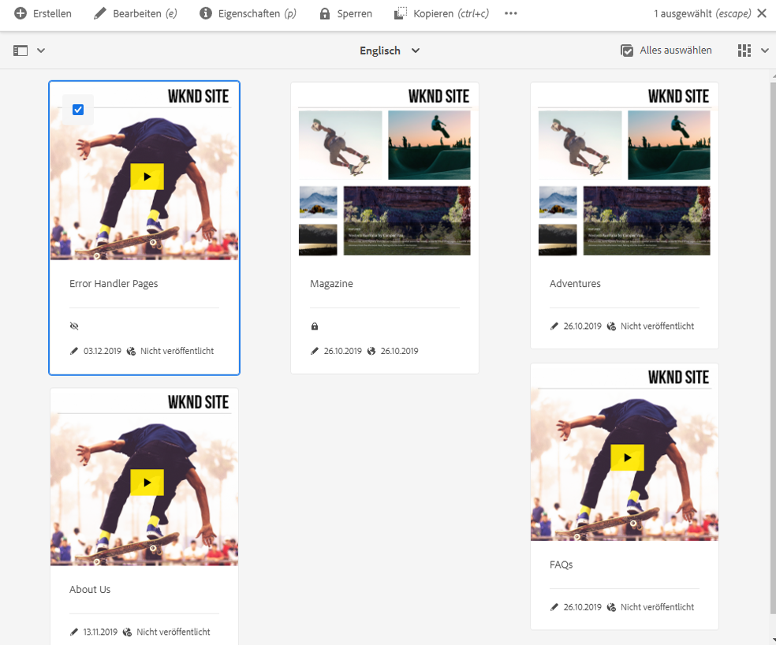

1. Nach Auswahl einer Ressource wird die obere Kopfzeile von der [Aktionssymbolleiste](#actions-toolbar) überdeckt, die Zugriff auf die Aktionen bietet, die für die ausgewählte Ressource verfügbar sind.

1. Um den Auswahlmodus zu beenden, wählen Sie das **X** in der rechten oberen Ecke oder drücken Sie die **Esc-Taste**.

### Spaltenansicht {#column-view}

Die Spaltenansicht ermöglicht die visuelle Navigation in einer Inhaltsstruktur durch eine Reihe kaskadierender Spalten. Mit dieser Ansicht können Sie die Baumstruktur Ihrer Website visualisieren und durchlaufen.

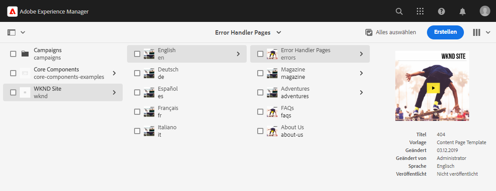

Wenn Sie eine Ressource in der Spalte ganz links auswählen, werden die untergeordneten Ressourcen in einer Spalte rechts angezeigt. Wenn Sie eine Ressource in der rechten Spalte auswählen, werden die ihr untergeordneten Ressourcen in einer anderen Spalte rechts angezeigt usw.

* Sie können in der Baumstruktur nach oben und unten navigieren, indem Sie auf den Ressourcennamen oder den Pfeil rechts neben dem Ressourcennamen tippen/klicken.

   * Beim Tippen bzw. Klicken werden der Ressourcenname und der Pfeil hervorgehoben.
   * Die untergeordneten Elemente der angeklickten/angetippten Ressource werden in der Spalte rechts neben der angeklickten/angetippten Ressource angezeigt.
   * Wenn Sie einen Ressourcennamen auswählen, der keine untergeordneten Elemente besitzt, werden die Ressourcendetails in der letzten Spalte angezeigt.

* Durch Tippen oder Klicken auf die Miniaturansicht wird die Ressource ausgewählt.

   * Wenn diese Option ausgewählt ist, wird ein Häkchen auf der Miniaturansicht angezeigt und zudem wird der Ressourcenname hervorgehoben.
   * Die Details der ausgewählten Ressource werden in der letzten Spalte angezeigt.
   * Die Aktionssymbolleiste wird verfügbar.

* Wenn eine Seite in der Spaltenansicht ausgewählt wird, wird die ausgewählte Seite in der letzten Spalte zusammen mit den folgenden Details angezeigt:

   * Seitentitel
   * Seitenname (Teil der URL der Seite)
   * Vorlage, auf der die Seite basiert
   * Änderungsdetails
   * Sprache der Seite
   * Veröffentlichen und Vorschau von Details

### Kartenansicht {#card-view}

In der Kartenansicht wird jedes Element in der aktuellen Hierarchieebene als große Karte angezeigt.

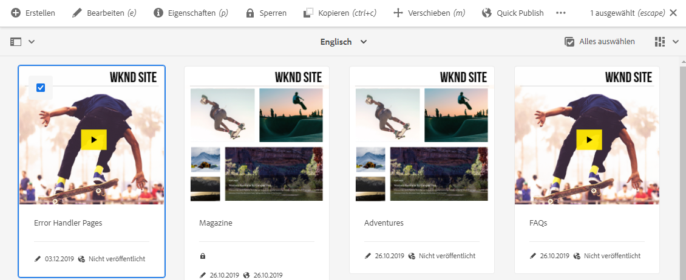

* Karten enthalten Informationen wie:

   * eine visuelle Darstellung des Seiteninhalts
   * den Seitentitel
   * wichtige Daten (z. B. zuletzt bearbeitet, zuletzt veröffentlicht)
   * ob die Seite gesperrt, ausgeblendet oder Teil einer Live Copy ist
   * ob Sie das Element im Zuge eines Workflows bearbeiten müssen

Die Kartenansicht bietet auch [Schnellaktionen](#quick-actions) für Elemente, z. B. Auswahl und allgemeine Aktionen wie Bearbeiten.

Sie können in der Struktur nach unten navigieren, indem Sie auf die Karten tippen/klicken (nicht die Schnellaktionen auswählen), und über die [Breadcrumbs in der Kopfzeile](#the-header) wieder nach oben navigieren.

### Listenansicht {#list-view}

In der Listenansicht werden Informationen für jede Ressource in der aktuellen Ebene in einer Liste aufgeführt.

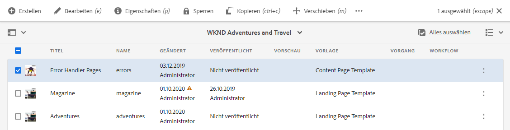

* Sie können in der Struktur nach unten navigieren, indem Sie auf den Ressourcennamen tippen/klicken, und mithilfe der [Breadcrumbs in der Kopfzeile](#the-header) wieder nach oben navigieren.
* Um alle Elemente in der Liste auf einfache Weise auszuwählen, aktivieren Sie das Kontrollkästchen [**Alle auswählen** in der Symbolleiste](#select-all).

* Wählen Sie mit der Option **Ansichtseinstellungen** unter der Schaltfläche „Ansichten“ die Spalten aus, die angezeigt werden sollen. Die folgenden Spalten stehen zur Anzeige zur Verfügung:

   * **Name** – Seitenname, der in einer mehrsprachigen Authoring-Umgebung nützlich sein kann, da er Teil der URL der Seite ist und sich unabhängig von der Sprache nicht ändert
   * **Geändert** – Datum und Person der letzten Änderung
   * **Veröffentlicht** – Veröffentlichungsstatus
   * **Vorschau** – Vorschaustatus
   * **Vorlage** – Vorlage, auf der die Seite basiert
   * **Vorgang**
   * **Workflow** – Workflow, der derzeit auf die Seite angewendet ist. Weitere Informationen sind verfügbar, wenn Sie die Maus darüber bewegen oder die Timeline öffnen.
   * **Übersetzt**
   * **Seitenansichten**
   * **Unique Visitors**
   * **Zeit auf Seite**

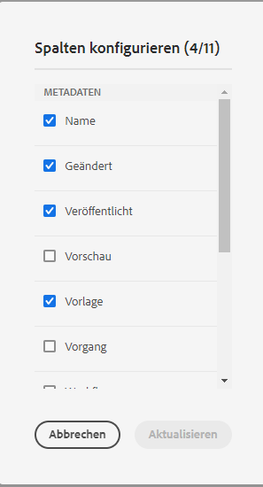

Standardmäßig wird die Spalte **Name** angezeigt, die Teil der URL der Seite ist. Unter Umständen muss der Autor auf Seiten zugreifen, die in einer anderen Sprache verfasst sind. In diesem Fall ist die Anzeige des Seitennamens (der sich normalerweise nicht ändert) äußerst hilfreich, wenn der Autor die Sprache der Seite nicht kennt.

* Ändern Sie die Reihenfolge der Elemente mithilfe des vertikalen gepunkteten Balkens am rechten Rand jedes Elements.

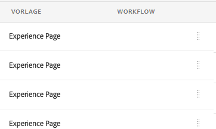

Wählen Sie die vertikale Auswahlleiste aus und ziehen Sie das Element an eine neue Position in der Liste.

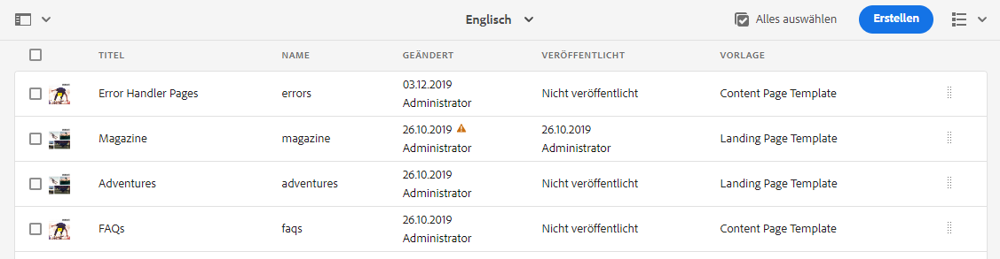

>[!NOTE]
>
>Das Ändern der Reihenfolge funktioniert nur innerhalb eines sortierten Ordners, für den `jcr:primaryType` den Wert `sling:OrderedFolder` hat.

## Aktionssymbolleiste {#actions-toolbar}

Immer wenn eine Ressource ausgewählt wird, können Sie verschiedene Aktionen für das ausgewählte Element ausführen. Diese Aktionen werden in der Aktionssymbolleiste angezeigt.

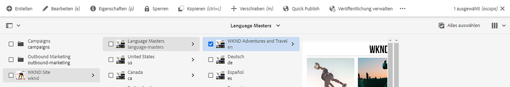

Die Aktionssymbolleiste wird nur angezeigt, wenn eine Ressource in der Konsole ausgewählt ist. In der Aktionssymbolleiste werden immer nur die Aktionen angezeigt, die Sie für die jeweiligen Elemente durchführen können. Die gängigsten Aktionen sind:

* [**Erstellen**](#create-action): Erstellt neue Inhalte oder inhaltsbezogene Aktionen.
* **Bearbeiten**: Je nachdem, wie die ausgewählte Seite erstellt wurde, öffnet die Aktion **Bearbeiten** den entsprechenden Editor.
   * [Seiteneditor](/help/sites-cloud/authoring/page-editor/introduction.md): Für Seiten, die mit dem AEM-Seiteneditor erstellt wurden.
   * [Universeller Editor](/help/sites-cloud/authoring/universal-editor/authoring.md): Für mit dem universellen Editor erstellte Seiten.
* [**Eigenschaften**](/help/sites-cloud/authoring/sites-console/edit-page-properties.md): Öffnet das Fenster „Seiteneigenschaften“.
* [**Sperren**](/help/sites-cloud/authoring/sites-console/managing-pages.md#locking-a-page): Sperrt eine Seite, um zu verhindern, dass sie von anderen geändert wird.
* [**Kopieren**](/help/sites-cloud/authoring/sites-console/managing-pages.md#copying-and-pasting-a-page): Kopiert eine Seite.
* [**Verschieben**](/help/sites-cloud/authoring/sites-console/managing-pages.md#moving-or-renaming-a-page): Verschiebt eine Seite oder benennt diese um.
* [**Quick Publish**](/help/sites-cloud/authoring/sites-console/publishing-pages.md#quick-publish): Ermöglicht die sofortige Veröffentlichung einer oder mehrerer Seiten.
* [**Veröffentlichung verwalten**](/help/sites-cloud/authoring/sites-console/publishing-pages.md#manage-publication): Ermöglicht es, die Veröffentlichung einer oder mehrerer Seiten zu planen.
* [**Wiederherstellen**](/help/sites-cloud/authoring/sites-console/page-versions.md#restore-version): Stellt eine Version einer Seite oder Seitestruktur wieder her.
* [**Löschen**](/help/sites-cloud/authoring/sites-console/managing-pages.md#deleting-a-page): Löscht eine oder mehrere Seiten.

Aufgrund des eingeschränkten Anzeigebereichs in einigen Fenstern kann die Symbolleiste schnell länger als der verfügbare Platz werden. In diesem Fall werden weitere Optionen angezeigt. Durch Klicken oder Tippen auf die Auslassungspunkte (drei Punkte bzw. **…**) wird eine Dropdown-Auswahl mit allen verbleibenden Aktionen geöffnet. 

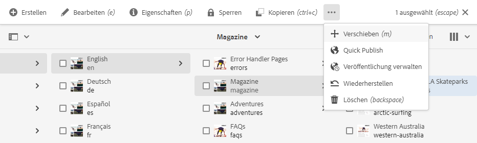

### Aktion „Erstellen“ {#create-action}

Die Aktion „Erstellen“ bietet ähnliche Optionen wie die Schaltfläche [**Erstellen** in der Symbolleiste](#create-button), um neue Seiten und ähnliche Elemente zu erstellen.

Darüber hinaus ermöglicht sie es, seitenbezogene Aktionen zu erstellen.

* [**Workflow**](/help/sites-cloud/authoring/workflows/overview.md): Wendet einen Workflow auf eine Seite an.
* [**Version**](/help/sites-cloud/authoring/sites-console/page-versions.md): Erstellt eine Version einer Seite.

## Vorlagen

Durch Auswählen der Seite in der [**Spaltenansicht**](/help/sites-cloud/authoring/basic-handling.md#column-view) oder [**Listenansicht**](/help/sites-cloud/authoring/basic-handling.md#list-view) können Sie schnell und einfach feststellen, auf welcher Vorlage die Seite basiert.

## KI-Assistent in AEM

Für Kundinnen und Kunden, die die [Voraussetzungen erfüllen](/help/implementing/cloud-manager/ai-assistant-in-aem.md#get-access), steht der KI-Assistent in AEM den Benutzenden ihres Unternehmens zur Verfügung. Siehe [KI-Assistent in AEM](/help/implementing/cloud-manager/ai-assistant-in-aem.md).

