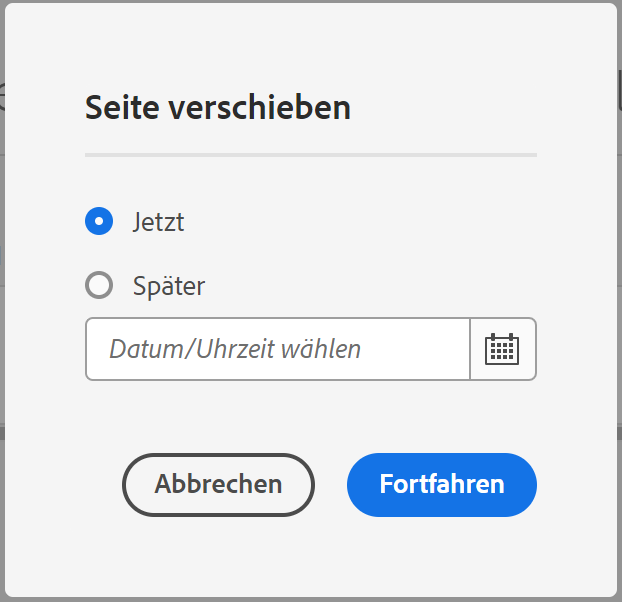

# Verwalten von Seiten {#managing-pages}

Erfahren Sie, wie Sie die Seiten Ihrer Website in AEM verwalten, einschließlich dem Verschieben, Kopieren und Löschen.

>[!TIP]
>
>Bevor Sie mit der Verwaltung Ihrer Seiten beginnen, sollten Sie sich damit vertraut machen, [wie Ihre Seiten in AEM organisiert sind](/help/sites-cloud/authoring/sites-console/organizing-pages.md).

>[!TIP]
>
>Es steht eine Reihe von [Tastaturbefehlen](/help/sites-cloud/authoring/sites-console/keyboard-shortcuts.md) in der Websites-Konsole zur Verfügung, die eine effizientere Seitenorganisation ermöglichen.

## Zugriff auf Berechtigungen {#access-privileges}

Ihr Konto muss über die erforderlichen Zugriffsrechte und Berechtigungen verfügen, damit Sie Aktionen auf Seiten durchführen können, beispielsweise erstellen, kopieren, verschieben, bearbeiten und löschen.

Wenn Sie auf Probleme stoßen, empfehlen wir Ihnen, sich an die Systemadmins zu wenden.

## Öffnen einer Seite zur Bearbeitung {#opening-a-page-for-editing}

Wenn Sie [eine Seite erstellt haben](/help/sites-cloud/authoring/sites-console/creating-pages.md) bzw. in [der **Sites**-Konsole](/help/sites-cloud/authoring/sites-console/introduction.md) zu einer bereits vorhandenen Seite navigiert sind, können Sie diese zur Bearbeitung öffnen.

1. Öffnen Sie [die **Sites**-Konsole](/help/sites-cloud/authoring/sites-console/introduction.md).
1. Navigieren Sie zu der Seite, die Sie bearbeiten möchten.
1. Wählen Sie Ihre Seite mit einer der folgenden Methoden aus:

   * [Schnellaktionen](/help/sites-cloud/authoring/basic-handling.md#quick-actions)
   * [Auswahlmodus](/help/sites-cloud/authoring/basic-handling.md#selecting-resources) und Symbolleiste

1. Tippen oder klicken Sie auf das Symbol **Bearbeiten**.

   

1. Die Seite wird geöffnet und Sie können sie nach Bedarf bearbeiten.  Je nachdem, wie die ausgewählte Seite erstellt wurde, öffnet die Aktion **Bearbeiten** den entsprechenden Editor.
   * [Seiteneditor](/help/sites-cloud/authoring/page-editor/introduction.md) – für Seiten, die mit dem AEM-Seiteneditor erstellt wurden.
   * [Universeller Editor](/help/sites-cloud/authoring/universal-editor/authoring.md) – für Seiten, die mit dem universellen Editor erstellt wurden.

## Kopieren und Einfügen einer Seite {#copying-and-pasting-a-page}

Sie können eine Seite und alle zugehörigen Unterseiten an einen neuen Speicherort kopieren:

1. Öffnen Sie [die **Sites**-Konsole](/help/sites-cloud/authoring/sites-console/introduction.md).
1. Navigieren Sie zu der Seite, die Sie kopieren möchten.
1. Wählen Sie Ihre Seite mit einer der folgenden Optionen aus:

   * [Schnellaktionen](/help/sites-cloud/authoring/basic-handling.md#quick-actions)
   * [Auswahlmodus](/help/sites-cloud/authoring/basic-handling.md#selecting-resources) und Symbolleiste

1. Tippen oder klicken Sie auf das Symbol zum **Kopieren** der Seite.

   

1. Navigieren Sie zum Speicherort, an dem Sie die neue Kopie der Seite speichern möchten.
1. Wählen Sie das **Einfügen**-Symbol, das neu verfügbar wurde.

   

1. Das Dialogfeld „Einfügen“ bietet eine Zusammenfassung der Einfügeoperation und folgende Möglichkeiten:
   * **Neuer Website-Name:** Ändern des Namens der eingefügten Seite
   * **Ohne untergeordnete Seiten einfügen:** Auslassen der untergeordneten Seiten der ausgewählten Seite beim Einfügen (standardmäßig werden die untergeordneten Seiten eingefügt)

   

1. Wählen Sie die Schaltfläche **Einfügen**, um die Einfügeoperation zu bestätigen und die neue(n) Seite(n) zu erstellen.

>[!NOTE]
>
>Wenn Sie die Seite an einen Speicherort kopieren, an dem sich bereits eine Seite befindet, deren Name mit dem der ursprünglichen Seite übereinstimmt, erstellt das System automatisch eine Variante des Namens, indem eine Zahl angehängt wird. Wenn beispielsweise `beach` bereits existiert, wird eine neue Seite mit dem Namen `beach` zu `beach1`.

>[!NOTE]
>
>Wenn Sie die Einfügeoperation im Auswahlmodus beginnen, wird dieser automatisch beendet, sobald die Seite kopiert wird.

## Verschieben oder Umbenennen einer Seite {#moving-or-renaming-a-page}

Die Vorgehensweise beim Verschieben oder Umbenennen einer Seite ist im Großen und Ganzen gleich und beide Aktionen werden von demselben Assistenten unterstützt. Dieser Assistent hilft Ihnen bei den folgenden Aktionen:

* Umbenennen einer Seite, ohne sie zu verschieben.
* Verschieben der Seite, ohne sie umzubenennen.
* Verschieben und gleichzeitiges Umbenennen der Seite.

AEM bietet die Möglichkeit, interne Links zu aktualisieren, die zu einer Seite führen, die umbenannt oder verschoben wird. Dies kann seitenweise erfolgen, um volle Flexibilität zu bieten.

1. Öffnen Sie [die **Sites**-Konsole](/help/sites-cloud/authoring/sites-console/introduction.md).
1. Navigieren Sie zu der Seite, die Sie verschieben möchten.
1. Wählen Sie Ihre Seite mit einer der folgenden Optionen aus:

   * [Schnellaktionen](/help/sites-cloud/authoring/basic-handling.md#quick-actions)
   * [Auswahlmodus](/help/sites-cloud/authoring/basic-handling.md#selecting-resources) und Symbolleiste

1. Tippen oder klicken Sie auf das Symbol zum **Verschieben** der Seite, um den Assistenten zum Verschieben von Seiten zu öffnen.

   

1. Der Schritt **Umbenennen** des Assistenten liefert **Informationen** zur Seite einschließlich Erstellungsdatum, Pfad und Anzahl der direkten Verweise. Von hier aus haben Sie folgende Möglichkeiten:

   * Geben Sie den Namen an, den die Seite nach dem Verschieben aufweisen soll, und wählen Sie dann **Weiter**, um fortzufahren.
   * Mit **Abbrechen** brechen Sie den Vorgang ab.

   

   * Der Seitenname kann unverändert bleiben, wenn Sie die Seite nur verschieben.

   >[!NOTE]
   >
   >Wenn Sie die Seite an einen Speicherort verschieben, an dem sich bereits eine Seite befindet, deren Name mit dem der ursprünglichen Seite übereinstimmt, erstellt das System automatisch eine Variation des Namens, indem eine Zahl angehängt wird. Wenn beispielsweise `beach` bereits existiert, wird eine neue Seite mit dem Namen `beach` zu `beach1`.

1. Im Schritt **Ziel auswählen** des Assistenten können Sie entweder:

   * Die [Spaltenansicht](/help/sites-cloud/authoring/basic-handling.md#column-view) verwenden, um zum neuen Speicherort für die Seite zu navigieren:

      * Wählen Sie das Ziel für die Seite aus, indem Sie auf die Miniatur des Ziels klicken.
      * Klicken Sie auf **Weiter**, um fortzufahren.

   * Auf **Zurück** klicken, um zur Angabe des Seitennamens zurückzukehren.

   >[!NOTE]
   >
   >Standardmäßig wird das übergeordnete Element der Seite, die Sie verschieben/umbenennen, als das Ziel ausgewählt.

   

   >[!NOTE]
   >
   >Wenn Sie die Seite an einen Speicherort verschieben, an dem sich bereits eine Seite befindet, deren Name mit dem der ursprünglichen Seite übereinstimmt, erstellt das System automatisch eine Variation des Namens, indem eine Zahl angehängt wird. Wenn beispielsweise `winter` bereits existiert, wird `winter` zu `winter1`.

1. Wenn die Seite verknüpft ist oder auf sie verwiesen wird, werden die Details im Schritt **Anpassen/Erneut veröffentlichen** aufgeführt.

   * Sie können angeben, welche Verweise ggf. angepasst und neu veröffentlicht werden sollen.

   >[!NOTE]
   >
   >* Wenn die Seite weder verknüpft ist noch darauf verwiesen wurde, ist dieser Schritt nicht verfügbar.
   >* Dieser Schritt listet sowohl direkte als auch indirekte Referenzen auf. Dies kann sich von der Menge unterscheiden, die im **Umbenennen** des Assistenten sowie von den in der Leiste „Verweise“ gemeldeten Verweisen gemeldet wird, die beide aus Leistungsgründen nur direkte Verweise melden.

   

1. Tippen oder klicken Sie auf **Verschieben**, um festzulegen, wann der Verschiebevorgang ausgeführt werden soll.

   * **Jetzt** löst einen [asynchronen Auftrag](#asynchronous-actions) aus, um die Seite sofort zu verschieben.
   * **Später** ermöglicht es Ihnen, ein Datum für die Verarbeitung des Verschiebevorgangs zu planen.

   

1. Tippen oder klicken Sie auf **Fortsetzen**, um die Seitenverschiebung abzuschließen.

>[!NOTE]
>
>Wenn die Seite bereits veröffentlicht wurde, wird das Veröffentlichen durch Verschieben der Seite automatisch rückgängig gemacht. Standardmäßig wird sie nach Abschluss des Verschiebevorgangs erneut veröffentlicht. Dies lässt sich jedoch ändern, indem Sie im Schritt **Anpassen/Erneut veröffentlichen** das Kontrollkästchen **Neu veröffentlichen** deaktivieren.

>[!NOTE]
>
>Das Umbenennen einer Seite unterliegt auch den [Seitenbenennungskonventionen](#page-naming-conventions) beim Angeben des neuen Seitennamens.

>[!NOTE]
>
>Eine Seite kann nur an einen Speicherort verschoben werden, an dem die Vorlage, auf der die Seite basiert, zulässig ist. Weitere Informationen finden Sie unter [Formularverfügbarkeit](/help/implementing/developing/components/templates.md#template-availability).

### Asynchrone Aktionen {#asynchronous-actions}

Seitenverschiebungsaktionen werden immer asynchron verarbeitet, sodass Sie ungehindert mit der Erstellung in der Benutzeroberfläche fortfahren können.

Der Status asynchroner Aufträge kann im [**Dashboard** Status asynchroner Aufträge](/help/operations/asynchronous-jobs.md#monitor-the-status-of-asynchronous-operations) unter **Globale Navigation** > **Werkzeuge** > **Vorgänge** > **Aufträge** überprüft werden.

>[!TIP]
>
>Weitere Informationen zur asynchronen Auftragsverarbeitung und zum Konfigurieren der Begrenzung für Verschiebungs-/Umbenennungsaktionen für Seiten finden Sie im Dokument [Asynchrone Aufträge](/help/operations/asynchronous-jobs.md) im Benutzerhandbuch für den Betrieb.

### Löschen einer Seite {#deleting-a-page}

1. Öffnen Sie [die **Sites**-Konsole](/help/sites-cloud/authoring/sites-console/introduction.md).
1. Navigieren Sie zu der Seite, die Sie löschen möchten.
1. Wählen Sie mit dem [Auswahlmodus](/help/sites-cloud/authoring/basic-handling.md#viewing-and-selecting-resources) die gewünschte Seite aus, bevor Sie in der Symbolleiste die Option **Löschen** auswählen:

   

1. Ein Bestätigungsdialogfeld wird angezeigt.

   

   * **Möchten Sie Seiten vor dem Löschen archivieren?** – Wenn diese Option aktiviert ist, werden beim Löschen Versionen der zu löschenden Seiten erstellt.
      * [Versionen können zu einem späteren Zeitpunkt wiederhergestellt werden](/help/sites-cloud/authoring/sites-console/page-versions.md).
      * Gelöschte Seiten ohne vorherige Versionen können nicht wiederhergestellt werden.
1. Tippen oder klicken Sie auf **Abbrechen**, um den Vorgang abzubrechen, oder auf **Löschen**, um den Vorgang zu bestätigen.
   * Wenn die Seite keine Verweise enthält, wird sie gelöscht.
   * Wenn die Seite Verweise enthält, werden Sie in einem Meldungsfeld darüber informiert, dass **auf eine oder mehrere Seiten verwiesen wird.** Sie können **Löschen erzwingen** oder **Abbrechen** auswählen.

>[!NOTE]
>
>Wenn eine Seite bereits veröffentlicht ist, wird vor dem Löschen automatisch ihre Veröffentlichung rückgängig gemacht.

### Sperren einer Seite {#locking-a-page}

Sie können entweder in einer Konsole oder beim Bearbeiten einer Seite [eine Seite sperren/entsperren](/help/sites-cloud/authoring/page-editor/edit-content.md#locking-a-page). Informationen darüber, ob eine Seite gesperrt ist, werden ebenfalls an beiden Stellen angezeigt.

 

### Erstellen eines neuen Ordners {#creating-a-new-folder}

Sie können Ordner erstellen, um Ihre Dateien und Seiten zu organisieren.

1. Öffnen Sie [die **Sites**-Konsole](/help/sites-cloud/authoring/sites-console/introduction.md). 
1. Navigieren Sie zum gewünschten Speicherort.
1. Um die Optionsliste zu öffnen, wählen Sie **Erstellen** in der Symbolleiste aus.
1. Wählen Sie **Ordner** aus, um das Dialogfeld zu öffnen. Hier können Sie den **Namen** und den **Titel** eingeben:

   

1. Wählen Sie **Erstellen**, um den Ordner zu erstellen.

>[!NOTE]
>
>* Ordner unterliegen ebenfalls den [Seitenbenennungskonventionen](#page-naming-conventions), wenn ein neuer Ordnername angegeben wird.
>* Ordner können nur direkt unter **Sites** oder unter anderen Ordnern erstellt werden. Sie können nicht unter einer Seite erstellt werden.
>* Für einen Ordner können folgende Standardaktionen ausgeführt werden: Verschieben, Kopieren, Einfügen, Löschen, Veröffentlichen, Rückgängigmachen der Veröffentlichung und Anzeigen/Bearbeiten von Eigenschaften.
>* Ordner sind in einer Live Copy nicht als Auswahl verfügbar.
