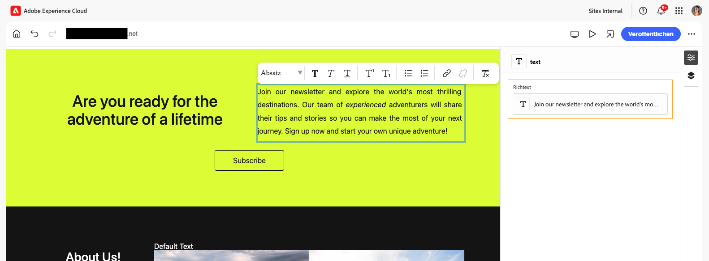
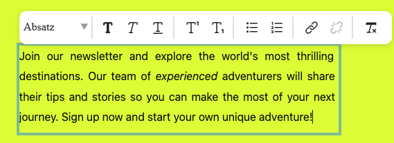
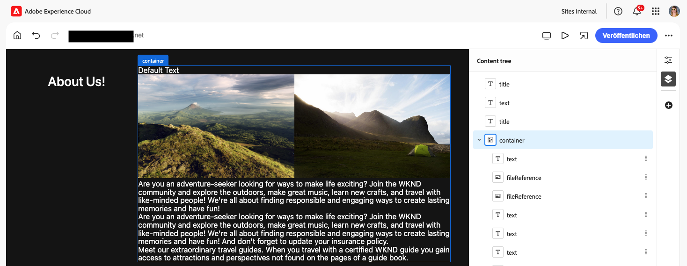
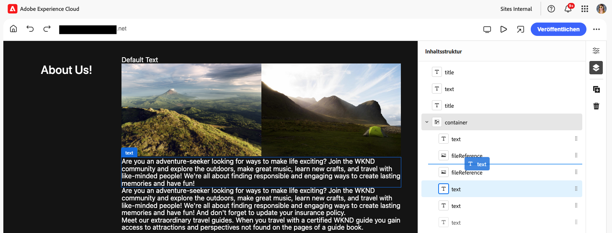

# Inhaltserstellung mit dem universellen Editor {#authoring}

Erfahren Sie, wie einfach und intuitiv es für Inhaltsautorinnen und -autoren ist, Inhalte mit dem universellen Editor zu erstellen.

## Einführung {#introduction}

Der universelle Editor ermöglicht die Bearbeitung beliebiger Inhalte in jeder Implementierung, um außergewöhnliche Erlebnisse bereitzustellen, die Inhaltsgeschwindigkeit zu erhöhen und ein modernes Entwicklererlebnis zu bieten.

Zu diesem Zweck bietet der universelle Editor Inhaltsautorinnen und Inhaltsautoren eine intuitive Benutzeroberfläche, die nur eine minimale Schulung erfordert, damit sie gleich loslegen und mit der Bearbeitung von Inhalten beginnen können. In diesem Dokument wird das Authoring-Erlebnis mit dem universellen Editor beschrieben.

>[!NOTE]
>
>Bei den in diesem Dokument beschriebenen Schritten wird vorausgesetzt, dass Sie bereits damit vertraut sind, wie Sie auf den universellen Editor zugreifen und darin navigieren. Ist dies nicht der Fall, lesen Sie das Dokument [Zugreifen auf den und Navigieren im universellen Editor](/help/sites-cloud/authoring/universal-editor/navigation.md).

>[!TIP]
>
>Eine detailliertere Einführung in den universellen Editor finden Sie im Dokument [Einführung in den universellen Editor](/help/implementing/universal-editor/introduction.md).

## Bearbeiten von Inhalten {#editing-content}

Die Bearbeitung von Inhalten ist einfach und intuitiv. Wenn Sie mit dem Mauszeiger über einen Inhalt im Editor fahren, werden bearbeitbare Inhalte mit einem dünnen blauen Umriss hervorgehoben.

>[!TIP]
>
>Durch Tippen oder Klicken auf einen Inhalt wird dieser standardmäßig zur Bearbeitung ausgewählt. Wenn Sie durch das Folgen von Links in Ihren Inhalten navigieren möchten, wechseln Sie zum [Vorschaumodus.](/help/sites-cloud/authoring/universal-editor/navigation.md#preview-mode)

Je nach ausgewähltem Inhalt können Ihnen unterschiedliche Optionen zur Bearbeitung im Kontext zur Verfügung stehen. Außerdem sehen Sie möglicherweise zusätzliche Informationen und Optionen für den Inhalt im [Bedienfeld „Eigenschaften“](/help/sites-cloud/authoring/universal-editor/navigation.md#properties-rail).

### Bearbeiten von einfachem Text {#edit-plain-text}

Sie können den Text direkt bearbeiten, indem Sie auf die Komponente doppelklicken oder doppeltippen.

Der dünne blaue Umriss wird zu einem dicken blauen Umriss, um die Auswahl anzuzeigen, und ein Cursor wird angezeigt. Nehmen Sie die gewünschten Änderungen vor und drücken Sie die Eingabetaste oder wählen Sie etwas außerhalb des Textfelds aus, um Ihre Änderungen zu speichern.

Wenn Sie die Textkomponente auswählen, werden ihre Details im [Bedienfeld „Eigenschaften“ angezeigt.](/help/sites-cloud/authoring/universal-editor/navigation.md#properties-rail) Sie können den Text auch im Bedienfeld bearbeiten.

Außerdem finden Sie im Bedienfeld „Eigenschaften“ weitere Details zu Ihrem Text. Änderungen werden automatisch gespeichert, sobald der Fokus das bearbeitete Feld im Bedienfeld „Eigenschaften“ verlässt.

### Bearbeiten von Rich-Text {#edit-rich-text}

Sie können den Text direkt bearbeiten, indem Sie auf die Komponente doppelklicken oder doppeltippen.

Zur Vereinfachung sind an zwei Stellen Formatierungsoptionen und Details zu Ihrem Text verfügbar.

#### Das Kontextmenü {#context-menu}

Das Kontextmenü wird oberhalb des Rich-Text-Blocks geöffnet und bietet grundlegende Formatierungsoptionen im Kontext. Aufgrund von Platzbeschränkungen kann es sein, dass einige Optionen hinter der Schaltfläche mit den Auslassungspunkten ausgeblendet werden.

Änderungen werden automatisch gespeichert, sobald das bearbeitete Feld nicht mehr den Eingabefokus hat.

#### Das Bedienfeld „Eigenschaften“ {#properties-rail}

Das [Bedienfeld „Eigenschaften“](/help/sites-cloud/authoring/universal-editor/navigation.md#properties-rail) zeigt ein Element für den ausgewählten Text an. Tippen Sie auf den Eintrag, um ein Dialogfeld mit einer größeren Arbeitsfläche zu öffnen, mit der Sie den Text bearbeiten können.

Tippen oder klicken Sie auf **Fertig** oder **Abbrechen**, um die Änderungen zu speichern bzw. zu verwerfen.

### Bearbeiten von Medien {#edit-media}

Sie können die Details im [Bedienfeld „Eigenschaften“](/help/sites-cloud/authoring/universal-editor/navigation.md#properties-rail) anzeigen.

1. Tippen oder klicken Sie auf die Vorschau des ausgewählten Bildes im Bedienfeld „Eigenschaften“.
1. Das Fenster [Asset-Selektor](/help/assets/overview-asset-selector.md#using-asset-selector) wird geöffnet, in dem Sie ein Asset auswählen können.
1. Wählen Sie diese Option, um ein neues Asset auszuwählen.
1. Wählen Sie **Auswählen**, um zum Bedienfeld „Eigenschaften“ zurückzukehren, in dem das Asset ersetzt wurde.

Änderungen an Ihrem Inhalt werden automatisch gespeichert.

### Bearbeiten von Inhaltsfragmenten {#edit-content-fragment}

Wenn Sie ein [Inhaltsfragment](/help/sites-cloud/administering/content-fragments/overview.md) auswählen, können Sie dessen Details im [Bedienfeld „Eigenschaften“](/help/sites-cloud/authoring/universal-editor/navigation.md#properties-rail) bearbeiten.

Die im Inhaltsmodell des ausgewählten Inhaltsfragments definierten Felder werden im Bedienfeld „Eigenschaften“ angezeigt und können dort bearbeitet werden.

Wenn Sie ein Feld auswählen, das mit einem Inhaltsfragment verknüpft ist, wird das Inhaltsfragment im Bedienfeld „Komponenten“ geladen und automatisch zu diesem Feld gescrollt.

Änderungen werden automatisch gespeichert, sobald der Fokus das bearbeitete Feld im Bedienfeld „Eigenschaften“ verlässt.

Wenn Sie Ihr Inhaltsfragment stattdessen im [Inhaltsfragmenteditor](/help/sites-cloud/administering/content-fragments/authoring.md) bearbeiten möchten, tippen oder klicken Sie im Bedienfeld „Eigenschaften“ auf die Schaltfläche [**Im CF-Editor öffnen**](/help/sites-cloud/authoring/universal-editor/navigation.md#edit).

>[!TIP]
>
>Verwenden Sie den Hotkey `e`, um das ausgewählte Inhaltsfragment im Inhaltsfragmenteditor zu bearbeiten.

Je nach den Anforderungen Ihres Workflows können Sie das Inhaltsfragment im universellen Editor oder direkt im Inhaltsfragmenteditor bearbeiten.

>[!NOTE]
>
>Der universelle Editor [validiert Inhaltsfragmentfelder anhand ihrer Modelle](/help/assets/content-fragments/content-fragments-models.md#validation). Dadurch können Sie Datenintegrationsregeln wie Regex-Muster und Eindeutigkeitsbeschränkungen erzwingen.
>
>So wird sichergestellt, dass Ihre Inhalte bestimmten Geschäftsanforderungen entsprechen, bevor sie veröffentlicht werden.

### Hinzufügen von Komponenten zu Containern {#adding-components}

1. Wählen Sie eine Container-Komponente in der [Inhaltsstruktur](/help/sites-cloud/authoring/universal-editor/navigation.md#content-tree-mode) oder im Editor aus.

   

1. Wählen Sie dann das Symbol „Hinzufügen“ im Bedienfeld „Eigenschaften“ aus.

   

Die Komponente wird in den Container eingefügt und kann im Editor bearbeitet werden.

>[!TIP]
>
>Verwenden Sie den Hotkey `a`, um dem ausgewählten Container eine Komponente hinzuzufügen.

### Duplizieren von Komponenten in Containern {#duplicating-components}

1. Wählen Sie eine Komponente in einem Container mithilfe der [Inhaltsstruktur](/help/sites-cloud/authoring/universal-editor/navigation.md#content-tree-mode) oder des Editors aus.
1. Wählen Sie dann das Symbol **Duplizieren** im Bedienfeld „Eigenschaften“ aus.

   
1. Die Komponente wird dupliziert und unterhalb der ausgewählten Komponente eingefügt.

Die Komponente wird in den Container eingefügt und kann im Editor bearbeitet werden.

### Löschen von Komponenten aus Containern {#deleting-components}

1. Wählen Sie eine Container-Komponente in der [Inhaltsstruktur](/help/sites-cloud/authoring/universal-editor/navigation.md#content-tree-mode) oder im Editor aus.
1. Wählen Sie das Pfeilsymbol des Containers aus, um seinen Inhalt in der Inhaltsstruktur zu erweitern.
1. Wählen Sie dann in der Inhaltsstruktur eine Komponente im Container aus.
1. Wählen Sie das Löschsymbol im Bedienfeld „Eigenschaften“ aus.

   

Die ausgewählte Komponente wird gelöscht.

>[!TIP]
>
>Verwenden Sie den Hotkey `Shift+Backspace`, um die ausgewählte Komponente aus ihrem Container zu löschen.

### Neuanordnen von Komponenten in Containern {#reordering-components}

1. Wechseln Sie in den [Inhaltsstruktur-Modus](/help/sites-cloud/authoring/universal-editor/navigation.md#content-tree-mode), wenn dieser nicht bereits aktiviert ist.
1. Wählen Sie eine Container-Komponente in der Inhaltsstruktur oder im Editor aus.
1. Wählen Sie das Pfeilsymbol des Containers aus, um seinen Inhalt in der Inhaltsstruktur zu erweitern.
1. Ziehpunkte neben den Komponenten im Container zeigen, dass Sie sie neu anordnen können. Ziehen Sie die Komponenten, um sie innerhalb des Containers neu anzuordnen.

   

1. Die gezogene Komponente wechselt in der Inhaltsstruktur zu Grau, während der Einfügepunkt durch eine blaue Linie dargestellt wird. Lassen Sie die Komponente an ihrer neuen Position los, um sie dort zu platzieren.

Die Komponenten werden sowohl in der Inhaltsstruktur als auch im Editor neu angeordnet.

>[!NOTE]
>
>Komponenten können nicht zwischen Containern verschoben werden, wenn zwischen Quell- und Ziel-Container nicht der gleiche [Komponentenfilter](/help/implementing/universal-editor/customizing.md#filtering-components) festgelegt ist.

## Vorschau von Inhalten {#previewing-content}

Wenn Sie mit der Bearbeitung von Inhalten fertig sind, möchten Sie häufig durch diese navigieren, um zu sehen, wie sie im Inhalt anderer Seiten aussehen. Im [Vorschaumodus](/help/sites-cloud/authoring/universal-editor/navigation.md#preview-mode) können Sie auf Links klicken, um genau wie eine Person, die Ihre Inhalte liest, durch diese zu navigieren. Der Inhalt wird im Editor so wiedergegeben, wie er veröffentlicht werden würde.

Beachten Sie, dass im Vorschaumodus beim Tippen oder Klicken auf den Inhalt die gleiche Reaktion erfolgt, wie es bei einer Person, die den Inhalt liest, der Fall wäre. Wenn Sie den Inhalt zum Bearbeiten auswählen möchten, wechseln Sie in den [Vorschaumodus.](/help/sites-cloud/authoring/universal-editor/navigation.md#preview-mode)

## Zusätzliche Ressourcen {#additional-resources}

Informationen zum Veröffentlichen von Inhalten mit dem universellen Editor finden Sie in diesem Dokument.

* [Veröffentlichen von Inhalten mit dem universellen Editor](publishing.md) – Erfahren Sie, wie mit dem universellen Editor Inhalte veröffentlicht werden und wie Ihre Apps mit den veröffentlichten Inhalten umgehen können.

Weitere Informationen zu den technischen Details zum universellen Editor finden Sie in diesen Entwicklerdokumenten.

* [Einführung in den universellen Editor](/help/implementing/universal-editor/introduction.md) – Erfahren Sie, wie der universelle Editor die Bearbeitung beliebiger Inhalte in jeder Implementierung ermöglicht, um außergewöhnliche Erlebnisse bereitzustellen, die Inhaltsgeschwindigkeit zu erhöhen und ein modernes Entwicklererlebnis zu bieten.
* [Erste Schritte mit dem universellen Editor in AEM](/help/implementing/universal-editor/getting-started.md) – Erfahren Sie, wie Sie Zugriff auf den universellen Editor erhalten und wie Sie mit der Instrumentierung Ihrer ersten AEM-App beginnen, um ihn zu verwenden.
* [Architektur des universellen Editors](/help/implementing/universal-editor/architecture.md) – Erfahren Sie mehr über die Architektur des universellen Editors und darüber, wie Daten zwischen seinen Diensten und Ebenen fließen.
* [Attribute und Typen](/help/implementing/universal-editor/attributes-types.md) – Erfahren Sie mehr über die Datenattribute und -typen, die der universelle Editor erfordert.
* [Authentifizierung beim universellen Editor](/help/implementing/universal-editor/authentication.md) – Erfahren Sie, wie beim universellen Editor authentifiziert wird.

## Bearbeiten der Komponentenvererbung {#inheritance}

Vererbung ist der Mechanismus, durch den Inhalte so verknüpft werden können, dass Inhaltsänderungen automatisch übernommen werden. 

Mit dem universellen Editor können Sie die Vererbung für Inhalte abbrechen, indem Sie den Inhalt einfach aktualisieren. Der Editor deaktiviert automatisch die Vererbung für alle Änderungen, die von Autorinnen und Autoren auf dieser Seite vorgenommen werden. Dadurch wird sichergestellt, dass geänderte Inhalte beibehalten werden, wenn Aktualisierungen aus dem Blueprint synchronisiert werden.

Weitere Informationen zur Funktionsweise der Vererbung mit dem universellen Editor finden Sie im Dokument [Vererbung von Inhalten im universellen Editor.](/help/sites-cloud/authoring/universal-editor/inheritance.md)
