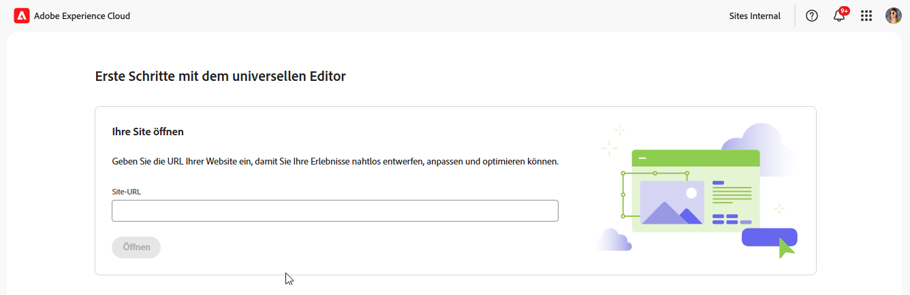
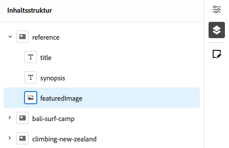
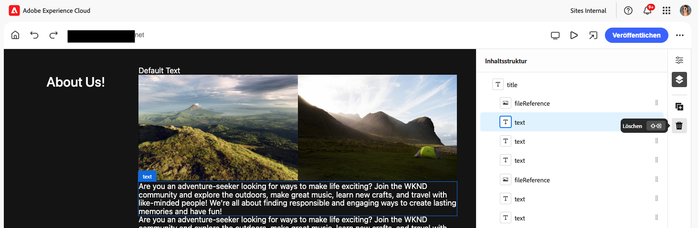

# Inhaltserstellung mit dem universellen Editor {#authoring}

Erfahren Sie, wie einfach und intuitiv es für Inhaltsautorinnen und -autoren ist, Inhalte mit dem universellen Editor zu erstellen.

## Einführung {#introduction}

Der universelle Editor ermöglicht die Bearbeitung beliebiger Inhalte in jeder Implementierung, um außergewöhnliche Erlebnisse bereitzustellen, die Inhaltsgeschwindigkeit zu erhöhen und ein modernes Entwicklererlebnis zu bieten.

Zu diesem Zweck bietet der universelle Editor Inhaltsautorinnen und Inhaltsautoren eine intuitive Benutzeroberfläche, die nur eine minimale Schulung erfordert, damit sie gleich loslegen und mit der Bearbeitung von Inhalten beginnen können. In diesem Dokument wird das Authoring-Erlebnis mit dem universellen Editor beschrieben.

>[!TIP]
>
>Eine detailliertere Einführung in den universellen Editor finden Sie im Dokument [Einführung in den universellen Editor](/help/implementing/universal-editor/introduction.md).

## Vorbereiten der App {#prepare-app}

Um Inhalte für eine App mit dem universellen Editor erstellen zu können, muss die App von einer Entwicklerperson instrumentiert werden, um den Editor zu unterstützen.

>[!TIP]
>
>Im Dokument [Erste Schritte mit dem universellen Editor in AEM](/help/implementing/universal-editor/getting-started.md) finden Sie ein Beispiel dafür, wie Sie eine AEM-App für die Arbeit mit dem universellen Editor konfigurieren.

## Zugreifen auf den universellen Editor {#accessing}

Sobald die App für die Verwendung mit dem universellen Editor instrumentiert wurde, kann der universelle Editor sowohl in AEM as a Cloud Service als auch direkt ohne Zugriff auf AEM aufgerufen werden.

### Zugreifen in AEM as a Cloud Service {#accessing-aem}

1. Melden Sie sich bei Ihrer Authoring-Instanz in AEM as a Cloud Service an.
1. Verwenden Sie die [**Sites**-Konsole](/help/sites-cloud/authoring/sites-console/introduction.md), um zu der Seite zu navigieren, die für die Verwendung mit dem universellen Editor erstellt wurde und die Sie bearbeiten möchten.
1. Bearbeiten Sie die Seite.
1. Der universelle Editor wird geöffnet, um die ausgewählte Seite zu bearbeiten.

>[!NOTE]
>
>Beim Bearbeiten einer Seite in der [**Sites**-Konsole](/help/sites-cloud/authoring/sites-console/introduction.md) öffnet die Konsole den entsprechenden Editor gemäß der [Vorlage](/help/sites-cloud/authoring/sites-console/templates.md) der Seite: entweder den in diesem Dokument beschriebenen universellen Editor oder den [Seiteneditor](/help/sites-cloud/authoring/page-editor/introduction.md).

### Direktes Zugreifen {#accessing-directly}

1. Melden Sie sich beim universellen Editor an. Sie benötigen eine Adobe ID, um sich anzumelden und [Zugang zum universellen Editor zu erhalten.](/help/implementing/universal-editor/getting-started.md#request-access)

1. Nachdem Sie sich angemeldet haben, geben Sie die URL der Seite, die Sie bearbeiten möchten, in die [Speicherortleiste ein.](#location-bar) Dann können Sie mit der Bearbeitung von Inhalten beginnen, z. B. [Textinhalt](#text-mode) oder [Medieninhalte](#media-mode).

## Grundlegendes zur Benutzeroberfläche {#ui}

Die Benutzeroberfläche ist in diese Hauptbereiche unterteilt.

* [Die Kopfzeile von Experience Cloud](#experience-cloud-header)
* [Die Symbolleiste des universellen Editors](#universal-editor-toolbar)
* [Der Editor](#editor)
* [Die Eigenschaftenleiste](#properties-rail)

### Die Kopfzeile von Experience Cloud {#experience-cloud-header}

Die Kopfzeile von Experience Cloud befindet sich immer oben im Bildschirm. Es handelt sich um einen Anker, der Ihnen mitteilt, wo Sie sich in Experience Cloud befinden, und Ihnen dabei hilft, zu anderen Experience Cloud-Apps zu navigieren.

#### Experience Manager {#experience-manager}

Wählen Sie links in der Kopfzeile den Adobe Experience Cloud-Link aus, um zum Stammverzeichnis Ihrer Experience Manager-Lösung zu navigieren und auf Tools wie [Cloud Manager](/help/onboarding/cloud-manager-introduction.md), [Cloud Acceleration Manager](/help/journey-migration/cloud-acceleration-manager/introduction/overview-cam.md) und [Software-Verteilung](https://experienceleague.adobe.com/docs/experience-cloud/software-distribution/home.html?lang=de) zuzugreifen.

#### Organisation {#organization}

Dadurch wird die Organisation angezeigt, bei der Sie sich derzeit angemeldet haben. Wählen Sie diese Option aus, um zu einer anderen Organisation zu wechseln, wenn Ihre Adobe ID mit mehreren Organisationen verknüpft ist.

#### Lösungen {#solutions}

Durch Tippen oder Klicken auf den Lösungsumschalter können Sie schnell zu anderen Experience Cloud-Lösungen wechseln.

#### Hilfe {#help}

Das Hilfesymbol bietet schnellen Zugriff auf Lern- und Support-Ressourcen.

#### Benachrichtigungen {#notifications}

Dieses Symbol wird mit der Anzahl der aktuell zugewiesenen unvollständigen [Benachrichtigungen](/help/implementing/cloud-manager/notifications.md) gekennzeichnet.

#### Benutzereigenschaften {#user-properties}

Wählen Sie das Symbol für Ihre Benutzerin bzw. Ihren Benutzer aus, um auf Ihre Benutzereinstellungen zuzugreifen. Wenn Sie kein Benutzerbild konfiguriert haben, wird ein zufälliges Symbol zugewiesen.

### Die Symbolleiste des universellen Editors {#universal-editor-toolbar}

Die Symbolleiste des universellen Editors befindet sich immer oben im Bildschirm, direkt unter der [Kopfzeile von Experience Cloud.](#experience-cloud-header) Dadurch erhalten Sie schnellen Zugriff auf eine andere Seite zum Bearbeiten und Veröffentlichen der aktuellen Seite.

#### Die Schaltfläche „Startseite“ {#home-button}

Über die Schaltfläche „Startseite“ gelangen Sie wieder zur Startseite des universellen Editors

Auf der Startseite können Sie die URL der Site eingeben, die Sie mit dem universellen Editor bearbeiten möchten.

>[!NOTE]
>
>Jede Seite, die Sie mit dem universellen Editor bearbeiten möchten, muss [für die Unterstützung des universellen Editors instrumentiert sein](/help/implementing/universal-editor/getting-started.md).

#### Speicherortleiste {#location-bar}

Die Speicherortleiste zeigt die Adresse der Seite an, die Sie bearbeiten. Wählen Sie sie aus, um die Adresse einer anderen Seite einzugeben, die bearbeitet werden soll.

>[!TIP]
>
>Verwenden Sie den Hotkey `L`, um die Adressleiste zu öffnen.

>[!NOTE]
>
>Jede Seite, die Sie mit dem universellen Editor bearbeiten möchten, muss [für die Unterstützung des universellen Editors instrumentiert sein](/help/implementing/universal-editor/getting-started.md).

#### Authentifizierungs-Header-Einstellungen {#authentication-settings}

Wählen Sie das Symbol für die Authentifizierungs-Kopfzeileneinstellungen aus, wenn Sie [eine benutzerdefinierte Authentifizierungs-Kopfzeile für lokale Entwicklungszwecke festlegen wollen](/help/implementing/universal-editor/developer-overview.md#auth-header).

#### Emulator-Einstellungen {#emulator}

Wählen Sie das Emulationssymbol aus, um festzulegen, wie der universelle Editor die Seite rendert.

Durch Tippen oder Klicken auf das Emulationssymbol werden die Optionen angezeigt.

Standardmäßig wird der Editor im Desktop-Layout geöffnet, wobei Höhe und Breite automatisch vom Browser definiert werden.

Sie können auch ein Mobilgerät im universellen Editor emulieren:

* Ausrichtung definieren
* Breite und Höhe definieren
* Ausrichtung ändern

#### Vorschaumodus {#preview-mode}

Im Vorschaumodus wird die Seite im Editor so gerendert, wie sie in Ihrem veröffentlichten Dienst angezeigt werden würde. Damit können Inhaltsautorinnen und Inhaltsautoren durch Klicken auf Links usw. durch den Inhalt navigieren.

>[!TIP]
>
>Verwenden Sie den Hotkey `P`, um in den Vorschaumodus zu wechseln.

#### App-Vorschau öffnen {#open-app-preview}

Wählen Sie das Symbol „App-Vorschau öffnen“ aus, um die Seite, die Sie gerade bearbeiten, auf einer eigenen Browser-Registerkarte zu öffnen (unabhängig vom Editor), um eine Vorschau der Änderungen anzuzeigen.

>[!TIP]
>
>Verwenden Sie den Hotkey `O` (Buchstabe O), um die App-Vorschau zu öffnen.

#### Veröffentlichen {#publish}

Wählen Sie die Schaltfläche „Veröffentlichen“ aus, um die Änderungen am Inhalt für Ihre Leserinnen und Leser live zu veröffentlichen.

>[!TIP]
>
>Weitere Informationen zur Veröffentlichung mit dem universellen Editor finden Sie im Dokument [Veröffentlichen von Inhalten mit dem universellen Editor](publishing.md).

### Der Editor {#editor}

Der Editor nimmt den größten Teil des Fensters ein und ist der Ort, an dem die in der [Speicherortleiste](#location-bar) angegebene Seite gerendert wird.

Wenn sich der Editor im [Vorschaumodus](#preview-mode) befindet, kann durch den Inhalt navigiert werden und Sie können Links folgen, aber den Inhalt nicht bearbeiten.

### Eigenschaftenleiste {#properties-rail}

Die Eigenschaftenleiste befindet sich immer auf der rechten Seite des Editors. Je nach Modus können Details zu einer im Inhalt ausgewählten Komponente oder die Hierarchie der Seiteninhalte angezeigt werden.

#### Eigenschaftenmodus {#properties-mode}

Im Eigenschaftenmodus zeigt die Leiste die Eigenschaften der Komponente an, die aktuell im Editor ausgewählt ist. Dies ist der Standardmodus der Eigenschaftenleiste beim Laden einer Seite.

Je nach ausgewähltem Komponententyp können Details in der Eigenschaftenleiste angezeigt und geändert werden.

Beachten Sie, dass nicht alle Komponenten Details aufweisen, die angezeigt und/oder bearbeitet werden können.

>[!TIP]
>
>Verwenden Sie den Hotkey `D`, um in den Eigenschaftenmodus zu wechseln.

#### Inhaltsstruktur-Modus {#content-tree-mode}

Im Inhaltsstruktur-Modus zeigt die Leiste die Hierarchie des Seiteninhalts an.

Bei der Auswahl eines Elements in der Inhaltsstruktur scrollt der Editor zu diesem Inhalt und wählt ihn aus.

>[!TIP]
>
>Verwenden Sie den Hotkey `F`, um in den Inhaltsstruktur-Modus zu wechseln.

##### Bearbeiten {#edit}

Bei der Bearbeitung werden die Optionen für die ausgewählte Komponente in der Eigenschaftenleiste angezeigt, in der Sie die ausgewählte Komponente bearbeiten können. Wenn es sich bei der ausgewählten Komponente um ein Inhaltsfragment handelt, können Sie auch die Schaltfläche „Bearbeiten“ auswählen.

Durch Tippen oder Klicken auf die Schaltfläche „Bearbeiten“ wird der [Inhaltsfragmenteditor](/help/assets/content-fragments/content-fragments-managing.md#opening-the-fragment-editor) in einer neuen Registerkarte geöffnet. Dadurch können Sie auf die volle Leistungsfähigkeit des Inhaltsfragmenteditors zugreifen, um das zugehörige Inhaltsfragment zu bearbeiten.

Abhängig von den Anforderungen Ihres Workflows können Sie das Inhaltsfragment im universellen Editor oder direkt im Inhaltsfragmenteditor bearbeiten.

>[!TIP]
>
>Verwenden Sie den Hotkey `E`, um eine ausgewählte Komponente zu bearbeiten.

##### Hinzufügen {#add}

Wenn Sie eine Container-Komponente in der Inhaltsstruktur oder im Editor auswählen, wird die Option zum Hinzufügen in der Eigenschaftenleiste angezeigt.

Durch Tippen oder Klicken auf die Schaltfläche „Hinzufügen“ wird ein Dropdown-Menü mit Komponenten geöffnet, die [zum ausgewählten Container hinzugefügt werden können.](#adding-components)

>[!TIP]
>
>Verwenden Sie den Hotkey `A`, um eine Komponente zu einer ausgewählten Container-Komponente hinzuzufügen.

##### Löschen {#delete}

Wenn Sie eine Komponente innerhalb einer Container-Komponente in der Inhaltsstruktur oder im Editor auswählen, wird die Löschoption in der Eigenschaftenleiste angezeigt.

Durch Tippen oder Klicken auf die Schaltfläche „Löschen“ [wird die Komponente gelöscht.](#deleting-components)

>[!TIP]
>
>Verwenden Sie den Hotkey `Shift+Backspace`, um eine ausgewählte Komponente aus einem Container zu löschen.

## Bearbeiten von Inhalten {#editing-content}

Die Bearbeitung von Inhalten ist einfach und intuitiv. Wenn Sie mit dem Mauszeiger über einen Inhalt im Editor fahren, werden bearbeitbare Inhalte mit einem blauen Feld hervorgehoben.

>[!TIP]
>
>Durch Tippen oder Klicken auf einen Inhalt wird dieser standardmäßig zur Bearbeitung ausgewählt. Wenn Sie durch das Folgen von Links in Ihren Inhalten navigieren möchten, wechseln Sie zum [Vorschaumodus.](#preview-mode)

Je nach ausgewähltem Inhalt können Ihnen unterschiedliche Optionen zur Bearbeitung im Kontext zur Verfügung stehen. Außerdem sehen Sie möglicherweise zusätzliche Informationen und Optionen für den Inhalt in der [Eigenschaftenleiste](#properties-rail).

### Bearbeiten von einfachem Text {#edit-plain-text}

Sie können den Text direkt bearbeiten, indem Sie auf die Komponente doppelklicken oder doppeltippen.

Drücken Sie die Eingabetaste oder wählen Sie etwas außerhalb des Textfelds aus, um Ihre Änderungen zu speichern.

Wenn Sie die Textkomponente auswählen, werden ihre Details in der Eigenschaftenleiste angezeigt. Sie können den Text auch in der Leiste bearbeiten.

Details zu Ihrem Text sind auch in der Eigenschaftenleiste verfügbar. Änderungen werden automatisch gespeichert, sobald das bearbeitete Feld in der Eigenschaftenleiste nicht mehr im Fokus ist.

### Bearbeiten von Rich-Text {#edit-rich-text}

Sie können den Text direkt bearbeiten, indem Sie auf die Komponente doppelklicken oder doppeltippen.

Zur Vereinfachung sind an zwei Stellen Formatierungsoptionen und Details zu Ihrem Text verfügbar.

* Das **Kontextmenü** wird oberhalb des Rich-Text-Blocks geöffnet und bietet grundlegende Formatierungsoptionen im Kontext. Aufgrund von Platzbeschränkungen kann es sein, dass einige Optionen hinter der Schaltfläche mit den Auslassungspunkten ausgeblendet werden.
* Die **Eigenschaftenleiste** zeigt alle verfügbaren Formatierungsoptionen zusammen mit dem Text an.

Änderungen werden automatisch gespeichert, sobald das bearbeitete Feld nicht mehr im Fokus ist.

### Bearbeiten von Medien {#edit-media}

Sie können die Details in der Eigenschaftenleiste ansehen.

1. Tippen oder klicken Sie in der Eigenschaftenleiste auf die Vorschau des ausgewählten Bildes.
1. Das Fenster [Asset-Selektor](/help/assets/asset-selector.md#using-asset-selector) wird geöffnet, in dem Sie ein Asset auswählen können.
1. Wählen Sie diese Option, um ein neues Asset auszuwählen.
1. Wählen Sie die Option **Auswählen** aus, um zur Eigenschaftenleiste zurückzukehren, in der das Asset ersetzt wurde.

Änderungen an Ihrem Inhalt werden automatisch gespeichert.

### Bearbeiten von Inhaltsfragmenten {#edit-content-fragment}

Wenn Sie ein [Inhaltsfragment](/help/sites-cloud/administering/content-fragments/overview.md) auswählen, können Sie seine Details in der Eigenschaftenleiste bearbeiten.

Die im Inhaltsmodell des ausgewählten Inhaltsfragments definierten Felder werden in der Eigenschaftenleiste angezeigt und können bearbeitet werden.

Wenn Sie ein Feld auswählen, das sich auf ein Inhaltsfragment bezieht, wird das Inhaltsfragment in der Komponentenleiste geladen und automatisch zu diesem Feld gescrollt.

Änderungen werden automatisch gespeichert, sobald das bearbeitete Feld in der Eigenschaftenleiste nicht mehr im Fokus ist.

Wenn Sie Ihr Inhaltsfragment im [Inhaltsfragmente-Editor](/help/sites-cloud/administering/content-fragments/authoring.md) bearbeiten möchten, klicken Sie stattdessen auf die [Schaltfläche „Bearbeiten“](#edit) in der Modusleiste.

Abhängig von den Anforderungen Ihres Workflows können Sie das Inhaltsfragment im universellen Editor oder direkt im Inhaltsfragmenteditor bearbeiten.

### Hinzufügen von Komponenten zu Containern {#adding-components}

1. Wählen Sie eine Container-Komponente in der Inhaltsstruktur oder im Editor aus.
1. Wählen Sie dann das Symbol „Hinzufügen“ in der Eigenschaftenleiste aus.

   

Die Komponente wird in den Container eingefügt und kann im Editor bearbeitet werden.

>[!TIP]
>
>Verwenden Sie den Hotkey `A`, um dem ausgewählten Container eine Komponente hinzuzufügen.

### Löschen von Komponenten aus Containern {#deleting-components}

1. Wählen Sie eine Container-Komponente in der Inhaltsstruktur oder im Editor aus.
1. Wählen Sie das Pfeilsymbol des Containers aus, um seinen Inhalt in der Inhaltsstruktur zu erweitern.
1. Wählen Sie dann in der Inhaltsstruktur eine Komponente im Container aus.
1. Wählen Sie das Symbol „Löschen“ in der Eigenschaftenleiste aus.

   

Die ausgewählte Komponente wird gelöscht.

>[!TIP]
>
>Verwenden Sie den Hotkey `Shift+Backspace`, um die ausgewählte Komponente aus ihrem Container zu löschen.

### Neuanordnen von Komponenten in Containern {#reordering-components}

1. Wählen Sie eine Container-Komponente in der Inhaltsstruktur oder im Editor aus.
1. Wechseln Sie in den [Inhaltsstruktur-Modus](#content-tree-mode), wenn dieser nicht bereits aktiviert ist.
1. Wählen Sie das Pfeilsymbol des Containers aus, um seinen Inhalt in der Inhaltsstruktur zu erweitern.
1. Ziehpunkte neben den Komponenten im Container zeigen, dass Sie sie neu anordnen können. Ziehen Sie die Komponenten, um sie innerhalb des Containers neu anzuordnen.

   

1. Die gezogene Komponente wechselt in der Komponentenstruktur zu Grau, während der Einfügepunkt durch eine blaue Linie dargestellt wird. Lassen Sie die Komponente los, um sie an ihrer neuen Position zu platzieren.

Die Komponenten werden sowohl in der Inhaltsstruktur als auch im Editor neu angeordnet.

## Vorschau von Inhalten {#previewing-content}

Wenn Sie mit der Bearbeitung von Inhalten fertig sind, möchten Sie häufig durch diese navigieren, um zu sehen, wie sie im Inhalt anderer Seiten aussehen. Im [Vorschaumodus](#preview-mode) können Sie auf Links klicken, um genau wie eine Person, die Ihre Inhalte liest, durch diese zu navigieren. Der Inhalt wird im Editor so wiedergegeben, wie er veröffentlicht werden würde.

Beachten Sie, dass im Vorschaumodus beim Tippen oder Klicken auf den Inhalt die gleiche Reaktion erfolgt, wie es bei einer Person, die den Inhalt liest, der Fall wäre. Wenn Sie den Inhalt zum Bearbeiten auswählen möchten, wechseln Sie in den [Vorschaumodus.](#preview-mode)

## Zusätzliche Ressourcen {#additional-resources}

Informationen zum Veröffentlichen von Inhalten mit dem universellen Editor finden Sie in diesem Dokument.

* [Veröffentlichen von Inhalten mit dem universellen Editor](publishing.md) – Erfahren Sie, wie mit dem universellen Editor Inhalte veröffentlicht werden und wie Ihre Apps mit den veröffentlichten Inhalten umgehen können.

Weitere Informationen zu den technischen Details zum universellen Editor finden Sie in diesen Entwicklerdokumenten.

* [Einführung in den universellen Editor](/help/implementing/universal-editor/introduction.md) – Erfahren Sie, wie der universelle Editor die Bearbeitung beliebiger Inhalte in jeder Implementierung ermöglicht, um außergewöhnliche Erlebnisse bereitzustellen, die Inhaltsgeschwindigkeit zu erhöhen und ein modernes Entwicklererlebnis zu bieten.
* [Erste Schritte mit dem universellen Editor in AEM](/help/implementing/universal-editor/getting-started.md) – Erfahren Sie, wie Sie Zugriff auf den universellen Editor erhalten und wie Sie mit der Instrumentierung Ihrer ersten AEM-App beginnen, um ihn zu verwenden.
* [Architektur des universellen Editors](/help/implementing/universal-editor/architecture.md) – Erfahren Sie mehr über die Architektur des universellen Editors und darüber, wie Daten zwischen seinen Diensten und Ebenen fließen.
* [Attribute und Typen](/help/implementing/universal-editor/attributes-types.md) – Erfahren Sie mehr über die Datenattribute und -typen, die der universelle Editor erfordert.
* [Authentifizierung beim universellen Editor](/help/implementing/universal-editor/authentication.md) – Erfahren Sie, wie beim universellen Editor authentifiziert wird.

