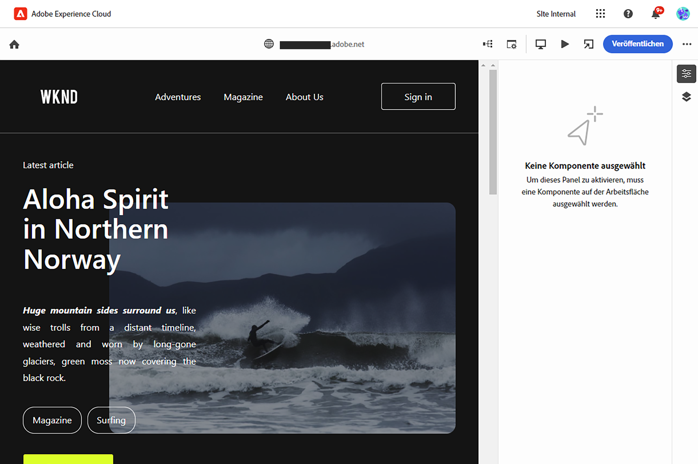
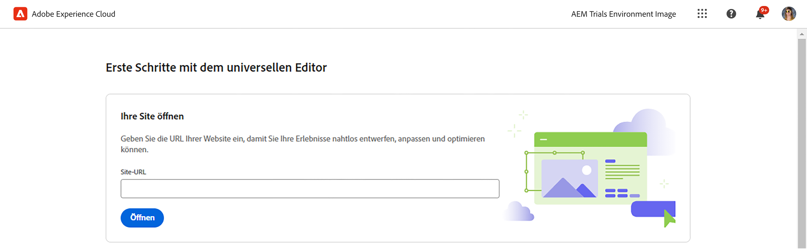
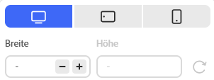
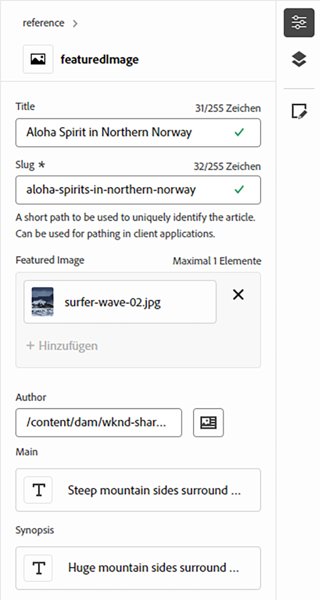
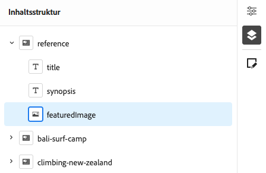

# Zugriff auf den und Navigation im universellen Editor {#navigating}

Erfahren Sie mehr über die Grundlagen des Zugriffs auf und der Navigation im universellen Editor.

## Einführung {#introduction}

Der universelle Editor ermöglicht die Bearbeitung beliebiger Inhalte in jeder Implementierung, um außergewöhnliche Erlebnisse bereitzustellen, die Inhaltsgeschwindigkeit zu erhöhen und ein modernes Entwicklererlebnis zu bieten.

Zu diesem Zweck bietet der universelle Editor Inhaltsautorinnen und Inhaltsautoren eine intuitive Benutzeroberfläche, die nur eine minimale Schulung erfordert, damit sie gleich loslegen und mit der Bearbeitung von Inhalten beginnen können. In diesem Dokument wird das Navigieren im universellen Editor beschrieben.

>[!TIP]
>
>* Weitere Informationen zum Verfassen mit dem universellen Editor finden Sie im Dokument [Inhaltserstellung mit dem universellen Editor](/help/sites-cloud/authoring/universal-editor/authoring.md).
>* Eine detailliertere Einführung in den universellen Editor finden Sie im Dokument [Einführung in den universellen Editor](/help/implementing/universal-editor/introduction.md).

## Vorbereiten der App {#prepare-app}

Um Inhalte für eine App mit dem universellen Editor erstellen zu können, muss die App von einer Entwicklerperson instrumentiert werden, um den Editor zu unterstützen.

>[!TIP]
>
>Im Dokument [Erste Schritte mit dem universellen Editor in AEM](/help/implementing/universal-editor/getting-started.md) finden Sie ein Beispiel dafür, wie Sie eine AEM-App für die Arbeit mit dem universellen Editor konfigurieren.

## Zugreifen auf den universellen Editor {#accessing}

Sobald die App für die Verwendung mit dem universellen Editor instrumentiert wurde, kann der universelle Editor sowohl in AEM as a Cloud Service als auch direkt ohne Zugriff auf AEM aufgerufen werden.

### Zugreifen in AEM as a Cloud Service {#accessing-aem}

1. Melden Sie sich bei Ihrer Authoring-Instanz in AEM as a Cloud Service an.
1. Verwenden Sie die [**Sites**-Konsole](/help/sites-cloud/authoring/sites-console/introduction.md), um zu der Seite zu navigieren, die für die Verwendung mit dem universellen Editor erstellt wurde und die Sie bearbeiten möchten.
1. Bearbeiten Sie die Seite.
1. Der universelle Editor wird geöffnet, um die ausgewählte Seite zu bearbeiten.

>[!NOTE]
>
>Beim Bearbeiten einer Seite in der [**Sites**-Konsole](/help/sites-cloud/authoring/sites-console/introduction.md) öffnet die Konsole den entsprechenden Editor gemäß der [Vorlage](/help/sites-cloud/authoring/page-editor/templates.md) der Seite: entweder den in diesem Dokument beschriebenen universellen Editor oder den [Seiteneditor](/help/sites-cloud/authoring/page-editor/introduction.md).

### Direktes Zugreifen {#accessing-directly}

1. Melden Sie sich beim universellen Editor an. Sie benötigen eine Adobe ID, um sich anzumelden und [Zugang zum universellen Editor zu erhalten](/help/implementing/universal-editor/getting-started.md#request-access).

1. Nachdem Sie sich angemeldet haben, geben Sie die URL der Seite, die Sie bearbeiten möchten, in die [Speicherortleiste](#location-bar) ein, damit Sie mit dem Bearbeiten von Inhalten wie Text- oder Medieninhalten beginnen können.

## Grundlegendes zur Benutzeroberfläche {#ui}

Die Benutzeroberfläche ist in diese Hauptbereiche unterteilt.

* [Die Kopfzeile von Experience Cloud](#experience-cloud-header)
* [Die Symbolleiste des universellen Editors](#universal-editor-toolbar)
* [Der Editor](#editor)
* [Das Bedienfeld „Eigenschaften“](#properties-rail)

>[!TIP]
>
>Der universelle Editor bietet eine Reihe von [Anpassungsoptionen](/help/implementing/universal-editor/customizing.md) und [Erweiterungspunkten](/help/implementing/universal-editor/extending.md), die die Funktionalität des Editors ändern und erweitern können. Aus diesem Grund werden möglicherweise andere Optionen angezeigt als die hier dokumentierten Standardoptionen.

### Die Kopfzeile von Experience Cloud {#experience-cloud-header}

Die Kopfzeile von Experience Cloud befindet sich immer oben im Bildschirm. Es handelt sich um einen Anker, der Ihnen mitteilt, wo Sie sich in Experience Cloud befinden, und Ihnen dabei hilft, zu anderen Experience Cloud-Apps zu navigieren.

#### Experience Manager {#experience-manager}

Wählen Sie links in der Kopfzeile den Adobe Experience Cloud-Link aus, um zum Stammverzeichnis Ihrer Experience Manager-Lösung zu navigieren und auf Tools wie [Cloud Manager](/help/onboarding/cloud-manager-introduction.md), [Cloud Acceleration Manager](/help/journey-migration/cloud-acceleration-manager/introduction/overview-cam.md) und [Software-Verteilung](https://experienceleague.adobe.com/docs/experience-cloud/software-distribution/home.html?lang=de) zuzugreifen.

#### Organisation {#organization}

Dadurch wird die Organisation angezeigt, bei der Sie sich derzeit angemeldet haben. Wählen Sie diese Option aus, um zu einer anderen Organisation zu wechseln, wenn Ihre Adobe ID mit mehreren Organisationen verknüpft ist.

#### Hilfezentrum {#help}

Das Symbol Hilfezentrum bietet schnellen Zugriff auf Lern- und Support-Ressourcen.

#### Benachrichtigungen {#notifications}

Dieses Symbol wird mit der Anzahl der aktuell zugewiesenen unvollständigen [Benachrichtigungen](/help/implementing/cloud-manager/notifications.md) gekennzeichnet.

#### Apps {#solutions}

Durch Tippen oder Klicken auf den Programmumschalter können Sie schnell zu anderen Experience Cloud-Lösungen wechseln.

#### Konto {#user-properties}

Wählen Sie das Symbol für Ihren Benutzer aus, um auf Ihre Kontoeinstellungen zuzugreifen. Wenn Sie kein Benutzerbild konfiguriert haben, wird ein zufälliges Symbol zugewiesen.

Durch Tippen oder Klicken auf das Kontosymbol wird ein Menü mit Ihren Benutzereinstellungen geöffnet. Diese Einstellungen gelten für Cloud Manager im Allgemeinen. Die Funktionen werden [&#x200B; dieser Dokumentation beschrieben](/help/implementing/cloud-manager/navigation.md)

Für den universellen Editor ([&#x200B; Sie über einen Vorschau-Service verfügen](/help/sites-cloud/authoring/sites-console/previewing-content.md) können Sie auch unter der Überschrift „Produkteinstellungen“ zwischen Ihrer Produktions- **der Vorschau-** wechseln.

### Die Symbolleiste des universellen Editors {#universal-editor-toolbar}

Die Symbolleiste des universellen Editors befindet sich immer oben im Bildschirm, direkt unter der [Kopfzeile von Experience Cloud](#experience-cloud-header). Dadurch erhalten Sie schnellen Zugriff auf eine andere Seite zum Bearbeiten und Veröffentlichen der aktuellen Seite.

Abhängig von der Konfiguration Ihres Programms kann es auch [zusätzliche Funktionen enthalten, die von Ihrer bzw. Ihrem Admin als Erweiterungen aktiviert wurden.](#additional-toolbar-buttons)

#### Die Schaltfläche „Startseite“ {#home-button}

Über die Schaltfläche „Startseite“ gelangen Sie wieder zur Startseite des universellen Editors

Auf der Startseite können Sie die URL der Site eingeben, die Sie mit dem universellen Editor bearbeiten möchten.

>[!NOTE]
>
>Jede Seite, die Sie mit dem universellen Editor bearbeiten möchten, muss [für die Unterstützung des universellen Editors instrumentiert sein](/help/implementing/universal-editor/getting-started.md).

Ein Abschnitt **Schnelllinks** enthält Hilferessourcen und ein Abschnitt **Zuletzt verwendet** enthält Links zu Seiten, die Sie kürzlich mit dem universellen Editor geöffnet haben.

#### Speicherortleiste {#location-bar}

Die Speicherortleiste zeigt die Adresse der Seite an, die Sie bearbeiten. Wählen Sie sie aus, um die Adresse einer anderen Seite einzugeben, die bearbeitet werden soll.

>[!TIP]
>
>Verwenden Sie den Hotkey `l` (Buchstabe I), um die Adressleiste zu öffnen.

>[!NOTE]
>
>Jede Seite, die Sie mit dem universellen Editor bearbeiten möchten, muss [für die Unterstützung des universellen Editors instrumentiert sein](/help/implementing/universal-editor/getting-started.md).

#### Rückgängig machen und wiederholen {#undo-redo}

Wählen Sie die Schaltflächen Rückgängig oder Wiederholen aus, um die letzte Bearbeitung im Editor rückgängig zu machen oder wiederherzustellen. Weitere Informationen finden Sie [&#x200B; Dokument „Inhaltserstellung mit &#x200B;](/help/sites-cloud/authoring/universal-editor/authoring.md#undo-redo) universellen Editor“.

>[!TIP]
>
>Verwenden Sie die Hotkey-`Command-Z` bzw. `Shift-Command-Z` zum Rückgängigmachen bzw. Wiederholen.

#### Authentifizierungs-Header {#authentication-settings}

Wählen Sie das Symbol Authentifizierungskopfzeilen , wenn Sie [eine benutzerdefinierte Authentifizierungskopfzeile für lokale Entwicklungszwecke festlegen](/help/implementing/universal-editor/developer-overview.md#auth-header).

#### Responsiver Modus {#emulator}

Wählen Sie das Symbol Responsive Modus aus, um zu definieren, wie der universelle Editor die Seite rendert.

Durch Tippen oder Klicken auf das Symbol für den responsiven Modus werden die Optionen angezeigt.

Standardmäßig wird der Editor im Desktop-Layout geöffnet, wobei Höhe und Breite automatisch vom Browser definiert werden.

Sie können auch ein Mobilgerät im universellen Editor emulieren:

* Ausrichtung definieren
* Breite und Höhe definieren
* Ändern der Ausrichtung

#### Vorschau {#preview-mode}

Im Vorschaumodus wird die Seite im Editor so gerendert, wie sie in Ihrem veröffentlichten Dienst angezeigt werden würde. Damit können Inhaltsautorinnen und Inhaltsautoren durch Klicken auf Links usw. durch den Inhalt navigieren.

>[!TIP]
>
>Verwenden Sie den Hotkey `p`, um in den Vorschaumodus zu wechseln.

#### Öffnen einer Seite {#open-page}

Wählen Sie das Symbol „Seite öffnen“ aus, um die Seite, die Sie gerade bearbeiten, auf einer eigenen Browser-Registerkarte zu öffnen (unabhängig vom Editor), um eine Vorschau Ihrer Inhalte anzuzeigen.

>[!TIP]
>
>Verwenden Sie den Hotkey `o` (Buchstabe O), um die App-Vorschau zu öffnen.

>[!TIP]
>
>Die Vorschau-URL für Ihre App [kann angepasst werden](/help/implementing/universal-editor/customizing.md#custom-preview-urls).

>[!NOTE]
>
>Die Schaltfläche „Seite öffnen“ [kann deaktiviert sein](/help/implementing/universal-editor/customizing.md#open-page) und wird daher möglicherweise nicht im Editor angezeigt.

#### Veröffentlichen {#publish}

Wählen Sie die Schaltfläche „Veröffentlichen“ aus, um die Änderungen am Inhalt für Ihre Leserinnen und Leser live oder zur Prüfung in einer Vorschauumgebung zu veröffentlichen.

>[!TIP]
>
>Weitere Informationen zur Veröffentlichung mit dem universellen Editor finden Sie im Dokument [Veröffentlichen von Inhalten mit dem universellen Editor](publishing.md).

>[!NOTE]
>
>Die Schaltfläche „Veröffentlichen“ [kann deaktiviert sein](/help/implementing/universal-editor/customizing.md#disable-publish) und wird daher möglicherweise nicht im Editor angezeigt.

#### Auslassungspunkte {#ellipsis}

Zusätzliche Standardoptionen sind über die Schaltfläche mit den Auslassungspunkten verfügbar.

Beispielsweise ist über die Schaltfläche mit den Auslassungspunkten die Möglichkeit verfügbar, die Veröffentlichung einer Seite (d. h. die Aktion der Schaltfläche [**Veröffentlichung**](#publish)) rückgängig zu machen.

#### Zusätzliche Schaltflächen {#additional-toolbar-buttons}

Der universelle Editor bietet ein anpassbares und erweiterbares Authoring-Erlebnis. Wenn zusätzliche Schaltflächen in der Symbolleiste angezeigt werden, wurde Ihr universeller Editor erweitert.

* Weitere Informationen zur Funktionsweise einer einzelnen Erweiterung [finden Sie in der Dokumentation zum Authoring im universellen Editor](/help/sites-cloud/authoring/universal-editor/authoring.md#toolbar-options).
* Weitere Informationen zu den Erweiterungsmöglichkeiten finden Sie unter [Erweitern des universellen Editors](/help/implementing/universal-editor/extending.md).
* Weitere Informationen zum Installieren einer einzelnen Erweiterung finden Sie in der [Dokumentation zu Extension Manager](https://developer.adobe.com/uix/docs/extension-manager/extension-developed-by-adobe/).

### Der Editor {#editor}

Der Editor nimmt den größten Teil des Fensters ein und ist der Ort, an dem die in der [Speicherortleiste](#location-bar) angegebene Seite gerendert wird.

Wenn sich der Editor im [Vorschaumodus](#preview-mode) befindet, können Sie durch den Inhalt navigieren und Links folgen, aber den Inhalt nicht bearbeiten.

### Bedienfeld „Eigenschaften“ {#properties-rail}

Das Bedienfeld „Eigenschaften“ befindet sich immer auf der rechten Seite des Editors. Je nach Modus können Details zu einer im Inhalt ausgewählten Komponente oder aber die Hierarchie der Seiteninhalte angezeigt werden.

Abhängig von der Konfiguration Ihres Programms kann es auch [zusätzliche Funktionen enthalten, die von Ihrer bzw. Ihrem Admin als Erweiterungen aktiviert wurden.](#additional-properties-panel-buttons)

#### Eigenschaftenmodus {#properties-mode}

Im Eigenschaftenmodus zeigt das Bedienfeld die Eigenschaften der aktuell im Editor ausgewählten Komponente an. Dies ist der Standardmodus des Bedienfelds „Eigenschaften“, wenn eine Seite geladen wird.

Je nach ausgewähltem Komponententyp können im Bedienfeld „Eigenschaften“ Details angezeigt und geändert werden.

Beachten Sie, dass nicht alle Komponenten Details aufweisen, die angezeigt und/oder bearbeitet werden können.

>[!TIP]
>
>Verwenden Sie den Hotkey `d`, um in den Eigenschaftenmodus zu wechseln.

#### Inhaltsstruktur-Modus {#content-tree-mode}

Im Inhaltsstruktur-Modus zeigt das Bedienfeld die Hierarchie des Seiteninhalts an.

* Bei der Auswahl eines Elements in der Inhaltsstruktur scrollt der Editor zu diesem Inhalt und wählt ihn aus.
* Bei Doppelklicken auf ein Element in der Inhaltsstruktur scrollt der Editor zu diesem Inhalt, wählt ihn aus und öffnet auch die zugehörigen Eigenschaften im [Eigenschaftenmodus](#properties-mode).

>[!TIP]
>
>Verwenden Sie den Hotkey `f`, um in den Inhaltsstruktur-Modus zu wechseln.

##### Im CF-Editor öffnen {#edit}

Bei der Bearbeitung werden die Optionen für die ausgewählte Komponente im Bedienfeld „Eigenschaften“ angezeigt, in dem Sie die ausgewählte Komponente bearbeiten können. Wenn es sich bei der ausgewählten Komponente um ein Inhaltsfragment handelt, können Sie auch die Schaltfläche **Im CF-Editor öffnen** auswählen.

Durch Tippen oder Klicken auf die Schaltfläche **Im CF-Editor öffnen** wird der [Inhaltsfragmenteditor](/help/assets/content-fragments/content-fragments-managing.md#opening-the-fragment-editor) in einer neuen Registerkarte geöffnet. Dadurch können Sie auf die volle Leistungsfähigkeit des Inhaltsfragmenteditors zugreifen, um das zugehörige Inhaltsfragment zu bearbeiten.

Je nach den Anforderungen Ihres Workflows können Sie das Inhaltsfragment im universellen Editor oder direkt im Inhaltsfragmenteditor bearbeiten.

>[!TIP]
>
>Verwenden Sie den Hotkey `e`, um ein ausgewähltes Inhaltsfragment im Inhaltsfragmenteditor zu öffnen.

##### Hinzufügen {#add}

Wenn Sie eine Container-Komponente in der Inhaltsstruktur oder im Editor auswählen, wird im Bedienfeld „Eigenschaften“ die Option zum Hinzufügen angezeigt.

Durch Tippen oder Klicken auf die Schaltfläche „Hinzufügen“ wird ein Dropdown-Menü mit Komponenten geöffnet, die [zum ausgewählten Container hinzugefügt](/help/sites-cloud/authoring/universal-editor/authoring.md#adding-components) werden können.

>[!TIP]
>
>Verwenden Sie den Hotkey `a`, um eine Komponente zu einer ausgewählten Container-Komponente hinzuzufügen.

##### Duplizieren {#duplicate}

Wenn Sie eine Komponente innerhalb einer Container-Komponente in der Inhaltsstruktur oder im Editor auswählen, wird im Bedienfeld „Eigenschaften“ die Option zum Duplizieren angezeigt.

Durch Tippen oder Klicken auf die Schaltfläche „Duplizieren“ [wird die ausgewählte Komponente dupliziert](/help/sites-cloud/authoring/universal-editor/authoring.md#duplicating-components).

##### Löschen {#delete}

Wenn Sie eine Komponente innerhalb einer Container-Komponente in der Inhaltsstruktur oder im Editor auswählen, wird im Bedienfeld „Eigenschaften“ die Löschoption angezeigt.

Durch Tippen oder Klicken auf die Schaltfläche „Löschen“ [wird die Komponente gelöscht](/help/sites-cloud/authoring/universal-editor/authoring.md#deleting-components).

>[!TIP]
>
>Verwenden Sie den Hotkey `Shift+Backspace`, um eine ausgewählte Komponente aus einem Container zu löschen.

##### Kopieren und Einfügen {#copy-paste}

Sie können Komponenten kopieren und einfügen, die sich in [Containern.](/help/implementing/universal-editor/field-types.md#container)

>[!TIP]
>
>Verwenden Sie den Hotkey-`Command-C` bzw. die `Command-V` zum Kopieren bzw. Einfügen.

Weitere Informationen finden Sie [&#x200B; Dokument „Inhaltserstellung mit &#x200B;](/help/sites-cloud/authoring/universal-editor/authoring.md#copy-paste) universellen Editor“.

#### Zusätzliche Schaltflächen {#additional-properties-panel-buttons}

Der universelle Editor bietet ein anpassbares und erweiterbares Authoring-Erlebnis. Wenn Sie im Bedienfeld „Eigenschaften“ weitere Schaltflächen finden, wurde Ihr universeller Editor erweitert.

* Weitere Informationen zur Funktionsweise einer einzelnen Erweiterung [finden Sie in der Dokumentation zum Authoring im universellen Editor](/help/sites-cloud/authoring/universal-editor/authoring.md#properties-panel-options).
* Weitere Informationen zu den Erweiterungsmöglichkeiten finden Sie unter [Erweitern des universellen Editors](/help/implementing/universal-editor/extending.md).
* Weitere Informationen zum Installieren einer einzelnen Erweiterung finden Sie in der [Dokumentation zu Extension Manager](https://developer.adobe.com/uix/docs/extension-manager/extension-developed-by-adobe/).

## Nächste Schritte {#next-steps}

Nachdem Sie nun wissen, wie Sie auf den universellen Editor zugreifen und darin navigieren können, [können Sie damit Inhalte erstellen](/help/sites-cloud/authoring/universal-editor/authoring.md).
