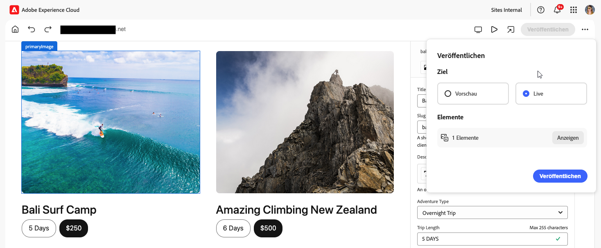

# Veröffentlichen von Inhalten mit dem universellen Editor {#publishing}

Erfahren Sie, wie Inhalte mit dem universellen Editor veröffentlicht werden und wie Ihre Apps mit den veröffentlichten Inhalten umgehen können.

>[!TIP]
>
>Der hier beschriebene Veröffentlichungsprozess ist die standardmäßige vordefinierte Funktion des universellen Editors.
>
>Der universelle Editor unterstützt auch [Erweiterungen und die Erweiterbarkeit der Benutzeroberfläche](/help/implementing/universal-editor/extending.md), damit Workflows Ihren Veröffentlichungsprozess unterstützen können, sodass Ihr Veröffentlichungsablauf variieren kann.

## Veröffentlichen von Inhalten aus dem universellen Editor {#publishing-content}

Wenn Sie nach dem Erstellen von Inhalten bereit sind, Ihre Inhalte zu veröffentlichen, brauchen Sie einfach nur auf das Symbol **Veröffentlichen** auf der Symbolleiste des universellen Editors zu tippen oder klicken.

1. Tippen oder klicken Sie im universellen Editor auf das [Symbol **Veröffentlichen** auf der Symbolleiste des universellen Editors](/help/sites-cloud/authoring/universal-editor/navigation.md#publish).
1. Wenn ein [Vorschau-Service](/help/sites-cloud/authoring/sites-console/previewing-content.md) verfügbar ist, können Sie auswählen, wo Sie Ihre Inhalte veröffentlichen möchten, entweder als **Vorschau** oder zum **Veröffentlichen**.
1. Im Abschnitt **Elemente** werden die Inhalte aufgelistet, die in der Veröffentlichung enthalten sind, einschließlich der folgenden:
   * **Neue** Elemente, die noch nicht veröffentlicht wurden.
   * **Geänderte** Inhalte, die veröffentlicht, aber seit der letzten Veröffentlichung geändert wurden.
   * **Veröffentlichte** Inhalte, die veröffentlicht und seit dieser Veröffentlichung nicht geändert wurden.

   Tippen oder klicken Sie auf die Kontrollkästchen neben den Elementen, um sie nach Bedarf in die Veröffentlichung ein- bzw. von ihr auszuschließen. Tippen oder klicken Sie auf **Erweitern**, um die einzelnen Elemente anzuzeigen, die in den Elementen dieser drei Kategorien enthalten sind, und um sie einzeln ein- oder ausschließen zu können.

   

   Tippen oder klicken Sie auf den Pfeil nach links neben der Überschrift **Elemente**, um zur Übersicht zurückzukehren.

1. Tippen oder klicken Sie auf **Veröffentlichen**, um zu veröffentlichen, oder auf **Abbrechen**, um den Vorgang abzubrechen.

## Aufheben der Veröffentlichung von Inhalten mit dem universellen Editor {#unpublishing-content}

Das Aufheben der Veröffentlichung von Inhalten funktioniert ähnlich wie das Veröffentlichen von Inhalten. Wenn Sie bereit sind, Inhalte aus der Veröffentlichung zu entfernen, tippen oder klicken Sie auf das Symbol mit den Auslassungspunkten auf der Symbolleiste des universellen Editors und dann auf **Veröffentlichung aufheben**.

Dann haben Sie dieselben Optionen zum Aufheben der Veröffentlichung von Inhalten wie beim [Veröffentlichen von Inhalten.](#publishing-content) Dazu gehört auch das Aufheben der Veröffentlichung über eine Vorschauinstanz, falls verfügbar, und das Festlegen der Elemente, die in das Aufheben der Veröffentlichung eingeschlossen werden sollen.

## Veröffentlichen und Aufheben der Veröffentlichung über die Sites-Konsole {#publishing-sites-console}

Sie können Inhalte auch [über die Sites-Konsole](/help/sites-cloud/authoring/sites-console/publishing-pages.md) veröffentlichen. Dies kann nützlich sein, wenn Sie mehrere Inhaltsseiten veröffentlichen oder die Veröffentlichung bzw. das Aufheben der Veröffentlichung planen möchten.

## Ähnlichkeiten mit dem Seiteneditor {#similarities}

Für Benutzende des [AEM-Seiteneditors](/help/sites-cloud/authoring/page-editor/introduction.md) funktioniert der Prozess zum Veröffentlichen von Inhalten mit dem universellen Editor wie gewohnt: Bei der Veröffentlichung in AEM wird der Inhalt von der Autorenebene in die Veröffentlichungsebene repliziert.

## Unterschiede {#differences}

Was die Veröffentlichung mit dem universellen Editor geringfügig unterscheidet, ist nicht so sehr der Editor selbst, sondern vielmehr das externe Hosten der App, was durch den universellen Editor möglich gemacht wird.

Wenn die Web-App extern gehostet wird, muss sichergestellt werden, dass Inhalte von der Autorenebene geladen werden, wenn die App von Autorinnen oder Autoren im Editor geöffnet wird, und dass sie von der Veröffentlichungsebene geladen werden, wenn Besuchende auf die App zugreifen.

## Erkennen der Ebene in der App {#detecting}

Um zu bestimmen, ob auf die Autoren- oder Veröffentlichungsebene zugegriffen werden soll, können Sie durch eine einfache bedingte Anweisung in der App festlegen, dass der entsprechende Autoren- oder Veröffentlichungsendpunkt ausgewählt wird, wenn festgestellt wird, dass der Endpunkt im Editor geöffnet wird.

Eine andere Möglichkeit besteht darin, die App in zwei verschiedenen Umgebungen bereitzustellen, die unterschiedlich konfiguriert sind, sodass eine Umgebung ihren Inhalt von der Autorenebene und die andere Umgebung ihn von der Veröffentlichungsebene abruft. Damit Autorinnen und Autoren die veröffentlichte URL im universellen Editor öffnen können, kann ein kleines Skript erstellt werden, um die URL auf der Veröffentlichungsseite in die entsprechende URL in der Autorenumgebung zu „konvertieren“ (z. B. durch Voranstellen einer `author`-Sub-Domain), sodass die Autorinnen und Autoren automatisch umgeleitet werden.

## Zusammenfassung {#summary}

Ziel des universellen Editors ist es, kein bestimmtes Muster vorzuschreiben, damit die Implementierung ihre Ziele am besten vollständig entkoppelt erreichen kann und dabei alles für die Implementierung einfach und unkompliziert bleibt.

Gleichermaßen stellt der universelle Editor keine Anforderungen daran, wie ein bestimmtes Projekt die Bestimmung der Ebene durchführt, von der der Inhalt bereitgestellt werden soll. Stattdessen bietet er verschiedene Möglichkeiten und ermöglicht es dem Projekt, zu bestimmen, welche Lösung für seine eigenen Anforderungen am besten geeignet ist.

## Zusätzliche Ressourcen {#additional-resources}

Informationen zum Erstellen von Inhalten mit dem universellen Editor finden Sie in diesem Dokument.

* [Inhaltserstellung mit dem universellen Editor](authoring.md) – Erfahren Sie, wie einfach und intuitiv es für Inhaltsautorinnen und Inhaltsautoren ist, Inhalte mit dem universellen Editor zu erstellen.

Weitere Informationen zu den technischen Details zum universellen Editor finden Sie in diesen Entwicklerdokumenten.

* [Einführung in den universellen Editor](/help/implementing/universal-editor/introduction.md) – Erfahren Sie, wie der universelle Editor die Bearbeitung beliebiger Inhalte in jeder Implementierung ermöglicht, um außergewöhnliche Erlebnisse bereitzustellen, die Inhaltsgeschwindigkeit zu erhöhen und ein modernes Entwicklererlebnis zu bieten.
* [Erste Schritte mit dem universellen Editor in AEM](/help/implementing/universal-editor/getting-started.md) – Erfahren Sie, wie Sie Zugriff auf den universellen Editor erhalten und wie Sie mit der Instrumentierung Ihrer ersten AEM-App beginnen, um ihn zu verwenden.
* [Architektur des universellen Editors](/help/implementing/universal-editor/architecture.md) – Erfahren Sie mehr über die Architektur des universellen Editors und darüber, wie Daten zwischen seinen Diensten und Ebenen fließen.
* [Attribute und Typen](/help/implementing/universal-editor/attributes-types.md) – Erfahren Sie mehr über die Datenattribute und -typen, die der universelle Editor erfordert.
* [Authentifizierung beim universellen Editor](/help/implementing/universal-editor/authentication.md) – Erfahren Sie, wie beim universellen Editor authentifiziert wird.
