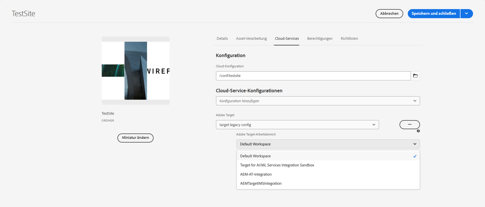

# Exportieren von Inhaltsfragmenten nach Adobe Target {#exporting-content-fragments-to-adobe-target}

>[!CAUTION]
>
>AEM muss gemäß den Anweisungen unter [Integration mit Adobe Target](/help/sites-cloud/integrating/integrating-adobe-target.md) mit Adobe Target integriert werden.

Sie können [Inhaltsfragmente](/help/sites-cloud/authoring/fragments/content-fragments.md), die in Adobe Experience Manager as a Cloud Service (AEM) erstellt wurden, nach Adobe Target (Target) exportieren. Diese können dann als Angebote in Target-Aktivitäten verwendet werden, um Erlebnisse in großem Maßstab zu testen und zu personalisieren.

Es gibt die Option zum Exportieren eines Inhaltsfragments nach Adobe Target:

* JSON: Unterstützung der Headless-Inhaltsbereitstellung

<!-- * GraphQL query ??? -->

Um Ihre Instanz für den Export von AEM-Inhaltsfragmenten nach Adobe Target vorzubereiten, müssen Sie Folgendes tun:

* [Integrieren mit Adobe Target](/help/sites-cloud/integrating/integrating-adobe-target.md)
* [Hinzufügen der Cloud-Konfiguration](#add-the-cloud-configuration)
* [Hinzufügen der Legacy-Konfiguration](#add-the-legacy-configuration)

Danach können Sie:

* [Exportieren eines Inhaltsfragments nach Adobe Target](#exporting-a-content-fragment-to-adobe-target)
* [Verwenden Ihrer Inhaltsfragmente in Adobe Target](#using-your-content-fragments-in-adobe-target)
* Und auch [Löschen eines bereits nach Adobe Target exportierten Inhaltsfragments](#deleting-a-content-fragment-already-exported-to-adobe-target)

Inhaltsfragmente können in den Standardarbeitsbereich in Adobe Target oder in benutzerdefinierte Arbeitsbereiche für Adobe Target exportiert werden.

>[!NOTE]
>
>Die Adobe Target-Arbeitsbereiche sind nicht in Adobe Target selbst vorhanden. Sie werden in Adobe IMS (Identity Management System) definiert und verwaltet und dann zur lösungsübergreifenden Verwendung mithilfe der Adobe-Entwicklerkonsole ausgewählt.

>[!NOTE]
>
>Adobe Target-Arbeitsbereiche können verwendet werden, um es Mitgliedern einer Organisation (Gruppe) zu ermöglichen, Angebote und Aktivitäten nur für diese Organisation zu erstellen und zu verwalten, ohne anderen Benutzern Zugriff zu gewähren. Zum Beispiel länderspezifische Organisationen innerhalb eines globalen Konzerns.

## Voraussetzungen {#prerequisites}

Die folgende Aktion ist erforderlich:

1. Sie müssen [AEM mit Adobe Target integrieren](/help/sites-cloud/integrating/integrating-adobe-target.md).

<!-- link rewriter - targets in content-fragments-customizing do not exist yet

1. Content Fragments are exported from the AEM author instance, so you need to [Configure the AEM Link Externalizer](/help/implementing/developing/extending/content-fragments-customizing.md#configuring-the-aem-link-externalizer) on the author instance to ensure that any references within the Content Fragment are externalized for web delivery.

   >[!NOTE]
   >
   >For link rewriting not covered by the default, the [Content Fragment Link Rewriter Provider](/help/implementing/developing/extending/content-fragments-customizing.md#the-content-fragment-link-rewriter-provider-html) is available. With this, customized rules can be developed for your instance.
-->

## Hinzufügen der Cloud-Konfiguration {#add-the-cloud-configuration}

Bevor Sie ein Fragment exportieren, müssen Sie die **Cloud-Konfiguration** für **Adobe Target** zum Fragment oder Ordner hinzufügen. Dies ermöglicht Ihnen auch:

* die für den Export zu verwendenden Formatoptionen anzugeben
* einen Target-Arbeitsbereich als Ziel auszuwählen

Die erforderlichen Optionen können in den **Eigenschaften** des erforderlichen Ordners ausgewählt werden. Die Spezifikation wird nach Bedarf vererbt.

1. Navigieren Sie zur **Assets**-Konsole.

1. Öffnen Sie die **Eigenschaften** für den entsprechenden Ordner.

   >[!NOTE]
   >
   >Wenn Sie die Cloud-Konfiguration zum übergeordneten Ordner des Inhaltsfragments hinzufügen, wird die Konfiguration von allen untergeordneten Elementen übernommen.

1. Wählen Sie die Registerkarte **Cloud-Services** aus.

1. Wählen Sie unter **Cloud-Service-Konfiguration** in der Dropdown-Liste Ihre Zielkonfiguration.

1. Wählen Sie Ihren Adobe Target-Arbeitsbereich aus.

   Beispiel:

   

1. **Speichern und schließen**.

## Hinzufügen der Legacy-Konfiguration {#add-the-legacy-configuration}

<!-- This is effectively the Manually Integrating with Adobe Target {#manually-integrating-with-adobe-target} section from 6.5 -->

>[!IMPORTANT]
>
>Das Hinzufügen einer neuen Legacy-Konfiguration ist ein Sonderszenario, das nur für den Export von Inhaltsfragmenten unterstützt wird.

Nachdem Sie [die Cloud-Konfiguration für die Verwendung von Experience Platform Launch hinzugefügt](#add-the-cloud-configuration) haben, müssen Sie die Integration von AEM mit Adobe Target auch manuell mit einer Legacy-Konfiguration durchführen.

### Erstellen einer Target-Cloud-Konfiguration {#creating-a-target-cloud-configuration}

Um AEM die Interaktion mit Adobe Target zu ermöglichen, erstellen Sie eine Target-Cloud-Konfiguration. Um die Konfiguration zu erstellen, geben Sie den Adobe Target-Clientcode und die Benutzeranmeldeinformationen an.

Sie erstellen die Target-Cloud-Konfiguration nur einmal, da Sie die Konfiguration mit mehreren AEM-Kampagnen verknüpfen können. Wenn Sie mehrere Adobe Target-Clientcodes haben, erstellen Sie für jeden Clientcode eine Konfiguration.

Sie können die Cloud-Konfiguration so konfigurieren, dass Segmente aus Adobe Target synchronisiert werden. Wenn Sie die Synchronisierung aktivieren, werden Segmente im Hintergrund aus Target importiert, sobald die Cloud-Konfiguration gespeichert wurde.

Gehen Sie wie folgt vor, um eine Target-Cloud-Konfiguration in AEM zu erstellen:

1. Gehen Sie zu **Legacy Cloud Services**: Über **das AEM-Logo** > **Tools** > **Cloud-Services** zu **Legacy Cloud Services**.
Beispiel: ([http://localhost:4502/libs/cq/core/content/tools/cloudservices.html](http://localhost:4502/libs/cq/core/content/tools/cloudservices.html))

   Die Übersichtsseite **Adobe Experience Cloud** wird geöffnet.

1. Klicken Sie im Abschnitt **Adobe Target** auf **Jetzt konfigurieren**.
1. Im Dialogfeld **Konfiguration erstellen**:

   1. Geben Sie der Konfiguration einen **Titel**.
   1. Wählen Sie die Vorlage **Adobe Target-Konfiguration** aus.
   1. Klicken Sie auf **Erstellen**.

Sie können jetzt die neue Konfiguration zur Bearbeitung auswählen.

1. Das Dialogfeld „Bearbeiten“ wird geöffnet.

   

   <!-- Can this still occur?

   >[!NOTE]
   >
   >When configuring A4T with AEM, you may see a Configuration reference missing entry. To be able to select the analytics framework, do the following:
   >
   >1. Navigate to **Tools** &gt; **General** &gt; **CRXDE Lite**.
   >1. Navigate to **/libs/cq/analytics/components/testandtargetpage/dialog/items/tabs/items/tab1_general/items/a4tAnalyticsConfig**
   >1. Set the property **disable** to **false**.
   >1. Select **Save All**.

   -->

1. Geben Sie im Dialogfeld **Adobe Target-Einstellungen** Werte für diese Eigenschaften an.

   * **Authentifizierung**: dies ist standardmäßig IMS (Benutzeranmeldedaten werden nicht mehr unterstützt)

   * **Client-Code**: Der Client-Code des Target-Kontos

   * **Mandanten-ID**: die Mandanten-ID

   * **IMS-Konfiguration**: Wählen Sie die gewünschte Konfiguration aus der Dropdown-Liste aus

   * **API-Typ**: standardmäßig auf REST gesetzt (XML ist veraltet)

   * **A4T-Analytics-Cloud-Konfiguration**: Wählen Sie die Analyse-Cloud-Konfiguration aus, die für Target-Aktivitätsziele und -metriken verwendet wird. Sie benötigen sie, wenn Sie Adobe Analytics als Quelle für das Reporting für bestimmte Inhalte verwenden.

     <!-- Is this needed?
     If you do not see your cloud configuration, see note in [Configuring A4T Analytics Cloud Configuration](#configuring-a-t-analytics-cloud-configuration).
     -->

   * **Präzises Targeting verwenden**: Dieses Kontrollkästchen ist standardmäßig aktiviert. Wenn diese Option aktiviert ist, wartet die Cloud-Service-Konfiguration auf das Laden des Kontexts, bevor der Inhalt geladen wird. Siehe folgenden Hinweis.

   * **Segmente aus Adobe Target synchronisieren**: Aktivieren Sie diese Option, um in Target definierte Segmente herunterzuladen und in AEM zu verwenden. Wählen Sie diese Option aus, wenn die Eigenschaft „API-Typ“ auf „REST“ festgelegt ist, da Inline-Segmente nicht unterstützt werden und Sie immer Segmente aus Target verwenden müssen. (Der AEM-Begriff „Segment“ ist gleichbedeutend mit dem Target-Begriff „Zielgruppe“.)

   * **Client-Bibliothek:** dies ist standardmäßig AT.js (mbox.js wird nicht mehr unterstützt)

     >[!NOTE]
     >
     >Die Target-Bibliotheksdatei [AT.js](https://experienceleague.adobe.com/docs/target-dev/developer/client-side/at-js-implementation/at-js/how-atjs-works.html?lang=de) ist die neue Implementierungsbibliothek für Adobe Target. Sie ist sowohl auf typische Web-Implementierungen als auch auf Einzelseitenanwendungen ausgelegt.
     >
     >mbox.js ist veraltet und wird zu einem späteren Zeitpunkt entfernt.
     >
     >Adobe empfiehlt die Verwendung von „AT.js“ anstelle von „mbox.js“ als Client-Bibliothek.
     >
     >„AT.js“ bietet gegenüber der Bibliothek von „mbox.js“ verschiedene Verbesserungen:
     >
     >* Verbesserte Seitenladezeiten für Web-Implementierungen
     >* Verbesserte Sicherheit
     >* Bessere Implementierungsoptionen für Single Page Applications (SPA)
     >* „at.js“ enthält die Komponenten, die in „target.js“ enthalten waren, weshalb kein Aufruf mehr an „target.js“ erfolgt
     >
     >Sie können im Dropdown-Menü **Client-Bibliothek** die Datei „AT.js“ oder „mbox.js“ auswählen.

   * **Verwenden des Tag Management Systems zur Bereitstellung der Client-Bibliothek**: Wählen Sie diese Option, um die Client-Bibliothek aus Adobe Launch oder einem anderen Tag-Management-System (oder DTM, das nicht mehr unterstützt wird) zu verwenden.

   * **Benutzerdefinierte AT.js**: Durchsuchen, um Ihre benutzerdefinierte AT.js-Datei hochzuladen. Lassen Sie das Feld leer, um die Standardbibliothek zu verwenden.

     >[!NOTE]
     >
     >Wenn Sie den Opt-in für den Adobe Target-Konfigurationsassistenten durchführen, wird die „präzise Zielgruppenerfassung“ aktiviert.
     >
     >Präzise Zielgruppenerfassung bedeutet, dass für die Cloud Service-Konfiguration gewartet wird, bis das Laden des Kontexts erfolgt ist, bevor der Inhalt geladen wird. Aus diesem Grund kann hinsichtlich der Leistung eine präzise Zielgruppenbestimmung eine Verzögerung von einigen Millisekunden verursachen, bevor das Laden des Inhalts erfolgt.
     >
     >Die präzise Zielgruppenerfassung ist auf der Autoreninstanz immer aktiviert. In der Veröffentlichungsinstanz können Sie die präzise Zielgruppenerfassung aber global deaktivieren, indem Sie in der Cloud-Service-Konfiguration das Häkchen neben „Präzise Zielgruppenerfassung“ entfernen (**http://localhost:4502/etc/cloudservices.html**). Sie können die präzise Zielgruppenerfassung auch für einzelne Komponenten aktivieren und deaktivieren, unabhängig von Ihrer Einstellung in der Cloud-Service-Konfiguration.
     >
     >Wenn Sie ***bereits*** Zielkomponenten erstellt haben und Sie diese Einstellung ändern, wirken sich Ihre Änderungen nicht auf diese Komponenten aus. Sie müssen alle Änderungen an diesen Komponenten direkt vornehmen.

1. Klicken Sie auf **Mit Adobe Target verbinden**, um die Verbindung mit Target zu initialisieren. Wenn die Verbindungsherstellung erfolgreich war, wird die Meldung **Die Verbindung wurde hergestellt** angezeigt. Klicken Sie auf **OK** und dann auf **OK.**

### Hinzufügen eines Target-Frameworks {#adding-a-target-framework}

<!-- Is this section needed? -->

Nachdem Sie die Target-Cloud-Konfiguration konfiguriert haben, fügen Sie ein Target-Framework hinzu. Das Framework bestimmt die Standardparameter, die von den verfügbaren [ContextHub](/help/implementing/developing/personalization/configuring-contexthub.md)-Komponenten an Adobe Target gesendet werden. Target nutzt die Parameter, um die Segmente zu ermitteln, die für den aktuellen Kontext gelten.

Sie können mehrere Frameworks für eine einzelne Target-Konfiguration erstellen. Mehrere Frameworks sind nützlich, wenn Sie für unterschiedliche Abschnitte Ihrer Website jeweils einen anderen Parametersatz an Target senden müssen. Erstellen Sie ein Framework für jeden Parametersatz, der gesendet werden muss. Verknüpfen Sie jeden Bereich Ihrer Website mit dem entsprechenden Framework. Beachten Sie, dass für eine Webseite nur jeweils ein Framework verwendet werden kann.

1. Klicken Sie auf der Seite für die Target-Konfiguration auf das Pluszeichen (**+**) neben „Verfügbare Konfigurationen“.

1. Geben Sie im Dialogfeld „Framework erstellen“ einen **Titel** an, wählen Sie die Option **Adobe Target-Framework** und klicken Sie auf **Erstellen**.

   <!--  -->

   Die Framework-Seite wird geöffnet. Sidekick bietet Komponenten mit Informationen zu dem [ContextHub](/help/implementing/developing/personalization/configuring-contexthub.md), den Sie zuordnen können.

   <!--  -->

1. Ziehen Sie die ClientContext-Komponente mit den Daten, die Sie für die Zuordnung nutzen möchten, auf das Ablageziel. Alternativ hierzu können Sie die **ContextHub-Store**-Komponente auf das Framework ziehen.

   >[!NOTE]
   >
   >Bei der Zuordnung werden Parameter über einfache Zeichenfolgen an eine mBox übergeben. Es ist nicht möglich, Arrays aus ContextHub zuzuordnen.

   Ziehen Sie beispielsweise die Komponente **Profildaten** auf die Seite, um **Profildaten** zu Ihren Websitebesuchern zum Steuern Ihrer Target-Kampagne zu verwenden. Es werden die Profildatenvariablen angezeigt, die für die Zuordnung zu Target-Parametern verfügbar sind.

   <!--  -->

1. Wählen Sie die Variablen aus, die für das Adobe Target-System sichtbar sein sollen, indem Sie das Kontrollkästchen **Freigeben** in den entsprechenden Spalten auswählen.

   <!--  -->

   >[!NOTE]
   >
   >Das Synchronisieren von Parametern erfolgt nur in eine Richtung, nämlich von AEM zu Adobe Target.

Ihr Framework wird erstellt. Um das Framework auf der Veröffentlichungsinstanz zu replizieren, verwenden Sie die Option **Framework aktivieren** aus dem Sidekick.

<!--
### Associating Activities With the Target Cloud Configuration  {#associating-activities-with-the-target-cloud-configuration}

Associate your [AEM activities](/help/sites-cloud/authoring/personalization/activities.md) with your Target cloud configuration so that you can mirror the activities in [Adobe Target](https://experienceleague.adobe.com/docs/target/using/experiences/offers/manage-content.html).

>[!NOTE]
>
>What types of activities are available is determined by the following:
>
>* If the **xt_only** option is enabled on the Adobe Target tenant (clientcode) used on the AEM side to connect to Adobe Target, then you can create **only** XT activities in AEM.
>
>* If the **xt_only** options is **not** enabled on the Adobe Target tenant (clientcode), then you can create **both** XT and A/B activities in AEM.
>
>**Additional note:** **xt_only** options is a setting applied on a certain Target tenant (clientcode) and can only be modified directly in Adobe Target. You cannot enable or disable this option in AEM.
-->

<!--
### Associating the Target Framework With Your Site {#associating-the-target-framework-with-your-site}

After you create a Target framework in AEM, associate your web pages with the framework. The targeted components on the pages send the framework-defined data to Adobe Target for tracking. (See [Content Targeting](/help/sites-cloud/authoring/personalization/targeted-content.md).)

When you associate a page with the framework, the child pages inherit the association.

1. In the **Sites** console, navigate to the site that you want to configure.
1. Using either [quick actions](/help/sites-cloud/authoring/basic-handling.md#quick-actions) or [selection mode](/help/sites-cloud/authoring/basic-handling.md#selecting-resources), select **View Properties.**
1. Select the **Cloud Services** tab.
1. Select **Edit**.
1. Select **Add Configuration** under **Cloud Service Configurations** and select **Adobe Target**.

  

1. Select the framework you want under **Configuration Reference**.

   >[!NOTE]
   >
   >Make sure that you select the specific **framework** that you created and not the Target cloud configuration under which it was created.

1. Select **Done**.
1. Activate the root page of the website to replicate it to the publish server. (See [How To Publish Pages](/help/sites-cloud/authoring/sites-console/publishing-pages.md).)

   >[!NOTE]
   >
   >If the framework you attached to the page was not activated yet, a wizard opens which lets you publish it as well.
-->

## Exportieren eines Inhaltsfragments nach Adobe Target {#exporting-a-content-fragment-to-adobe-target}

>[!CAUTION]
>
>Für Medien-Assets wie Bilder wird nur ein Verweis nach Target exportiert. Das Asset selbst bleibt in AEM Assets gespeichert und wird von der AEM-Veröffentlichungsinstanz bereitgestellt.
>
>Deshalb muss das Inhaltsfragment mit allen zugehörigen Assets veröffentlicht werden, bevor es nach Target exportiert wird.

So exportieren Sie ein Inhaltsfragment aus AEM in Target (nach Angabe der Cloud-Konfiguration):

1. Navigieren Sie zu Ihrem Inhaltsfragment in der **Assets**-Konsole.
1. Wählen Sie das Inhaltsfragment aus, das Sie in die Zielgruppe exportieren möchten.

1. Wählen Sie **Nach Adobe Target-Angebote exportieren** aus.

   

   <!-- this note does not seem to be accurate for CFs -->

   <!--
   
   >[!NOTE]
   >
   >If the Content Fragment has already been exported, select **Update in Adobe Target**.
   
   -->

1. Wählen Sie **Exportieren ohne Veröffentlichung** bzw. **Veröffentlichen** aus.

   >[!NOTE]
   >
   >Welche Aktionen tatsächlich angezeigt werden, hängt vom Status Ihres Fragments und der zugehörigen Assets ab.
   >
   >Wenn alles bereits veröffentlicht wurde und seitdem nichts mehr geändert wurde, wird dieser Schritt übersprungen.

   >[!NOTE]
   >
   >Wenn Sie **Veröffentlichen** auswählen, wird das Inhaltsfragment sofort veröffentlicht und an Target gesendet.

1. Wählen Sie im Bestätigungsdialogfeld **OK** aus.

   Ihr Inhaltsfragment sollte sich jetzt in Target befinden.

   >[!NOTE]
   >
   >[Viele Details](/help/sites-cloud/authoring/fragments/content-fragments.md#details-of-your-content-fragment) des Exports können in der **Listenansicht** der Konsole und den **Eigenschaften** eingesehen werden.

   >[!NOTE]
   >
   >Beim Anzeigen eines Inhaltsfragments in Adobe Target gibt *Zuletzt geändert* an, wann das Fragment zuletzt in AEM geändert wurde. Es ist nicht das Datum, an dem das Fragment zuletzt in Adobe Target exportiert wurde.

>[!NOTE]
>
>Alternativ können Sie den Export auch über den Seiteneditor durchführen, indem Sie vergleichbare Befehle im Menü [Seiteninformationen](/help/sites-cloud/authoring/page-editor/introduction.md#page-information) verwenden.

## Verwenden Ihrer Inhaltsfragmente in Adobe Target {#using-your-content-fragments-in-adobe-target}

Nach dem Ausführen der zuvor genannten Aufgaben wird das Inhaltsfragment auf der Seite „Angebote“ in Target angezeigt. In der [spezifischen Target-Dokumentation](https://experienceleague.adobe.com/docs/target/using/integrate/aem/fragments/content-fragments-aem.html?lang=de) erfahren Sie, was Sie dort erreichen können.

>[!NOTE]
>
>Beim Anzeigen eines Inhaltsfragments in Adobe Target gibt *Zuletzt geändert* an, wann das Fragment zuletzt in AEM geändert wurde. Es ist nicht das Datum, an dem das Fragment zuletzt in Adobe Target exportiert wurde.

## Löschen eines bereits nach Adobe Target exportierten Inhaltsfragments {#deleting-a-content-fragment-already-exported-to-adobe-target}

Wie beim Exportieren kann auch das Löschen eines Inhaltsfragments aus Adobe Target über die obere Symbolleiste der **Assets**-Konsole ausgewählt werden, sobald das Fragment ausgewählt wurde:

Das Löschen eines Inhaltsfragments, das bereits in Target exportiert wurde, kann Probleme verursachen, wenn das Fragment bereits in einem Angebot in Target verwendet wird. Durch das Löschen des Fragments wird das Angebot unbrauchbar, da der Fragmentinhalt von AEM bereitgestellt wird.

<!-- if the information about deleting-if-used correct, or is it not allowed at all? -->

So vermeiden Sie solche Situationen:

* Wenn das Inhaltsfragment derzeit nicht in einer Aktivität verwendet wird, ermöglicht AEM es den Benutzenden, das Fragment ohne Warnmeldung zu löschen.
* Wenn das Inhaltsfragment derzeit von einer Aktivität in Target verwendet wird, werden AEM-Benutzende durch eine Fehlermeldung über die möglichen Auswirkungen des Löschens des Fragments auf die Aktivität gewarnt.

  Die Fehlermeldung in AEM untersagt den Benutzenden nicht das (erzwungene) Löschen des Inhaltsfragments. Wenn das Inhaltsfragment gelöscht wurde, gilt Folgendes:

   * Das Target-Angebot mit dem AEM-Inhaltsfragment kann unerwünschtes Verhalten zeigen

      * Das Angebot wird wahrscheinlich weiterhin gerendert, da das Inhaltsfragment an Target übermittelt wurde.
      * Verweise im Inhaltsfragment funktionieren möglicherweise nicht ordnungsgemäß, wenn referenzierte Assets in AEM ebenfalls gelöscht wurden.

   * Natürlich sind keine weiteren Änderungen am Inhaltsfragment möglich, da es nicht mehr in AEM vorhanden ist.

## Weitere Ressourcen {#further-resources}

Weitere Informationen finden Sie in den folgenden Themen:

<!--
* [Creating a Target Cloud Configuration](/help/sites-cloud/integrating/integrating-adobe-target.md#create-configuration)
-->

* [Kernkomponenten – Inhaltsfragmente](https://experienceleague.adobe.com/docs/experience-manager-core-components/using/wcm-components/content-fragment-component.html?lang=de)

* [Adobe Target-Entwicklung](https://developers.adobetarget.com/)

* [Adobe Target – Verwendung von AEM Inhaltsfragmenten in Target-Aktivitäten zur Optimierung oder Personalisierung](https://experienceleague.adobe.com/docs/target/using/integrate/aem/fragments/content-fragments-aem.html?lang=de)

* [Adobe Target – Übersicht über Experience Fragments und Inhaltsfragmente in AEM](https://experienceleague.adobe.com/docs/target/using/integrate/aem/fragments/aem-experience-and-content-fragments.html?lang=de)
