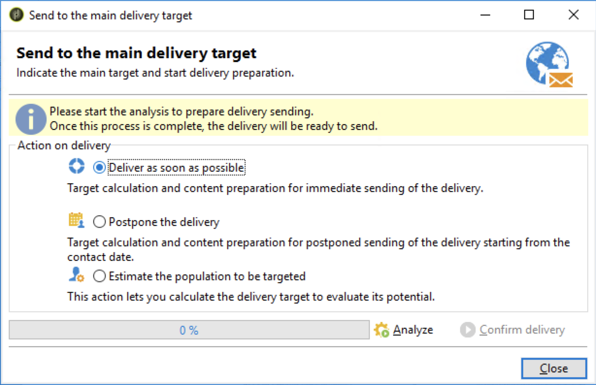

# Erstellen eines Adobe Experience Manager-Newsletters {#creating-newsletter}

Bevor Sie die unten beschriebenen Schritte durchführen können, müssen Sie zunächst [integrieren](/help/sites-cloud/integrating/integrating-campaign-classic.md) Adobe Campaign Classic und AEM as a Cloud Service. Nachdem Sie Adobe Campaign Classic und AEM as a Cloud Service konfiguriert haben, erfahren Sie jetzt, wie Sie einen Adobe Experience Manager-Newsletter erstellen.

1. Klicken Sie in der AEM Autoreninstanz auf das Adobe Experience Manager-Logo oben links auf der Seite und wählen Sie **Sites**.
1. Kampagne auswählen, klicken Sie auf **Erstellen einer Seite**.
   
1. Marke auswählen und auf **Nächste**.
1. Geben Sie einen Titel ein und klicken Sie auf **Erstellen** und **Fertig**.
1. Um eine Kampagnenseite zu erstellen, gehen Sie zu **Campaigns → AdobeDemo → Übergeordnet** und klicken Sie auf **Erstellen einer Seite**.
   
1. Wählen Sie die Kampagnenvorlage aus und klicken Sie auf **Nächste** und **Fertig**.
1. Geben Sie einen Titel ein und klicken Sie auf **Erstellen** und **Fertig**.
1. Navigieren Sie zu **Campaign → AdobeDemo → Übergeordnet** und aktivieren Sie das Kontrollkästchen CampaignPage . Klicken **Eigenschaften** oben links.
   
1. Navigieren Sie zu **Cloud Service** tab:
   * Wählen Sie Adobe Campaign aus der Dropdownliste Cloud Service-Konfigurationen aus.
   * Wählen Sie den gewünschten Namen für die Adobe Campaign-Konfiguration aus.
   * **Speichern** und **Schließen**.
1. Um eine Adobe Campaign Classic-E-Mail-Seite zu erstellen, navigieren Sie zu **Campaign → AdobeDemo → Übergeordnet → CampaignPage** und klicken Sie auf **Erstellen einer Seite**.
1. Wählen Sie die Vorlage Adobe Campaign Email (z. B. AC 6.1) aus und klicken Sie auf **Nächste**.
1. Geben Sie auf der Seite Erstellen den Titel für den Newsletter ein und klicken Sie auf **Erstellen** und **Fertig**.
1. Navigieren Sie zu **Campaign → AdobeDemo → Übergeordnet → CampaignPage**, aktivieren Sie das Kontrollkästchen Campaign Classic und klicken Sie auf **Bearbeiten** oben links, um die E-Mail-Seite zu öffnen.
1. Bearbeiten Sie die Adobe Campaign Classic-E-Mail-Newsletterseite entsprechend Ihren Anforderungen.
1. Klicken Sie auf **Seiteninformationen** Schaltfläche oben links und klicken Sie auf **Seite veröffentlichen**.
1. Wählen Sie die Konfiguration aus, in der die Seite veröffentlicht werden soll. Klicken Sie auf **Veröffentlichen**.
   
1. Die Newsletter-Seite wurde in der Veröffentlichungsinstanz und auch in der AEM Adobe Campaign Classic-Konfiguration veröffentlicht.
   * Jetzt wird die Newsletterseite in Adobe Campaign Classic angezeigt
1. Klicken Sie auf die Schaltfläche Seiteninformationen und klicken Sie auf **Workflow starten**.
1. Auswählen **Für Adobe Campaign genehmigen** als Workflow-Modell verwenden und auf die Schaltfläche **Workflow starten** Schaltfläche.
1. Oben auf der Seite wird ein Haftungsausschluss angezeigt. Klicken **Fertig** zum Bestätigen der Überprüfung klicken Sie erneut auf **OK**.
1. Klicken **Fertig** und wählen Sie **Newsletter-Validierung** Klicken Sie in der Dropdownliste Nächster Schritt auf die Schaltfläche **OK** Schaltfläche.

## Empfänger erstellen {#creating-recipient}

1. Öffnen Sie den Adobe Campaign Classic-Server mithilfe der Adobe Campaign Classic-Clientkonsole.
1. Navigieren Sie zur Explorer-Ansicht.
1. Gehen Sie in der Baumansicht auf der linken Seite zu Profile und Zielgruppen und wählen Sie **Empfänger**.
   
1. Füllen Sie die Details des Empfängers aus.
   * Geben Sie den Vornamen ein.
   * Geben Sie den Nachnamen ein.
   * Geben Sie die E-Mail ein.
   * Klicken Sie auf **Speichern**.

## E-Mail-Versand in Adobe Campaign Classic erstellen {#create-delivery}

1. Öffnen Sie den Adobe Campaign Classic-Server mithilfe der Adobe Campaign Classic-Clientkonsole.
1. Navigieren Sie zur Explorer-Ansicht.
1. Wählen Sie in der Baumansicht auf der linken Seite die Option **Campaign Management** und wählen Sie **Sendungen**.
1. Klicken Sie oben rechts auf **Neu**.
1. Auswählen **E-Mail-Versand mit AEM Inhalt** Wählen Sie in der Dropdown-Liste Versandvorlage die Option **Weiter**.
1. Klicken Sie unter E-Mail-Parameter auf Von .
   * Geben Sie die Absenderadresse ein.
   * Geben Sie das Feld Von ein.
   * Klicken Sie auf **OK**.
1. Klicken **nach** Link und klicken Sie dann auf **Hinzufügen** auf dem Zielbildschirm auswählen.
1. Auswählen **Empfänger** und klicken Sie auf **Nächste**.
   
1. Wählen Sie den erstellten Empfänger aus [before](#creating-recipient) und klicken Sie auf **Beenden**.
1. Der Empfänger wurde ausgewählt. Klicken Sie auf **OK**.
1. Klicken **Synchronisieren**.
1. Wählen Sie die E-Mail-Seite aus der Liste aus und klicken Sie auf **OK**.
1. Die E-Mail-Vorlage wird synchronisiert. Klicken **Inhalt aktualisieren** , wenn sie nicht geladen wird.
1. Klicken **Senden** , um die E-Mail zu senden.
1. Wählen Sie im nächsten Bildschirm **Sendungen schnellstmöglich abschicken** und klicken Sie anschließend auf **Analyse**.
   
1. Klicken Sie nach der Erstellung des Versands auf **Versand bestätigen** um mit dem Versand der E-Mail zu beginnen. Klicken Sie zur Bestätigung auf **Ja**.
   
1. Der Versand wurde gestartet. Klicken Sie auf **Schließen**.
1. Klicken **Speichern** , um den Versand zu speichern.
