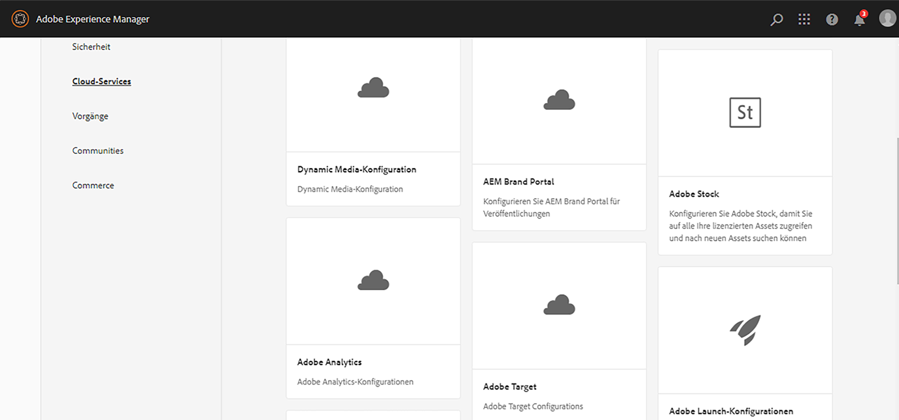
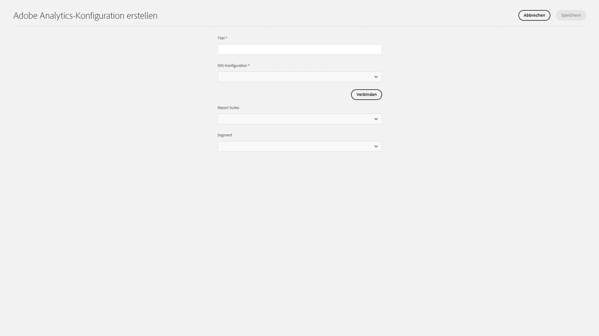

# Integration mit Adobe Analytics{#integrating-with-adobe-analytics}

Die Integration von Adobe Analytics in AEM as a Cloud Service ermöglicht es Ihnen, die Aktivitäten Ihrer Web-Seiten zu erfassen. Die Integration setzt Folgendes voraus:

* Verwenden der Touch-Benutzeroberfläche, um eine Analytics-Konfiguration in AEM as a Cloud Service zu erstellen. Die IMS-Authentifizierung ist erforderlich, um Adobe Analytics mit AEM as a Cloud Service zu integrieren.
* Hinzufügen und Konfigurieren von Adobe Analytics als Erweiterung in [Adobe Experience Platform Launch](#analytics-launch). Weitere Informationen zu Adobe Launch finden Sie in der [Schnellstartanleitung](https://experienceleague.adobe.com/docs/experience-platform/tags/get-started/quick-start.html?lang=de).

Im Vergleich zu früheren Versionen von AEM ist in der Analytics-Konfiguration von AEM as a Cloud Service keine Framework-Unterstützung gegeben. Stattdessen erfolgt diese nun über Adobe Experience Platform Launch, das De-facto-Tool für die Instrumentierung einer AEM-Site mit Analytics-Funktionen (JS-Bibliotheken). In Adobe Experience Platform Launch wird eine Eigenschaft eingerichtet, bei der die Adobe Analytics-Erweiterung konfiguriert werden kann und Regeln zum Senden von Daten an Adobe Analytics erstellt werden. Adobe Experience Platform Launch hat die Aufgabe der von SiteCatalyst bereitgestellten Analysefunktionen übernommen.

>[!NOTE]
>
>Kunden mit Adobe Experience Manager as a Cloud Service, die kein Analytics-Konto haben, können Zugriff auf das Analytics Foundation Pack für Experience Cloud anfordern. Dieses Foundation Pack ermöglicht eine eingeschränkte Verwendung von Analytics.

## Erstellen der Adobe Analytics-Konfiguration {#analytics-configuration}

1. Navigieren Sie zu **Tools** > **Cloud Services**.
2. Wählen Sie **Adobe Analytics**.
   
3. Klicken Sie auf die Schaltfläche **Erstellen**.
4. Füllen Sie die Details aus (siehe unten) und klicken Sie auf **Verbinden**.

### Konfigurationsparameter {#configuration-parameters}

Die im Konfigurationsfenster verfügbaren Felder lauten wie folgt:

| Eigenschaft | Beschreibung |
|---|---|
| Titel | Der Konfigurationsname |
| IMS-Konfiguration | Wählen Sie die IMS-Konfiguration aus (siehe Kapitel unten). |
| Segment | Option zur Verwendung eines in der aktuellen Report Suite definierten Analytics-Segments. Die Analytics-Berichte werden basierend auf dem Segment gefiltert. Weitere Informationen finden Sie unter [Informationen zu Segmenten](https://experienceleague.adobe.com/docs/analytics/components/segmentation/seg-overview.html?lang=de). |
| Report Suites | Ein Repository, in dem Sie Daten senden und Berichte abrufen können. Eine Report Suite definiert die vollständigen, unabhängigen Berichte für eine bestimmte Website, eine Reihe von Websites oder eine Teilmenge von Website-Seiten. Sie können die Berichte, die aus einer bestimmten Report Suite abgerufen werden, jederzeit entsprechend Ihren Anforderungen anzeigen. |

### Adobe Analytics mit IMS-Authentifizierung {#configuration-parameters-ims}

Die Integration von Adobe Experience Manager as a Cloud Service (AEMaaCS) mit Adobe Analytics über die Analytics Standard-API erfordert die Konfiguration von Adobe IMS (Identity Management System).

Unter [Einrichten von IMS-Integrationen für AEM as a Cloud Service](/help/security/setting-up-ims-integrations-for-aem-as-a-cloud-service.md) finden Sie Informationen zum Erstellen der IMS-Konfiguration.

>[!NOTE]
>
>[IMS-Integrationen sind jetzt mit S2S OAuth konfiguriert](/help/security/setting-up-ims-integrations-for-aem-as-a-cloud-service.md).
>
>Frühere Konfigurationen erfolgten mit [JWT-Berechtigungen, die in der Adobe Developer Console nicht mehr unterstützt werden](/help/security/jwt-credentials-deprecation-in-adobe-developer-console.md).

### Hinzufügen einer Konfiguration zu einer Site {#add-configuration}

Um eine Konfiguration für die Touch-optimierte Benutzeroberfläche auf eine Website anzuwenden, gehen Sie zu: **Websites** > **Beliebige Website-Seite auswählen** > **Eigenschaften** > **Erweitert** > **Konfiguration** > Konfigurationsmandanten auswählen.

## Integrieren von Adobe Analytics in AEM Sites mithilfe von Adobe Experience Platform Launch {#analytics-launch}

Adobe Analytics kann in der Launch-Präsenz als Erweiterung hinzugefügt werden. Es können Regeln definiert werden, die das Zuordnen und Ausführen eines post-Aufrufs an Adobe Analytics erledigen:

* In [diesem Video](https://experienceleague.adobe.com/docs/analytics-learn/tutorials/implementation/via-adobe-launch/basic-configuration-of-the-analytics-launch-extension.html?lang=de) erfahren Sie, wie Sie die Analytics-Erweiterung in Launch für eine einfache Site konfigurieren.

* Weitere Informationen zum Erstellen von Regeln und Senden von Daten an Adobe Analytics finden Sie unter [Hinzufügen von Adobe Analytics](https://experienceleague.adobe.com/docs/core-services-learn/implementing-in-websites-with-launch/implement-solutions/analytics.html?lang=de).

>[!NOTE]
>
>Die IMS-Konfiguration (technische Konten) für Adobe Experience Platform Launch ist in AEM as a Cloud Service vorkonfiguriert. Sie müssen diese Konfiguration nicht erstellen.

>[!NOTE]
>
>Vorhandene (ältere) Frameworks funktionieren weiterhin, können jedoch nicht in der Touch-optimierten Benutzeroberfläche konfiguriert werden. Es wird empfohlen, die Variablenzuordnungskonfigurationen in Adobe Experience Platform Launch neu zu erstellen.
