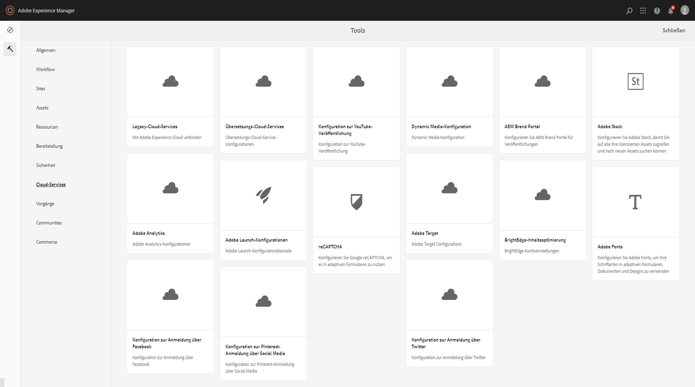
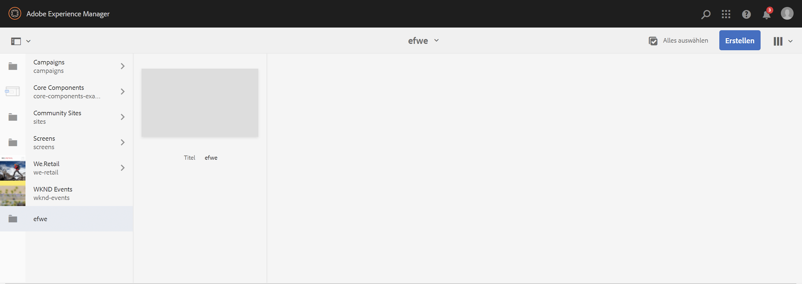
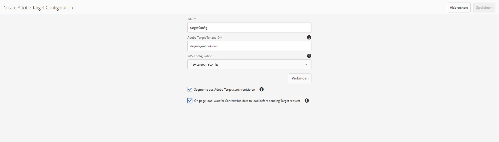

# Integrieren mit Adobe Target{#integrating-with-adobe-target}

Als Teil von Adobe Experience Cloud ermöglicht [Adobe Target](https://experienceleague.adobe.com/en/docs/target) Ihnen die Steigerung der Inhaltsrelevanz durch Targeting und Messungen über alle Kanäle hinweg. Die Integration von Adobe Target und AEM as a Cloud Service erfordert Folgendes:

* Die Verwendung der Touch-optimierte Benutzeroberfläche, um eine Target-Konfiguration in AEM as a Cloud Service zu erstellen (IMS-Konfiguration erforderlich)
* Das Hinzufügen und Konfigurieren von Adobe Target als Erweiterung in [Adobe Experience Platform Launch](https://experienceleague.adobe.com/docs/experience-platform/tags/get-started/quick-start.html?lang=de)

Adobe Experience Platform Launch ist erforderlich, um Client-seitige Eigenschaften für Analytics und Target auf AEM-Seiten zu verwalten (JS-Bibliotheken/-Tags). Allerdings ist für „Erlebnis-Targeting“ die Integration mit Launch erforderlich.

Für den Export von Experience Fragments und/oder Inhaltsfragmenten nach Target benötigen Sie die [Adobe Target-Konfiguration](#create-configuration) einschließlich der [IMS-Integration](#ims-configuration).

>[!NOTE]
>
>Kundinnen und Kunden, die kein Target-Konto haben, können Zugriff auf das Target Foundation Pack für Experience Cloud anfordern. Das Foundation Pack ermöglicht eine eingeschränkte Verwendung von Target.

>[!NOTE]
>
>Siehe auch die Adobe Target-Dokumentation: [Integration von Target mit Adobe Experience Manager (AEM)](https://experienceleague.adobe.com/en/docs/target/using/integrate/aem/aem-target-integration).

## Erstellen der Adobe Target-Konfiguration {#create-configuration}

1. Navigieren Sie zu **Tools** > **Cloud Services**.
   
2. Wählen Sie **Adobe Target** aus.
3. Klicken Sie auf die Schaltfläche **Erstellen**.
   
4. Geben Sie die Details ein (siehe unten) und wählen Sie **Verbinden** aus.
   

### IMS-Konfiguration {#ims-configuration}

Die Integration von AEM mit Adobe Target über die Target Standard-API erfordert die Konfiguration von Adobe IMS (Identity Management System). Die Target-IMS-Konfiguration muss erstellt werden (nachdem Target bereitgestellt wurde). Siehe [Einrichten von IMS-Konfigurationen für AEM as a Cloud Service](/help/security/setting-up-ims-integrations-for-aem-as-a-cloud-service.md) und das Video [Integrieren von Experience Platform Launch und AEM](https://experienceleague.adobe.com/docs/experience-manager-learn/sites/integrations/experience-platform-data-collection-tags/overview.html?lang=de) mit Informationen zum Erstellen der Target-IMS-Konfiguration.

>[!NOTE]
>
>[IMS-Integrationen sind jetzt mit S2S OAuth konfiguriert](/help/security/setting-up-ims-integrations-for-aem-as-a-cloud-service.md).
>
>Frühere Konfigurationen wurden mit [JWT-Berechtigungen, die in der Adobe Developer Console nicht mehr unterstützt werden](/help/security/jwt-credentials-deprecation-in-adobe-developer-console.md), erstellt.

>[!NOTE]
>
>Beim Konfigurieren des Projekts hängt die Anzeige der Produktprofile von folgenden Voraussetzungen ab:
>
>* Adobe Target Standard – nur **Standardarbeitsbereich** ist verfügbar
>* Adobe Target Premium – alle verfügbaren Arbeitsbereiche werden aufgelistet, wie unten dargestellt

### Adobe Target-Mandanten-ID und Adobe Target-Clientcode {#tenant-client}

Beachten Sie beim Konfigurieren der Felder für die Adobe Target-Mandanten-ID und den Adobe Target-Clientcode Folgendes:

1. Für die meisten Kundinnen und Kunden sind die Mandanten-ID und der Clientcode identisch. Das bedeutet, dass beide Felder die gleichen Informationen enthalten und identisch sind. Achten Sie darauf, dass Sie die Mandanten-ID in beide Felder eingeben.
2. Sollten Sie über ältere Werte verfügen, können Sie auch verschiedene Werte in die Felder „Mandanten-ID“ und „Clientcode“ eingeben.

In beiden Fällen gilt:

* Standardmäßig wird der Clientcode (wenn er zuerst eingegeben wird) automatisch in das Feld „Mandanten-ID“ kopiert.
* Bei Bedarf können Sie den standardmäßigen Mandanten-ID-Satz ändern.
* Die Backend-Aufrufe von Target basieren auf der Mandanten-ID und die Client-seitigen Aufrufe von Target auf dem Clientcode.

Wie bereits erwähnt, tritt der erste Fall in AEM as a Cloud Service häufiger auf. Stellen Sie in beiden Fällen sicher, dass **beide** Felder die richtigen Informationen entsprechend Ihren Anforderungen enthalten.

>[!NOTE]
>
> Wenn Sie eine bestehende Target-Konfiguration ändern möchten:
>
> 1. Geben Sie die Mandanten-ID erneut ein.
> 2. Stellen Sie eine erneute Verbindung zu Target her.
> 3. Speichern Sie die Konfiguration.

### Bearbeiten der Target-Konfiguration {#edit-target-configuration}

Um die Target-Konfiguration zu deaktivieren, führen Sie die folgenden Schritte aus:

1. Wählen Sie eine vorhandene Konfiguration aus und klicken Sie auf **Eigenschaften**.
2. Bearbeiten Sie die Eigenschaften.
3. Wählen Sie **Erneute Verbindung zu Adobe Target herstellen** aus.
4. Klicken Sie auf **Speichern und schließen**.

### Hinzufügen einer Konfiguration zu einer Site {#add-configuration}

Um eine Konfiguration für die Touch-optimierte Benutzeroberfläche auf eine Site anzuwenden, wechseln Sie zu: **Sites** > **Site-Seite auswählen** > **Eigenschaften** > **Erweitert** > **Konfiguration** > Konfigurationsmandanten auswählen.

## Integrieren von Adobe Target mit AEM Sites mithilfe von Adobe Experience Platform Launch {#integrate-target-launch}

AEM bietet eine vorkonfigurierte Integration mit Experience Platform Launch. Durch Hinzufügen der Adobe Target-Erweiterung zu Experience Platform Launch können Sie die Funktionen von Adobe Target auf AEM-Web-Seiten verwenden. Target-Bibliotheken werden nur mit Launch gerendert.

>[!NOTE]
>
>Vorhandene (ältere) Frameworks funktionieren weiterhin, können jedoch nicht in der Touch-optimierten Benutzeroberfläche konfiguriert werden. Adobe empfiehlt, die Variablenzuordnungskonfigurationen in Launch neu zu erstellen.

Die Schritte zur Integration als allgemeine Übersicht:

1. Erstellen einer Experience Platform Launch-Eigenschaft
2. Hinzufügen der erforderlichen Erweiterungen
3. Erstellen eines Datenelements (zum Erfassen von ContextHub-Parametern)
4. Erstellen einer Seitenregel
5. Erstellen und Veröffentlichen

### Erstellen einer Experience Platform Launch-Eigenschaft {#create-property}

Eine Eigenschaft ist ein Container, der mit Erweiterungen, Regeln und Datenelementen gefüllt ist.

1. Klicken Sie auf die Schaltfläche **Neue Eigenschaft**.
2. Geben Sie einen Namen für die Eigenschaft an.
3. Geben Sie als Domain die IP/den Host ein, auf der/dem Sie die Experience Platform Launch-Bibliothek laden möchten.
4. Klicken Sie auf die Schaltfläche **Speichern**.
   

### Hinzufügen der erforderlichen Erweiterungen {#add-extension}

**Erweiterungen** ist der Name des Containers, der die Kern-Bibliothekseinstellungen verwaltet. Die Adobe Target-Erweiterung unterstützt Client-seitige Implementierungen, indem „at.js“ verwendet wird, das JavaScript-SDK von Target für das moderne Web. Sie müssen sowohl die **Adobe Target** als auch die **Adobe ContextHub**-Erweiterung hinzufügen.

1. Wählen Sie die Option „Erweiterungskatalog“ aus und suchen Sie im Filter nach Target.
2. Wählen Sie **Adobe Target**at.js aus und klicken Sie auf die Option „Installieren“.
   
3. Klicken Sie auf die Schaltfläche **Konfigurieren**. Beachten Sie das Konfigurationsfenster mit den importierten Target-Anmeldedaten und die at.js-Version für diese Erweiterung.
4. Wählen Sie **Speichern**, um die Target-Erweiterung zur Experience Platform Launch-Eigenschaft hinzuzufügen. Die Target-Erweiterung sollte unter **Installierte Erweiterungen** aufgeführt sein.
   
5. Wiederholen Sie die obigen Schritte, um nach der **Adobe ContextHub**-Erweiterung zu suchen und sie zu installieren (diese Erweiterung ist für die Integration mit ContextHub-Parametern erforderlich, abhängig vom jeweils durchgeführten Targeting).

### Erstellen eines Datenelements {#data-element}

**Datenelemente** sind die Platzhalter, denen Sie ContextHub-Parameter zuordnen können.

1. Wählen Sie **Datenelemente**.
2. Wählen Sie **Datenelement hinzufügen** aus.
3. Geben Sie den Namen des Datenelements an und ordnen Sie es einem ContextHub-Parameter zu.
4. Wählen Sie **Speichern** aus.
   

### Erstellen einer Seitenregel {#page-rule}

Unter **Regel** können Folgen von Aktionen definiert und geordnet werden, die lokal zum Targeting ausgeführt werden.

1. Fügen Sie eine Reihe Aktionen hinzu, wie im Screenshot dargestellt.
   
2. Fügen Sie unter „Parameter zu sämtlichen Mboxes hinzufügen“ das zuvor konfigurierte Datenelement (siehe Datenelement oben) zu dem Parameter hinzu, der im Mbox-Aufruf gesendet wird.
   

### Erstellen und Veröffentlichen {#build-publish}

Informationen zum Erstellen und Veröffentlichen finden Sie auf [dieser Seite](https://experienceleague.adobe.com/docs/experience-manager-learn/aem-target-tutorial/aem-target-implementation/using-launch-adobe-io.html?lang=de).

## Unterschiede an der Inhaltsstruktur zwischen den Konfigurationen der klassischen und Touch-optimierten Benutzeroberfläche {#changes-content-structure}

<table style="table-layout:auto">
  <tr>
    <th>Änderung</th>
    <th>Konfiguration der klassischen Benutzeroberfläche</th>
    <th>Konfiguration der Touch-optimierten Benutzeroberfläche</th>
    <th>Folgen</th>
  </tr>
  <tr>
    <td>Speicherort der Target-Konfiguration</td>
    <td>/etc/cloudservices/testandtarget/</td>
    <td>/conf/tenant/settings/cloudconfigs/target/</td>
    <td> Zuvor waren unter „/etc/cloudservices/testandtarget“ mehrere Konfigurationen vorhanden. Jetzt ist unter einem Mandanten nur jeweils eine Konfiguration zu finden.</td>
  </tr>
</table>

>[!NOTE]
>
>Ältere Konfigurationen werden für die bestehenden Kundinnen und Kunden weiterhin unterstützt (ohne die Möglichkeit, sie zu bearbeiten oder zu erstellen). Ältere Konfigurationen sind Teil von Inhaltspaketen, die von Kundinnen und Kunden mithilfe von VSTS hochgeladen werden.
