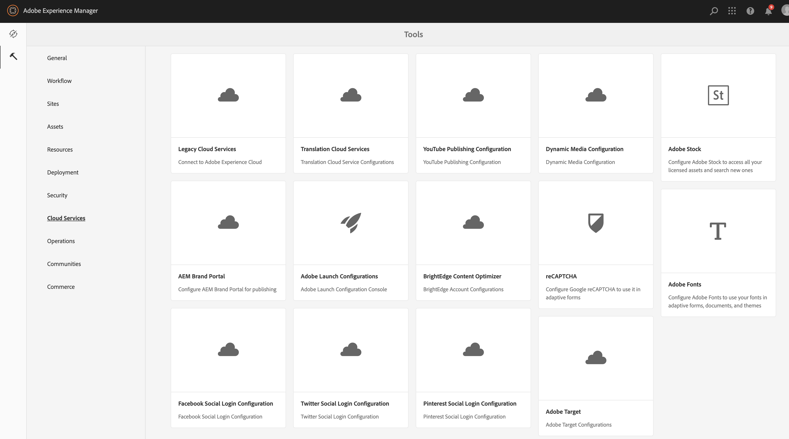
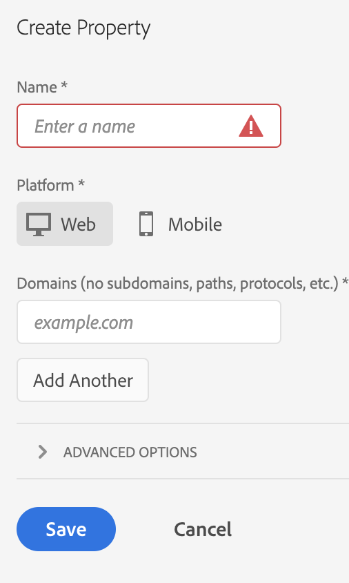
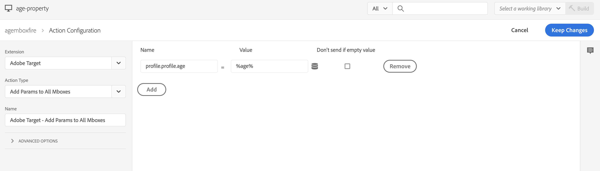

# Integrieren mit Adobe Target {#integrating-with-adobe-target}

Als Teil von Adobe Experience Cloud ermöglicht Adobe Target Ihnen die Verbesserung der Content-Relevanz durch Targeting und Messungen über alle Kanäle hinweg. Die Integration von Adobe Target und AEM as a Cloud Service erfordert Folgendes:

* Die Verwendung der Touch-optimierte Benutzeroberfläche, um eine Target-Konfiguration in AEM as a Cloud Service zu erstellen (IMS-Konfiguration erforderlich)
* Das Hinzufügen und Konfigurieren von Adobe Target als Erweiterung in [Adobe Experience Platform Launch](https://docs.adobe.com/content/help/de-DE/launch/using/intro/get-started/quick-start.html)

Adobe Experience Platform Launch ist erforderlich, um Client-seitige Eigenschaften für Analytics und Target auf AEM-Seiten zu verwalten (JS-Bibliotheken/-Tags). Allerdings ist für „Erlebnis-Targeting“ die Integration mit Experience Platform Launch erforderlich. Für den Export von Erlebnisfragmenten in die Zielgruppe benötigen Sie nur die Adobe Target-Konfiguration und das IMS.

>[!NOTE]
>
>Kunden mit Adobe Experience Manager as a Cloud Service, die kein Target-Konto haben, können Zugriff auf Target Foundation Pack für Experience Cloud anfordern. Das Foundation Pack ermöglicht eine eingeschränkte Verwendung von Target.

## Erstellen der Adobe Target-Konfiguration {#create-configuration}

1. Navigieren Sie zu **Tools** > **Cloud Services**.
   
2. Wählen Sie **Adobe Target** aus.
3. Klicken Sie auf die Schaltfläche **Erstellen**.
   
4. Geben Sie die Details ein (siehe unten) und wählen Sie **Verbinden** aus.
   

### IMS-Konfiguration {#ims-configuration}

Um Target ordnungsgemäß in AEM und Experience Platform Launch zu integrieren, ist eine IMS-Konfiguration für Launch und Target erforderlich. Während die IMS-Konfiguration für Experience Platform Launch in AEM as a Cloud Service vorkonfiguriert ist, muss die Target-IMS-Konfiguration erstellt werden (nachdem Target bereitgestellt wurde). Sehen Sie sich [dieses Video](https://helpx.adobe.com/de/experience-manager/kt/sites/using/aem-sites-target-standard-technical-video-understand.html) und [diese Seite](https://docs.adobe.com/content/help/de-DE/experience-manager-65/administering/integration/integration-ims-adobe-io.html) an, um zu erfahren, wie Sie die Target-IMS-Konfiguration erstellen.

### Adobe Target Tenant ID und Adobe Target Client Code {#tenant-client}

Beachten Sie beim Konfigurieren der Adobe Target Tenant ID- und Adobe Target Client Code-Felder Folgendes:

1. Für die meisten Kunden sind die Mandant-ID und der Client-Code identisch. Das bedeutet, dass beide Felder die gleichen Informationen enthalten und identisch sind. Vergewissern Sie sich, dass Sie die Mandant-ID in beide Felder eingeben.
2. Zu älteren Zwecken können Sie auch verschiedene Werte in die Felder &quot;Mandant-ID&quot;und &quot;Client-Code&quot;eingeben.

Beachten Sie in beiden Fällen Folgendes:

* Standardmäßig wird auch der Client-Code (wenn er zuerst hinzugefügt wird) automatisch in das Feld &quot;Mandant-ID&quot;kopiert.
* Sie haben die Möglichkeit, den Standardsatz für die Mandant-ID zu ändern.
* Dementsprechend basieren die Backend-Aufrufe zur Zielgruppe auf der Mandanten-ID und die clientseitigen Aufrufe zur Zielgruppe basieren auf dem Client-Code.

Wie bereits erwähnt, ist der erste Fall der häufigste Fall für AEM Cloud Service. Stellen Sie in beiden Fällen sicher, dass die Felder **beide** je nach Bedarf die richtigen Informationen enthalten.

>[!NOTE]
>
> Wenn Sie eine bestehende Konfiguration der Zielgruppe ändern möchten:
>
> 1. Geben Sie die Tenant-ID erneut ein.
> 2. Stellen Sie eine erneute Verbindung zur Zielgruppe her.
> 3. Speichern Sie die Konfiguration.

### Bearbeiten der Target-Konfiguration {#edit-target-configuration}

Um die Target-Konfiguration zu deaktivieren, führen Sie die folgenden Schritte aus:

1. Wählen Sie eine vorhandene Konfiguration aus und klicken Sie auf **Eigenschaften**.
2. Bearbeiten Sie die Eigenschaften.
3. Wählen Sie **Erneute Verbindung zu Adobe Target herstellen** aus.
4. Wählen Sie **Speichern und schließen** aus.

### Hinzufügen einer Konfiguration zu einer Site {#add-configuration}

Um eine Konfiguration für die Touch-optimierte Benutzeroberfläche auf eine Site anzuwenden, wechseln Sie zu: **Sites** → **Beliebige Site-Seite auswählen** → **Eigenschaften** → **Erweitert** → **Konfiguration** → Konfigurationsmandanten auswählen.

## Integrieren von Adobe Target mit AEM Sites mithilfe von Adobe Experience Platform Launch {#integrate-target-launch}

AEM bietet eine vorkonfigurierte Integration mit Experience Platform Launch. Durch Hinzufügen der Adobe Target-Erweiterung zu Experience Platform Launch können Sie die Funktionen von Adobe Target auf AEM Webseiten verwenden. Zielgruppen-Bibliotheken werden nur mithilfe von Launch gerendert.

>[!NOTE]
>
>Vorhandene (ältere) Frameworks funktionieren weiterhin, können jedoch nicht in der Touch-optimierten Benutzeroberfläche konfiguriert werden. Es wird empfohlen, die Variablenzuordnungskonfigurationen in Adobe Experience Platform Launch neu zu erstellen.

Die Schritte zur Integration als allgemeine Übersicht:

1. Erstellen einer Experience Platform Launch-Eigenschaft
2. Hinzufügen der erforderlichen Erweiterungen
3. Erstellen eines Datenelements (zum Erfassen von ContextHub-Parametern)
4. Erstellen einer Seitenregel
5. Erstellen und Veröffentlichen

### Erstellen einer Experience Platform Launch-Eigenschaft {#create-property}

Eine Eigenschaft ist ein Container, der mit Erweiterungen, Regeln und Datenelementen gefüllt ist.

1. Klicken Sie auf die Schaltfläche **Neue Eigenschaft**.
2. Geben Sie einen Namen für die Eigenschaft an.
3. Geben Sie als Domäne die IP/Hostadresse ein, auf der Sie die Startbibliothek laden möchten.
4. Klicken Sie auf die Schaltfläche **Speichern**.
   

### Hinzufügen der erforderlichen Erweiterungen {#add-extension}

**Erweiterungen** ist der Name des Containers, der die Core-Bibliothekseinstellungen verwaltet. Die Adobe Target-Erweiterung unterstützt Client-seitige Implementierungen, indem „at.js“ verwendet wird, das JavaScript-SDK von Target für das moderne Web. Sie müssen die Erweiterungen **Adobe Target** und **Adobe ContextHub** hinzufügen.

1. Wählen Sie die Option „Erweiterungskatalog“ aus und suchen Sie im Filter nach Target.
2. Wählen Sie **Adobe Target at.js** aus und klicken Sie auf die Option „Installieren“.
   
3. Klicken Sie auf die Schaltfläche **Konfigurieren**. Beachten Sie das Konfigurationsfenster mit den importierten Target-Anmeldedaten und die at.js-Version für diese Erweiterung.
4. Wählen Sie **Speichern**, um die Target-Erweiterung zur Experience Platform Launch-Eigenschaft hinzuzufügen. Die Target-Erweiterung sollte unter **Installierte Erweiterungen** aufgeführt sein.
   
5. Wiederholen Sie die obigen Schritte, um nach der **Adobe ContextHub**-Erweiterung zu suchen und sie zu installieren (dies ist für die Integration mit ContextHub-Parametern erforderlich, abhängig vom jeweils durchgeführten Targeting).

### Erstellen eines Datenelements {#data-element}

**Datenelemente** sind die Platzhalter, denen Sie ContextHub-Parameter zuordnen können.

1. Wählen Sie **Datenelemente**.
2. Wählen Sie **Datenelement hinzufügen** aus.
3. Geben Sie den Namen des Datenelements an und ordnen Sie es einem ContextHub-Parameter zu.
4. Wählen Sie **Speichern** aus.
   

### Erstellen einer Seitenregel {#page-rule}

In **Regel** definieren und ordnen wir eine Folge von Aktionen an, die auf der Site ausgeführt werden, um Targeting zu erreichen.

1. Fügen Sie eine Reihe Aktionen hinzu, wie im Screenshot dargestellt.
   
2. Fügen Sie unter „Parameter zu sämtlichen Mboxes hinzufügen“ das zuvor konfigurierte Datenelement (siehe Datenelement oben) zu dem Parameter hinzu, der im Mbox-Aufruf gesendet wird.
   

### Erstellen und Veröffentlichen {#build-publish}

Weitere Informationen zum Erstellen und Veröffentlichen finden Sie auf dieser [Seite](https://docs.adobe.com/content/help/de-DE/experience-manager-learn/aem-target-tutorial/aem-target-implementation/using-launch-adobe-io.html).

## Unterschiede an der Inhaltsstruktur zwischen den Konfigurationen der klassischen und Touch-optimierten Benutzeroberfläche {#changes-content-structure}

| **Änderung** | **Konfiguration der klassischen Benutzeroberfläche** | **Konfiguration der Touch-optimierten Benutzeroberfläche** | **Folgen** |
|---|---|---|---|
| Speicherort der Target-Konfiguration | /etc/cloudservices/testandtarget/ | /conf/tenant/settings/cloudservices/target | Früher waren unter /etc/cloudservices/testandtarget mehrere Konfigurationen vorhanden, jetzt ist jedoch eine einzige Konfiguration unter einem Mieter vorhanden. |

>[!NOTE]
>
>Ältere Konfigurationen werden für bestehende Kunden weiterhin unterstützt (ohne die Option, neue zu bearbeiten oder zu erstellen). Ältere Konfigurationen sind Teil von Inhaltspaketen, die von Kunden mit VSTS hochgeladen werden.
