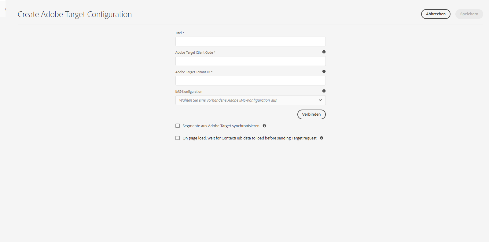

# Integrieren mit Adobe Target{#integrating-with-adobe-target}

Als Teil von Adobe Marketing Cloud ermöglicht Adobe Target Ihnen die Steigerung der Inhaltsrelevanz durch Targeting und Messungen über alle Kanäle hinweg. Die Integration von Adobe Target und AEM als Cloud Service erfordert Folgendes:

* Verwenden der Touch-Benutzeroberfläche, um eine Zielgruppe-Konfiguration in AEM als Cloud Service zu erstellen (IMS-Konfiguration erforderlich).
* Hinzufügen und Konfigurieren von Adobe Target als Erweiterung in [Adobe Launch](https://docs.adobe.com/content/help/en/launch/using/intro/get-started/quick-start.html).

Adobe Launch ist erforderlich, um clientseitige Eigenschaften für Analytics und Zielgruppe in AEM zu verwalten (JS-Bibliotheken/Tags). Allerdings ist die Integration mit Launch für &quot;Erlebnis-Targeting&quot;erforderlich. Für den Export von Erlebnisfragmenten in die Zielgruppe benötigen Sie nur die Adobe Target-Konfiguration und das IMS.

>[!NOTE]
>
>Kunden mit Adobe Experience Manager as a Cloud Service, die kein Target-Konto haben, können Zugriff auf Target Foundation Pack für Experience Cloud anfordern. Das Foundation Pack bietet eine eingeschränkte Verwendung von Target.

## Erstellen der Adobe Target-Konfiguration {#create-configuration}

1. Navigate to **Tools** → **Cloud Services**.
   
2. Wählen Sie **Adobe Target**.
3. Select the **Create** button.
   
4. Füllen Sie die Details aus (siehe unten) und wählen Sie **Verbinden**.
   

### IMS-Konfiguration

Eine IMS-Konfiguration für Start und Zielgruppe ist erforderlich, um Zielgruppe korrekt in AEM und Launch zu integrieren. Während die IMS-Konfiguration für Launch in AEM als Cloud Service vorkonfiguriert ist, muss die Zielgruppe-IMS-Konfiguration erstellt werden (nachdem die Zielgruppe bereitgestellt wurde). Sehen Sie sich [dieses Video](https://helpx.adobe.com/experience-manager/kt/sites/using/aem-sites-target-standard-technical-video-understand.html) und [diese Seite](https://docs.adobe.com/content/help/en/experience-manager-65/administering/integration/integration-ims-adobe-io.html) an, um zu erfahren, wie Sie die Zielgruppe IMS-Konfiguration erstellen.

### Bearbeiten der Konfiguration der Zielgruppe {#edit-target-configuration}

Gehen Sie wie folgt vor, um die Konfiguration der Zielgruppe zu bearbeiten:

1. Wählen Sie eine vorhandene Konfiguration aus und klicken Sie auf **Eigenschaften**.
2. Bearbeiten Sie die Eigenschaften.
3. Select **Re-connect to Adobe Target**.
   
4. Wählen Sie **Speichern und schließen** aus.

### Hinzufügen einer Konfiguration zu einer Site {#add-configuration}

Um eine Touch-UI-Konfiguration auf eine Site anzuwenden, gehen Sie zu: **Sites** → **Wählen Sie eine Site-Seite** → **Eigenschaften** → **Erweitert** → **Konfiguration** → Wählen Sie den Konfigurationsteilnehmer aus.

## Integrieren von Adobe Target auf AEM Sites mithilfe von Adobe Launch {#integrate-target-launch}

AEM Angebot und die Integration mit Experience Platform Launch sind sofort einsetzbar. Wenn Sie die Adobe Target-Erweiterung zu Experience Platform Launch hinzufügen, können Sie die Funktionen von Adobe Target auf AEM Webseite(n) verwenden.Zielgruppe-Bibliotheken werden nur mit Launch gerendert.

>[!NOTE]
>
>Vorhandene (ältere) Frameworks funktionieren weiterhin, können jedoch nicht in der Touch-Benutzeroberfläche konfiguriert werden. Es wird empfohlen, die Variablenzuordnungskonfigurationen in Launch neu zu erstellen.

Als allgemeine Übersicht werden die folgenden Schritte zur Integration beschrieben:

1. Eigenschaft &quot;Launch&quot;erstellen
2. Hinzufügen der erforderlichen Erweiterungen
3. Erstellen eines Datenelements (zum Erfassen von Kontext-Hub-Parametern)
4. Seitenregel erstellen
5. Erstellen und Veröffentlichen

### Creating a Launch Property {#create-property}

Eine Eigenschaft ist ein Container, der mit Erweiterungen, Regeln und Datenelementen gefüllt wird.

1. Klicken Sie auf die Schaltfläche &quot; **Neue Eigenschaft** &quot;.
2. Geben Sie einen Namen für Ihre Eigenschaft ein.
3. Als Domäne geben Sie den IP/Host ein, auf dem Sie die Startbibliothek laden möchten.
4. Klicken Sie auf die Schaltfläche **Speichern** .
   

### Hinzufügen der erforderlichen Erweiterungen {#add-extension}

**Erweiterungen** sind der Container, der die Core-Bibliothekseinstellungen verwaltet. Die Adobe Target-Erweiterung unterstützt clientseitige Implementierungen, indem das JavaScript-SDK der Zielgruppe für das moderne Web at.js verwendet wird. Sie müssen sowohl die **Adobe Target** - als auch die **Adobe ContextHub** -Erweiterung hinzufügen.

1. Wählen Sie die Option &quot;Erweiterungskatalog&quot;und suchen Sie im Filter nach Zielgruppen.
2. Wählen Sie &quot; **Adobe Target** at.js&quot;und klicken Sie auf die Option &quot;Installieren&quot;.
   
3. Select the **Configure** button. Beachten Sie das Konfigurationsfenster mit den importierten Kontoanmeldeinformationen und die at.js-Zielgruppe für diese Erweiterung.
4. Wählen Sie &quot; **Speichern** &quot;, um die Erweiterung des Zieldatensatzes der Eigenschaft &quot;Start&quot;hinzuzufügen. Sie sollten die Erweiterung des Zieldatensatzes unter der Liste **Installierte Erweiterungen** anzeigen können.
   
5. Wiederholen Sie die obigen Schritte, um nach der **Adobe ContextHub** zu suchen und sie zu installieren (dies ist für die Integration mit Kontextteilparametern erforderlich, basierend darauf, auf welchen Targeting durchgeführt wird).

### Erstellen eines Datenelements {#data-element}

**Datenelemente** sind die Platzhalter, denen Sie kontextbezogene Hub-Parameter zuordnen können.

1. Wählen Sie **Datenelemente**.
2. Wählen Sie **Hinzufügen Datenelement**.
3. Geben Sie den Namen des Datenelements an und ordnen Sie es einem Kontextknoten-Parameter zu.
4. select **Save**.
   

### Erstellen einer Seitenregel {#page-rule}

In der **Regel** definieren und ordnen wir eine Folge von Aktionen, die auf der Site ausgeführt werden, um Targeting zu erreichen.

1. Hinzufügen eine Reihe von Aktionen, wie im Screenshot dargestellt.
   
2. Fügen Sie in Hinzufügen &quot;Params to All Mboxes&quot;dem Parameter, der im mbox-Aufruf gesendet wird, das zuvor konfigurierte Datenelement hinzu (siehe Datenelement oben).
   

### Erstellen und Veröffentlichen {#build-publish}

Weitere Informationen zum Erstellen und Veröffentlichen finden Sie auf dieser [Seite](https://docs.adobe.com/content/help/en/experience-manager-learn/aem-target-tutorial/aem-target-implementation/using-launch-adobe-io.html).

## Änderungen der Inhaltsstruktur zwischen Classic- und Touch-UI-Konfigurationen {#changes-content-structure}

| **Ändern** | **Konfiguration der klassischen Benutzeroberfläche** | **Touch-UI-Konfiguration** | **Folgen** |
|---|---|---|---|
| Speicherort der Konfiguration der Zielgruppe. | /etc/cloudservices/testandtarget/ | /conf/tenant/settings/cloudservices/Zielgruppe | Früher waren unter /etc/cloudservices/testandtarget mehrere Konfigurationen vorhanden, jetzt wird jedoch eine einzelne Konfiguration unter einem Mieter vorhanden sein. |

>[!NOTE]
>
>Ältere Konfigurationen werden für bestehende Kunden weiterhin unterstützt (ohne die Möglichkeit, neue zu bearbeiten oder zu erstellen). Ältere Konfigurationen sind Teil von Inhaltspaketen, die von Kunden mit VSTS hochgeladen werden.
