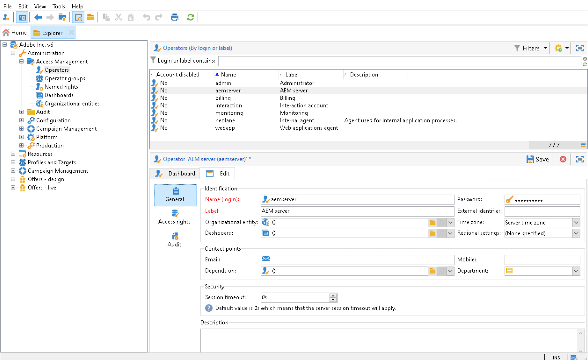
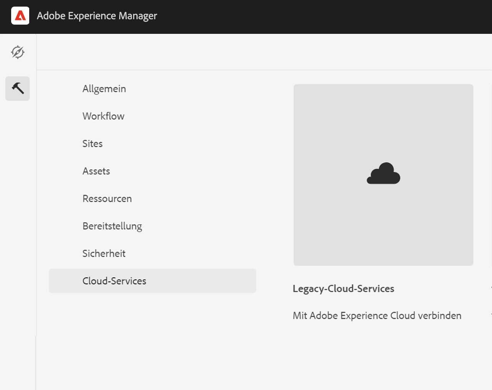
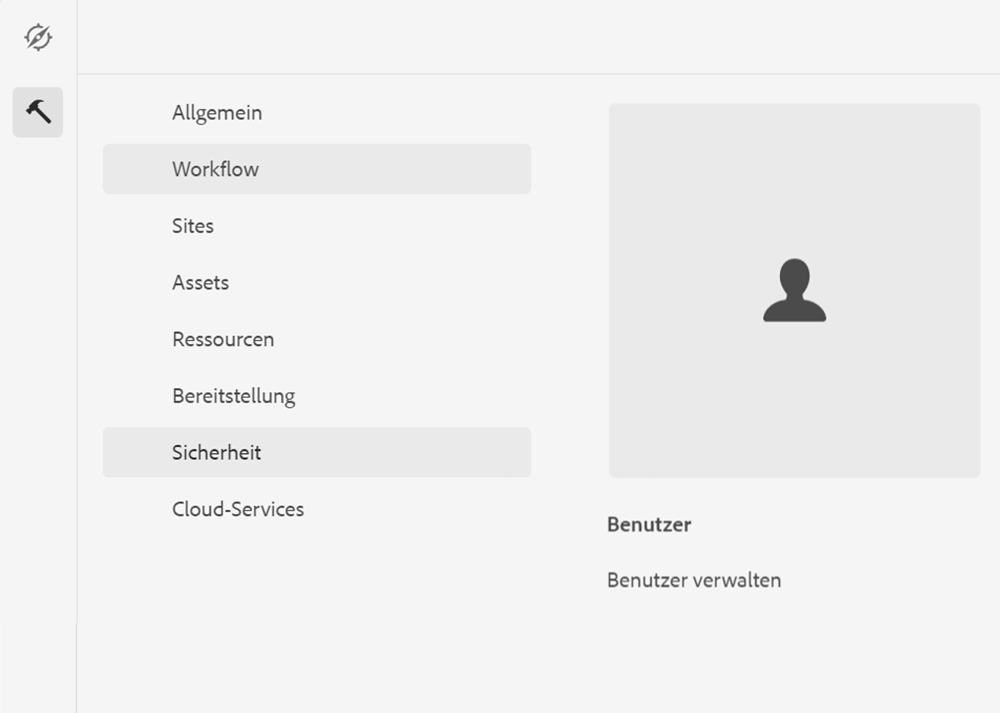

# Integration mit Adobe Campaign Classic {#integrating-campaign-classic}

Durch die Integration mit Adobe Campaign können Sie den E-Mail-Versand, den Inhalt und die Formulare direkt in AEM as a Cloud Service verwalten. Konfigurationsschritte sowohl in Adobe Campaign Classic als auch AEM as a Cloud Service sind erforderlich, um die bidirektionale Kommunikation zwischen Lösungen zu ermöglichen.

Beachten Sie, dass AEM as a Cloud Service und Adobe Campaign Classic auch unabhängig verwendet werden können. So können Marketer beispielsweise Kampagnen erstellen und Targeting in Adobe Campaign verwenden, während Ersteller von Inhalten in AEM as a Cloud Service an dem Design arbeiten können.

## Integrations-Workflow {#integration-workflow}

In den folgenden Kapiteln wird beschrieben, wie Sie die Lösungen integrieren. Dies erfordert Konfigurationsschritte sowohl in Adobe Campaign Classic als auch AEM as a Cloud Service. Daher lernen Sie Folgendes:

* [Erstellen des Operatorbenutzers](#create-operator)
* [as a Cloud Service AEM für die Integration konfigurieren](#aem-configuration)
* [Campaign Remote User konfigurieren](#configure-user)
* [Einrichten des externen Adobe Campaign Classic-Kontos](#acc-setup)

### Voraussetzungen {#prerequisites}

**Adobe Campaign Classic**

Für die Integration benötigen Sie eine funktionierende Adobe Campaign Classic-Instanz, einschließlich einer Datenbank. Weitere Informationen zum Einrichten und Konfigurieren von Adobe Campaign Classic finden Sie in der offiziellen [Adobe Campaign Classic-Dokumentation](https://experienceleague.adobe.com/docs/campaign-classic/using/campaign-classic-home.html) insbesondere im Handbuch zur Installation und Konfiguration. Beachten Sie, dass Sie zur Ausführung der unten aufgeführten Vorgänge auch die Administratorrolle benötigen.

**AEM as a Cloud Service**

Sie benötigen die [AEM as a Cloud Service](https://experienceleague.adobe.com/docs/experience-manager-cloud-service/content/overview/introduction.html) Lösung.

### Erstellen des Operatorbenutzers in Adobe Campaign Classic {#create-operator}

Öffnen Sie die Adobe Campaign Classic-Clientkonsole im Startmenü und melden Sie sich an. Die Startseite sollte angezeigt werden.

1. Klicken **Explorer** um die Explorer-Ansicht zu öffnen.
   
1. Navigieren Sie in der Baumansicht auf der linken Seite zu **Administration ->Zugriffsverwaltung ->Benutzer**.
1. Doppelklicken Sie auf die `aemserver` in der Liste Benutzer auf der rechten Seite.
1. Wechseln Sie zu **Bearbeiten** Registerkarte. Legen Sie das Kennwort für den aemserver fest.
   
1. Klicken Sie auf **Zugriffsberechtigungen** und klicken Sie auf **Zugriffsparameter bearbeiten** unter den Sicherheitseinstellungen.
1. Wählen Sie unter Verschlüsselung Öffentliches Netzwerk als autorisierten Verbindungsbereich aus. Klicken Sie auf **OK**.
   
1. Klicken Sie auf **Speichern**.
1. Abmelden.
1. Wechseln Sie zum Adobe Campaign Classic v7-Installationsspeicherort, z. B. `C:\Program Files\Adobe\Adobe Campaign Classic v7\conf` und öffnen Sie die `serverConf.xml` als Administrator.
   * Suchen Sie nach **Sicherheitszone**.
   * Legen Sie die folgenden Parameter fest `allowHTTP="true"` `sessionTokenOnly="true"` `allowUserPassword="true"`.
   * Speichern Sie die Datei.
1. Stellen Sie sicher, dass die Sicherheitszone nicht durch die entsprechende Einstellung in `config-<server name>.xml` Datei (C:\Program Files\Adobe\Adobe Campaign Classic v7\conf\config_acc-test.xml).
   * Wenn die Konfigurationsdatei eine separate Sicherheitszoneneinstellung enthält, ändern Sie die `allowUserPassword` auf &quot;true&quot;fest.
1. Wenn Sie den Adobe Campaign Classic-Server-Port ändern möchten, ersetzen Sie 8080 durch den gewünschten Anschluss (z. B.: 80).

>[!NOTE]
>
>Standardmäßig ist keine Sicherheitszone für den Benutzer konfiguriert. Um eine Verbindung zu Adobe Campaign mit AEM as a Cloud Service herstellen zu können, müssen Sie eine auswählen (siehe obige Schritte). Es wird dringend empfohlen, eine Sicherheitszone für AEM zu erstellen, um Sicherheitsprobleme zu vermeiden.

### Konfigurieren von AEM as a Cloud Service {#aem-configuration}

1. Melden Sie sich bei Cloud Manager an und starten Sie die AEM as a Cloud Service Autoreninstanz.
1. Navigieren Sie zu **Tools > Cloud Service > Legacy-Cloud Service**.
   
1. Scrollen Sie nach unten zu Adobe Campaign und klicken Sie auf **Jetzt konfigurieren** Link.
   * Geben Sie einen Titel ein.
   * Geben Sie einen Namen ein.
   * Klicken Sie auf **Erstellen**.
1. Auf dem Bildschirm &quot;Komponente bearbeiten&quot;
   * Geben Sie den Benutzernamen ein, siehe [Erstellen des Operatorbenutzers](#create-operator).
   * Geben Sie das Kennwort ein.
   * Geben Sie den Adobe Campaign Classic-Server-API-Endpunkt ein (z. B. `http://3.22625.51:80`).
   * Klicken Sie auf **Mit Adobe Campaign verbinden**.
   * Klicken Sie auf **OK**.

   >[!NOTE]
   >
   >Stellen Sie sicher, dass Ihr Adobe Campaign-Server über das Internet erreichbar ist, da AEM as a Cloud Service keine privaten Netzwerke erreichen kann.
1. Überprüfen Sie die Veröffentlichungsinstanz in der Konfiguration Link Externalizer .
Sie können diese Konfiguration anzeigen, indem Sie die Statusdump der OSGi-Dienste im Abschnitt [Entwicklerkonsole](https://experienceleague.adobe.com/docs/experience-manager-learn/cloud-service/debugging/debugging-aem-as-a-cloud-service/developer-console.html#osgi-services).
Wenn dies nicht korrekt ist, nehmen Sie Änderungen am entsprechenden Git-Repository der Instanz vor und stellen Sie dann die Konfiguration mithilfe von [Cloud Manager](https://experienceleague.adobe.com/docs/experience-manager-cloud-service/content/implementing/using-cloud-manager/deploy-code.html).

```
Service 3310 - [com.day.cq.commons.Externalizer] (pid: com.day.cq.commons.impl.ExternalizerImpl)",
"  from Bundle 420 - Day Communique 5 Commons Library (com.day.cq.cq-commons), version 5.12.16",
"    component.id: 2149",
"    component.name: com.day.cq.commons.impl.ExternalizerImpl",
"    externalizer.contextpath: ",
"    externalizer.domains: [local https://author-p17558-e33255-cmstg.adobeaemcloud.com, author https://author-p17558-e33255-cmstg.adobeaemcloud.com,
     publish https://publish-p17558-e33255-cmstg.adobeaemcloud.com]",
"    externalizer.encodedpath: false",
"    externalizer.host: ",
"    feature-origins: [com.day.cq:cq-quickstart:slingosgifeature:cq-platform-model_quickstart_author:6.6.0-V23085]",
"    service.bundleid: 420",
"    service.description: Creates absolute URLs",
"    service.scope: bundle",
"    service.vendor: Adobe Systems Incorporated",
```

>[!NOTE]
>
>Die Veröffentlichungsinstanz muss auch vom Adobe Campaign-Server aus erreichbar sein.

### Konfigurieren des Adobe Campaign Remote-Benutzers {#configure-user}

Sie müssen ein Kennwort für den Campaign-Remote-Benutzer festlegen. Dies ist erforderlich, um Adobe Campaign Classic mit AEM as a Cloud Service zu verbinden.

1. Navigieren Sie zu **AEM → Werkzeuge → Sicherheit → Benutzer**.
   
1. Suchen Sie nach `campaign-remote` und klicken Sie darauf.
1. Klicken Sie auf Kennwort ändern
   * Geben Sie das neue Kennwort zweimal ein.
   * Geben Sie Ihr AEM Passwort ein.
   * Klicken Sie auf **Speichern**.

### Konfigurieren des externen Adobe Campaign Classic-Kontos {#acc-setup}

Sie müssen auch ein externes Konto konfigurieren, um Adobe Campaign Classic mit der as a Cloud Service AEM-Instanz zu verbinden.

1. Melden Sie sich über die Clientkonsole beim Adobe Campaign Classic-Server an.
1. Navigieren Sie zur Explorer-Ansicht.
1. Navigieren Sie in der Baumansicht auf der linken Seite zu **Administration > Plattform > Externe Konten**.
1. Klicken Sie in der Listenansicht oben rechts auf AEM Instanz.
1. In der Konfiguration der AEM-Instanz
   * Geben Sie AEM as a Cloud Service Autor-IP/FQN ein, z. B. `https://author-p17558-e33255-cmstg.adobeaemcloud.com`.
   * Geben Sie den Benutzer und das Konto ein.
   * Geben Sie das Kennwort für den Campaign-Remote-Benutzer ein, den Sie in der as a Cloud Service AEM-Instanz festgelegt haben (siehe obiges Verfahren).
   * Wählen Sie die **Aktiviert** aktivieren.
   * Klicken Sie auf **Speichern**.

   >[!NOTE]
   >
   >Die IP/FQN-Adresse des AEM-Autorenservers muss von der Adobe Campaign Classic-Serverinstanz aus erreichbar sein. Fügen Sie außerdem nicht den umgekehrten Schrägstrich in die IP/FQN des AEM-Autorenservers ein.

Nachdem Adobe Campaign Classic und AEM as a Cloud Service konfiguriert wurden, ist die Integration nun abgeschlossen. Darüber hinaus erfahren Sie, wie Sie einen Adobe Experience Manager-Newsletter erstellen, indem Sie [diese Seite](/help/sites-cloud/integrating/creating-newsletter.md).
