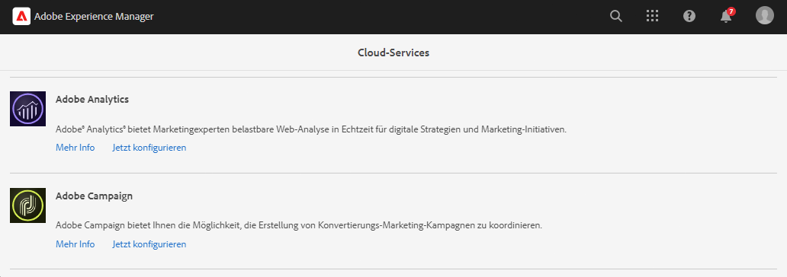
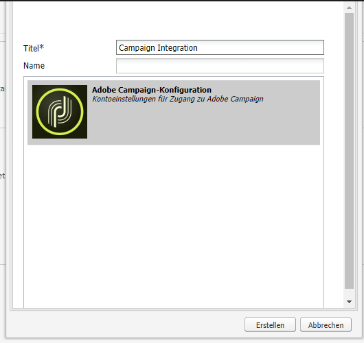
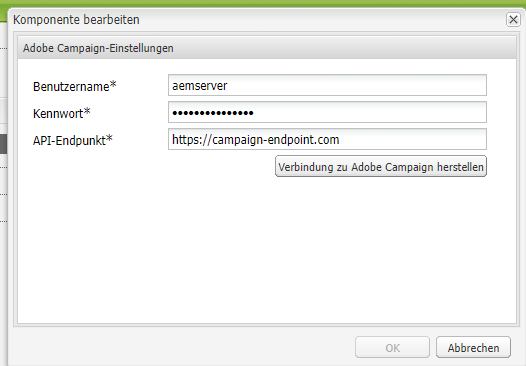

# Integration mit Adobe Campaign Classic {#integrating-campaign-classic}

Durch die Integration von AEM as a Cloud Service mit Adobe Campaign können Sie den E-Mail-Versand, den Inhalt und die Formulare direkt in AEM as a Cloud Service verwalten. Zur bidirektionalen Kommunikation zwischen Lösungen sind Konfigurationsschritte sowohl in Adobe Campaign Classic als auch AEM as a Cloud Service erforderlich.

Durch diese Integration können AEM as a Cloud Service und Adobe Campaign Classic unabhängig verwendet werden. Marketingexperten können Kampagnen erstellen und Targeting in Adobe Campaign verwenden, während Ersteller von Inhalten parallel an der Inhaltserstellung in AEM as a Cloud Service arbeiten können. Durch die Integration können Inhalt und Design der Kampagne in AEM zielgerichtet und von Campaign bereitgestellt werden.

## Integrationsschritte {#integration-steps}

Die Integration von AEM und Campaign erfordert in beiden Lösungen eine Reihe von Schritten.

1. [Installieren Sie das AEM Integrationspaket in Campaign.](#install-package)
1. [Benutzer für AEM in Campaign erstellen](#create-operator)
1. [Campaign-Integration in AEM konfigurieren](#campaign-integration)
1. [AEM Externalizer konfigurieren](#externalizer)
1. [Konfigurieren des Campaign-Remote-Benutzers in AEM](#configure-user)
1. [Externes AEM-Konto in Campaign konfigurieren](#acc-setup)

Dieses Dokument führt Sie durch die einzelnen Schritte im Detail

## Voraussetzungen {#prerequisites}

* Administratorzugriff auf Adobe Campaign Classic
   * Für die Integration benötigen Sie eine funktionierende Adobe Campaign Classic-Instanz, einschließlich einer konfigurierten Datenbank.
   * Weitere Informationen zum Einrichten und Konfigurieren von Adobe Campaign Classic finden Sie im Abschnitt [Adobe Campaign Classic-Dokumentation,](https://experienceleague.adobe.com/docs/campaign-classic/using/campaign-classic-home.html) insbesondere das Handbuch zur Installation und Konfiguration.

* Administratorzugriff auf AEM as a Cloud Service

## Installieren des AEM Integrationspakets in Campaign {#install-package}

Die **AEM** -Paket in Adobe Campaign enthält eine Reihe von Standardkonfigurationen, die für die Verbindung mit AEM erforderlich sind.

1. Als Administrator melden Sie sich mit der Clientkonsole bei der Adobe Campaign-Instanz an.

1. Auswählen **Instrumente** > **Erweitert** > **Package importieren..**.

   

1. Klicken **Standardpaket installieren** und klicken Sie anschließend auf **Nächste**.

1. Überprüfen Sie die **AEM** Paket.

   

1. Klicken **Nächste**, und dann **Starten** um die Installation zu starten.

   

1. Klicken **Schließen** wenn die Installation abgeschlossen ist.

Das Integrationspaket ist jetzt installiert.

## Erstellen des Operators für AEM in Campaign {#create-operator}

Das Integrationspaket erstellt automatisch das `aemserver` -Operator, AEM verwendet, um eine Verbindung mit Adobe Campaign herzustellen. Sie müssen eine Sicherheitszone für diesen Benutzer definieren und sein Kennwort festlegen.

1. Melden Sie sich mit der Clientkonsole bei Adobe Campaign als Administrator an.

1. Auswählen **Instrumente** -> **Explorer** aus der Menüleiste.

1. Navigieren Sie im Explorer zum **Administration** > **Zugriffsverwaltung** > **Benutzer** Knoten.

1. Wählen Sie die `aemserver` Operator.

1. Im **Bearbeiten** im Bedienfeld die **Zugriffsberechtigungen** und klicken Sie auf die **Zugriffsparameter bearbeiten..** Link.

   

1. Wählen Sie die entsprechende Sicherheitszone aus und definieren Sie die vertrauenswürdige IP-Maske nach Bedarf.

1. Klicken Sie auf **Speichern**.

1. Melden Sie sich beim Adobe Campaign-Client ab.

1. Navigieren Sie im Dateisystem des Adobe Campaign-Servers zum Speicherort der Campaign-Installation und bearbeiten Sie die `serverConf.xml` als Administrator. Diese Datei befindet sich normalerweise unter:
   * `C:\Program Files\Adobe\Adobe Campaign Classic v7\conf` unter Windows.
   * `/usr/local/neolane/nl6/conf/eng` in Linux.

1. Suchen Sie nach `securityZone` und stellen Sie sicher, dass die folgenden Parameter für die Sicherheitszone des AEM-Benutzers festgelegt sind.

   * `allowHTTP="true"`
   * `sessionTokenOnly="true"`
   * `allowUserPassword="true"`.

1. Speichern Sie die Datei.

1. Stellen Sie sicher, dass die Sicherheitszone nicht durch die entsprechende Einstellung in der `config-<server name>.xml` -Datei.

   * Wenn die Konfigurationsdatei eine separate Sicherheitszoneneinstellung enthält, ändern Sie die `allowUserPassword` Attribut `true`.

1. Wenn Sie den Adobe Campaign Classic-Serveranschluss ändern möchten, ersetzen Sie `8080` mit dem gewünschten Anschluss.

>[!CAUTION]
>
>Standardmäßig ist keine Sicherheitszone für den Benutzer konfiguriert. Damit AEM eine Verbindung zu Adobe Campaign herstellen kann, müssen Sie einen Bereich auswählen, wie in den vorherigen Schritten beschrieben.
>
>Adobe empfiehlt dringend, eine Sicherheitszone zu erstellen, die AEM gewidmet ist, um Sicherheitsprobleme zu vermeiden. Weitere Informationen zu diesem Thema finden Sie im Abschnitt [Dokumentation zu Adobe Campaign Classic.](https://experienceleague.adobe.com/docs/campaign-classic/using/installing-campaign-classic/additional-configurations/security-zones.html)

1. Kehren Sie im Campaign-Client zur `aemserver` und wählen Sie **Allgemein** Registerkarte.

1. Klicken Sie auf **Kennwort zurücksetzen...** Link.

1. Geben Sie ein Kennwort an und speichern Sie es an einem sicheren Speicherort für die zukünftige Verwendung.

1. Klicken **OK** , um das Kennwort für die `aemserver` Operator.

## Campaign-Integration in AEM konfigurieren {#campaign-integration}

AEM [den Operator, den Sie bereits in Campaign eingerichtet haben](#create-operator) zur Kommunikation mit Campaign

1. Melden Sie sich bei Ihrer AEM Authoring-Instanz als Administrator an.

1. Wählen Sie in der Seitenleiste der globalen Navigation die Option **Instrumente** > **Cloud Services** > **Ältere Cloud Services** > **Adobe Campaign** Klicken Sie auf **Jetzt konfigurieren**.

   

1. Erstellen Sie im Dialogfeld eine Campaign-Dienstkonfiguration, indem Sie eine **Titel** und klicken Sie auf **Erstellen**.

   

1. Ein neues Fenster und Dialogfeld wird geöffnet, um die Konfiguration zu bearbeiten. Geben Sie die erforderlichen Informationen an.

   * **Benutzername** - Dies ist [den im vorherigen Schritt erstellten Adobe Campaign AEM Integrationspaket-Operator.](#create-operator) Standardmäßig ist `aemserver`.
   * **Passwort** - Dies ist das Kennwort für [den im vorherigen Schritt erstellten Adobe Campaign AEM Integrationspaket-Operator.](#create-operator)
   * **API-Endpunkt** - Dies ist die Adobe Campaign-Instanz-URL.

   

1. Auswählen **Verbindung zu Adobe Campaign herstellen** , um die Verbindung zu überprüfen, und klicken Sie dann auf **OK**.

AEM können jetzt mit Adobe Campaign kommunizieren.

>[!NOTE]
>
>Stellen Sie sicher, dass Ihr Adobe Campaign-Server über das Internet erreichbar ist. AEM as a Cloud Service kann nicht auf private Netzwerke zugreifen.

## Konfigurieren des AEM Externalizer {#externalizer}

Der Externalizer ist ein OSGi-Dienst in AEM, der einen Ressourcenpfad in eine externe und absolute URL umwandelt, was erforderlich ist, damit AEM Inhalte bereitstellen kann, die Campaign verwenden kann.

1. Melden Sie sich bei der AEM Authoring-Instanz als Administrator an.
1. Bestätigen Sie die Veröffentlichungsinstanz in der Externalizer-Konfiguration, indem Sie die Statusdump der OSGi-Dienste im Abschnitt [Entwicklerkonsole.](https://experienceleague.adobe.com/docs/experience-manager-learn/cloud-service/debugging/debugging-aem-as-a-cloud-service/developer-console.html#osgi-services)
1. Wenn dies nicht korrekt ist, nehmen Sie die erforderlichen Änderungen im entsprechenden Git-Repository der Instanz vor und dann [die Konfiguration mithilfe von Cloud Manager bereitstellen.](/help/implementing/cloud-manager/deploy-code.md)

```text
Service 3310 - [com.day.cq.commons.externalizer] (pid: com.day.cq.commons.impl.externalizerImpl)",
"  from Bundle 420 - Day Communique 5 Commons Library (com.day.cq.cq-commons), version 5.12.16",
"    component.id: 2149",
"    component.name: com.day.cq.commons.impl.externalizerImpl",
"    externalizer.contextpath: ",
"    externalizer.domains: [local https://author-p17558-e33255-cmstg.adobeaemcloud.com, author https://author-p17558-e33255-cmstg.adobeaemcloud.com,
     publish https://publish-p17558-e33255-cmstg.adobeaemcloud.com]",
"    externalizer.encodedpath: false",
"    externalizer.host: ",
"    feature-origins: [com.day.cq:cq-quickstart:slingosgifeature:cq-platform-model_quickstart_author:6.6.0-V23085]",
"    service.bundleid: 420",
"    service.description: Creates absolute URLs",
"    service.scope: bundle",
"    service.vendor: Adobe Systems Incorporated",
```

>[!NOTE]
>
>Die Veröffentlichungsinstanz muss vom Adobe Campaign-Server aus erreichbar sein.

## Konfigurieren des Campaign-Remote-Benutzers in AEM {#configure-user}

Damit Campaign mit AEM kommunizieren kann, müssen Sie ein Kennwort für die `campaign-remote` Benutzer in AEM.

1. Melden Sie sich in AEM als Administrator an.
1. Klicken Sie in der Hauptnavigationskonsole auf **Instrumente** in der linken Leiste.
1. Klicken Sie anschließend auf **Sicherheit** -> **Benutzer** , um die Benutzeradministrationskonsole zu öffnen.
1. Suchen Sie die `campaign-remote` Benutzer.
1. Wählen Sie die `campaign-remote` Benutzer und klicken Sie auf **Eigenschaften** , um den Benutzer zu bearbeiten.
1. Im **Benutzereinstellungen bearbeiten** Fenster, klicken Sie auf **Kennwort ändern**.
1. Geben Sie ein neues Kennwort für den Benutzer ein und notieren Sie das Kennwort an einem sicheren Ort für die zukünftige Verwendung.
1. Klicken **Speichern** , um die Kennwortänderung zu speichern.
1. Klicken **Speichern und schließen** , um die Änderungen an der `campaign-remote` Benutzer.

## Konfigurieren des AEM externen Kontos in Campaign {#acc-setup}

Wann [Installieren der **AEM** Package in Campaign,](#install-package) ein externes Konto für AEM erstellt wird. Durch die Konfiguration dieses externen Kontos kann Adobe Campaign eine Verbindung zu AEM as a Cloud Service herstellen und so eine bidirektionale Kommunikation zwischen den Lösungen ermöglichen.

1. Melden Sie sich mit der Clientkonsole bei Adobe Campaign als Administrator an.

1. Auswählen **Instrumente** -> **Explorer** aus der Menüleiste.

1. Navigieren Sie im Explorer zum **Administration** > **Plattform** > **Externe Konten** Knoten.

   

1. Suchen Sie das externe AEM. Standardmäßig hat er die folgenden Werte:

   * **Typ** - AEM
   * **Titel** - AEM Instanz
   * **Interner Name** - aemInstance

1. Im **Allgemein** in diesem Konto die Benutzerinformationen eingeben, die Sie in der [Kampagnen-Remote-Benutzerkennwort festlegen](#set-campaign-remote-password) Schritt.

   * **Server** - AEM Autorenserveradresse
      * Der AEM-Autorenserver muss von der Adobe Campaign Classic-Serverinstanz aus erreichbar sein.
      * Stellen Sie sicher, dass die Serveradresse **not** enden in einem Schrägstrich.
   * **Konto** - Standardmäßig ist dies die `campaign-remote` -Benutzer, den Sie in AEM im [Kampagnen-Remote-Benutzerkennwort festlegen](#set-campaign-remote-password) Schritt.
   * **Passwort** - Dieses Kennwort ist mit dem `campaign-remote` -Benutzer, den Sie in AEM im [Kampagnen-Remote-Benutzerkennwort festlegen](#set-campaign-remote-password) Schritt.

1. Wählen Sie die **Aktiviert** aktivieren.

1. Klicken Sie auf **Speichern**.

Adobe Campaign kann jetzt mit AEM kommunizieren.

## Nächste Schritte {#next-steps}

Nachdem sowohl Adobe Campaign Classic als auch AEM as a Cloud Service konfiguriert wurden, ist die Integration nun abgeschlossen.

Sie können jetzt erfahren, wie Sie einen Newsletter in Adobe Experience Manager erstellen, indem Sie mit [dieses Dokument.](/help/sites-cloud/authoring/campaign/creating-newsletters.md)
