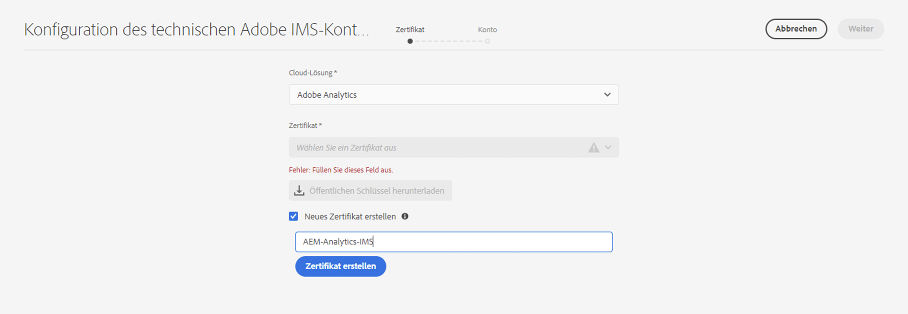
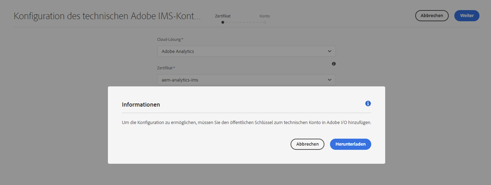
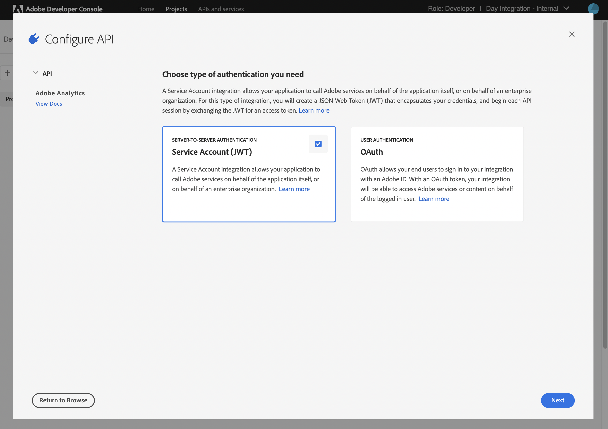
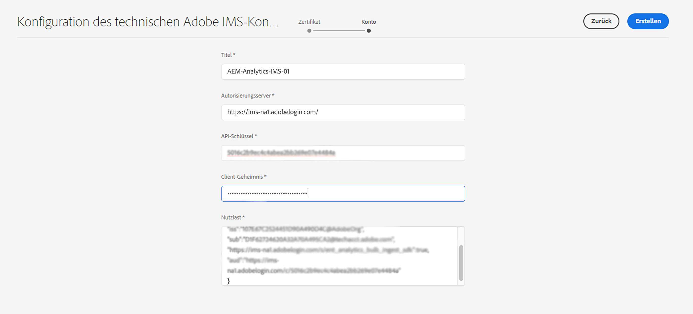
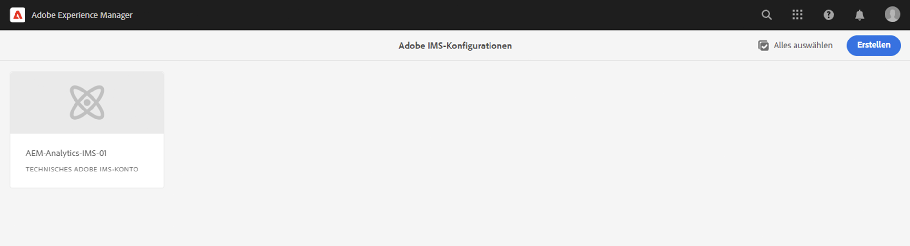
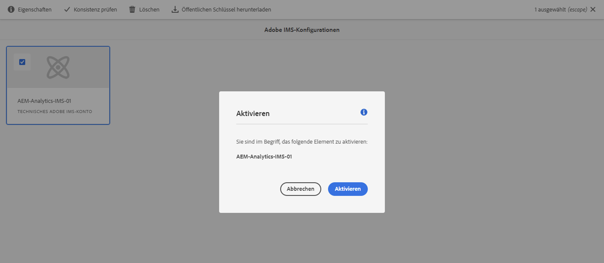

# IMS-Konfiguration für die Integration mit Adobe Analytics {#ims-configuration-for-integration-with-adobe-analytics}

Die Integration von Adobe Experience Manager as a Cloud Service (AEMaaCS) mit Adobe Analytics über die Analytics Standard-API erfordert die Konfiguration von Adobe IMS (Identity Management-System). Die Konfiguration wird mit der Adobe Developer-Konsole durchgeführt.

>[!NOTE]
>
>Die Unterstützung für die Adobe Analytics Standard API 2.0 ist neu in AEMaaCS 2022.2.0. Diese API-Version unterstützt die IMS-Authentifizierung.
>
>Die API-Auswahl wird von der Authentifizierungsmethode gesteuert, die für die AEM/Analytics-Integration verwendet wird.
>
>Weitere Informationen finden Sie unter [Migration zu den 2.0-APIs](https://developer.adobe.com/analytics-apis/docs/2.0/guides/migration/).

## Voraussetzungen {#prerequisites}

Bevor Sie mit diesem Verfahren beginnen:

* [Adobe-Support](https://helpx.adobe.com/de/contact/enterprise-support.ec.html) muss Ihr Konto für Folgendes bereitstellen:

   * Adobe Console
   * Adobe-Entwicklerkonsole
   * Adobe Analytics und
   * Adobe IMS (Identity Management System)

* Der Systemadministrator Ihres Unternehmens sollte die Admin Console verwenden, um die erforderlichen Entwickler in Ihrem Unternehmen den relevanten Produktprofilen hinzuzufügen.

   * Dadurch erhalten bestimmte Entwickler Berechtigungen zum Aktivieren von Integrationen mithilfe der Adobe Developer Console.
   * Weitere Informationen finden Sie unter [Verwalten von Entwicklern](https://helpx.adobe.com/enterprise/admin-guide.html/enterprise/using/manage-developers.ug.html).

## Konfigurieren einer IMS-Konfiguration - Generieren eines öffentlichen Schlüssels {#configuring-ims-generating-a-public-key}

Der erste Schritt der Konfiguration besteht darin, eine IMS-Konfiguration in AEM zu erstellen und den öffentlichen Schlüssel zu generieren.

1. Öffnen Sie AEM **Instrumente** Menü.
1. Im **Sicherheit** Abschnittsauswahl **Adobe IMS-Konfigurationen**.
1. Auswählen **Erstellen** , um **Technische Kontokonfiguration für Adobe IMS**.
1. Verwenden der Dropdown-Liste unter **Cloud-Konfiguration** auswählen **Adobe Analytics**.
1. Aktivieren **Neues Zertifikat erstellen** und geben Sie einen neuen Alias ein.
1. Bestätigen mit **Zertifikat erstellen**.

   

1. Auswählen **Download** (oder **Öffentlichen Schlüssel herunterladen**), um die Datei auf Ihr lokales Laufwerk herunterzuladen, damit sie einsatzbereit ist, wenn [IMS für die Adobe Analytics-Integration mit AEM konfigurieren](#configuring-ims-adobe-analytics-integration-with-aem).

   >[!CAUTION]
   >
   >Lassen Sie diese Konfiguration geöffnet. Sie wird bei [Abschließen der IMS-Konfiguration in AEM](#completing-the-ims-configuration-in-aem).

   

## IMS für Adobe Analytics-Integration mit AEM konfigurieren {#configuring-ims-adobe-analytics-integration-with-aem}

Mithilfe der Adobe Developer Console müssen Sie ein Projekt (Integration) mit Adobe Analytics erstellen (AEM verwenden) und dann die erforderlichen Berechtigungen zuweisen.

### Erstellen des Projekts {#creating-the-project}

Öffnen Sie die Adobe Developer Console, um ein Projekt mit Adobe Analytics zu erstellen, das AEM Folgendes verwenden wird:

1. Öffnen Sie die Adobe Developer Console for Projects:

   [https://developer.adobe.com/console/projects](https://developer.adobe.com/console/projects)

1. Alle Projekte, die Sie haben, werden angezeigt. Auswählen **Neues Projekt erstellen** - Ort und Nutzung hängen von Folgendem ab:

   * Wenn Sie noch kein Projekt haben, **Neues Projekt erstellen** wird zentriert sein, unten.
      
   * Wenn Sie bereits über vorhandene Projekte verfügen, werden diese aufgelistet und **Neues Projekt erstellen** oben rechts.
      

1. Auswählen **Zum Projekt hinzufügen** gefolgt von **API**:

   

1. Auswählen **Adobe Analytics**, dann **Nächste**:

   >[!NOTE]
   >
   >Wenn Sie Adobe Analytics abonniert haben, es jedoch nicht aufgeführt sehen, sollten Sie die Option [Voraussetzungen](#prerequisites).

   

1. Auswählen **Dienstkonto (JWT)** als Authentifizierungstyp angeben, fahren Sie dann mit **Nächste**:

   

1. **Öffentlichen Schlüssel hochladen** und nach Abschluss des Vorgangs mit **Nächste**:

   

1. Überprüfen Sie die Anmeldeinformationen und fahren Sie mit **Nächste**:

   

1. Wählen Sie die erforderlichen Produktprofile aus und fahren Sie mit **Konfigurierte API speichern**:

   

1. Die Konfiguration wird bestätigt.

### Zuweisen von Berechtigungen zur Integration {#assigning-privileges-to-the-integration}

Sie müssen der Integration jetzt die erforderlichen Berechtigungen zuweisen:

1. Adobe öffnen **Admin Console**:

   * [https://adminconsole.adobe.com](https://adminconsole.adobe.com/)

1. Navigieren Sie zu **Produkte** (obere Symbolleiste) und wählen Sie **Adobe Analytics - &lt;*your-tenant-id*>** (im linken Bereich).
1. Auswählen **Produktprofile**, dann den gewünschten Arbeitsbereich aus der angezeigten Liste. Beispiel: Standardarbeitsbereich.
1. Auswählen **API-Anmeldeinformationen**, dann die erforderliche Integrationskonfiguration.
1. Auswählen **Editor** als **Produktrolle**; anstelle von **Beobachter**.

## Für das Adobe Developer Console-Integrationsprojekt gespeicherte Details {#details-stored-for-the-ims-integration-project}

In der Adobe Developer Console - Projekte können Sie eine Liste aller Integrationsprojekte anzeigen:

* [https://developer.adobe.com/console/projects](https://developer.adobe.com/console/projects)

Wählen Sie einen bestimmten Projekteintrag aus, um weitere Details zur Konfiguration anzuzeigen. Dazu gehören:

* Projektübersicht
* Insights
* Berechtigungen
   * Dienstkonto (JWT)
      * Details zu Berechtigungen
      * JWT generieren
* APIS
   * Beispiel: Adobe Analytics

Einige davon müssen Sie die Integration von Adobe Analytics in AEM basierend auf IMS abschließen.

## Abschließen der IMS-Konfiguration in AEM {#completing-the-ims-configuration-in-aem}

Kehren Sie zu AEM zurück und Sie können die IMS-Konfiguration abschließen, indem Sie erforderliche Werte aus der IMS-Integration für Analytics hinzufügen:

1. Kehren Sie zu [IMS-Konfiguration geöffnet in AEM](#configuring-ims-generating-a-public-key).
1. Wählen Sie **Weiter** aus.

1. Hier können Sie die [Details aus der Projektkonfiguration in der Adobe Developer Console](#details-stored-for-the-ims-integration-project):

   * **Titel**: Ihr Text.
   * **Autorisierungsserver**: Kopieren/Einfügen Sie dies aus dem `aud` der **Nutzlast** unten, z. B. `https://ims-na1.adobelogin.com` im Beispiel unten
   * **API-Schlüssel**: Kopieren Sie dies aus dem **Anmeldeinformationen** Abschnitt [Projektübersicht](#details-stored-for-the-ims-integration-project)
   * **Client Secret**: Generieren Sie dies im [Registerkarte &quot;Client-Geheimnis&quot;im Abschnitt &quot;Service-Konto (JWT)&quot;](#details-stored-for-the-ims-integration-project)und kopieren
   * **Nutzlast**: Kopieren Sie dies aus dem [Registerkarte &quot;JWT generieren&quot;im Abschnitt &quot;Dienstkonto (JWT)&quot;](#details-stored-for-the-ims-integration-project)

   

1. Bestätigen Sie mit **Erstellen**.

1. Ihre Adobe Analytics-Konfiguration wird in der AEM Console angezeigt.

   

## IMS-Konfiguration bestätigen {#confirming-the-ims-configuration}

So überprüfen Sie, ob die Konfiguration erwartungsgemäß funktioniert:

1. Öffnen Sie:

   * `https://localhost<port>/libs/cq/adobeims-configuration/content/configurations.html`

   Beispiel:

   * `https://localhost:4502/libs/cq/adobeims-configuration/content/configurations.html`

1. Wählen Sie Ihre Konfiguration aus.
1. Auswählen **Konsistenzprüfung** aus der Symbolleiste, gefolgt von **Überprüfen**.

   

1. Bei erfolgreicher Ausführung wird eine Bestätigungsmeldung angezeigt.

## Abschließen der Integration mit Adobe Analytics {#complete-the-integration-with-adobe-analytics}

Sie können jetzt diese IMS-Konfiguration verwenden, um die [Integration mit Adobe Analytics](/help/sites-cloud/integrating/integrating-adobe-analytics.md).

<!--
## Configuring the Adobe Analytics Cloud Service {#configuring-the-adobe-analytics-cloud-service}

The configuration can now be referenced for a Cloud Service to use the Analytics Standard API:

1. Open the **Tools** menu. Then, within the **Cloud Services** section, select **Legacy Cloud Services**.
1. Scroll down to **Adobe Analytics** and select **Configure now**.

   The **Create Configuration** dialog will open.

1. Enter a **Title** and, if you want, a **Name** (if left blank this will be generated from the title).

   You can also select the required template (if more than one is available).

1. Confirm with **Create**.

   The **Edit Component** dialog will open.

1. Enter the details in the **Analytics Settings** tab:

    * **Authentication**: IMS

    * **IMS Configuration**: select the name of the IMS Configuration

1. Click **Connect to Analytics** to initialize the connection with Adobe Analytics.

   If the connection is successful, the message **Connection successful** is displayed.

1. Select **OK** on the message.

1. Complete other parameters as required, followed by **OK** on the dialog to confirm the configuration.

1. You can now proceed to [Adding an Analytics Framework](/help/sites-administering/adobeanalytics-connect.md) to configure parameters that will be sent to Adobe Analytics. 
-->
