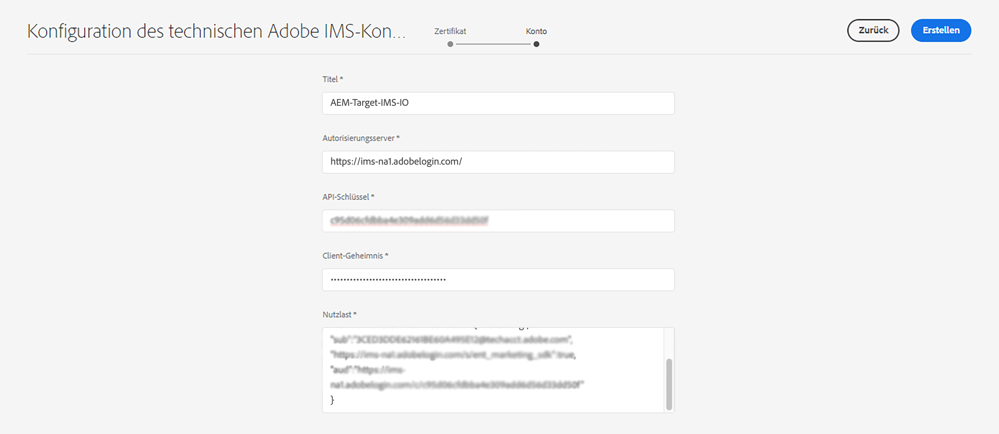

# IMS-Konfiguration für die Integration mit Adobe Target{#ims-configuration-for-integration-with-adobe-target}

Die Integration von AEM mit Adobe Target über die Target Standard-API erfordert die Konfiguration von Adobe IMS (Identity Management-System). Die Konfiguration wird mit der Adobe Developer Console durchgeführt.

>[!NOTE]
>
>Die Unterstützung für die Adobe Target Standard-API ist in AEMaaCS neu. Die Target Standard-API verwendet die IMS-Authentifizierung.
>
>Die API-Auswahl wird von der Authentifizierungsmethode gesteuert, die für die AEM/Target-Integration verwendet wird.

## Voraussetzungen {#prerequisites}

Bevor Sie mit diesem Verfahren beginnen:

* [Adobe-Support](https://helpx.adobe.com/de/contact/enterprise-support.ec.html) muss Ihr Konto für Folgendes bereitstellen:

   * Adobe Console
   * Adobe-Entwicklerkonsole
   * Adobe Target und
   * Adobe IMS (Identity Management System)

* Der Systemadministrator Ihres Unternehmens sollte die Admin Console verwenden, um die erforderlichen Entwickler in Ihrem Unternehmen den relevanten Produktprofilen hinzuzufügen.

   * Dadurch erhalten bestimmte Entwickler Berechtigungen zum Aktivieren von Integrationen mithilfe der Adobe Developer Console.
   * Weitere Informationen finden Sie unter [Verwalten von Entwicklern](https://helpx.adobe.com/enterprise/admin-guide.html/enterprise/using/manage-developers.ug.html).

## Konfigurieren einer IMS-Konfiguration - Generieren eines öffentlichen Schlüssels {#configuring-an-ims-configuration-generating-a-public-key}

Der erste Schritt der Konfiguration besteht darin, eine IMS-Konfiguration in AEM zu erstellen und den öffentlichen Schlüssel zu generieren.

1. Öffnen Sie AEM **Instrumente** Menü.
1. Im **Sicherheit** Abschnittsauswahl **Adobe IMS-Konfigurationen**.
1. Auswählen **Erstellen** , um **Technische Kontokonfiguration für Adobe IMS**.
1. Verwenden der Dropdown-Liste unter **Cloud-Konfiguration** auswählen **Adobe Target**.
1. Aktivieren **Neues Zertifikat erstellen** und geben Sie einen neuen Alias ein.
1. Bestätigen mit **Zertifikat erstellen**.

   

1. Auswählen **Download** (oder **Öffentlichen Schlüssel herunterladen**), um die Datei auf Ihr lokales Laufwerk herunterzuladen, damit sie einsatzbereit ist, wenn [IMS für die Adobe Target-Integration mit AEM konfigurieren](#configuring-ims-adobe-target-integration-with-aem).

   >[!CAUTION]
   >
   >Lassen Sie diese Konfiguration geöffnet. Sie wird bei [Abschließen der IMS-Konfiguration in AEM](#completing-the-ims-configuration-in-aem).

   

## IMS für Adobe Target-Integration mit AEM konfigurieren {#configuring-ims-adobe-target-integration-with-aem}

Adobe Developer Console Project (Integration) mit Adobe Target, das AEM verwenden wird, und weisen Sie dann die erforderlichen Berechtigungen zu.

### Erstellen des Projekts {#creating-the-project}

Öffnen Sie die Adobe Developer Console, um ein Projekt mit Adobe Target zu erstellen, das AEM Folgendes verwenden wird:

1. Öffnen Sie die Adobe Developer Console for Projects:

   [https://developer.adobe.com/console/projects](https://developer.adobe.com/console/projects)

1. Alle Projekte, die Sie haben, werden angezeigt. Auswählen **Neues Projekt erstellen** - Ort und Nutzung hängen von Folgendem ab:

   * Wenn Sie noch kein Projekt haben, **Neues Projekt erstellen** wird zentriert sein, unten.
      
   * Wenn Sie bereits über vorhandene Projekte verfügen, werden diese aufgelistet und **Neues Projekt erstellen** oben rechts.
      

1. Auswählen **Zum Projekt hinzufügen** gefolgt von **API**:

   

1. Auswählen **Adobe Target**, dann **Nächste**:

   >[!NOTE]
   >
   >Wenn Sie Adobe Target abonniert haben, es jedoch nicht aufgeführt sehen, sollten Sie die Option [Voraussetzungen](#prerequisites).

   

1. **Öffentlichen Schlüssel hochladen** und nach Abschluss des Vorgangs mit **Nächste**:

   

1. Überprüfen Sie die Anmeldeinformationen und fahren Sie mit **Nächste**:

   

1. Wählen Sie die erforderlichen Produktprofile aus und fahren Sie mit **Konfigurierte API speichern**:

   >[!NOTE]
   >
   >Welche Produktprofile mit angezeigt werden, hängt davon ab, ob Sie über Folgendes verfügen:
   >
   >* Adobe Target Standard - nur **Standardarbeitsbereich** ist verfügbar
   >* Adobe Target Premium - alle verfügbaren Arbeitsbereiche werden aufgelistet, wie unten dargestellt

   

1. Die Erstellung wird bestätigt.

<!--
1. The creation will be confirmed, you can now **Continue to integration details**; these are needed for [Completing the IMS Configuration in AEM](#completing-the-ims-configuration-in-aem).

   
-->

<!-- could not verify - only saw Adobe Target Classic -->

### Zuweisen von Berechtigungen zur Integration {#assigning-privileges-to-the-integration}

Sie müssen der Integration jetzt die erforderlichen Berechtigungen zuweisen:

1. Adobe öffnen **Admin Console**:

   * [https://adminconsole.adobe.com](https://adminconsole.adobe.com/)

1. Navigieren Sie zu **Produkte** (obere Symbolleiste) und wählen Sie **Adobe Target - &lt;*your-tenant-id*>** (im linken Bereich).
1. Auswählen **Produktprofile**, dann den gewünschten Arbeitsbereich aus der angezeigten Liste. Beispiel: Standardarbeitsbereich.
1. Auswählen **API-Anmeldeinformationen**, dann die erforderliche Integrationskonfiguration.
1. Auswählen **Editor** als **Produktrolle**; anstelle von **Beobachter**.

## Für das Adobe Developer Console-Integrationsprojekt gespeicherte Details {#details-stored-for-the-ims-integration-project}

In der Projektekonsole der Adobe Developer Console können Sie eine Liste aller Integrationsprojekte sehen:

* [https://developer.adobe.com/console/projects](https://developer.adobe.com/console/projects)

Auswählen **Ansicht** (rechts neben einem bestimmten Projekteintrag), um weitere Details zur Konfiguration anzuzeigen. Dazu gehören:

* Projektübersicht
* Insights
* Berechtigungen
   * Dienstkonto (JWT)
      * Details zu Berechtigungen
      * JWT generieren
* APIS
   * Beispiel: Adobe Target

Einige davon müssen Sie die Integration von Adobe Target in AEM basierend auf IMS abschließen.

## Abschließen der IMS-Konfiguration in AEM {#completing-the-ims-configuration-in-aem}

Kehren Sie zu AEM zurück und Sie können die IMS-Konfiguration abschließen, indem Sie erforderliche Werte aus der IMS-Integration für Target hinzufügen:

1. Kehren Sie zu [IMS-Konfiguration geöffnet in AEM](#configuring-an-ims-configuration-generating-a-public-key).
1. Wählen Sie **Weiter** aus.

1. Hier können Sie die [Details aus der Projektkonfiguration in der Adobe Developer Console](#details-stored-for-the-ims-integration-project):

   * **Titel**: Ihr Text.
   * **Autorisierungsserver**: Kopieren/Einfügen Sie dies aus dem `aud` der **Nutzlast** unten, z. B. `https://ims-na1.adobelogin.com` im Beispiel unten
   * **API-Schlüssel**: Kopieren Sie dies aus dem Projekt [Übersicht](#details-stored-for-the-ims-integration-project) Abschnitt
   * **Client Secret**: Generieren Sie dies im Projekt [Übersicht](#details-stored-for-the-ims-integration-project) und kopieren
   * **Nutzlast**: Kopieren Sie dies aus dem [JWT generieren](#details-stored-for-the-ims-integration-project) Abschnitt

   

1. Bestätigen Sie mit **Erstellen**.

1. Ihre Adobe Target-Konfiguration wird in der AEM Console angezeigt.

   

## IMS-Konfiguration bestätigen {#confirming-the-ims-configuration}

So überprüfen Sie, ob die Konfiguration erwartungsgemäß funktioniert:

1. Öffnen Sie:

   * `https://localhost<port>/libs/cq/adobeims-configuration/content/configurations.html`

   Beispiel:

   * `https://localhost:4502/libs/cq/adobeims-configuration/content/configurations.html`

1. Wählen Sie Ihre Konfiguration aus.
1. Auswählen **Konsistenzprüfung** aus der Symbolleiste, gefolgt von **Überprüfen**.

   

1. Bei erfolgreicher Ausführung wird eine Bestätigungsmeldung angezeigt.

## Abschließen der Integration mit Adobe Target {#complete-the-integration-with-adobe-target}

Sie können jetzt diese IMS-Konfiguration verwenden, um die [Integration mit Adobe Target](/help/sites-cloud/integrating/integrating-adobe-target.md).

<!--

## Configuring the Adobe Target Cloud Service {#configuring-the-adobe-target-cloud-service}

The configuration can now be referenced for a Cloud Service to use the Target Standard API:

1. Open the **Tools** menu. Then, within the **Cloud Services** section, select **Legacy Cloud Services**.
1. Scroll down to **Adobe Target** and select **Configure now**.

   The **Create Configuration** dialog will open.

1. Enter a **Title** and, if you want, a **Name** (if left blank this will be generated from the title).

   You can also select the required template (if more than one is available).

1. Confirm with **Create**.

   The **Edit Component** dialog will open.

1. Enter the details in the **Adobe Target Settings** tab:

    * **Authentication**: IMS

    * **Client Code**: See the [Tenant ID and Client Code](#tenant-client) section.

    * **Tenant ID**: the Adobe IMS Tenant ID. See also the [Tenant ID and Client Code](#tenant-client) section.

      >[!NOTE]
      >
      >For IMS this value needs to be taken from Target itself. You can log into Target and extract the Tenant ID from the URL.
      >
      >For example, if the URL is:
      >
      >`https://experience.adobe.com/#/@yourtenantid/target/activities`
      >
      >Then you would use `yourtenantid`.

    * **IMS Configuration**: select the name of the IMS Configuration

    * **API Type**: REST

    * **A4T Analytics Cloud Configuration**: Select the Analytics cloud configuration that is used for target activity goals and metrics. You need this if you are using Adobe Analytics as the reporting source when targeting content.   

      <!--
      If you do not see your cloud configuration, see note in [Configuring A4T Analytics Cloud Configuration](/help/sites-administering/target-configuring.md#configuring-a-t-analytics-cloud-configuration).
      -- >

    * **Use accurate targeting**: By default this check box is selected. If selected, the cloud service configuration will wait for the context to load before loading content. See note that follows.

    * **Synchronize segments from Adobe Target**: Select this option to download segments that are defined in Target to use them in AEM. You must select this option when the API Type property is REST, because inline segments are not supported and you always need to use segments from Target. (Note that the AEM term of 'segment' is equivalent to the Target 'audience'.)

    * **Client library**: Select whether you want the AT.js client library, or mbox.js (deprecated).

    * **Use Tag Management System to deliver client library**: Use DTM (deprecated), Adobe Launch or any other tag management system.

    * **Custom AT.js**: Leave blank if you checked the Tag Management box or to use the default AT.js. Alternatively upload your custom AT.js. Only appears if you have selected AT.js.

   <!--
   >[!NOTE]
   >
   >[Configuration of a Cloud Service to use the Target Classic API](/help/sites-administering/target-configuring.md#manually-integrating-with-adobe-target) has been deprecated (uses the Adobe Recommendations Settings tab).
   -- >

1. Click **Connect to Adobe Target** to initialize the connection with Adobe Target.

   If the connection is successful, the message **Connection successful** is displayed.

1. Select **OK** on the message, followed by **OK** on the dialog to confirm the configuration.

1. You can now proceed to [Adding a Target Framework](/help/sites-administering/target-configuring.md#adding-a-target-framework) to configure ContextHub or ClientContext parameters that will be sent to Target. Note this may not be required for exporting AEM Experience Fragments to Target.

### Tenant ID and Client Code {#tenant-client}

With [Adobe Experience Manager as a Cloud Service](/help/release-notes/release-notes-cloud/release-notes-current.md), the Client Code field had been added to the Target configuration window.

When configuring the Tenant ID and Client Code fields, please be aware of that for most customers, the **Tenant ID** and the **Client Code** are the same. This means that both fields contain the same information and are identical. Make sure you enter the Tenant ID in both fields.

>[!NOTE]
>
>For legacy purposes, you can also enter different values in the Tenant ID and the Client Code fields.

In both cases, be aware that:

* By default, the Client Code (if added first) will also be automatically copied into the Tenant ID field.
* You have the option to change the default Tenant ID set.
* Accordingly, the backend calls to Target will be based on the **Tenant ID** and the client side calls to Target will be based on the **Client Code**.

As stated previously, the default case is the most common for AEM as a Cloud Service. Either way, make sure **both** fields contain the correct information depending on your requirements.

>[!NOTE]
>
> If you want to change an existing Target Configuration:
>
> 1. Re-enter the Tenant ID.
> 2. Re-connect to Target.
> 3. Save the configuration.
-->
