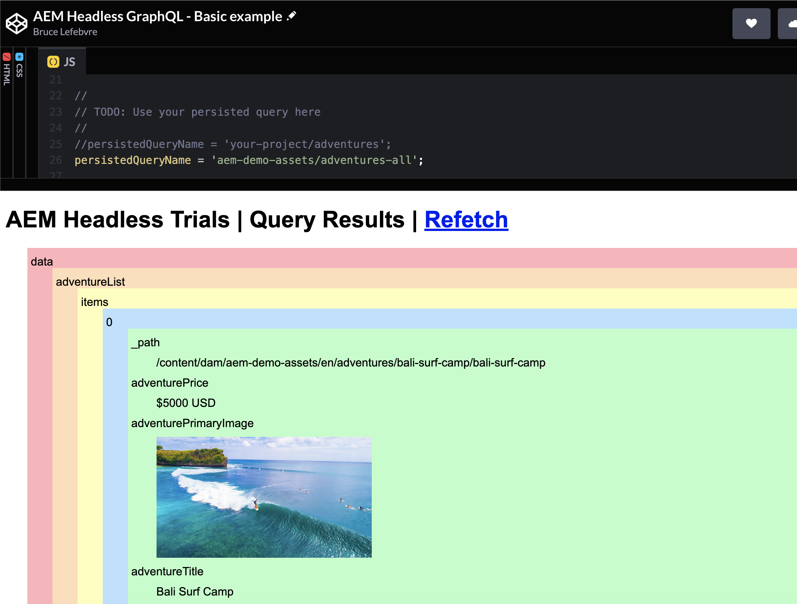

# Inhalt in einer einfachen App rendern {#render-content-simple-app}

>[!CONTEXTUALHELP]
>id="aemcloud_sites_trial_fetch_json_with_javascript"
>title="Rendern von Inhalten in einer einfachen App"
>abstract="Erfahren Sie, wie Sie JSON-Inhalte mit einer CodePen-App und dem AEM Headless-Client für JavaScript aus Ihrer Testumgebung abrufen."

>[!CONTEXTUALHELP]
>id="aemcloud_sites_trial_fetch_json_with_javascript_guide"
>title="Starten der CodePen-Beispiel-App"
>abstract="Dieses Handbuch führt Sie durch die Abfrage von JSON-Daten aus Ihrer Testumgebung in eine einfache JavaScript-Web-Anwendung. Wir verwenden die Inhaltsfragmente , die Sie in den früheren Lernmodulen modelliert und erstellt haben. Daher sollten Sie diese Handbücher zuerst durcharbeiten, bevor Sie voll in dieses Lernmodul einsteigen."

>[!CONTEXTUALHELP]
>id="aemcloud_sites_trial_fetch_json_with_javascript_guide_footer"
>title="In diesem Modul haben Sie erfahren, wie Sie mit dem AEM Headless-Client für JavaScript JSON-Daten aus Ihrer Testumgebung abrufen können, indem Sie persistierte GraphQL-Abfragen verwenden.<br><br>Jetzt wissen Sie, wie dieser Client verwendet wird, um Daten von innerhalb Ihrer eigenen Web-Anwendung nutzen zu können."
>abstract=""

## CodePen {#codepen}

CodePen ist ein Online-Code-Editor und Spielplatz für die Front-End-Webentwicklung. Dadurch können Sie HTML-, CSS- und JavaScript-Code in Ihren Browser schreiben und die Ergebnisse Ihrer Arbeit fast sofort sehen. Sie können Ihre Arbeit auch speichern und für andere freigeben. Wir haben eine App in CodePen erstellt, mit der Sie JSON-Daten aus Ihrer Testumgebung abrufen können, indem Sie die [AEM Headless-Client für JavaScript](https://github.com/adobe/aem-headless-client-js). Sie können diese App unverändert verwenden oder sie in Ihr eigenes CodePen-Konto abspalten, um sie weiter anzupassen.

Klicken Sie auf **Starten der Beispielanwendung &quot;CodePen&quot;** -Schaltfläche in der Testversion gelangen Sie zur App in CodePen. Die App dient als minimales Beispiel für das Abrufen von JSON-Daten mit JavaScript. Die Beispielanwendung ist so konzipiert, dass alle zurückgegebenen JSON-Inhalte gerendert werden, unabhängig von der Struktur des zugrunde liegenden Inhaltsfragmentmodells. Standardmäßig ruft das Programm Daten von einem `aem-demo-assets` persistente Abfrage, die in Ihrer Testumgebung enthalten ist. Es sollte eine JSON-Antwort ähnlich der folgenden angezeigt werden:

```json
{
  "data": {
    "adventureList": {
      "items": [
        {
          "_path": "/content/dam/aem-demo-assets/en/adventures/bali-surf-camp/bali-surf-camp",
          "title": "Bali Surf Camp",
          "price": "$5000 USD",
          ...
```

Wenn stattdessen ein Fehler angezeigt wird, überprüfen Sie die Browser-Konsole auf weitere Details oder wenden Sie sich an [zum Slack](https://adobe-dx-support.slack.com).

Nachdem Sie nun ein wenig über CodePen wissen, konfigurieren Sie als Nächstes die App, um Daten aus der gespeicherten Abfrage abzurufen, die Sie in einem vorherigen Modul erstellt haben.

## JavaScript-Code - Anleitung {#code-walkthrough}

Die **JS** rechts in CodePen befindet, enthält das JavaScript der Beispielanwendung. Ab Zeile 2 importieren wir den AEM Headless Client für JavaScript aus dem Skypack CDN. Skypack wird verwendet, um die Entwicklung ohne einen Build-Schritt zu erleichtern, aber Sie können auch den AEM Headless Client mit NPM oder Yarn in Ihren eigenen Projekten verwenden. Sehen Sie sich die Gebrauchsanweisungen im Abschnitt [README](https://github.com/adobe/aem-headless-client-js#aem-headless-client-for-javascript) für weitere Details.

```javascript
import AdobeAemHeadlessClientJs from 'https://cdn.skypack.dev/@adobe/aem-headless-client-js@v3.2.0';
```

In Zeile 6 lesen wir Ihre Details zum Veröffentlichungs-Host aus dem `publishHost` Abfrageparameter. Dies ist der Host, von dem der AEM Headless-Client Daten abruft. Dies würde normalerweise in Ihrer App codiert, aber wir verwenden einen Abfrageparameter, um die Arbeit der CodePen-App mit verschiedenen Umgebungen zu erleichtern.

Wir konfigurieren den AEM Headless-Client in Zeile 12:

```javascript
const aemHeadlessClient = new AdobeAemHeadlessClientJs({
  // Use a proxy to avoid CORS issues
  serviceURL: 'https://102588-505tanocelot.adobeioruntime.net/api/v1/web/aem/proxy',
  headers: {
    'aem-url': publishHost
  }
});
```

>[!NOTE]
>
>Die **serviceURL** ist so eingestellt, dass eine Proxy-Adobe IO Runtime-Funktion verwendet wird, um CORS-Probleme zu vermeiden. Dies ist nicht für Ihre eigenen Projekte erforderlich, aber für die CodePen-App erforderlich, damit sie mit Ihrer Testumgebung funktioniert. Die Proxy-Funktion ist so konfiguriert, dass die Variable **publishHost** -Wert, der im Abfrageparameter angegeben wurde.

Schließlich die Funktion `fetchJsonFromGraphQL()` wird verwendet, um die Abrufanforderung mit dem AEM Headless Client auszuführen. Er wird jedes Mal aufgerufen, wenn der Code geändert wird, oder kann durch Klicken auf die **Neu abrufen** Link. Die tatsächlichen `aemHeadlessClient.runPersistedQuery(..)` -Aufruf erfolgt in Zeile 34. Ein wenig später werden wir die Art und Weise ändern, wie diese JSON-Daten gerendert werden, aber für den Moment drucken wir sie einfach in die `#output` div mit dem `resultToPreTag(queryResult)` -Funktion.

## Abrufen von Daten aus Ihrer persistenten Abfrage {#use-persisted-query}

In Zeile 25 geben wir an, aus welcher von GraphQL gespeicherten Abfrage die App Daten abrufen soll. Der persistente Abfragename ist eine Kombination aus dem Namen des Endpunkts (d. h. `your-project` oder `aem-demo-assets`), gefolgt von einem Schrägstrich und dem Namen der Abfrage. Wenn Sie die vorherigen Modulanweisungen genau befolgt haben, befindet sich die von Ihnen erstellte persistente Abfrage im `your-project` -Endpunkt.

1. Aktualisieren Sie die `persistedQueryName` zur Verwendung der gespeicherten Abfrage, die Sie im vorherigen Modul erstellt haben. Wenn Sie dem Namensvorschlag gefolgt sind, hätten Sie eine persistente Abfrage mit dem Namen `adventure-list` im `your-project` -Endpunkt, und Sie legen die `persistedQueryName` zu `your-project/adventure-list`:

   ```javascript
   //
   // TODO: Use your persisted query here
   //
   persistedQueryName = 'your-project/adventure-list';
   ```

1. Sobald diese Änderung vorgenommen wurde, sollte das Programm automatisch aktualisiert und die rohe JSON-Antwort von Ihrer gespeicherten Abfrage an die `#output` div. Wenn eine Fehlermeldung angezeigt wird, überprüfen Sie die Konsole auf weitere Details. Reichweite [zum Slack](https://adobe-dx-support.slack.com) wenn Sie noch Probleme mit diesem Schritt haben.

1. Enthält dieses JSON die genauen Eigenschaften, die Ihre App benötigt? Wenn nicht, gehen Sie zurück zum [Extrahieren von Inhalten mit der GraphQL API](https://experience.adobe.com/experiencemanager/learn/extract_content_using_graphql) Lernhandbuch zu Änderungen. Vergessen Sie nicht, Ihre Abfrage zu speichern und zu veröffentlichen, sobald Sie damit fertig sind.

## JSON-Rendering ändern {#change-rendering}

Die JSON wird unverändert in einer `pre` -Tag, was nicht sehr kreativ ist. Wir können unseren CodePen für die Verwendung der `resultToDom()` -Funktion verwenden, um zu veranschaulichen, wie die JSON-Antwort wiederholt werden kann, um ein interessanteres Ergebnis zu erzielen.

1. Um diese Änderung vorzunehmen, kommentieren Sie Zeile 37 aus und entfernen Sie den Kommentar aus Zeile 40:

   ```javascript
   // Output the results to a pre tag
   //resultToPreTag(queryResult);
   
   // Alternatively, build a colorful div structure with the JSON results and render images inline
   resultToDom(queryResult);
   ```

1. Diese Funktion rendert auch alle Bilder, die in der JSON-Antwort enthalten sind, als `img` -Tag. Wenn die Variable **Abenteuer** Inhaltsfragmente, die Sie erstellt haben, enthalten keine Bilder. Sie können versuchen, zu wechseln, um die `aem-demo-assets/adventures-all` persistente Abfrage durch Änderung von Zeile 25:

   ```javascript
   persistedQueryName = 'aem-demo-assets/adventures-all';
   ```

Diese Abfrage liefert eine JSON-Antwort, die Bilder und die `resultToDom()` -Funktion werden sie inline gerendert.



Nachdem Sie die Arbeit zum Erstellen der Modelle und Abfragen abgeschlossen haben, kann Ihr Content-Team die Aufgabe problemlos übernehmen. Im nächsten Modul wird der Inhaltsautor-Fluss angezeigt.
