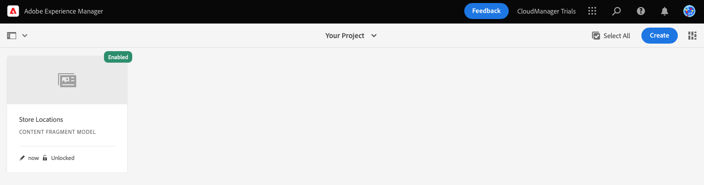

# Erstellen der Inhaltsstruktur für Ihre App {#content-structure}

Inhaltsfragmente ermöglichen Ihnen das Entwerfen, Erstellen, Kuratieren und Verwenden von seitenunabhängigen Inhalten. Damit können Sie Inhalte vorbereiten, die an mehreren Orten und über mehrere Kanäle hinweg verwendet werden können. Dies ist ideal für die Headless-Bereitstellung. Inhaltsfragmentmodelle werden verwendet, um die Struktur dieses Inhalts zu definieren. Sie müssen dies als Erstes erstellen, um Ihren Headless Content zu verwalten.

Um Ihnen dabei zu helfen, zu verstehen, wie dies geschieht, führt Sie dieses Modul von AEM Trials durch den Prozess mit einer schnellen, interaktiven Tour, die zuerst das Modell erstellt und dann seine Struktur hinzufügt. Dieses Dokument dient als Ergänzung zur produktinternen Tour, die die gleichen Schritte umfasst und gegebenenfalls mit zusätzlichen Ressourcen verknüpft ist.

## Die Konsole &quot;Inhaltsfragmentmodell&quot; {#content-fragment-model-console}

Sie beginnen in der Konsole Inhaltsfragmentmodelle . Die Konsole &quot;Inhaltsfragmentmodelle&quot;kann als Ihre Modellbibliothek betrachtet werden. Sie verwenden die Konsole, um neue Modelle zu erstellen und vorhandene Modelle zu verwalten. Ihre Konsole beginnt leer, also erstellen wir ein neues Modell!

Wenn Sie außerhalb der In-App-Anleitung selbst zur Konsole des Inhaltsfragmentmodells navigieren möchten, verwenden Sie das Symbol Adobe oben links auf der Seite. Dadurch wird die globale Navigation von AEM geöffnet. Wählen Sie von hier aus die **Instrumente** Registerkarte und dann **Allgemein** -> **Inhaltsfragmentmodelle**.

>[!TIP]
>
>Weitere Informationen zur Navigation in AEM finden Sie unter [Abschnitt &quot;Zusätzliche Ressourcen&quot;](#additional-resources) für weitere Informationen über AEM grundlegende Handhabung.

## Modell erstellen {#create-model}

Sobald Sie sich in der Konsole des Inhaltsfragmentmodells befinden, können Sie ein neues Modell erstellen, das Ihre eigenen Headless-Inhalte darstellt.

1. Klicken Sie in der Konsole des Inhaltsfragmentmodells auf die **Erstellen** oben rechts im Bildschirm, um mit der Erstellung eines Inhaltsfragmentmodells zu beginnen.

1. Der Assistent Modell erstellen wird gestartet, der Sie durch die Erstellung eines Inhaltsfragmentmodells führt.

   

   Geben Sie die erforderlichen Informationen an.

   * **Modelltitel** - Dies ist eine kurze Beschreibung des Modells und gibt normalerweise seinen Zweck an.
   * **Modell aktivieren** - Diese Option ist standardmäßig aktiviert und muss aktiviert sein, damit Inhaltsfragmente später auf Grundlage dieses Modells erstellt werden können.

   Sie können auch eine **Beschreibung** zum Modell sowie **Tags** , um sie zu kategorisieren und für Ihre Benutzer später in der Konsole des Inhaltsfragmentmodells zu unterscheiden.

   >[!TIP]
   >
   >Wenn Sie daran interessiert sind, wie Tags Ihren Inhalt organisieren können, finden Sie unter [Abschnitt &quot;Zusätzliche Ressourcen&quot;](#additional-resources) für weitere Informationen zum Tagging in AEM.

1. Sobald die Pflichtfelder ausgefüllt sind, klicken Sie auf **Erstellen** oben links, um das Modell zu erstellen.

1. Die **Erfolg** bestätigt, dass das Modell erstellt wurde.

   

1. Bevor Sie das Modell verwenden können, müssen Sie auch die Datenstruktur definieren. Klicken **Öffnen** im Dialogfeld, um es zu öffnen und mit der Definition des Modells fortzufahren.

## Felder zum Modell hinzufügen {#configure-model}

Das Inhaltsfragmentmodell ist im Wesentlichen ein Schema für Ihre Inhaltsfragmente. Sie definiert also, welche Felder/Datentypen das Modell enthält.

Mithilfe des Modelleditors für Inhaltsfragmente können Sie Felder für das Inhaltsfragmentmodell mithilfe einer Drag &amp; Drop-Benutzeroberfläche definieren.

1. Ziehen Sie ein Feld aus dem **Datentypen** auf der rechten Seite des Bildschirms und legen Sie es auf Ihrem Inhaltsfragmentmodell ab. Es gibt mehrere Datentypen, aus denen Sie wählen können, z. B. einen einzeiligen Text, mehrzeiligen Text, eine Zahl und Verweise auf andere Fragmente.

   

   >[!TIP]
   >
   >Weitere Informationen zu den verfügbaren Datentypen finden Sie in der [Abschnitt &quot;Zusätzliche Ressourcen&quot;](#additional-resources) dieses Dokuments für die detaillierte Dokumentation zu Inhaltsfragmentmodellen.

1. Sobald ein Datentyp platziert wurde, wird die **Datentypen** -Spalte automatisch in **Eigenschaften** -Tab, in dem Sie die Details des gerade platzierten Datentyps definieren können.

   

   Die Modelleigenschaften können den Namen des Felds, den Feldtyp, die Länge des Felds, falls erforderlich usw. umfassen.

1. Verwenden Sie die **Eigenschaften** Registerkarte des ausgewählten Datentyps, um Eigenschaften wie Standardwert, maximale Länge, falls es sich um ein erforderliches Feld handelt usw. zu definieren.

   >[!TIP]
   >
   >Weitere Informationen zu den für Sie verfügbaren Eigenschaften finden Sie in der [Abschnitt &quot;Zusätzliche Ressourcen&quot;](#additional-resources) dieses Dokuments für die detaillierte Dokumentation zu Inhaltsfragmentmodellen.

1. Nachdem Sie alle für das Inhaltsfragmentmodell erforderlichen Felder hinzugefügt haben, klicken Sie auf **Speichern** oben rechts im Fenster.

1. Dadurch wird das Modell gespeichert und Sie werden zur Konsole des Inhaltsfragmentmodells zurückgeleitet, wo Sie weitere Modelle hinzufügen können.

## Sie haben gelernt, ein Inhaltsfragmentmodell zu erstellen {#conclusion}

In diesem Modul haben Sie erfahren, wie Sie ein Inhaltsfragmentmodell erstellen, das die Struktur Ihrer Headless-Daten darstellt. Zuerst haben Sie das Modell erstellt und dann mit Datentypen und den zugehörigen Eigenschaften gefüllt und damit ein Schema für Ihren Headless-Inhalt definiert.

Nachdem Sie jetzt über ein eigenes Inhaltsfragmentmodell verfügen, können Sie das Modell zum Erstellen von Inhaltsfragmenten verwenden. Das Modul [Erstellen neuer Inhalte](create-content.md) Details, um Ihr neues Inhaltsfragmentmodell zum Erstellen von Headless-Inhalten zu verwenden.

Sie können zur Teststartseite zurückkehren, indem Sie auf **Lösungen** Schaltfläche oben rechts in der Navigationsleiste und Auswahl **Experience Manager**.

## Zusätzliche Ressourcen {#additional-resources}

Weitere Informationen zu Inhaltsfragmenten und AEM finden Sie in dieser zusätzlichen Dokumentation.

* [Grundlegende Handhabung](/help/sites-cloud/authoring/getting-started/basic-handling.md) - Dokumentation zur Navigation und Verwendung von AEM für neue Benutzer
* [Verwenden von Tags](/help/sites-cloud/authoring/features/tags.md) - Dokumentation zur Verwendung von Tags in AEM zum Organisieren von Inhalten
* [Inhaltsfragmente](/help/assets/content-fragments/content-fragments.md) - Übersicht über Inhaltsfragmente und Links zur vollständigen Dokumentation zu Inhaltsfragmenten
* [Inhaltsfragmentmodelle](/help/assets/content-fragments/content-fragments-models.md) - Vollständige Dokumentation zu Inhaltsfragmentmodellen
* [Inhaltsfragmentmodelle - Datentypen](/help/assets/content-fragments/content-fragments-models.md#data-types) - Details zu den verschiedenen Datentypen, die für Inhaltsfragmentmodelle verfügbar sind
* [Inhaltsfragmentmodelle - Eigenschaften](/help/assets/content-fragments/content-fragments-models.md#data-types) - Details zu den verschiedenen für die Datentypen der Inhaltsfragmentmodelle verfügbaren Eigenschaften
