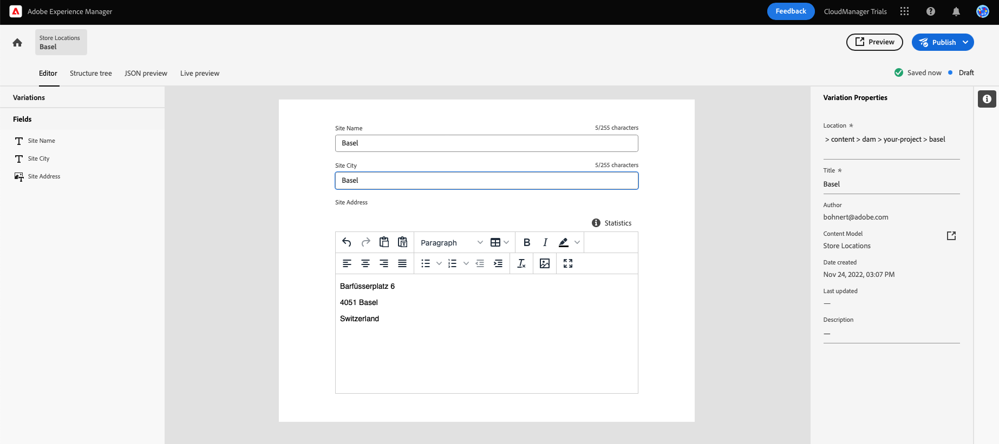
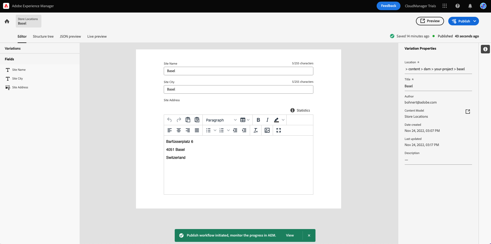
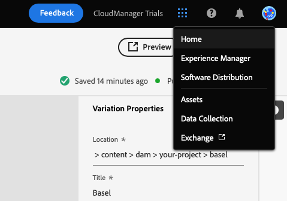

# Headless-Inhalt erstellen {#create-content}

Indem Sie dem produktinternen Lernmodul folgen, erfahren Sie, wie Sie [die zuvor erstellten Inhaltsfragmentmodelle](content-structure.md) , um Inhalte zu erstellen, die für die Seitenbearbeitung oder als Grundlage für Ihren Headless Content verwendet werden können. Dieses Dokument dient als Ergänzung der interaktiven Tour, die die gleichen Schritte umfasst und gegebenenfalls mit zusätzlichen Ressourcen verknüpft ist.

>[!CONTEXTUALHELP]
>id="aemcloud_sites_trial_admin_content_fragments_create_content"
>title="Erstellen neuer Inhalte"
>abstract="Aufbauend auf den Modellen, die Sie in Modul 1 erstellt haben, erfahren Sie, wie Sie Inhalte erstellen, die für die Seitenbearbeitung verwendet werden können, oder als Grundlage für Ihren Headless Content."

>[!CONTEXTUALHELP]
>id="aemcloud_sites_trial_admin_content_fragments_create_content_guide"
>title="Starten der Inhaltsfragmentkonsole"
>abstract="In AEM Headless-CMS sind &quot;Inhaltsfragmente&quot;alle Inhaltsfragmente, die in die vordefinierte Struktur &quot;Inhaltsfragmentmodell&quot;passen. In dieser exemplarischen Vorgehensweise erfahren Sie, wie Sie Inhalte für Ihr Inhaltsfragmentmodell erstellen.  Klicken Sie unten, um die Funktion auf einer neuen Registerkarte zu starten, und befolgen Sie dieses Lerndokument, um Ihr erstes Inhaltsfragment zu erstellen."
>additional-url="https://video.tv.adobe.com/v/328618?captions=ger" text="Platzhalter für das Einführungsvideo"

## Inhaltsfragmente {#introduction}

In AEM as a Cloud Service sind Inhaltsfragmente Headless-Content-Bestandteile, die auf der von einem Inhaltsfragmentmodell definierten Struktur basieren. Sie können Ihr eigenes Inhaltsfragment erstellen, indem Sie in der Inhaltsfragmentkonsole beginnen. Die Inhaltsfragmentkonsole kann als Ihre Bibliothek mit Headless-Inhalten betrachtet werden. Sie verwenden die Konsole, um neue Inhaltsfragmente zu erstellen und vorhandene Fragmente zu verwalten. Ihre Konsole wird leer gestartet, also erstellen wir ein neues Fragment!

Wenn Sie außerhalb der In-App-Anleitung selbst zur Inhaltsfragmentkonsole navigieren möchten, wird dies über das Symbol Adobe oben links auf der Seite angezeigt. Dadurch wird die globale Navigation von AEM geöffnet. Wählen Sie von hier aus die **Navigation** Registerkarte und dann **Inhaltsfragmente**.

>[!TIP]
>
>Weitere Informationen zur Navigation in AEM finden Sie unter [Abschnitt &quot;Zusätzliche Ressourcen&quot;](#additional-resources) für weitere Informationen über AEM grundlegende Handhabung.

## Erstellen eines Inhaltsfragments {#create-fragment}

Inhaltsfragmente stellen Ihren Headless-Inhalt dar. Sie können jedoch nur basierend auf einer vordefinierten Inhaltsstruktur erstellt werden. Das zuvor von Ihnen erstellte Inhaltsfragmentmodell dient als solche Struktur.

1. Tippen oder klicken Sie auf **Erstellen** Schaltfläche oben rechts in der Konsole, um die **Neues Inhaltsfragment** ein, um mit der Erstellung eines neuen Inhaltsfragments zu beginnen.

   

1. Wenn Sie die In-App-Anleitung befolgen, **Standort** automatisch ausgefüllt werden.

   1. Wenn Sie die Anleitung nicht befolgen, verwenden Sie den Pfad-Browser, um Ihren Projektordner auszuwählen.

   1. Im **Neues Inhaltsfragment** Dialogfeld, tippen oder klicken Sie auf **Speicherort auswählen** -Schaltfläche (das Symbol, das wie ein Ordner aussieht) im **Standort** -Feld.

      
   * Alternativ können Sie den Pfad im linken Navigationsbereich der Inhaltsfragmentkonsole auswählen, bevor Sie auf **Erstellen**.

1. Im **Inhaltsfragmentmodell** in der Dropdown-Liste wählen Sie aus der Dropdown-Liste das zuvor erstellte Inhaltsfragmentmodell aus.

1. Hinzufügen einer **Titel** für das Inhaltsfragment.

1. Tippen oder klicken Sie auf **Erstellen und öffnen**.

## Inhaltsfragmente-Editor {#edit-fragment}

Nachdem Sie das neue Inhaltsfragment gespeichert haben, wird der Inhaltsfragment-Editor geöffnet, in dem Sie den tatsächlichen Inhalt des Fragments angeben können.

1. Der Editor zeigt die Felder an, die Sie im ausgewählten Modell definiert haben. Hier können Sie sie bearbeiten, um Ihr Inhaltsfragment abzuschließen. Ihr Fortschritt wird automatisch gespeichert.

   

1. Wenn das Modell Ihres Inhaltsfragments über viele Felder verfügt, können Sie schnell zu einem beliebigen Feld springen, indem Sie die **Variablen** auf der linken Seite des Editors angezeigt. Felder mit Fehlern werden hier gekennzeichnet.

1. Damit das Inhaltsfragment für die Verwendung durch eine externe App verfügbar ist, müssen Sie es veröffentlichen. Tippen oder klicken Sie auf **Veröffentlichen** Schaltfläche oben rechts im Editor.

1. Auswählen **Jetzt** aus der Dropdown-Liste aus. Sie können die Veröffentlichung auch zu einem späteren Zeitpunkt planen.

   

   >[!TIP]
   >
   >Weitere Informationen zur Veröffentlichung von Inhalten in AEM finden Sie im Abschnitt [Abschnitt &quot;Zusätzliche Ressourcen&quot;](#additional-resources) für weitere Informationen zur Veröffentlichung.

1. AEM führt automatisch eine Referenzprüfung durch, um sicherzustellen, dass alle erforderlichen Ressourcen für Ihr Inhaltsfragment veröffentlicht werden. In diesem Fall müssen Sie auch das von Ihnen erstellte Modell veröffentlichen. Tippen oder klicken Sie auf **Veröffentlichen**.

   

1. Die Veröffentlichung wird in einem Banner bestätigt.

   

## Sie haben gelernt, wie Sie ein Inhaltsfragment erstellen! {#conclusion}

In diesem Modul haben Sie erfahren, wie Sie ein Inhaltsfragment erstellen, das auf dem zuvor erstellten Modell basiert. So würde ein Inhaltsautor strukturierte Headless-Inhalte erstellen.

Nachdem Sie Ihre Inhalte erstellt und veröffentlicht haben, können Sie diese nun über die Graph-QL über AEM APIs extrahieren. Weitere Informationen hierzu finden Sie im Modul [Extrahieren Sie Inhalte über die GraphQL-API.](extract-content.md)

Sie können zur Teststartseite zurückkehren, indem Sie auf **Lösungen** Schaltfläche oben rechts in der Navigationsleiste und Auswahl **Experience Manager**.

## Zusätzliche Ressourcen {#additional-resources}

Weitere Informationen zu Inhaltsfragmenten und AEM finden Sie in dieser zusätzlichen Dokumentation.

* [Grundlegende Handhabung](/help/sites-cloud/authoring/getting-started/basic-handling.md) - Dokumentation zur Navigation und Verwendung von AEM für neue Benutzer
* [Verwalten von Inhaltsfragmenten - Veröffentlichen und Referenzieren](/help/assets/content-fragments/content-fragments-managing.md#publishing-and-referencing-a-fragment) - Informationen zum Veröffentlichen von Inhalten in AEM
* [Inhaltsfragmente](/help/assets/content-fragments/content-fragments.md) - Übersicht über Inhaltsfragmente und Links zur vollständigen Dokumentation zu Inhaltsfragmenten
* [Verwalten von Inhaltsfragmenten](/help/assets/content-fragments/content-fragments-managing.md) - Erstellen und Verwalten von Inhaltsfragmenten
