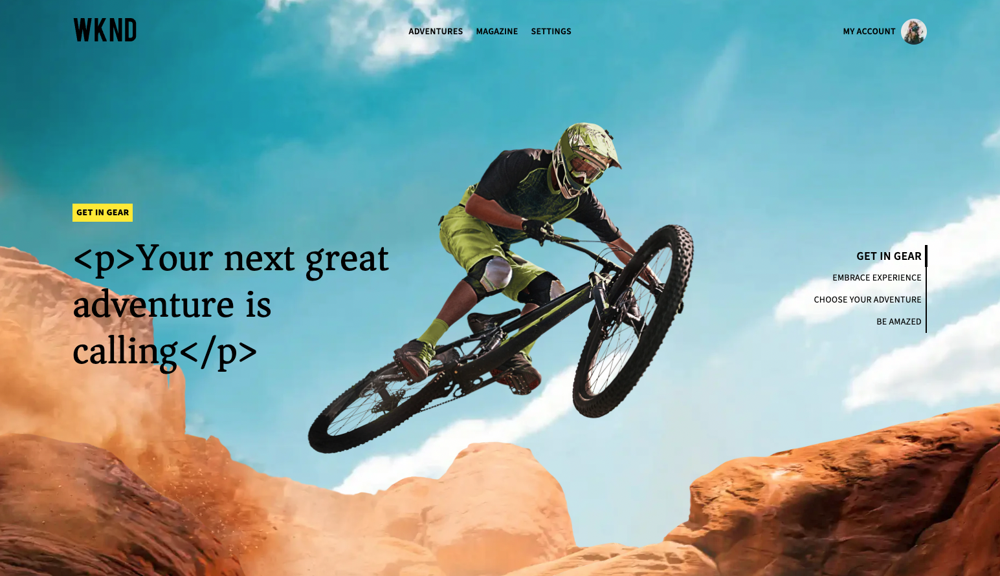
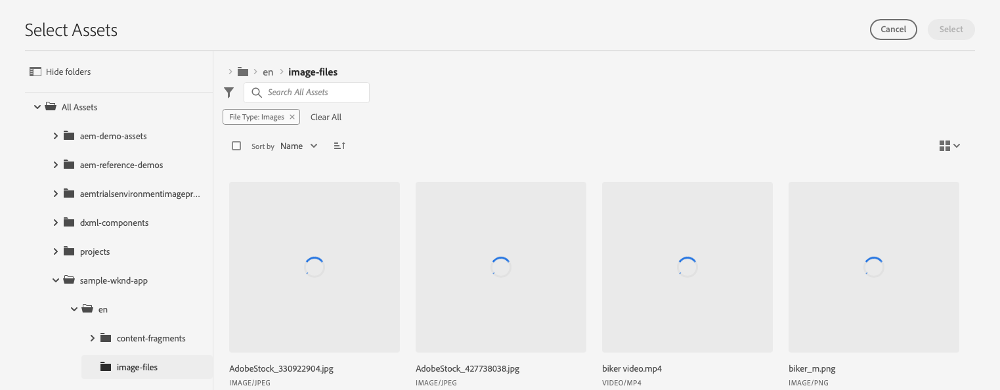
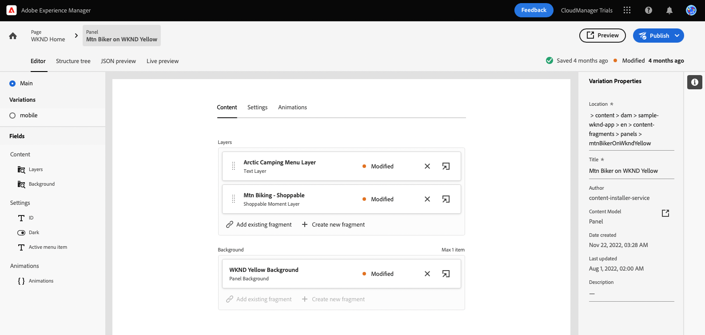

# Anpassen von Inhalten in einer Beispiel-React-App {#customize-app}

AEM Testsendungen für Headless werden mit einer einfachen React-App vorgeladen, um Headless-Inhalte zu präsentieren. In diesem Modul erfahren Sie, wie Sie die App in der Vorschau anzeigen und ihren Inhalt ändern können, indem Sie ein Bild austauschen und dafür einen Shop-fähigen Moment erstellen.

Die App selbst basiert auf der Struktur von Inhaltsfragmenten. Mit dem Inhaltsfragment-Editor in AEM können Sie Ihren App-Inhalt ändern. Um Ihnen dabei zu helfen, zu verstehen, wie dies geschieht, führt Sie dieses Modul von AEM Trials durch den Prozess mit einer schnellen, interaktiven Tour. Dieses Dokument dient als Ergänzung der interaktiven Tour, die die gleichen Schritte umfasst und gegebenenfalls mit zusätzlichen Ressourcen verknüpft ist.

>[!CONTEXTUALHELP]
>id="aemcloud_sites_trial_admin_content_fragments_react_app"
>title="Inhalt in einer React-Beispielanwendung anpassen"
>abstract="Wir haben eine moderne React-App eingerichtet, mit der Sie erfahren können, wie Sie Inhalte mithilfe des Headless-Funktionssatzes anpassen können."

>[!CONTEXTUALHELP]
>id="aemcloud_sites_trial_admin_content_fragments_react_app_guide"
>title="Starten des Inhaltsfragmente-Editors"
>abstract="AEM Testsendungen für Headless werden mit einer einfachen React-App vorgeladen, um Headless-Inhalte zu präsentieren. Die App basiert auf der Struktur von Inhaltsfragmenten. Mit dem Inhaltsfragment-Editor in AEM können Sie den Inhalt Ihrer App ändern.  Starten Sie die Funktion in einer neuen Registerkarte, indem Sie unten klicken und diesem Handbuch folgen."
>additional-url="https://video.tv.adobe.com/v/328618?captions=ger" text="Platzhalter für das Einführungsvideo"

## Inhaltsfragmente-Editor {#fragment-editor}

Sie beginnen im Inhaltsfragment-Editor für die Beispielanwendung.

Wenn Sie außerhalb der In-App-Anleitung selbst zum Inhaltsfragment-Editor navigieren möchten, wird dies über das Symbol Adobe oben links auf der Seite angezeigt. Dadurch wird die globale Navigation von AEM geöffnet. Wählen Sie von hier aus die **Navigation** Registerkarte und dann **Inhaltsfragmente**.

Dadurch wird die Inhaltsfragmentkonsole geöffnet. Von dort aus verwenden Sie die Inhaltsstruktur im linken Bereich, um zum Speicherort des App-Inhalts zu navigieren. In diesem Fall **Inhaltsfragmente** -> **WKND-Beispielanwendung** -> **englisch** -> **Inhaltsfragmente** -> **pages**.

Tippen oder klicken Sie auf die **WKND-Homepage** in der Konsole rechts neben der Inhaltsstruktur angezeigt, um den Editor für den App-Inhalt zu starten.

>[!TIP]
>
>Weitere Informationen zur Navigation in AEM finden Sie unter [Abschnitt &quot;Zusätzliche Ressourcen&quot;](#additional-resources) für weitere Informationen über AEM grundlegende Handhabung.

## Vorschau der App {#preview}

Bevor Sie mit der Bearbeitung der App beginnen, sollten Sie sich zunächst mit ihr vertraut machen, indem Sie deren aktuellen Status in der Vorschau anzeigen. Tippen oder klicken Sie auf **Vorschau** rechts oben im Editor-Bildschirm.

Die Demo-App wird in einer neuen Registerkarte geöffnet.

Die App selbst ist eine einfache E-Commerce-App für die fiktive WKND Outdoor Lifestyle-Marke, die in React implementiert wurde. Klicken Sie auf die Schaltfläche, um zum Beispielinhalt zu navigieren.

Kehren Sie zur Registerkarte des Inhaltsfragment-Editors zurück, um fortzufahren.

## Text in der App bearbeiten {#edit-app}

Wie bereits erwähnt, besteht die App selbst aus Inhaltsfragmenten. Diese Fragmente sind in einer Struktur verknüpft, um die App zu erstellen.

Der Inhaltsfragment-Editor zeigt das grundlegende Layout der App als Seite an. Diese Seite ist ein Inhaltsfragment, das selbst eine Sammlung anderer Fragmente darstellt. Die **Bedienfelder** verschiedene Seiten der App darstellen, von denen jede ein eigenes Inhaltsfragment ist. Durch Ändern dieser Fragmente können Sie den Inhalt der App ändern.

1. Tippen oder klicken Sie auf **Mtn Biker in Canyon** im **Bedienfelder** Abschnitt.

   

1. Der Editor öffnet die Kopfzeile für den Mountainbiker. Jedes Bedienfeld besteht aus Ebenen, die unterschiedliche Inhalte auf einer Seite der App darstellen.

   

1. Auswählen der Textebene **Mtn Biker in Canyon Textebene**. Dadurch wird die Detailansicht der Ebene im Editor geöffnet. Die Ebene besteht aus mehreren Inhaltsfragmenten.

   

1. Wählen Sie die **Mtn Biker in Canyon-Titel** Textelement. Dadurch wird der Inhaltsfragment-Editor geöffnet, der den Inhalt dieses Fragments anzeigt und Ihnen die Möglichkeit gibt, es zu ändern.

   

1. Text ändern von `Your next great adventure is calling` nach `Choose your own adventure`. Die Änderung wird automatisch vom Editor gespeichert.

1. Klicken Sie auf Vorschau , um Ihre Änderungen anzuzeigen. Die Demo-App wird in einer neuen Registerkarte geöffnet.

   

Kehren Sie zur Registerkarte des Inhaltsfragment-Editors zurück, um das Modul fortzusetzen.

## Hauptbild der App ändern {#change-image}

Nachdem Sie jetzt Text in der App geändert haben, versuchen Sie, das Hauptbild der App zu ändern. Zunächst müssen Sie diesen Inhalt suchen.

Die Breadcrumbs oben links im Editor zeigen an, wo Sie sich in Ihrer Inhaltshierarchie befinden.

1. Tippen oder klicken Sie auf **Mtn Biker in Canyon** in den Breadcrumbs, um zu dieser Seite zurückzukehren.

   

1. Kehren Sie mit den verschiedenen Ebenen der App zum Bedienfeld zurück. Die Ebenen stellen nicht nur Textinhalte dar. Sie stellen alle Inhalte in Ihrer App dar. Daher können Sie Bilder auch mit dem Inhaltsfragment-Editor austauschen.

   

1. Wählen Sie die **Mtn Biking - Biker** Bildebene. Dadurch wird der Inhaltsfragment-Editor geöffnet, der den Inhalt dieses Fragments anzeigt und Ihnen die Möglichkeit gibt, es zu ändern.

   

1. Tippen oder klicken Sie auf **X** , um das Biker-Bild zu entfernen. Das Bild verschwindet und der Editor zeigt einen Fehler an, da das Bild für dieses Inhaltsfragmentmodell erforderliche Daten ist.

   

1. Tippen oder klicken Sie auf **Asset hinzufügen** und suchen Sie das gelbe Biker-Bild in **sample-wknd-app** > **en** > **image-files**. Verwenden Sie die Baumansicht auf der linken Seite des **Auswählen von Assets** Dialogfeld zum Navigieren in der Inhaltshierarchie.

   

1. Nach Text filtern `yellow`. Verwenden Sie die **Alle Assets durchsuchen** -Feld am oberen Rand des **Auswählen von Assets** -Fenster, um nach dem Bild zu suchen. Geben Sie den Suchtext ein und drücken Sie die Eingabetaste oder die Eingabetaste, um zu suchen.

   

1. Tippen oder klicken Sie, um die `biker-yellow.png` Bild, tippen oder klicken Sie dann auf **Auswählen**.

   

1. Das Bild des Fahrers wurde durch das ausgewählte Bild ersetzt. Der Editor speichert die Änderungen automatisch.

   

## Einen Shop-fähigen Moment erstellen {#create-moment}

Nachdem Sie jetzt das Bild des Bikers aktualisiert haben, können Sie einen Shop-fähigen Moment für die gelben Hosen des Bikers hinzufügen.

1. Kehren Sie zunächst zum Inhaltsfragment-Editor für das Seitenfragment zurück. Die Breadcrumbs oben links im Editor zeigen an, wo Sie sich in Ihrer Inhaltshierarchie befinden. Tippen oder klicken Sie auf **WKND-Homepage** in den Breadcrumbs, um zu dieser Seite zurückzukehren.

   

1. Wählen Sie die **Mtn Biker auf WKND Gelb** Bereich.

   

1. Sie können nun die Ebenen sehen, aus denen das Bild des Fahrers besteht. Fügen Sie den gelben Hosen des Bikers einen Shop-fähigen Moment hinzu, indem Sie die **Mtn Biking - Shoppable** Ebene.

   

1. Um einen Moment mit Shopping-Funktion zu erstellen, müssen Sie ein neues Inhaltsfragment erstellen, das diesen Moment darstellt. Tippen oder klicken Sie auf **+ Neues Fragment erstellen** -Taste, um für die kurze Hose des Bikers einen Shop-fähigen Moment hinzuzufügen.

   

1. Da Inhaltsfragmente strukturierte Headless-Daten darstellen, müssen Sie beim Erstellen eines Inhaltsfragments zunächst ein Modell auswählen, auf dem es basieren soll. Wählen Sie die **Shopping-Moment-Element** -Modell aus **Inhaltsfragmentmodell** Dropdown-Liste.

   

1. Benennen Sie das Inhaltsfragment, das diesen neuen Shop-fähigen Moment darstellt. Geben Sie beispielsweise `Shorts` in **Name** -Feld.

   

1. Tippen oder klicken Sie auf **Erstellen und öffnen**.

1. Der Editor wird für Ihr neues Inhaltsfragment geöffnet.
   * Benennen Sie den Shop-fähigen Moment im **Text** -Feld, z. B. `Yellow shorts`.
   * Legen Sie ein X und Y fest, an dem dieser Shop-fähige Moment überlagert werden soll.
      * **X**: `-18`
      * **Y**: `-28`
   * Änderungen am Fragment werden vom Editor automatisch gespeichert

   

1. Tippen oder klicken Sie auf **Vorschau** um diese Positionierung zu testen und nach Bedarf Anpassungen vorzunehmen.

   

## Sie haben gelernt, eine React-Beispielanwendung anzupassen! {#conclusion}

In diesem Modul haben Sie erfahren, wie Sie eine React-Beispielanwendung anpassen können. Zuerst haben Sie gelernt, wie Sie vorhandenen Text bearbeiten. Dann wurde ein Bild mit einer anderen Instanz dieses Bildes ausgetauscht. Schließlich haben Sie gesehen, wie ein Element mit Shopping-Funktion erstellt und positioniert wird.

Überprüfen Sie unbedingt die [Abschnitt &quot;Zusätzliche Ressourcen&quot;](#additional-resources) für zusätzliche Ressourcen zur Verwendung von AEM und den zugehörigen Inhaltsfragmenten.

Wenn Sie erfahren möchten, wie Inhaltsfragmente und Headless-Inhalte für die Verwendung durch benutzerdefinierte Apps erstellt werden, können Sie zunächst das Modul überprüfen [Erstellen Sie die Inhaltsstruktur für Ihre App.](content-structure.md)

Sie können zur Teststartseite zurückkehren, indem Sie auf **Lösungen** Schaltfläche oben rechts in der Navigationsleiste und Auswahl **Experience Manager**.

## Zusätzliche Ressourcen {#additional-resources}

Weitere Informationen zu Inhaltsfragmenten und AEM finden Sie in dieser zusätzlichen Dokumentation.

* [Inhaltsfragmentmodelle](/help/assets/content-fragments/content-fragments-models.md) - Vollständige Dokumentation zu Inhaltsfragmentmodellen
* [Inhaltsfragmente](/help/assets/content-fragments/content-fragments.md) - Übersicht über Inhaltsfragmente und Links zur vollständigen Dokumentation zu Inhaltsfragmenten
* [Grundlegende Handhabung](/help/sites-cloud/authoring/getting-started/basic-handling.md) - Dokumentation zur Navigation und Verwendung von AEM für neue Benutzer
