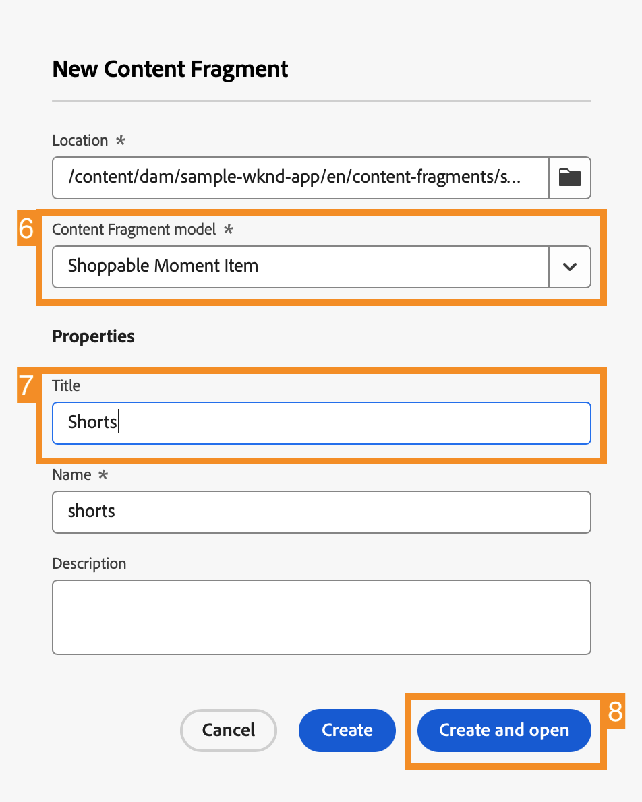

# Anpassen von Inhalten in einer React-Beispiel-App {#customize-app}

>[!CONTEXTUALHELP]
>id="aemcloud_sites_trial_admin_content_fragments_react_app"
>title="Anpassen von Inhalten in einer React-Beispiel-App"
>abstract="Ihre AEM Headless-Testversion beinhaltet auch eine React-Beispiel-App, die Sie anpassen können."

>[!CONTEXTUALHELP]
>id="aemcloud_sites_trial_admin_content_fragments_react_app_guide"
>title="Starten des Inhaltsfragment-Editors"
>abstract="Lassen Sie uns nun untersuchen, wie die Headless-Inhaltserstellung funktioniert. Ihre AEM Headless-Testversion beinhaltet auch eine integrierte React-Beispiel-App, anhand der Sie sehen können, wie einfach es ist, Inhalte unabhängig zu verwalten, ohne die Zeit der Entwicklerabteilung in Anspruch zu nehmen.  Starten Sie dieses Modul auf einer neuen Registerkarte, indem Sie unten klicken und dieser Anleitung folgen."

>[!CONTEXTUALHELP]
>id="aemcloud_sites_trial_admin_content_fragments_react_app_guide_footer"
>title="In diesem Modul haben Sie erfahren, wie sich eine React-Beispiel-App anpassen lässt.  Markteinführungszeit: beschleunigt! Entwicklungszyklen: reduziert!  Jetzt wissen Sie, wie einfach die Verwaltung von Headless-Inhalten für Websites und Apps ist, die auf AEM Headless-Funktionen basieren."
>abstract=""

## Vorschau der App {#preview}

Sie beginnen im Inhaltsfragment-Editor Ihrer bereits geladenen AEM Headless-Testversion und der darin enthaltenen Beispiel-App. Die Beispiel-App basiert auf Inhaltsfragmenten, die über GraphQL bereitgestellt werden. Machen Sie sich mit dem Inhaltsfragment-Editor vertraut, indem Sie sich eine Vorschau der Beispiel-App ansehen.

1. Wählen Sie die **Vorschau** rechts oben im Editor-Bildschirm.

1. Die Demo-App wird auf einer neuen Registerkarte geöffnet. Die App ist für die fiktive Outdoor-Lifestyle-Marke WKND vorgesehen. Scrollen Sie auf der Seite nach unten, um durch den Beispielinhalt zu navigieren.

1. Kehren Sie zur Browser-Registerkarte des Inhaltsfragment-Editors zurück, um fortzufahren.

## Bearbeiten einer Kopfzeile in der App {#edit-app}

Der Inhaltsfragment-Editor zeigt das grundlegende Layout der App als Seiteninhaltsfragment an. Die **Bedienfelder** stellen verschiedene Seiten der App dar, von denen jede ein eigenes Inhaltsfragment ist. Durch das Bearbeiten dieser Fragmente können Sie den Inhalt der App ändern.

1. Auswählen **Mtn Biker in Canyon** im **Bedienfelder** Abschnitt.

   

1. Der Editor öffnet das Kopfzeilenbedienfeld der App für den Mountainbiker. Jedes Bedienfeld besteht aus Ebenen mit verschiedenen Bildern und Texten, aus denen sich die Oberfläche zusammensetzt.

1. Wählen Sie die Textebene **Mtn Biker in Canyon Text Layer** aus, um die Details der Ebene im Editor zu öffnen. Die Ebene besteht aus mehreren Inhaltsfragmenten, die den Text steuern, der in diesem Bedienfeld der App angezeigt wird.

1. Wählen Sie das Textelement **Mtn Biker in Canyon Title** aus. Dadurch wird der Inhaltsfragment-Editor geöffnet, der den Inhalt dieses Fragments anzeigt. Hier können Sie den Inhalt ändern.

1. Ändern Sie den Text von `Your next great adventure is calling` in `Choose your own adventure`. Die Änderung wird vom Editor automatisch gespeichert.

1. Auswählen **Vorschau** oben rechts im Fenster, um Ihre Änderungen zu sehen. Die Vorschau der Demo-App wird auf einer neuen Registerkarte geöffnet.

   

So einfach ist es, Inhalte in einer React-App zu aktualisieren, wenn diese in AEM Headless-CMS integriert ist.

## Austauschen eines Bilds in der App {#change-image}

Nachdem Sie jetzt wissen, wie eine Überschrift in der App geändert wird, versuchen Sie, ein Bild zu ändern.

1. Kehren Sie von der Vorschau zur Browser-Registerkarte des Inhaltsfragment-Editors zurück.

1. Sie müssen zur richtigen Stelle im Inhaltsfragment-Editor zurückkehren. Die Breadcrumbs oben links im Editor zeigen an, wo Sie sich in der Inhaltshierarchie befinden. Tippen oder klicken Sie in den Breadcrumbs auf **Mtn Biker in Canyon**, um zu dieser Seite zurückzukehren.

   

1. Wählen Sie die Bildebene **Mtn Biking - Biker** aus. Daraufhin wird der Inhaltsfragment-Editor geöffnet.

1. Wählen Sie die **X** , um das Biker-Bild zu entfernen. Das Bild verschwindet und der Editor zeigt einen Fehler an, da das Bild für dieses Inhaltsfragmentmodell erforderlich ist.

   

1. Auswählen **Asset hinzufügen** und dann **Durchsuchen von Assets** im Popup-Menü.

1. Das Dialogfeld **Asset auswählen** wird geöffnet und der Pfad **sample-wknd-app** > **en** > **image-files** wird automatisch ausgewählt.

1. Bild auswählen `biker-yellow.png` und wählen Sie **Auswählen**.

1. Das Bild des Radfahrers wird durch das ausgewählte Bild ersetzt. Der Editor speichert die Änderungen automatisch.

1. Auswählen **Vorschau** oben rechts im Fenster, um Ihre Änderungen zu sehen. Die Vorschau der Demo-App wird auf einer neuen Registerkarte geöffnet. Klicken Sie im Browser auf „Aktualisieren“. In der App sollte nun das neue Bild eines Radfahrers mit gelben Shorts angezeigt werden.

So einfach ist es, Bilder und Assets in Ihren Apps mit AEM Headless-CMS zu aktualisieren.

## Hinzufügen eines Verweises zu einem neuen Inhaltsfragment in der App {#create-moment}

Nachdem Sie jetzt das Bild des Radfahrers aktualisiert haben, erläutern wir, wie Sie einer App neue Inhalte hinzufügen können, indem Sie ein neues Inhaltsfragment erstellen und darauf verweisen. Sie fügen dem zweiten Bedienfeld der App einen Produktaufruf hinzu, der von dem Inhaltsfragment „Shoppable Moment“ verwaltet wird.

1. Kehren Sie von der Registerkarte „Vorschau“ zur Browser-Registerkarte des Inhaltsfragment-Editors zurück.

1. Sie müssen zur richtigen Stelle im Inhaltsfragment-Editor zurückkehren. Die Breadcrumbs oben links im Editor zeigen an, wo Sie sich in der Inhaltshierarchie befinden. Auswählen **WKND-Homepage** in den Breadcrumbs, um zu dieser Seite zurückzukehren.

1. Wählen Sie das Bedienfeld **Mtn Biker on WKND Yellow** aus.

1. Wählen Sie die Ebene **Mtn Biking - Shoppable** aus.

1. Um einen Abruf in diesem Bedienfeld zu erstellen, erstellen Sie einen Shop-fähigen Moment Inhaltsfragment. Wählen Sie die **+ Neues Fragment erstellen** Schaltfläche.

   

1. Sie müssen zunächst ein Modell auswählen, auf dem das neue Inhaltsfragment basieren soll. Wählen Sie das Modell **Shoppable Moment Item** aus der Dropdown-Liste **Inhaltsfragmentmodell** aus.

1. Geben Sie dem Inhaltsfragment einen Namen. Geben Sie beispielsweise `Shorts` in das Feld **Name** ein.

1. Auswählen **Erstellen und öffnen**.

   

1. Der Editor wird für das neue Inhaltsfragment geöffnet.

1. Benennen Sie das „Shoppable Momen“-Element im Feld **Text**, z. B. `Yellow shorts`.

1. Legen Sie Werte für **X** und **Y** fest. Hier sollte dieser Aufruf im Bedienfeld überlagert werden. Änderungen am Fragment werden vom Editor automatisch gespeichert.

   * **X**: `-5`
   * **Y**: `-10`

1. Auswählen **Vorschau** oben rechts im Fenster, um Ihre Änderungen zu sehen. Die Vorschau der Demo-App wird auf einer neuen Registerkarte geöffnet. Klicken Sie im Browser auf „Aktualisieren“, um die Positionierung zu testen, und nehmen Sie im Editor bei Bedarf Anpassungen vor.

   

Jetzt wissen Sie, wie Sie ohne Entwicklungszyklen neue Inhalte erstellen und in Ihrer App als Inhaltsfragment darauf verweisen können.
