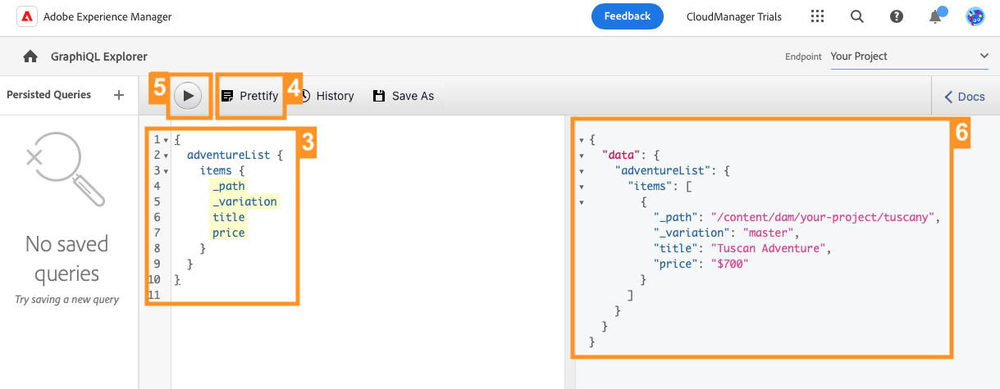

# Extrahieren von Inhalten über die GraphQL-API {#extract-content}

>[!CONTEXTUALHELP]
>id="aemcloud_sites_trial_admin_content_fragments_graphql"
>title="Extrahieren von Inhalten mit der GraphQL-API"
>abstract="In diesem Modul erfahren Sie, wie Sie Inhaltsfragmente und die GraphQL-API als Headless-Content-Management-System verwenden können."

>[!CONTEXTUALHELP]
>id="aemcloud_sites_trial_admin_content_fragments_graphql_guide"
>title="Starten von GraphQL Explorer"
>abstract="GraphQL bietet eine abfragebasierte API, mit der externe Client-Anwendungen AEM mithilfe eines einzigen API-Aufrufs nur nach den benötigten Inhalten abfragen können. In diesem Modul erfahren Sie, wie Sie zwei verschiedene Arten von Abfragen ausführen. Erfahren Sie dann, wie Sie den Inhalt aus dem Inhaltsfragment abrufen, das Sie im vorherigen Modul erstellt haben.<br><br>Starten Sie dieses Modul auf einer neuen Registerkarte, indem Sie auf den Bereich unten klicken."

>[!CONTEXTUALHELP]
>id="aemcloud_sites_trial_admin_content_fragments_graphql_guide_footer"
>title="Gute Arbeit! Sie haben die beiden grundlegenden Arten von Abfragen kennengelernt und erfahren, wie Sie Ihre eigenen Inhalte abfragen können. Jetzt wissen Sie, wie Sie mit der AEM GraphQL API effiziente Abfragen erstellen können, mit denen Inhalte in einem von Ihrer App erwarteten Format bereitgestellt werden."
>abstract=""

## Abfrage einer Liste von Beispielinhalten {#list-query}

Sie beginnen mit dem GraphQL Explorer auf einer neuen Registerkarte. Hier können Sie Abfragen für Ihre Headless-Inhalte vor ihrer Verwendung erstellen und validieren, um Inhalte in Ihrer App oder Website zu optimieren.

1. Die AEM Headless-Testversion enthält einen Endpunkt, in den bereits Inhaltsfragmente geladen wurden und aus dem Sie Inhalte zu Testzwecken extrahieren können. Stellen Sie sicher, dass der Endpunkt **AEM Demo Assets** im Dropdown-Menü **Endpunkt** oben rechts im Editor ausgewählt ist.

1. Kopieren Sie das folgende Code-Fragment für eine Listenabfrage des vorbereiteten Endpunkts **AEM Demo Assets**. Eine Listenabfrage gibt eine Liste aller Inhalte zurück, die ein bestimmtes Inhaltsfragmentmodell verwenden. Inventar- und Kategorieseiten verwenden normalerweise dieses Abfrageformat.

   ```text
   {
    adventureList {
     items {
       _path
       title
       price
       tripLength
       primaryImage {
         ... on ImageRef {
           _path
           mimeType
           width
           height
         }
       }
     }
    }
   }
   ```

1. Ersetzen Sie den im Abfrage-Editor den vorhandenen Inhalt durch Einfügen des kopierten Codes.

1. Klicken Sie nach dem Einfügen oben links im Abfrage-Editor auf die Schaltfläche **Wiedergeben**, um die Abfrage auszuführen.

1. Die Ergebnisse werden im Bereich rechts neben dem Abfrage-Editor angezeigt. Sollte die Abfrage fehlerhaft sein, wird im rechten Bereich ein Fehler angezeigt.

   

Sie haben gerade eine Listenabfrage für eine vollständige Liste aller Inhaltsfragmente validiert. Mit diesem Prozess wird sichergestellt, dass die Antwort dem entspricht, was Ihre App erwartet, und Ergebnisse liefert, die veranschaulichen, wie Ihre Apps und Websites die in AEM erstellten Inhalte abrufen.

## Abfrage eines bestimmten Elements des Beispielinhalts {#bypath-query}

Wenn Sie eine byPath-Abfrage ausführen, können Sie Inhalte für ein bestimmtes Inhaltsfragment abrufen. Produktdetailseiten und Seiten, die sich auf einen bestimmten Satz von Inhalten konzentrieren, erfordern in der Regel diese Art von Abfrage.

1. Kopieren Sie das folgende Code-Fragment für eine byPath-Abfrage des vorbereiteten Endpunkts **AEM Demo Assets**.

   ```text
    {
     adventureByPath(
       _path: "/content/dam/aem-demo-assets/en/adventures/bali-surf-camp/bali-surf-camp"
     ) {
       item {
         _path
         title
         description {
           json
         }
         primaryImage {
           ... on ImageRef {
             _path
             width
             height
           }
         }
       }
     }
   }
   ```

1. Ersetzen Sie den im Abfrage-Editor den vorhandenen Inhalt durch Einfügen des kopierten Codes.

1. Klicken Sie nach dem Einfügen oben links im Abfrage-Editor auf die Schaltfläche **Wiedergeben**, um die Abfrage auszuführen.

1. Die Ergebnisse werden im Bereich rechts neben dem Abfrage-Editor angezeigt. Sollte die Abfrage fehlerhaft sein, wird im rechten Bereich ein Fehler angezeigt.

   

Sie haben gerade eine byPath-Abfrage validiert, um ein bestimmtes, durch den Pfad dieses Fragments identifiziertes Inhaltsfragment abzurufen.

## Abfrage von eigenen Inhalten {#own-queries}

Nachdem Sie nun die beiden primären Abfragetypen ausgeführt haben, können Sie eigene Inhalte abfragen.

1. Um Abfragen nach eigenen Inhaltsfragmenten auszuführen, ändern Sie den Endpunkt vom Ordner **AEM Demo Assets** in den Ordner **Ihr Projekt**.

1. Löschen Sie alle im Abfrage-Editor vorhandenen Inhalte. Geben Sie dann eine linke geschweifte Klammer `{` ein und drücken Sie Strg+Leertaste oder Option+Leertaste, um eine AutoVervollständigen-Liste der in Ihrem Endpunkt definierten Modelle zu erstellen. Wählen Sie aus den Optionen das von Ihnen erstellte Modell aus, das in `List` endet. Wenn Sie die Beispiele aus den vorherigen Modulen befolgt haben, sollten Sie `adventureList` in der Liste für die automatische Vervollständigung finden.

   

1. Definieren Sie die Elemente, die die Abfrage für das ausgewählte Inhaltsfragmentmodell enthalten soll. Geben Sie erneut eine linke geschweifte Klammer `{` ein und drücken Sie dann Strg+Leertaste oder Option+Leertaste, um eine AutoVervollständigen-Liste anzuzeigen. Wählen Sie aus den Optionen `items` aus.

1. Wählen Sie die **Pretify** -Schaltfläche, um Ihren Code automatisch zu formatieren, sodass er leichter zu lesen ist.

1. Wählen Sie nach Abschluss die **Play** Schaltfläche oben links im Editor, um die Abfrage auszuführen. Der Editor vervollständigt automatisch die `items`, die kurz gelb hervorgehoben werden, und die Abfrage wird ausgeführt.

1. Die Ergebnisse werden im rechten Bereich neben dem Abfrage-Editor angezeigt.

   

So können Ihre Inhalte für digitale Omnichannel-Erlebnisse bereitgestellt werden.

## Persistierte Abfragen {#persisted-queries}

Persistierte Abfragen sind der bevorzugte Mechanismus, um die GraphQL-API für Client-Applikationen zugänglich zu machen. Nachdem eine Abfrage persistiert wurde, kann sie mithilfe einer GET-Anfrage angefordert und zwischengespeichert werden, um einen schnellen Abruf zu ermöglichen.

Sie erstellen eine persistente Abfrage mit Daten, die Sie in Ihrer Client-Applikation verwenden möchten.

1. Sie werden die Daten verwenden, die Sie zuvor als Inhaltsfragment erstellt haben. Vergewissern Sie sich also, dass der Endpunkt **Ihr Projekt** im Dropdown-Menü **Endpunkt** oben rechts im Editor ausgewählt ist.

1. Kopieren Sie den folgenden Code-Snippet.

   ```text
      {
      adventureList {
       items {
         title
         description {
           plaintext
         }
         price
         image {
           ... on ImageRef {
             _publishUrl
             mimeType
           }
         }
       }
     }
   }
   ```

1. Ersetzen Sie den im Abfrage-Editor den vorhandenen Inhalt durch Einfügen des kopierten Codes.

   >[!NOTE]
   >
   >Wenn Sie nicht dieselben Feldbeschreibungen wie in den vorherigen Modulen verwendet haben, aktualisieren Sie die Feldnamen in dieser Abfrage.
   >
   >Verwenden Sie die GraphQL-Funktion „autocomplete“ (Strg + Leertaste oder Option + Leertaste) wie zuvor beschrieben, um die verfügbaren Eigenschaften zu identifizieren.

1. Klicken Sie nach dem Einfügen oben links im Abfrage-Editor auf die Schaltfläche **Wiedergeben**, um die Abfrage auszuführen.

1. Die Ergebnisse werden im Bereich rechts neben dem Abfrage-Editor angezeigt. Sollte die Abfrage fehlerhaft sein, wird im rechten Bereich ein Fehler angezeigt.

   

1. Wenn Sie mit Ihrer Abfrage zufrieden sind, klicken Sie auf die Schaltfläche **Speichern unter** oben im Abfrage-Editor, um die Abfrage zu speichern.

1. Im Popup **Abfragename**, geben Sie Ihrer Abfrage den Namen `adventure-list`.

1. Auswählen **Speichern unter**.

   

1. Die Abfrage wird beibehalten, wie durch eine Bannermeldung am unteren Bildschirmrand bestätigt. Die Abfrage wird jetzt auch im linken Bereich der persistierten Abfragen im Fenster angezeigt.

1. Damit die persistente Abfrage öffentlich verfügbar ist, muss sie ähnlich wie Ihre Inhaltsfragmente veröffentlicht werden. Klicks **Veröffentlichen** oben rechts im Abfrageeditor, um die Abfrage zu veröffentlichen.

1. Die Veröffentlichung wird durch eine Bannerbenachrichtigung bestätigt.

Sie haben nun eine neue persistierte Abfrage, die nur die spezifischen Eigenschaften und Formate enthält, die Sie definiert haben.
