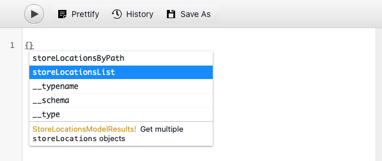

# Extrahieren von Inhalten über die GraphQL-API {#extract-content}

Bisher haben Sie in AEM Testsendungen für Headless [eigene Inhaltsfragmentmodelle erstellt haben](content-structure.md) sowie eigene Headless-Inhalte erstellt [Inhaltsfragmente.](create-content.md) Jetzt erfahren Sie, wie Sie Inhaltsfragmente und die GraphQL-API als Headless-Content-Management-System verwenden können, um Ihre Inhalte bereitzustellen.

GraphQL bietet eine abfragebasierte API, mit der externe Clientanwendungen AEM nur mithilfe eines einzigen API-Aufrufs nach den benötigten Inhalten abfragen können.

Zunächst erfahren Sie, wie Sie zwei verschiedene Arten von Abfragen ausführen: **Liste** und **byPath** Abfragen. Anschließend erfahren Sie, wie Sie Inhalte aus dem zuvor erstellten Inhaltsfragment abrufen können. Dieses Dokument dient als Ergänzung der interaktiven Tour, die die gleichen Schritte umfasst und gegebenenfalls mit zusätzlichen Ressourcen verknüpft ist.

>[!TIP]
>
>Weitere Informationen zur GraphQL-API finden Sie in der [Abschnitt &quot;Zusätzliche Ressourcen&quot;](#additional-resources) am Ende dieses Moduls für das GraphQL API-Handbuch.

## GraphQL-Explorer {#graphql-explorer}

Starten Sie im GraphQL Explorer. Hier können Sie Abfragen für Headless-Inhalte erstellen und ausführen.


Wenn Sie außerhalb der In-App-Anleitung selbst zum GraphQL-Explorer navigieren möchten, wird dies über das Symbol Adobe oben links auf der Seite angezeigt. Dadurch wird die globale Navigation von AEM geöffnet. Wählen Sie von hier aus die **Instrumente** Registerkarte und dann **Allgemein** -> **GraphQL Query Editor**.

>[!TIP]
>
>Weitere Informationen zur Navigation in AEM finden Sie unter [Abschnitt &quot;Zusätzliche Ressourcen&quot;](#additional-resources) für weitere Informationen über AEM grundlegende Handhabung.

AEM Testsendungen enthalten einen -Endpunkt, der vorab mit Inhalten gefüllt ist, aus denen Sie Inhalte zu Testzwecken extrahieren können.


Wählen Sie die **AEM Demo-Assets** -Endpunkt von der **Endpunkt** Dropdown-Menü oben rechts im Editor, falls noch nicht geschehen.

## Kopieren und Ausführen einer Listenabfrage {#list-query}

Beginnen Sie mit einer einfachen Listenabfrage, um sich mit der Funktionsweise AEM GraphQL-APIs von as a Cloud Service vertraut zu machen. Dieses Listenabfragebeispiel gibt eine Liste aller Inhalte zurück, die ein bestimmtes Inhaltsfragmentmodell verwenden. Inventar- und Kategorieseiten verwenden normalerweise dieses Abfrageformat.

1. Kopieren Sie das folgende Codefragment.

   ```text
   {
       adventureList {
         items {
            _path
            adventureTitle
            adventurePrice
            adventureTripLength
            adventurePrimaryImage {
              ... on ImageRef {
               _path
               mimeType
               width
               height
             }
           }
         }
      }
    }
   ```

1. Ersetzen Sie dann den vorhandenen Inhalt im Abfrageeditor durch Einfügen des kopierten Codes.

   

1. Klicken Sie nach dem Einfügen auf die **Play** Schaltfläche oben links im Abfrageeditor, um die Abfrage auszuführen.

1. Nach erfolgreicher Ausführung der Abfrage werden die Ergebnisse im rechten Bereich neben dem Abfrageeditor angezeigt. Sollte die Abfrage fehlerhaft sein, wird im rechten Bereich ein Fehler angezeigt.

   

Sie haben gerade eine Listenabfrage für eine vollständige Liste aller Inhaltsfragmente validiert. Dieser Prozess hilft sicherzustellen, dass die Antwort dem entspricht, was Ihre App erwartet, mit Ergebnissen, die veranschaulichen, wie Ihre Apps und Websites die in AEM erstellten Inhalte abrufen.

Die verschiedenen Kanäle und Plattformen, in denen Ihr Inhalt angezeigt werden soll, können jetzt diese Abfrage oder Ähnliches verwenden, um Ihren Headless-Inhalt abzurufen.

## Kopieren und Ausführen einer byPath-Abfrage {#bypath-query}

Wenn Sie eine byPath-Abfrage ausführen, können Sie Assets für ein bestimmtes Inhaltsfragment abrufen. Für Produktdetailseiten und Seiten, die sich auf einen bestimmten Satz von Inhalten konzentrieren, ist in der Regel diese Art von Abfrage erforderlich.

1. Kopieren Sie das folgende Codefragment.

   ```text
    {
     adventureByPath(
       _path: "/content/dam/aem-demo-assets/en/adventures/bali-surf-camp/bali-surf-camp"
     ) {
       item {
         _path
         adventureTitle
         adventureDescription {
           json
         }
         adventurePrimaryImage {
           ... on ImageRef {
             _path
             width
             height
           }
         }
       }
     }
   }
   ```

1. Ersetzen Sie dann den vorhandenen Inhalt im Abfrageeditor durch Einfügen des kopierten Codes.

   

1. Klicken Sie nach dem Einfügen auf die **Play** Schaltfläche oben links im Abfrageeditor, um die Abfrage auszuführen.

1. Nach erfolgreicher Ausführung der Abfrage werden die Ergebnisse im rechten Bereich neben dem Abfrageeditor angezeigt. Sollte die Abfrage fehlerhaft sein, wird im rechten Bereich ein Fehler angezeigt.

1. Nach erfolgreicher Ausführung der Abfrage werden die Ergebnisse im rechten Bereich neben dem Abfrageeditor angezeigt. Sollte die Abfrage fehlerhaft sein, wird im rechten Bereich ein Fehler angezeigt.

   

Sie haben gerade eine Listenabfrage für eine vollständige Liste aller Inhaltsfragmente validiert. Dieser Prozess hilft sicherzustellen, dass die Antwort dem entspricht, was Ihre App erwartet, mit Ergebnissen, die veranschaulichen, wie Ihre Apps und Websites die in AEM erstellten Inhalte abrufen.

Die verschiedenen Kanäle und Plattformen, in denen Ihr Inhalt angezeigt werden soll, können jetzt diese Abfrage oder Ähnliches verwenden, um Ihren Headless-Inhalt abzurufen.

## Ausführen von Abfragen für eigene Inhalte {#own-queries}

Nachdem Sie nun die beiden primären Abfragetypen ausgeführt haben, können Sie Abfragen für selbst erstellte Inhalte einrichten und ausführen.

1. Um Abfragen für Ihre eigenen Inhaltsfragmente auszuführen, ändern Sie den -Endpunkt in der **AEM Demo Assets** Ordner in **Ihr Projekt** Ordner.

   

1. Wählen Sie im Abfrageeditor zunächst den gesamten vorhandenen Inhalt aus und löschen Sie ihn. Geben Sie dann eine offene Klammer ein `{` und drücken Sie Strg+Leertaste oder Option+Leertaste , um eine Liste der im Inhaltsfragmentmodell definierten Modelle automatisch auszufüllen. Wählen Sie das von Ihnen erstellte Modell aus, das `List` aus der Liste.

   

1. Definieren Sie die Elemente, die die Abfrage für das ausgewählte Inhaltsfragmentmodell enthalten soll. Geben Sie erneut eine geöffnete Klammer ein. `{`und drücken Sie dann Strg+Leertaste oder Option+Leertaste , um eine Liste der automatischen Vervollständigung anzuzeigen. Auswählen `items` aus der Liste.

   

1. Definieren Sie die Felder, die die Abfrage für das ausgewählte Inhaltsfragmentmodell enthalten soll. Geben Sie erneut eine geöffnete Klammer ein. `{`drücken Sie dann Strg+Leertaste oder Option+Leertaste , um eine automatisch ausgefüllte Liste der verfügbaren Felder im Inhaltsfragmentmodell anzuzeigen. Wählen Sie in der Liste die gewünschten Felder aus Ihrem Modell aus.

   

1. Trennen Sie mehrere Felder mit einem Komma (`,`) oder Leerzeichen und drücken Sie erneut Strg+Leertaste oder Option+Leertaste , um weitere Felder auszuwählen.

1. Während der Arbeit können Sie auf die **Pretify** -Schaltfläche, um Ihren Code automatisch zu formatieren, sodass er leichter zu lesen ist.

   

1. Tippen oder klicken Sie nach Abschluss des Vorgangs auf **Play** Schaltfläche oben links im Editor, um die Abfrage auszuführen.

   

So können Ihre Inhalte für digitale Omnichannel-Erlebnisse bereitgestellt werden. Siehe [Abschnitt &quot;Zusätzliche Ressourcen&quot;](#additional-resources) für zusätzliche Beispielabfragen und erfahren Sie, wie viel mehr Sie mit der GraphQL-API tun können.

## Sie haben gelernt, wie man Inhalte abfragt! {#conclusion}

Gute Arbeit! Sie haben die beiden grundlegenden Arten von Abfragen kennengelernt und erfahren, wie Sie Ihre eigenen Inhalte abfragen können. Überprüfen Sie unbedingt die [Abschnitt &quot;Zusätzliche Ressourcen&quot;](#additional-resources) für zusätzliche Beispielabfragen und erfahren Sie, wie viel mehr Sie mit der GraphQL-API tun können.

Wenn Sie erfahren möchten, wie extrahierter Inhalt dann in einer benutzerdefinierten React-App verwendet wird, überprüfen Sie das -Modul [Anpassen von Inhalten in einer Beispiel-React-App.](customize-app.md)

Sie können zur Teststartseite zurückkehren, indem Sie auf **Lösungen** Schaltfläche oben rechts in der Navigationsleiste und Auswahl **Experience Manager**.


## Zusätzliche Ressourcen {#additional-resources}

Weitere Informationen zu Inhaltsfragmenten und AEM finden Sie in dieser zusätzlichen Dokumentation.

* [GraphQL-API-Handbuch](https://experienceleague.adobe.com/docs/experience-manager-learn/getting-started-with-aem-headless/graphql/multi-step/explore-graphql-api.html)
* [Grundlegende Handhabung](/help/sites-cloud/authoring/getting-started/basic-handling.md) - Dokumentation zur Navigation und Verwendung von AEM für neue Benutzer
* [Verwenden von GraphQL mit AEM – Beispielinhalt und Abfragen](https://experienceleague.adobe.com/docs/experience-manager-cloud-service/content/headless/graphql-api/sample-queries.html)
