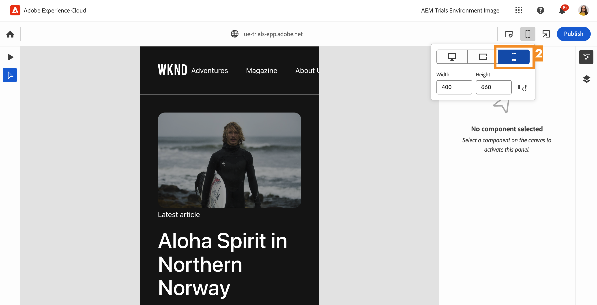

# Bearbeiten im Kontext mit dem universellen Editor {#editing-in-context}

>[!CONTEXTUALHELP]
>id="aemcloud_sites_trial_edit_inline_universal_editor"
>title="Bearbeiten im Kontext mit dem universellen Editor"
>abstract="Erfahren Sie, wie Ihre Headless-Apps den universellen Editor nutzen können, um Ihren Autorinnen und Autoren eine reibungslose, kontextbezogene Bearbeitung zu ermöglichen."

>[!CONTEXTUALHELP]
>id="aemcloud_sites_trial_edit_inline_universal_editor_guide"
>title="Universellen Editor starten"
>abstract="In diesem Handbuch erfahren Sie mehr über den universellen Editor und wie dieser allen ermöglicht, alle Inhaltsaspekte in jeder Implementierung zu bearbeiten, was zu höherer Content Velocity führen kann.  Starten Sie dieses Modul auf einer neuen Registerkarte, indem Sie unten klicken und dieser Anleitung folgen."

>[!CONTEXTUALHELP]
>id="aemcloud_sites_trial_edit_inline_universal_editor_guide_footer"
>title="In diesem Modul haben Sie erfahren, wie Sie mithilfe des universellen Editors Inhalte im Kontext und an Ort und Stelle anpassen können."
>abstract=""

## Bearbeiten von Text im Kontext {#edit-text}

Die Bearbeitung an Ort und Stelle und im Kontext kann häufig von Vorteil gegenüber der strukturierten Headless-Content-Bearbeitung sein, wie es in den vorhergehenden Modulen im Inhaltsfragment-Editor gezeigt wurde.

>[!NOTE]
>
>Um den universellen Editor in dieser Testversion zu verwenden, müssen Sie Chrome als Browser verwenden und der Inkognito-Modus darf nicht aktiviert sein. Dies ist eine Einschränkung des Testversion-Erlebnisses, nicht des universellen Editors.

Mit dem universellen Editor können Sie Ihren Text im Kontext sowie an Ort und Stelle flexibel bearbeiten, was eine einfache und intuitive Inhaltserstellung ermöglicht.

1. Wählen Sie mit einem Doppelklick den Titel des neuesten Artikels aus, um ihn zu bearbeiten.

   

1. Die ausgewählte Komponente wird durch einen blauen Rand angezeigt, wobei eine Registerkarte angibt, dass es sich um eine Textkomponente handelt. Innerhalb des Rahmens befindet sich ein Cursor, der auf die Texteingabe wartet. Ändern Sie den Text zu `Aloha Spirit in Lofoten`.

   

1. Wählen Sie etwas außerhalb der Textkomponente aus und Ihre Änderungen werden automatisch gespeichert.

Der universelle Editor speichert die Änderungen automatisch in der Authoring-Umgebung. Sie müssen sie noch veröffentlichen, damit Ihre Leserinnen und Leser sie auch sehen können. Dies erfolgt noch in einem späteren Schritt.

## Bearbeiten von Medien im Kontext {#edit-media}

Durch Verwendung des universellen Editors können Sie Bilder auch austauschen, während sie im Kontext Ihres Inhalts bleiben.

1. Wählen Sie das Bild des Surfers aus, um es auszuwählen.

1. In der Komponentenleiste können Sie die Details des Assets sehen. Wählen Sie die Miniaturansicht des **vorgestellten Bilds** aus.

   

1. Scrollen Sie im Fenster **Assets auswählen** nach unten und wählen Sie das Bild `surfer-wave-02.JPG` aus.

1. Wählen Sie **Auswählen** im Fenster **Auswählen von Assets** aus.

   

Das Bild wird durch das von Ihnen ausgewählte Bild ersetzt.

## Erleben Sie Ihren Inhalt so wie Ihre Leserinnen und Leser {#emulators}

Mit dem universellen Editor können Sie mit Ihren Inhalten im Kontext interagieren und sehen, wie die Inhalte auf den Geräten Ihrer Benutzenden bereitgestellt werden.

1. Der Editor rendert standardmäßig die Desktop-Version des Inhalts. Wählen Sie die Schaltfläche „Emulator“ oben rechts in der Symbolleiste des universellen Editors aus, um das Zielgerät zu ändern.

   

1. Die Leserinnen und Leser können sich auf verschiedenen Geräten mit unterschiedlichen Seitenverhältnissen befinden. Daher bietet der Editor Emulationsmodi, um zu sehen, wie die Seite Benutzenden angezeigt wird. Wählen Sie beispielsweise die Option für Mobilgeräte im Hochformat aus.

   

1. Sehen Sie sich die Inhaltsänderung im Editor an. Das Symbol für den Emulator ändert sich ebenfalls entsprechend dem Modus, in dem es sich befindet. Wählen Sie eine beliebige Stelle außerhalb des Emulator-Menüs aus, um es zu schließen und mit Ihrem Inhalt zu interagieren.

1. Versetzen Sie den Emulator zurück in den Desktop-Modus.

Sie können auch genaue Abmessungen für den Emulator angeben und das emulierte Gerät drehen, um Ihren Inhalt auf einem beliebigen Zielgerät anzuzeigen.

## Vorschau und Veröffentlichung {#preview}

Da Sie Ihren Inhalt auswählen müssen, um ihn im Editor zu ändern, können Sie im Editor weder Links folgen noch durch Tippen oder Klicken mit Ihrem Inhalt interagieren. Im Vorschaumodus können Sie den Links in Ihrem Inhalt folgen und ihn vor der Veröffentlichung so erleben wie Ihre Benutzenden.

1. Wählen Sie in der Symbolleiste des universellen Editors die Option **Vorschau**.

1. Wählen Sie nun den Link **Mehr dazu** für den Hauptartikel aus.

   

1. Durchstöbern Sie den Artikel und verwenden Sie dann den Link **Zurück**, um zur Hauptseite zurückzukehren.

   

1. Wählen Sie nun oben rechts im Editor die Schaltfläche **Veröffentlichen** aus, um den Inhalt zu veröffentlichen.

   

Der Inhalt wird veröffentlicht.

## Bearbeiten von Inhaltsfragmenten {#editing-fragments}

Um das Inhaltserstellungserlebnis zu beschleunigen, wenn die strukturierte Bearbeitung von Headless-Inhalten gegenüber der Bearbeitung im Kontext von Vorteil ist, bietet Ihnen der universelle Editor auch einen Schnellzugriff auf den Inhaltsfragmenteditor.

1. Deaktivieren Sie den Vorschaumodus, indem Sie in der Symbolleiste des universellen Editors auf **Vorschau** tippen.

   

1. Scrollen Sie weiter nach unten auf der Seite zum Abschnitt **Adventures**.

1. Wählen Sie eines der Abenteuer aus, z. B. **Bali Surf Camp**.

   * Beachten Sie die blaue Umrandung der ausgewählten Komponente. Auf der Registerkarte sollte der Name des Inhaltsfragments angezeigt werden, wenn ein Inhaltsfragment ausgewählt wird. In diesem Fall ist dies **Bali Surf Camp**.
   * Da der universelle Editor die Auswahl eines beliebigen Objekts auf der Seite ermöglicht, können Komponenten, die Teil eines Inhaltsfragments sind, auch einzeln ausgewählt werden. Treffen Sie an der in der Abbildung angegebenen Stelle Ihre Auswahl, um die gesamte Inhaltsfragment-Komponente auszuwählen.

1. Das Symbol **Bearbeiten** wird in der Komponentenleiste angezeigt. Wählen Sie das Symbol **Bearbeiten** aus, um den Inhaltsfragmenteditor auf einer neuen Registerkarte zu öffnen.

Auf der neuen Registerkarte können Sie nun das ausgewählte Inhaltsfragment im universellen Editor bearbeiten.
