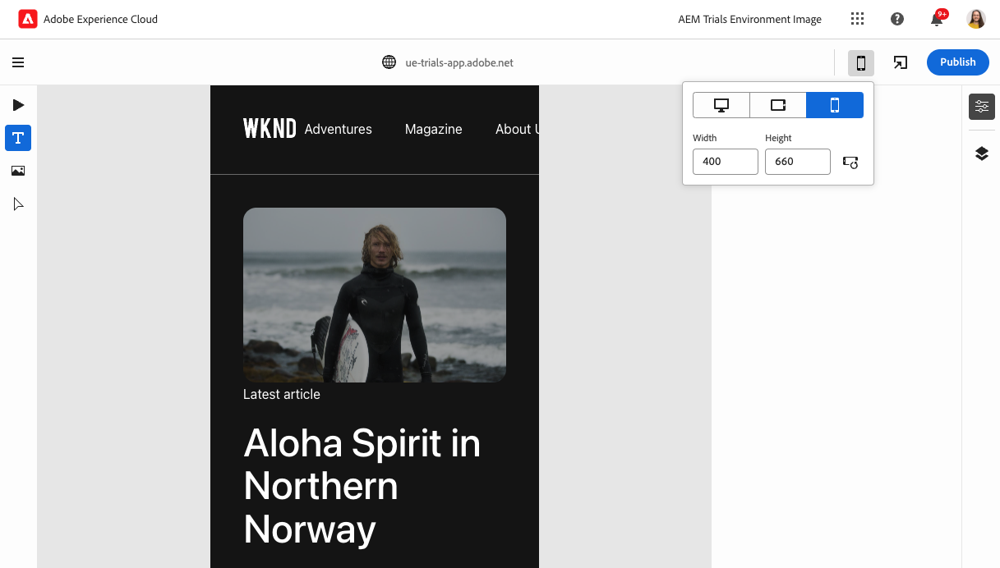
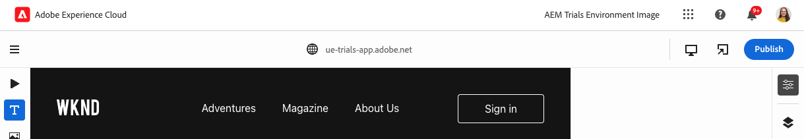

# Universeller Editor {#universal-editor}

>[!CONTEXTUALHELP]
>id="aemcloud_sites_trial_edit_inline_universal_editor"
>title="Universeller Editor"
>abstract="Erfahren Sie, wie Ihre Headless-Apps den universellen Editor instrumentieren können, um Ihren Autorinnen und Autoren reibungsarme, kontextbezogene Bearbeitung zur Verfügung zu stellen."

>[!CONTEXTUALHELP]
>id="aemcloud_sites_trial_edit_inline_universal_editor_guide"
>title="Starten des universellen Editors"
>abstract="In diesem Handbuch erfahren Sie mehr über den universellen Editor und wie dieser jedem ermöglicht, alle Inhaltsaspekte in jeder Implementierung zu bearbeiten, was zu höherer Content Velocity führen kann.  Starten Sie dieses Modul auf einer neuen Registerkarte, indem Sie unten klicken und dieser Anleitung folgen."

>[!CONTEXTUALHELP]
>id="aemcloud_sites_trial_edit_inline_universal_editor_guide_footer"
>title="In diesem Modul haben Sie erfahren, wie Sie Inhalte mit dem universellen Editor anpassen."
>abstract=""

## Verwenden Sie den Emulator, um Ihren Inhalt so anzuzeigen, wie es Ihre Reader tun {#emulators}

Mit dem universellen Editor können Sie in seinem Kontext mit Ihren Inhalten interagieren, den Inhalt so anzeigen, wie er Ihren Endbenutzern bereitgestellt wird, und ihn direkt bearbeiten.

1. Der universelle Editor stellt Ihre Inhalte so dar, wie sie für Ihre Leser unabhängig vom Gerät angezeigt werden. Standardmäßig rendert der Editor die Desktop-Version Ihres Inhalts. Tippen oder klicken Sie oben rechts im Editor auf die Schaltfläche Emulator , um das Zielgerät zu ändern.

   

1. Reader können sich auf verschiedenen Geräten mit unterschiedlichen Seitenverhältnissen befinden, sodass der Editor über Emulationsmodi verfügt. Um zu sehen, wie die Seite Benutzern auf einem Mobilgerät angezeigt wird, wählen Sie die Option Mobilgerät im Hochformat aus.

   

1. Siehe Inhaltsänderung im Editor. Das Symbol für den Emulator ändert sich ebenfalls entsprechend dem Modus, in dem er sich befindet. Tippen oder klicken Sie auf eine beliebige Stelle außerhalb des Emulator-Menüs, um es zu schließen und mit Ihrem Inhalt zu interagieren.

1. Kehren Sie den Emulator in den Desktop-Modus zurück.

Sie können auch genaue Abmessungen für den Emulator angeben und das emulierte Gerät drehen, um Ihren Inhalt auf einem beliebigen Zielgerät anzuzeigen.

## Text im Kontext bearbeiten {#edit-text}

Sie können Ihren Text kontextbezogen und direkt bearbeiten und so einfache und intuitive Inhaltserstellung ermöglichen.

1. Tippen oder klicken Sie auf den Titel des neuesten Artikels, um ihn zu bearbeiten.

1. Die Komponente wird wie durch einen blauen Rand ausgewählt, wobei eine Registerkarte angibt, dass es sich um eine Textkomponente handelt. Ein Cursor befindet sich im Rahmen, der auf die Texteingabe wartet. Ändern Sie den Text in `Aloha Spirit in Lofoten`.

   

1. Drücken Sie die Eingabetaste oder tippen oder klicken Sie außerhalb der Textkomponente auf die Eingabetaste, damit Ihre Änderungen automatisch gespeichert werden.

Der Universal Editor speichert Ihre Änderungen automatisch, sie bleiben jedoch nur in der Authoring-Umgebung erhalten. Sie müssen sie noch veröffentlichen, damit Ihre Leser sie sehen können.

## Vorschau und Veröffentlichung {#preview}

Der Editor rendert den Kontext so, wie es Ihre Leser sehen werden. Da Sie zum Auswählen auf den Inhalt tippen oder klicken müssen, können Sie im Editor nicht auf Links folgen oder mit dem Inhalt interagieren, indem Sie auf tippen oder klicken. Im Vorschaumodus können Sie den Inhalt so erleben, wie er vor der Veröffentlichung veröffentlicht wird.

1. Tippen oder klicken Sie in der Modusleiste auf der linken Seite des Editors auf **Vorschau**.

1. Die Seite wird im Vorschaumodus in einer neuen Browser-Registerkarte geöffnet.

1. Überprüfen Sie die Änderungen. Wenn alles gut aussieht, kehren Sie zur Registerkarte Universal Editor Ihres Browsers zurück und tippen oder klicken Sie auf . **Veröffentlichen**.

   

Ihr Inhalt wird veröffentlicht.

## Bearbeiten von Inhaltsfragmenten {#editing-fragments}

Mit dem universellen Editor erhalten Sie auch schnellen Zugriff auf den Inhaltsfragment-Editor, um Ihre Inhaltserstellung zu beschleunigen.

1. Scrollen Sie weiter unten auf der Seite zum **Abenteuer** Abschnitt.

1. Wählen Sie in der Modusleiste auf der linken Seite des Editors die Option **Komponenten**. Auf diese Weise können Sie Seitenkomponenten im Editor auswählen.

1. Tippen oder klicken Sie auf eines der Abenteuer, um es auszuwählen. Eine neue **Bearbeiten** in der Modusleiste angezeigt.

   * Beachten Sie die blaue Umrisslinie. Die Registerkarte sollte lesen **reference** wenn ein Inhaltsfragment ausgewählt ist.
   * Da der universelle Editor die Auswahl eines beliebigen Objekts auf der Seite ermöglicht, können Komponenten, die Teile eines Inhaltsfragments sind, auch einzeln ausgewählt werden.

   

1. Tippen oder klicken Sie auf **Bearbeiten** in der Modusleiste, um den Inhaltsfragment-Editor auf einer neuen Registerkarte zu öffnen.

Auf der neuen Registerkarte können Sie jetzt das Inhaltsfragment bearbeiten, das Sie im universellen Editor ausgewählt haben.
