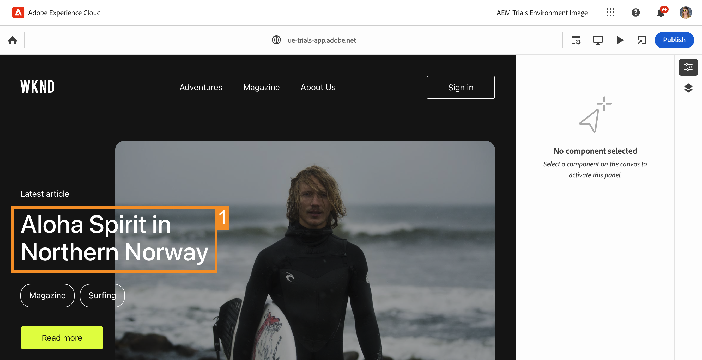
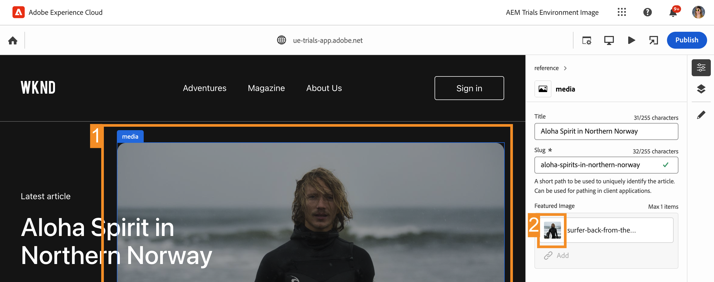
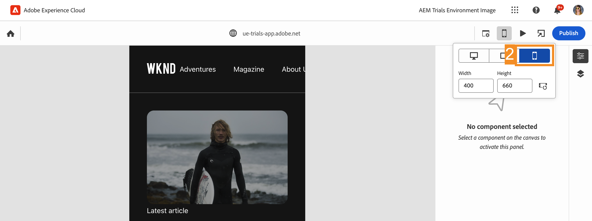

# Bearbeiten im Kontext mit dem universellen Editor {#editing-in-context}

>[!CONTEXTUALHELP]
>id="aemcloud_sites_trial_edit_inline_universal_editor"
>title="Bearbeiten im Kontext mit dem universellen Editor"
>abstract="Erfahren Sie, wie Ihre Headless-Apps den Universal Editor verwenden können, um bei der Kontextbearbeitung die Fingerspitzen Ihrer Autoren zu optimieren."

>[!CONTEXTUALHELP]
>id="aemcloud_sites_trial_edit_inline_universal_editor_guide"
>title="Starten des universellen Editors"
>abstract="In diesem Handbuch erfahren Sie, wie der universelle Editor jedem ermöglicht, jeden Aspekt Ihres Inhalts in jeder Implementierung zu bearbeiten, wodurch Inhalte schneller bearbeitet werden.  Starten Sie dieses Modul auf einer neuen Registerkarte, indem Sie unten klicken und dieser Anleitung folgen."

>[!CONTEXTUALHELP]
>id="aemcloud_sites_trial_edit_inline_universal_editor_guide_footer"
>title="In diesem Modul haben Sie erfahren, wie Sie mithilfe des universellen Editors Inhalte im Kontext und an Ort und Stelle anpassen können."
>abstract=""

## Text im Kontext bearbeiten {#edit-text}

Die Bearbeitung an Ort und Stelle und im Kontext kann häufig von Vorteil gegenüber der strukturierten Headless-Content-Bearbeitung sein, wie sie im Inhaltsfragment-Editor in früheren Modulen aufgetreten ist.

>[!NOTE]
>
>Um den universellen Editor in dieser Testversion zu verwenden, müssen Sie Chrome als Browser und nicht im Inkognito-Modus verwenden. Dies ist eine Einschränkung der Testerfahrung, nicht des universellen Editors.

Mit dem universellen Editor können Sie Ihren Text im Kontext und an Ort und Stelle flexibel bearbeiten und so einfache und intuitive Inhaltserstellung ermöglichen.

1. Der Editor sollte standardmäßig in **Komponenten** -Modus. Wenn nicht, wählen Sie die **Komponenten** in der Modusleiste auf der linken Seite des Editors.

1. Wählen Sie doppelt den Titel des neuesten Artikels aus, um ihn zu bearbeiten.

   

1. Die Komponente wird wie durch einen blauen Rand ausgewählt, wobei eine Registerkarte angibt, dass es sich um eine Textkomponente handelt. Ein Cursor befindet sich im Rahmen, der auf die Texteingabe wartet. Ändern Sie den Text in `Aloha Spirit in Lofoten`.

   

1. Drücken Sie die Eingabetaste oder wählen Sie außerhalb der Textkomponente aus, damit Ihre Änderungen automatisch gespeichert werden.

Der Universal Editor speichert Ihre Änderungen automatisch in der Authoring-Umgebung. Sie müssen sie noch veröffentlichen, damit Ihre Leser sie sehen können, was wir in einem späteren Schritt tun werden.

## Medien im Kontext bearbeiten {#edit-media}

Sie können auch Bilder austauschen, während sie im Kontext Ihres Inhalts verbleiben, indem Sie den universellen Editor verwenden.

1. Verbleibend in **Komponenten** -Modus, wählen Sie das Bild des Surfers aus, um es auszuwählen.

1. In der Komponentenleiste können Sie die Details des Assets sehen. Wählen Sie die **Vorgestelltes Bild** Miniaturansicht.

   

1. Im **Auswählen von Assets** , scrollen Sie nach unten und wählen Sie `surfer-wave-02.JPG` -Bild, um es auszuwählen.

1. Auswählen **Auswählen** im **Auswählen von Assets** Fenster.

   

Das Bild wird durch das von Ihnen ausgewählte ersetzt.

## Erleben Sie Ihren Inhalt so wie Ihre Reader {#emulators}

Mit dem universellen Editor können Sie mit Ihren Inhalten in ihrem Kontext interagieren und sehen, wie die Inhalte auf den Geräten Ihrer Benutzer bereitgestellt werden.

1. Standardmäßig rendert der Editor die Desktop-Version Ihres Inhalts. Wählen Sie die Schaltfläche Emulator oben rechts im Editor aus, um das Zielgerät zu ändern.

   

1. Reader können sich auf verschiedenen Geräten mit unterschiedlichen Seitenverhältnissen befinden. Daher bietet der Editor Emulationsmodi, um zu sehen, wie die Seite Benutzern angezeigt wird. Wählen Sie beispielsweise die Mobilgeräteoption im Hochformat aus.

   

1. Siehe Inhaltsänderung im Editor. Das Symbol für den Emulator ändert sich ebenfalls entsprechend dem Modus, in dem er sich befindet. Wählen Sie eine beliebige Stelle außerhalb des Emulator-Menüs aus, um es zu schließen und mit Ihrem Inhalt zu interagieren.

1. Kehren Sie den Emulator in den Desktop-Modus zurück.

Sie können auch genaue Abmessungen für den Emulator angeben und das emulierte Gerät drehen, um Ihren Inhalt auf einem beliebigen Zielgerät anzuzeigen.

## Vorschau und Veröffentlichung {#preview}

Da Sie den Inhalt auswählen müssen, um ihn im Editor auszuwählen, können Sie im Editor keine Links folgen oder mit Ihrem Inhalt interagieren, indem Sie auf tippen oder klicken, während er sich im Bearbeitungsmodus befindet. Im Vorschaumodus können Sie den Links in Ihrem Inhalt folgen und ihn so erleben, wie es Ihre Benutzer vor der Veröffentlichung tun würden.

1. Wählen Sie in der Modusleiste links im Editor die Option **Vorschau**.

1. Wählen Sie nun die **Mehr dazu** -Link für den Hauptartikel.

   

1. Durchsuchen Sie den Artikel und verwenden Sie dann das **Zurück** -Link, um zur Hauptseite zurückzukehren.

   

1. Wählen Sie nun die **Veröffentlichen** rechts oben im Editor, um den Inhalt zu veröffentlichen.

   

Ihr Inhalt wird veröffentlicht.

## Bearbeiten von Inhaltsfragmenten {#editing-fragments}

Um das Authoring-Erlebnis für Inhalte zu beschleunigen, wenn die strukturierte Bearbeitung von Headless-Inhalten günstiger ist als die Bearbeitung im Kontext, bietet Ihnen der universelle Editor auch schnellen Zugriff auf den Inhaltsfragment-Editor.

1. Scrollen Sie weiter unten auf der Seite zum **Abenteuer** Abschnitt.

1. Wählen Sie in der Modusleiste links im Editor die Option **Komponenten**. Auf diese Weise können Sie Seitenkomponenten im Editor auswählen.

1. Wählen Sie eines der Abenteuer aus, z. B. **Bali Surf Camp** , um sie auszuwählen.

   * Beachten Sie den blauen Umriss der ausgewählten Komponente. Auf der Registerkarte sollte der Name des Inhaltsfragments angezeigt werden, wenn ein Inhaltsfragment ausgewählt wird. In diesem Fall **Bali Surf Camp**.
   * Da der universelle Editor die Auswahl eines beliebigen Objekts auf der Seite ermöglicht, können Komponenten, die Teil eines Inhaltsfragments sind, auch einzeln ausgewählt werden. Wählen Sie an der in der Abbildung angegebenen Stelle aus, um die gesamte Inhaltsfragment-Komponente auszuwählen.

1. Die **Bearbeiten** wird in der Komponentenleiste angezeigt. Wählen Sie die **Bearbeiten** -Symbol, um den Inhaltsfragment-Editor auf einer neuen Registerkarte zu öffnen.

Auf der neuen Registerkarte können Sie jetzt das Inhaltsfragment bearbeiten, das Sie im universellen Editor ausgewählt haben.
